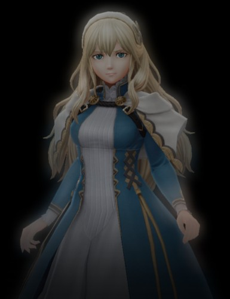
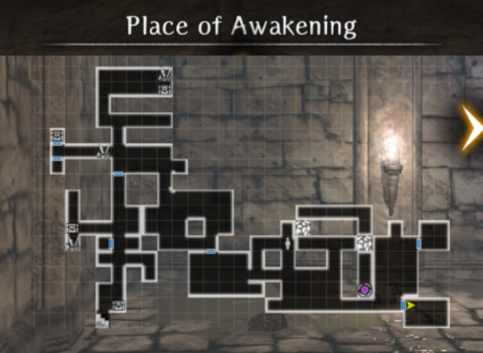
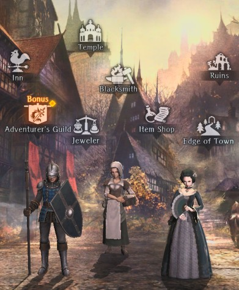
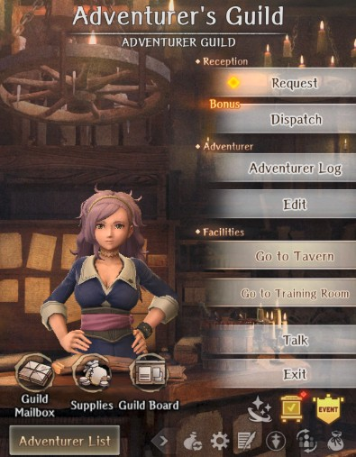

# Introduction

## Tutorial Dungeon  

After starting the game, you find yourself in a tough situation.  Don't worry about things going well. They won't. It's okay.

Follow the on-screen instructions and after some spooky scenes, you'll be prompted with a personality quiz.

### Creating Your Character

This quiz determines:

 - Your alignment - Good, Neutral, or Evil.
 - Your starting attributes (i.e. STR, DEX, etc.)

You'll be shown the result and prompted for confirmation after answering the questions. Below are a few answers you can select to get the alignment of your choice:

??? info "Alignment Selection"

    === "Good"
        - Distribute what money I have - GOOD 
        - My family - EVIL 
        - A farewell drink - GOOD 
        - Keep it for Myself - EVIL 
        - A beached whale - NEUTRAL 
        - A girl I saved a long time ago - GOOD 
        - Demand monetary compensation - NEUTRAL 
        - Pirate's treasure - EVIL 
        - Evacuate the citizens - GOOD
        - Go over and help her cross voluntarily - GOOD

    === "Neutral"
        - Distribute what money I have - GOOD 
        - My family - EVIL 
        - A treasure map - NEUTRAL
        - Keep it for myself - EVIL 
        - A beached whale - NEUTRAL 
        - A girl I saved a long time ago - GOOD 
        - Demand monetary compensation - NEUTRAL 
        - Pirate's treasure - EVIL 
        - Evacuate the citizens - GOOD
        - Go over and help her cross voluntarily - GOOD

    === "Evil"
        - Distribute what money I have - GOOD 
        - My family - EVIL 
        - A farewell drink - GOOD 
        - Keep it for myself - EVIL 
        - A beached whale - NEUTRAL 
        - A girl I saved a long time ago - GOOD 
        - Demand monetary compensation - NEUTRAL 
        - Pirate's treasure - EVIL 
        - Loot and flee - EVIL
        - Help her across but ask for a reward - EVIL

If you made a mistake or decide you want a different alignment, just retake the quiz at the end. You can do this as many times as you want ([it can be gradually changed later in the game](../../adventurer-customization/alignment.md)) and then you'll regain control of your character.

### Welcome back, let's explore.
!!! info inline end "Lulunarde"
      

You'll wake up in a dungeon (see below).  Explore the nearby area until you meet a ghostly Girl - Lulunarde.  Have a chat with her and follow her instructions. Maybe give yourself a name, or accept one as a suggestion.  Later you may get a chance to change it if you want.  In the meantime you two are going to be spending a lot of time together.

Don't worry about the rubble and that purple circle you see on the map. You can't do anything with that yet.  Later, you will get the opportunity to come back later and explore that area. 

!!! map inline "Place of Awakening"
    

### Combat!

Before long, you'll get some free stuff and then find yourself in combat with a vicious Goblin - learn how that works and kick its ass.  Make sure you pick up *and equip* all of the equipment scattered about this dungeon floor; it's not the best, but makes the combat a bit easier.  You'll get to replace some of it soon.

### Freedom?

Lulunarde will keep offering you some flavor text, background, and cutscenes as you head your way out of the dungeon. You will soon find your way outdoors, where you will be rewarded with fresh air and... some bandits.

Kick their asses.  (Starting to sense a pattern?)  Then go find Lulunarde who wandered off somewhere.  The location is random, so just walk everywhere on the small map until you run into her.  Then head up and out. 

### Royal Capital Luknalia

After another cutscene, you enter a city - Royal Capital Luknalia.

Lets head to the Adventurer's Guild, and meet the nice lady - Arna!

She'll tell us a bit of information, and most importantly, show us how to summon Adventurers.

Once you're tuckered yourself exploring the town, you'll be asked politely to head back into the Beginning Abyss.

Next: The Beginning Abyss (Coming Soon)
