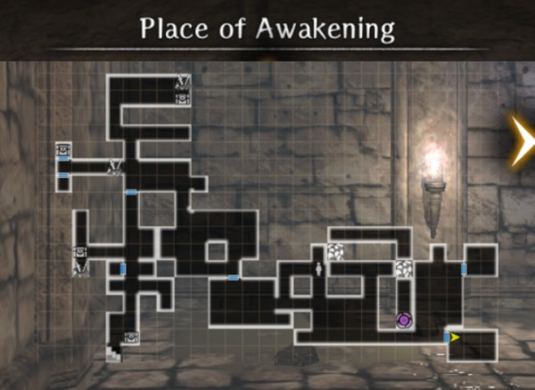
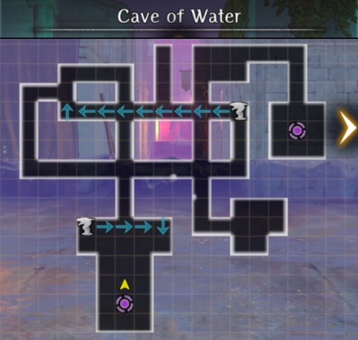
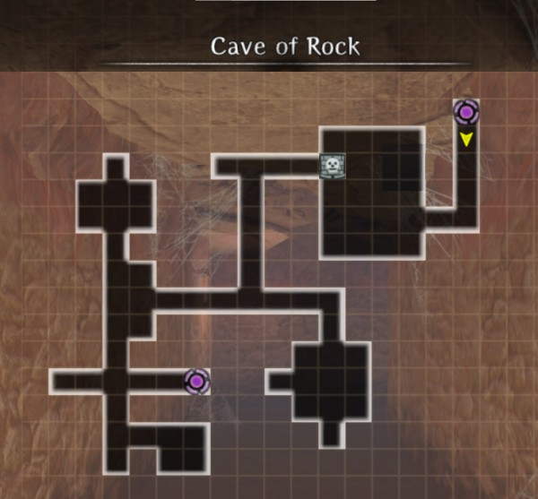
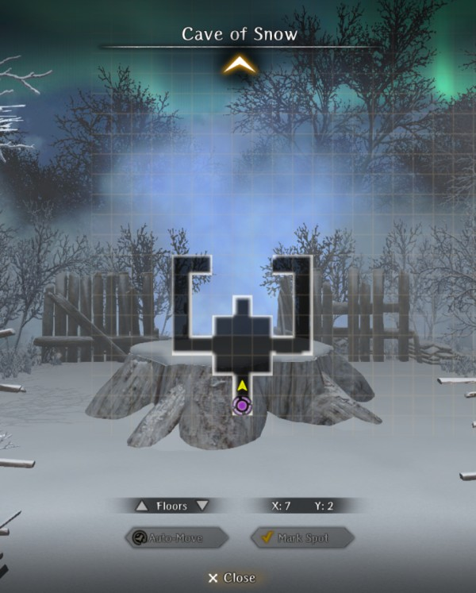

# Place of Awakening - Abyss Preview Dungeon?

When you first Awakened in the [Tutorial Dungeon], there were inaccessible locations blocked by rubble.  Shortly into the game you learn how to use your Right Hand of Reversal powers to clear rubble letting you to access that area in [floor B1F "Pit" of the Beginning Abyss](./maps.md).  After clearing two piles of rubble all you will find, howewever, is a deactivated teleporter.  From B1F, there is currently nothing else you can do here. 

Later you unlock the Cursed Wheel and can leap back in time to Awakening, reliving the opening scenes of meeting Lulunarde (and giving you the chance to change the main character's Name) and exiting the Place of Awakening, which looks suspiciously identical to B1F.  

!!! map "Place of Awakening map"
      
    *Now* you have the ability to reverse the piles of rubble and only now, immediately after Awakening, is that teleporter active.  It seems to make no difference if you do it before or after meeting Lulunare, but stepping into that portal teleports you to a new dungeon, with more rubble to reverse.  This new dungeon has the enigmatic name "???".  

!!! map "???"
    
    There's not much here. You'll see a preview of the Beginning Abyss dungeon style, a few more rubble piles to reverse, one chest containing a Worn-Out One-Handed Axe, and another teleporter. This teleporter takes you to ...  another "dungeon" floor that looks strangely like a flooded city.  This time it has a name:  "Cave of Water".  

!!! map "Cave of Water"
    
    Your ability to explore the Cave of Water is limited by a strong current coming from a serpent-shaped statue.  As anyone can tell you who has progressed to the Second Abyss Trade Waterways dungeon in Port Town, this dungeon is giving a preview of that Abyss style.  Once you have unlocked the Right Hand of Reversal ability to turn off the water you can find another chest (this time with a Worn-Out Two-Handed Staff) and another teleporter that takes you to...  another dungeon.  This one is named "Cave of Rock", and unsurprisingly is a preview dungeon for Abyss 3, the Impregnable Fortress in Guarda.  

!!! map "Cave of Rock"
      
    You cannot progress through this floor until you learn another Right Hand of Reversal skill - the ability to activate Golems so they move out of your way.  Doing so allows you to find yet another chest (Worn-Out Two-Handed Mace) and another teleporter.  Grab your mittens. This one taking you to the preview dungeon for Abyss 4, the "Cave of Snow". 

!!! map "Cave of Snow"
      
    The Cave of Snow contains a wintery landscape with billowing mist/ice that cannot be passed, and a big tree stump.  One can assume that on release of Abyss 4, we'll be learning another use for our Right Hand to progress further and unlock a preview of the Fifth Abyss.

*To Be Continued ...*
