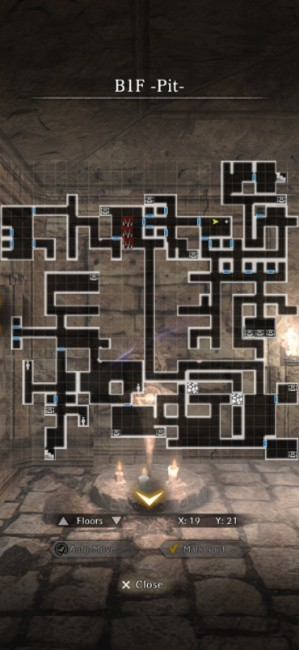
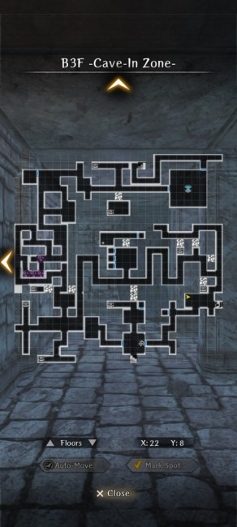
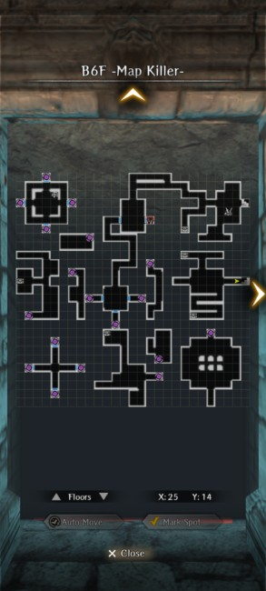
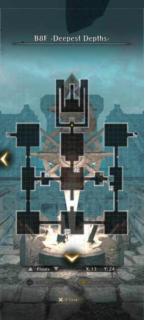

# The Beginning Abyss

## Overview
The Beginning Abyss is an eight level dungeon that serves as both a tutorial to the mechanics of the game and an introduction to the overaching Wizardry Variants Daphne story.  Your primary goal is to [complete the request to Save the King](./important-request-gwo.md)!  It's not as easy as it sounds, and it may take you a few tries. The key is to keep progressing in the story despite setbacks and you'll eventually learn how to get the job done right.  Each floor has a very similar square layout with various events, [side quests](./requests.md), tricks, and traps. The one exception to this is a side dungeon on the third floor called the "Goblin Den". You will be warned away from this area if your level is too low.  *Savor the risk* but DON'T IGNORE WARNINGS FROM THE GAME! 

## Maps

!!! note
    Certain floors have tile variations variations (shifts and rotations) that are randomly selected when you start the abyss, and certain actions can reset the dungeon layout changing the variation you see. Two variations of the maps with tile changes are included below, but your maps and the location of certain events may not perfectly match what is shown. Key events on variable tiles always occur in the same rooms on those tiles, so look for similar features. See [Map Variations page](../../mechanics/map-variations.md) for details. 

??? map "B1F -Pit-"

    !!! note
        Not much to say, first floor, welcome. Look for the Beginning Abyss Key for a nice surprise on floor 2. On second playthrough, make sure to talk to Chris to unlock a bondmate quest. He's the elf on the left side dead end when you first enter.

    === "Variation 1"
         

    === "Variation 2"
         

??? map "B2F -Temple-"

    !!! note
        You will fight your real first boss here. Not much to say, use the harken afterwards. Only important thing of note is the room to the right has an infinite respawn mob that you can grind on early levels. If you found the key on B1F, the locked room on the left will have a few adventurer bones to help you build your team (one time only).

    

??? map "B3F -Cave-In Zone-"

    !!! note
        You can continue your way through until the story makes you examine the rocks. Examine all surrounding surfaces enough times and you can reverse the rocks and proceed. Make sure you reverse all rocks and find the cause of death of your friends for important knowledge. There's a camp where it restores all your hp/mp/sp. It can be used once each time you enter the labyrinth. The Goblin's nest is not worth doing. Listen yo Lulu, leave it for later.

    === "Variation 1"
        

    === "Variation 2"
        

??? map "B4F -Labyrinth"

    !!! note
        First time here? You get to watch your friends die. Second time here? Fix it with the wheel! This is the first time the game shows you raising a stone will lower and raise certain paths, that's really it. Those two chests in the northwest? You can only pick one (the left has an adventurer's bone). Oh, and watch out for the rabbits. They've got a vicious streak a mile wide.

    === "Variation 1"
             

    === "Variation 2"
        

??? map "B5F -Warped One's Nest-"

    !!! note
        The top left side will be a warped one's nest in the beginning of the map, I don't suggest going there unless you're prepared, not much there. The larger rectangular area will have a boss for you. Prepare accordingly. Also, check this map to avoid the poison tile paths.

    

??? map "B6F -Map Killer-"

    !!! note
        Don't bother opening the wrong door where the corpse tells you. It's just spikes. The corpses will give you hints to get through the level. I believe the correct warp order is right, up, then right or left depending on the previous corpse warning. (The light/sun rises in the east and sets in the west.) Statue room puzzle requires you to restore the statue heads that match your party members according to the clue on the nearby dead body. If none match, leave all heads broken. This clue can change every time you enter this level. [See answers in the FAQ](../../frequently-asked-questions.md#how-do-i-solve-the-statue-puzzle-on-b6f-of-the-beginning-abyss). Saint shield quest is also completed here; do the second warp wrong and fight the mob.

    === "Variation 1"
        

    === "Variation 2"
        

??? map "B7F -Amongst the Dead-"
    
    !!! note
        You will need to go through the poison floors every time UNLESS you reverse the stones on the next floor that create shortcuts. Make sure to do that. B8F description tells you which stones open which paths.  Albano will REALLY not like you here, unless YOU DO something correctly (second playthrough only). The camp here is important as you can't access the Harken on the next floor until you beat the final boss. 

    === "Variation 1"
        

    === "Variation 2"
        

??? map "B8F -Deepest Depths-"

    !!! note
        The four stones on this floor can be reversed to create new paths on B7F.  From the entry stairs, the closest two stones creates paths on B7F at X:21,Y:11 and X:12,Y:2 to reach the unreachable treasure chests. The third stone connects the entry room to the hallway with the Camp by adding a path on B7F at X:8,Y:14.  The fourth stone connects the hallway with the Camp to the hallway with the stairs down to floor 8 by adding a path on B7F at X:14,Y:15.  No, you must kill the boss to reach the harken. Yes, there are mimics now. They hurt, but good news, defending their p atk gives you a big opening for massive damage. Good luck on the boss, and hope your head won't fly. (It will if this will be your first playthrough.)

    
