# The Beginning Abyss - Requests  
!!! note "Key locations can change due to some maps having variable layouts. See [Map Variations page](../../mechanics/map-variations.md) for details. "

!!! note "The Requests on this page are listed in order of the Cursed Wheel point needed to 'reset' the request, not necessarily the order in which they will be activated or completed.  Note that many of the requests *cannot* be fully completed the first time progressin through the Beginning Abyss."

## Fresh Start

### Sweet Walnut Delivery
<!-- --8<-- [start:sweet-walnut-delivery] -->
??? info "Request"
    

- Talk to the Smirking Adventurer in the tavern  
- Go to Beginning Abyss -Entrance- and gather the Walnuts

??? map "Location"
    
<!-- --8<-- [end:sweet-walnut-delivery] -->

### Light Shield Material Collection
<!-- --8<-- [start:light-shield-material-collection] -->
??? info "Request"
    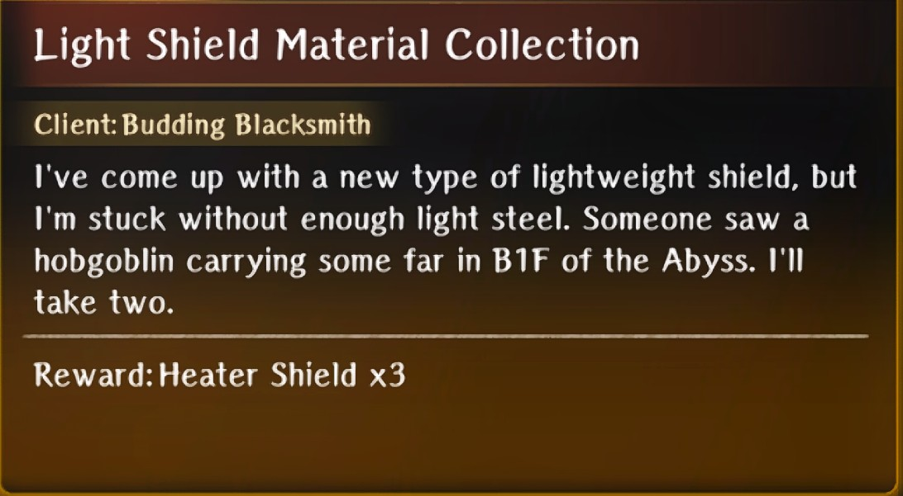

- Go to B1 of Beginning Abyss

??? map "Location"
    
<!-- --8<-- [end:light-shield-material-collection] -->

### Fragrant Plant Seed Delivery
<!-- --8<-- [start:fragrant-plant-seed-delivery] -->
??? info "Request"
    

- Go to Inn  
- Go to B1 and find the herbs

??? map "Location"
    
    
    !!! note
        It's possible this is randomly in any small room
<!-- --8<-- [end:fragrant-plant-seed-delivery] -->

### Scrap Sabaton Collection
<!-- --8<-- [start:scrap-sabaton-collection] -->
??? info "Request"
    

- Go to the Item shop to activate the request  
- Go to the guild and accept the quest  
- In B1 gather junk and turn in the request  
- Go back to the item shop to receive item
<!-- --8<-- [end:scrap-sabaton-collection] -->

### Rhodium Delivery
<!-- --8<-- [start:rhodium-delivery] -->
??? info "Request"
    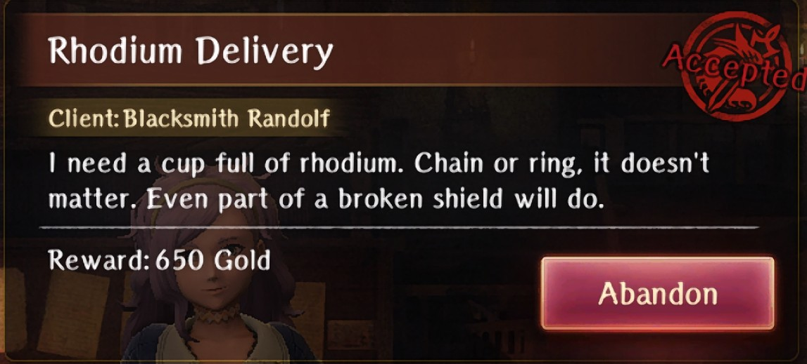

- Go to the blacksmith to activate this quest  
- Go to the guild and accept the request   
- Continue on until B6F then collect the 2 Rhodium  
- Turn in the request  
- Go back to the blacksmith

??? map "Locations"
    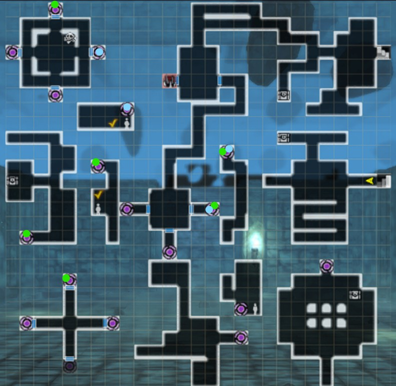

    ??? info
        Follow Green for one and Blue for the other
<!-- --8<-- [end:rhodium-delivery] -->

## Minor Harken Unlocked

### Death Stench Investigation

??? info "Request"
    

- Go to B1F and defeat the Ambush

??? map "Location"
    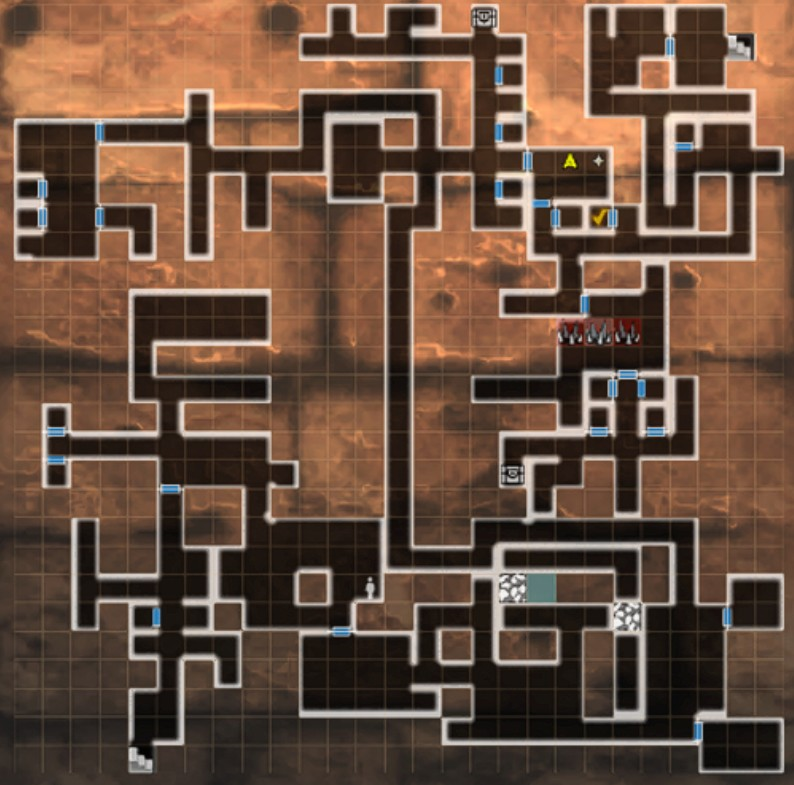

!!! note "<s>To reset this request for the monthly bone, you'll need to walk to the B1F harken from the Cursed Wheel point Fresh Start, otherwise it will not respawn.</s> (As of Aug 2025 (confirmed version 1.13.10) the previous requirement is no longer necessary. The request resets like all others simply by Wheeling back and forth.)"
 
### Donato’s Redemption

??? info "Request"
    

- Defeat the 6 goblin packs in B1F

??? map "Location"
    

!!! note "There is a letter for Donato on a corpse on floor B4F.  Once this letter is found, subsequent completions of this request will give Donato as a bondmate."

## Despicable Trap

### Abyssal Steel Delivery
<!-- --8<-- [start:abyssal-steel-delivery] -->
??? info "Request"
    

- Fight the enemies blocking the Ebonsteel on B4F
- Pick up the Ebonsteel from the sparkle on the ground

??? map "Location"
    
<!-- --8<-- [end:abyssal-steel-delivery] -->

### Knight-Butcher Ent Proliferation

??? info "Request"
    

- Defeat the 3 enemies on B3F

??? map "Location"
    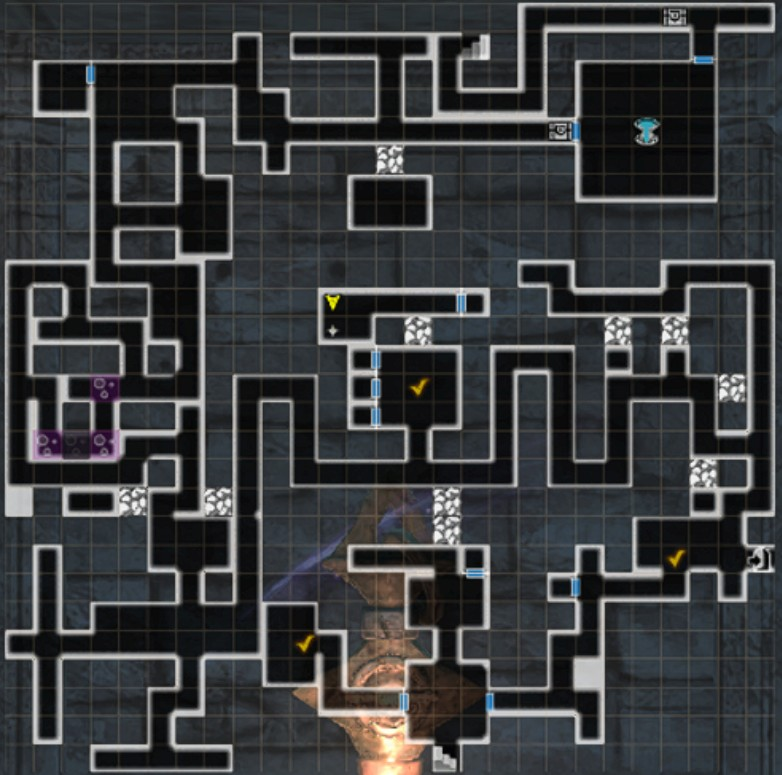

### Fluorescent Flower Delivery
<!-- --8<-- [start:fluorescent-flower-delivery] -->
??? info "Request"
    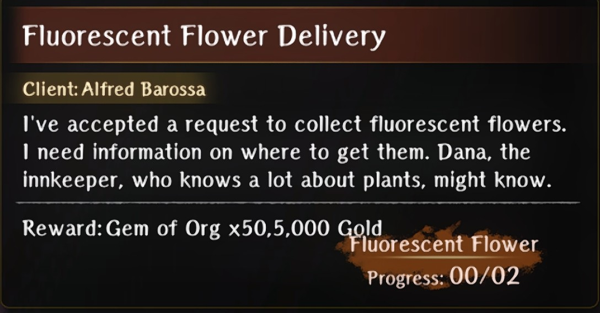

- You will activate this request as part of the Albano Bondmate line  
- Go to the inn upon accepting the request  
- Go to B5F and kill the mimic to get the glowstone  

??? map "B5F Mimic Location"
    

    !!! note
        The chest does not appear on the map

- Go to B3F and find the 2 flowers

??? map "B3F Flower Locations"
    

??? map "Alternate Locations"
    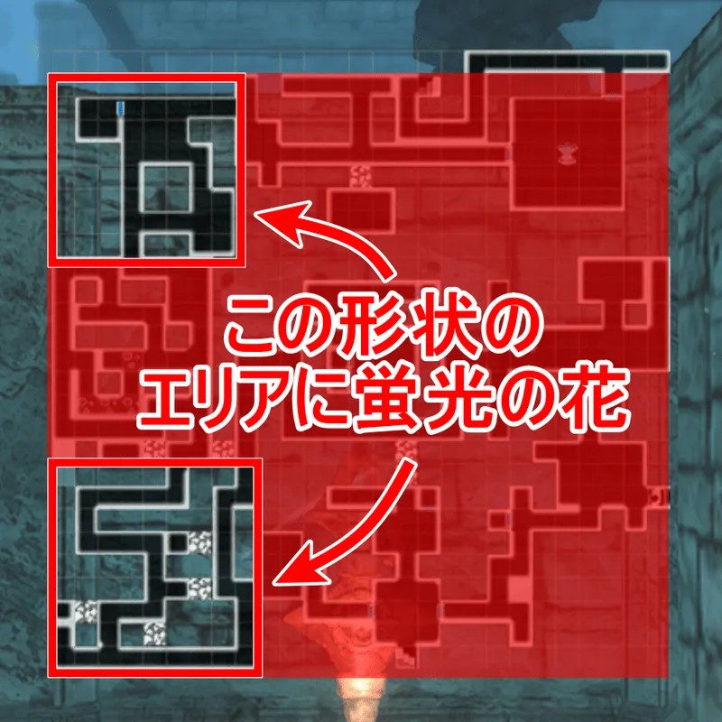

    !!! note
        It is possible that there are other locations than the above two specified, so if neither of those maps work for you, you can check the bottom-right side or just explore everywhere!
<!-- --8<-- [end:fluorescent-flower-delivery] -->

## Treacherous Floor Traversal

### Relentless Massacre Rabbit

??? info "Request"
    

- Go to B4F and fight the vorpal bunny 4 times

??? map "Locations"
    

??? Map "Alternate Locations"
    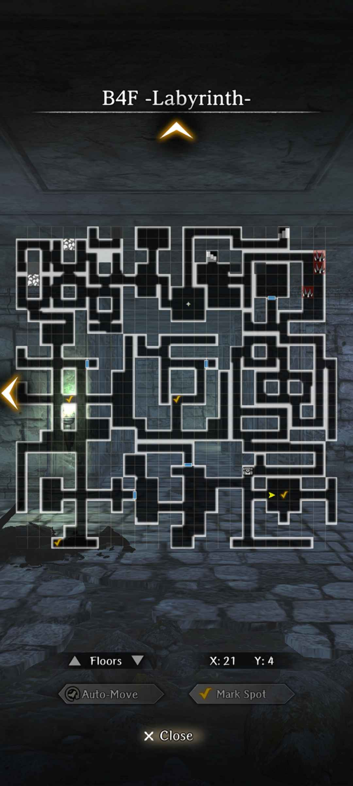

### Grandchild Party Rescue

??? info "Request"
    

- Save Mel and her party on B5F

??? map "Location"
    

## Second Major Harken

### Search for Lambert

??? info "Request"
    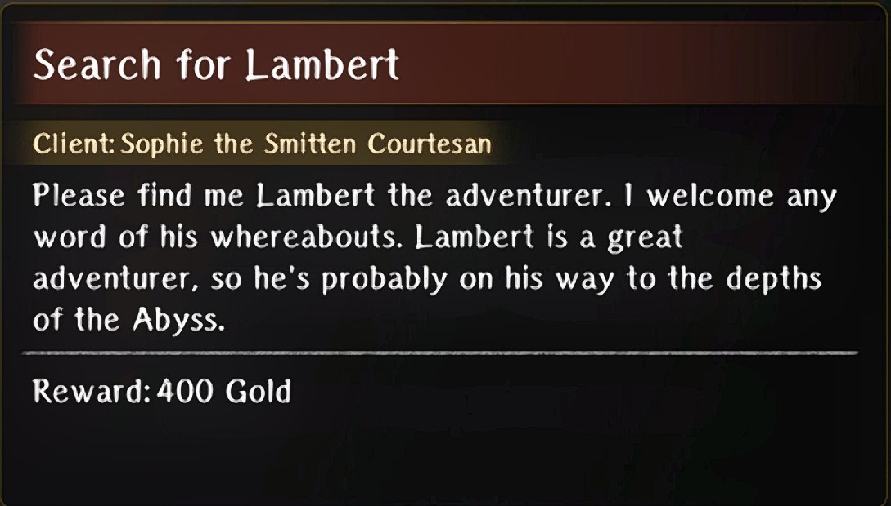

1. Talk to Sophia in the tavern  
2. Find Lambert on B7F. Engage in a fight with 3 Gluttonous Maws.
3. Return to Sophia in the tavern to obtain a Digging Mattock as a reward.

??? map "Location"
    

Alternate Ending:

4. After having accepted Sophia's request once, wheel back to Treacherous Floor Traversal and find Lambert on B5F. Tell him that Sophia is looking for him.
5. Cursed Wheel to Warped Scene and accept the request. Obtain Sophia as a bondmate

??? map "Final Location"
    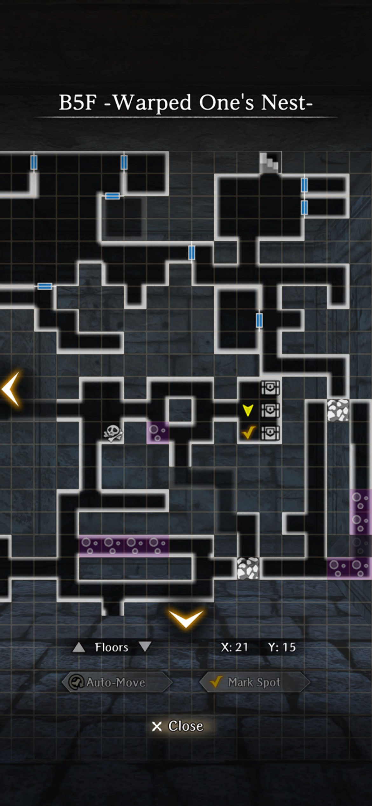

!!! warning "If you save Lambert, any further instances of the quest will not give the Digging Mattock as the reward. To reset this, pick Do Nothing when speaking to Lambert."

### Abyss Heretics

??? info "Request"
    

- Defeat the 3 groups of zealots

??? map "Locations"
    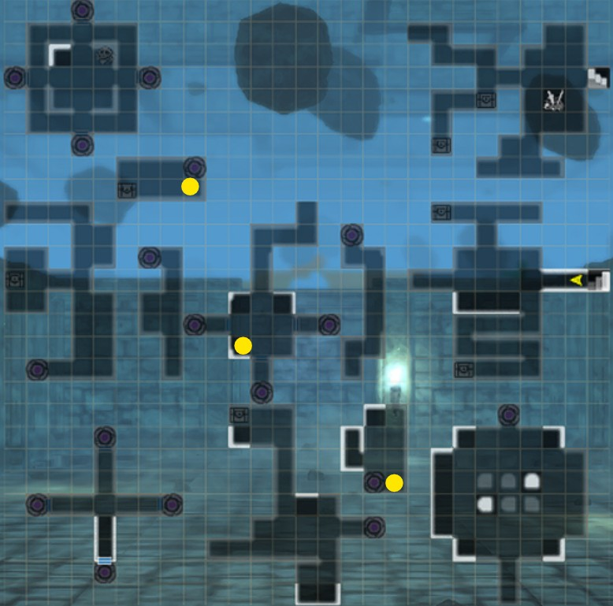

### March of the Undead

??? info "Request"
    

- Take the Harken to B7F
- Step out and defeat the enemies

??? map "Location"
    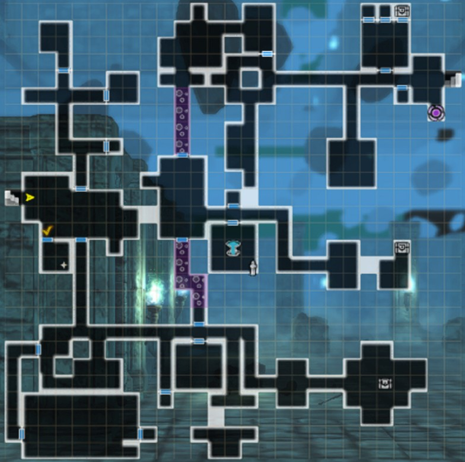

## Labyrinth Cleared

### Cazula Root Delivery
<!-- --8<-- [start:cazula-root-delivery] -->
??? info "Request"
    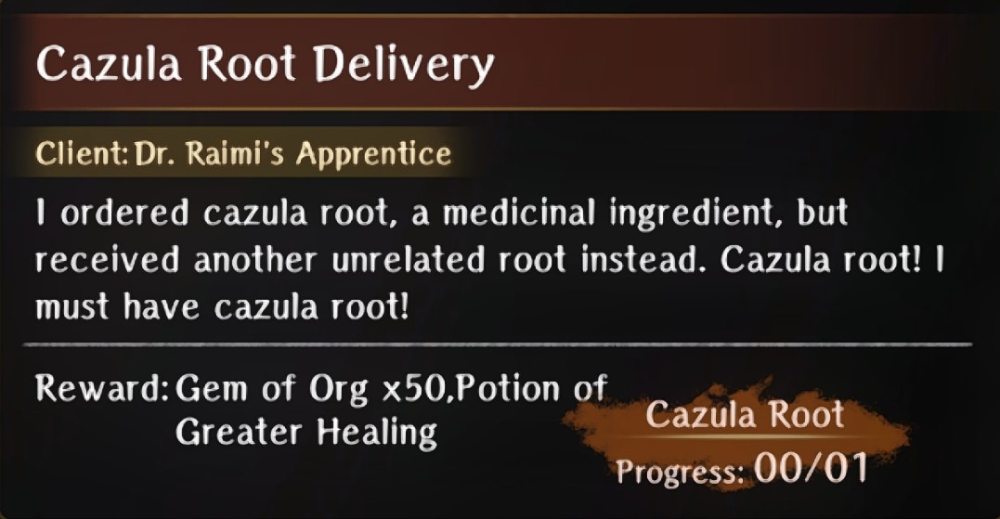

- Go to the tavern and talk to the Gloomy Adventurer  
- Go to B7F and get the Bladeless Dagger  
- Return to the tavern and give it to him

??? map "Location"
    

!!! note "Missing Request Fix"
    Numerous users report this request not appearing.  If it is missing, cursed wheel to "Warped Scene", then <em>immediately</em> step back to go up to B7F without triggering the dialog giving the shield to Dylanhart. Step in the teleporter then Harken back to town.  The request should be there in the Guild.  Complete the quest then go beat Helmut before using the cursed wheel.
<!-- --8<-- [end:cazula-root-delivery] -->

## The King’s Rescue

### The Lingering Scent of the Greater Warped One

??? info "Request"
    

- Take the Harken to B8F
- Fight the waves of enemies

??? map "Location"
    
