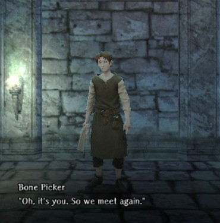
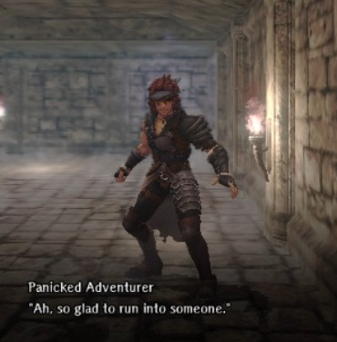
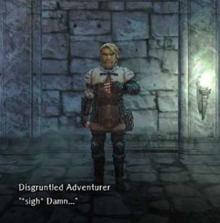

# Beginning Abyss Wandering NPC Guide

There are a number of characters that wander the Abyss who you may encounter.  They may be a help, a threat, or simply a distraction. These chance encounters often present you with a choice of interactions that may bring you additional riches or even personality changes.  

## Bone Picker  
"Might I interest you in some slightly used body parts?"  
  
??? note "Details"  
    - Location: Most floors (B1F-B7F)  
    - Interaction Options:  
        - The Bone Picker has several items he'll sell you:  
            - Healing Potion - 100gp - Always available  
            - Adventurer's Remains - 1,000gp - Once every 7 days  
            - (If unlocked) Mausoleum Bone Tallow - 10,000gp - Once every 7 days  
    - Personality Impact: None known.  
    - Notes: The cooldown timer on Remains and Tallow appear to be 7 days from the last time collected, not tied to the weekly game reset.  If you have insufficient gold, the interaction will be dismissed without affecting any cooldown timers.  

## Panicked Adventurer  
This adventurer needs help and requests a Medicinal Herb from the player.  
  
??? note "Details"  
    - Location: Upper Floors - B1F-B3F(?)  
    - Interaction Options (Personality Impact):    
        - Give Medicinal Herb for Free - get a 200gp reward  (Good)  
        - Give Medicinal Herb for a 100gp payment - get 100gp (Evil)   
        - Ignore request (Unknown)  
    - Notes: Medicinal Herbs must\ be carried in your party's current inventory.  If the player has no Medicinal Herbs in their inventory, the Panicked Adventurer leaves without interacting.  

## Amiable Dwarf  
This Dwarf will trade you some Beginning Abyss Junk if you help restock his potion supply.  
  
??? note "Details"  
    - Location: Mid-to-Lower Floors - B4F-B7F
    - Interaction Options:    
        - The Dwarf will ask for either an Invigorating Draught or an Antitoxin if you possess either.  
        - Agreeing to the trade get you some slightly better quality Beginning Abyss Junk.     
    - Personality Impact: Unknown.   
    - Notes: Items need to be carried in your party's inventory.  If the player has no Invigorating Draughts or Antitoxins, the Amiable Dwarf leaves without interacting.  

## Disgruntled Adventurer  
This Priest-looking adventurer is standing around frustrated with something.  
  
??? note "Details"  
    - Location: Mid-to-Lower Floors - B5F-B7F  
    - Interaction Options:    
        - The player may ask about the adventurer's wellbeing.  
            - Asking will randomly trigger either an attack by a group of Hostile Adventurers or a friendly exchange with a small gift.   
            - If he attacks, the combat will provide a chest with gold.  
        - The player may simply Ignore the Adventurer, which dismisses the interaction.   
    - Personality Impact: Unknown.  

## Clever-Looking Goblin   
This friendly little goblin wants to add to his shiny klink-klink collection.  

??? note "Details"  
    - Location: Most Floors - B1F-B7F  
    - Interaction Options (Personality Impact):   
        - If the player possesses any Rusty Old Coins, you may give him one.  He'll give you a Translucent Pebble in trade. (Good)  
        - The player may Ignore the Goblin, which dismisses the interaction. (Evil)  
    - Note: Rusty Old Coin does not need to be in current inventory. Coins in storage can be used as long as you didn't sell them all.  

## Ghreen Jelly  
This non-hostile slime seems... hungry. What could go wrong?  
<!-- FIXME: Get interaction photo from new player -->
  
??? note "Details"  
    - Location: Mid-to-Lower Floors - B4F-B7F  
    - Interaction Options:  
        - The player can feed the green slime one of the following gems each time you meet it:  
            - Translucent Pebble  
            - Azure Ore  
            - Azure Ore Clump  
        - Feeding it gems will eventually trigger [gaining the slime as a Bondmate](../../adventurer-customization/bondmates/beginning-abyss/bondmates.md#ghreen-jelly), with higher value gems achieving this sooner.
    - Personality Impact: Unknown  
    - Note:  Gems do not need to be in party inventory. Gems in storage can be used as long as you didn't sell them all.  Once acquired as a bondmate, you can never run into the Ghreen Jelly again even using the Cursed Wheel.    

