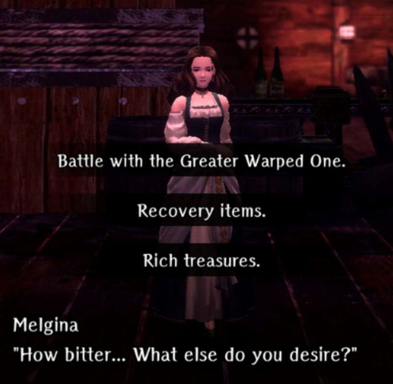
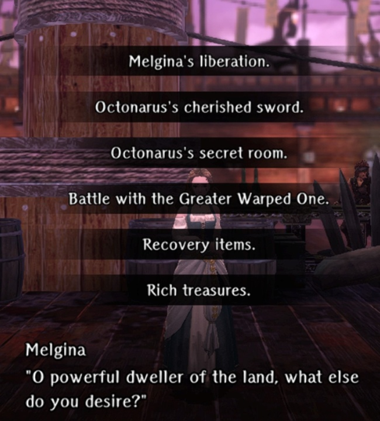

# Port Town Grand Legion - Important Request and Greater Warped One

!!! note "Overview"  
    - This page walks you through successfully completing the Second Abyss by finishing the primary Request ("Find the Missing Person"), and not just killing the Abyss's final boss.  
    - Specific requirements/activities are listed in order of the Cursed Wheel point needed to 'reset' the event.  
    - Reward:  After Finding the Missing Person, you receive a reward based on the which Faction request you chose:  
        - Pontiff Route: Book of Sanctuary's Blessing Secrets (Skill book that gives chance to reduce damage based on PIE)  
        - Princess Route:  Shield of Honor (Steel light shield, with fixed +4 RES and -2MDEF vs standard light shield)  
        - Admiral Route:  Twin Pearls (sell only)  

## Mechanics

- Recommended Level: 30+
- Recommended Element: Earth

### Water Statues

These statues create rivers that control movement throughout the map, often forcing you into specific locations.

Bring a Hook of Harken to retreat if your party is too injured to proceed.

Later in the dungeon, on Trade Channel 4th Street, you’ll encounter an event that allows you to disable these statues.

### Locked Doors

Red-marked doors on the minimap are inaccessible until the end of the dungeon. 

Near the dungeon's conclusion, an NPC on a ship will give you a key to unlock these doors, just before the arena segment.

## Arena

!!! warning "Arena Warning"
    Most of the arena fights follow the same pattern of attempt it and die, Lulu asks you what happened then tells you to talk to Rickett (by the Ship's Hold harken), you get one or more requests, you complete them, then you try the fight again and win.

    In order to save on resurrection costs on your first time through the arena, it's a good idea to send the MC alone to Arena 1, Arena 3 (Princess and Admiral routes), Arena 4, and Arena 5. You can alternatively send the MC alone the first time on every fight, but if you die against Arena 2 or Arena 3 Pontiff route, Lulu will pretty much tell you that it's a skill issue and there's no reason you should have died.

??? "Arena Fights in a nutshell (if you really need it)"

    ### Arena Round 1

    1. You will die due to being stunlocked by bad breath and instant killed by his magic weapon. Only go in with the main character.
    2. Pay some gold or complete [Eradicate Warped Ones Request](./requests.md#eradicate-warped-ones-belowdecks) to remove the instant kill.
    3. Talk to the chef across from Reprobus on Lower Deck 1.
    4  Return to town and complete [Exterminate Farm Monsters Request](./requests.md#exterminate-farm-monsters) to give the Mimint to the head chef. Consume Mimint Potage to remove his ability to stunlock you.
    5. Beat up stinky boi.
   
    ### Arena Round 2

    1. The Round 2 enemy changes by talking to Bonnie and Clyde in the 7th District - Pier.  If you never talked to them, or you perfectly completed their story arc, you will face  a group of not-too-difficult Warped Ones.  Otherwise you will fight some combination of Bonnie and/or Clyde.  Simply defeating whichever enemy you face allows you to move on to Round 3. The Bonnie and Clyde side story is tedious but completely optional:  
        - To change this fight, wheel back to where B&C appear at the Pier (Arena 1 or earlier) and talk to them. Then wheel back to and refight Arena 1 for the dialog change to register for the Abyss 2 fight.  
        - First time talkign to B&C, you choose one to encourage. You will fight that one in Arena 2 and gain knowledge about why the other died. Complete their story arc requires you to have encouraged each once to gain both pieces of knowledge.  
        - After learning why each one died you can, one at a time, take requests from them to [get Clyde a better sword](./requests.md#pirates-cutlass-delivery) and [get Bonnie some wire for chain mail](./requests.md#steel-wire-delivery) so they (individually) survive. You will then again face each one separately (slightly buffed with better equipment) in the Arena, but you learn that only helping one still allows the other to die.  
        - After having attempting to save each separately, you can try a new option to [equip both with Arena Survival Gear](./requests.md#battle-item-set-delivery). Then you will  finally face them both in the arena with better gear. **Warning, after winning the fight they attempt the Butch technique of blowing you all up in a damaging explosion. Do not end the fight low on HP or you could die anyway.**  
        - Last, after learning they both die no matter what you do, you can finally try to [convince them to leave town](./requests.md#delivering-chamomile-for-the-dead). If you succeed, they both live and leave, and you go back to fighting a group of not-too-difficult Warped Ones.  
        - After returning to town you will learn of their fate and gain both an Achievement and a Luck Lamp for the Well of the Mind.  
    2. After completing any version of the Round 2 fight, when asking about Round 3 the missing person you are looking for is blown up in a fight with Butch.  
    3. To keep him from getting blown up (and yourself from being murdered later) follow the steps below:

        #### "Saving the Missing Person and Not Being Murdered"  
        A dead missing person results in a dead you even after defeating the GWO. (Your actual request WAS to retrieve him, after all.) You have two options to keep the missing person, and yourself, alive.  After winning your second arena battle and watching the missing person get blown up, either:  
        
        1. Disable Butch's explosives:  
            1. Use the Cursed Wheel to go back in time to before fighting the second battle.  
            2. Find Butch and complete the [Obtaining KnightQuil request](./requests.md#obtaining-knightquil).  
            3. After completing the request, beat up your second arena battle opponent again and re-watch the scene. Your missing person lives this time!   ("Defeated Butch" appears as an Arena 3 Cursed Wheel option.)  
        2. Flood the Arena (Unconfirmed: you may need to have played through strategizing for the Arena 4 fight first.)  
            1. Use the Cursed Wheel to go back in time to before the second battle.  
            2. Immediately after your Arena Round 2 fight, before talking to the goblin to ask about Round 3, head straight down to Lower Deck 1 where the guard is waiting in front of the switch. Either fight the guard or give him a food voucher. Flip the switch so that the arena floods for the next fight.  
            3. Go back upstairs and talk to the arena goblin. Re-watch the scene. This time the arena floods and the fight ends in a draw. Your missing person lives this time! ("Ended in a Draw" appears as an Arena 3 Cursed Wheel option.)  

        If the missing person is alive, don't forget to go talk to him. 
        
    ### Arena Round 3

    1. On first attempt you may die depending on who it is. Go in with the main character only if you're sure of or worried about losing:  
        - Pickerel (Pontiff Route) is relatively straightforward.  
        - Vernant (Admiral Route) is extremely difficult but killable (not recommended on first attempt).  
        - Shagtis (Princess Route) is the only forced death.          
    2. If Vernant or Shagtis: talk to Pickerel and complete [Temple Food Assistance Request](./requests.md#temple-food-assistance) for Pickerel's help in the fight. If Pickerel, then just kill him and move on, unless you would like a relatively difficult boss fight (probably more difficult than the GWO of this abyss) which requires you to complete a rather long [Monster Bird Soup Request](./requests.md#monster-bird-soup).  To avoid killing Vernant on the Admiral route, you must first complete tbe Monster Bird Soup request on the Pontiff Route. Then you can [Prevent Vernant from Entering the Arena](./requests.md#prevent-vernant-from-entering-the-arena).
    3. Win the fight and continue.

    ### Arena Round 4

    1. This fight is winnable, but like Vernant, extremely difficult (basically a big stat check fight). If you are not confident in your team or are already struggling a bit in general, only go in with the main character.
    2. Head to Lower Deck 1, and head to the switch. Either fight the guard or give him a food voucher. Flip the switch to lower the water.
    3. There will be a new request at the Royal Capital, which is the [Purple Garlic Delivery Request](./requests.md#purple-garlic-delivery). Complete it and give the Garlic to the head chef and eat the garlic dish.
    4. Win the fight. You will get a bondmate if you did not do Step 2 and 3.
    
    ### Arena Round 5

    1. You will die, so go in with the main character only.
    2. Go to Rickert and complete [Murder Investigation Request](./requests.md#murder-investigation) to turn off the infinite magical beasts.
    3. Talk to the Under Cook in the food hall to obtain [Gathering Sahuagin Scales Request](./requests.md#gathering-sahuagin-scales) at the Royal Capital. Give the peppers to the Under Cook to turn off Geuzen's singing.
    4. Win the fight.

### Arena Rewards  
After winning Arena Round 5, you get your wish granted. The options you see depend on if it's your first victory and/or if you've gathered all information needed to discover who the real GWO is. See image below:  

=== "First Victory"
    

=== "Second Loop before challenging Octonarus"
    

Some reward choices will result in gaining an item or access to a new area after defeating the GWO.  Also, some choices require you to "Reverse" either the GWO (left) or the Ship (right) after the battle. 

#### First Victory Rewards

- Recovery Items
    - Reward: Recover HP/MP/SP to full before GWO fight.
    - Prerequisite: Gave Mackarel Sandwich to Melgina (no reward if you gave her the knife)

- Rich Treasures
    - Reward:  Treasurey chest key - unlocks trapdoor on Ship's deck.
 
-  Battle with the Greater Warped One
    - Reward:
        - Melgina’s Choker (if you gave Melgina the sandwich)
        - Octonarus' necklace (if you gave Melgina the knife)
    - Which side to reverse: Right

#### 2nd Victory Rewards

- Melgina’s liberation
    - Reward: Melgina Bondmate
    - Prerequisite: Gave Titanium knife to Melgina and Gave Titanium Ore to Gessi.
    - Which side to reverse: Right, and then check Octonarus’s hand.

- Octonarus‘s Cherished Sword
    - Reward: Cutlass of Tyranny
    - Prerequisite: Gave Titanium knife to Melgina
    - Which side to reverse: Left

- Octonarus‘s Secret Room
    - Reward: Access Forgotten Pirate Harbor (via the underwater grate in the underwater section of the pier area, only accessible directly after the battle)
    - Prerequisite: Gave Titanium knife to Melgina
    - Which side to reverse: Left, then go to grate before returning to town.

## Epilogue

After you beat Melgina, watch the scenes. 

Congratulations \- you lived, completed your request, and more importantly, received the lexicon that allows you to read the 7 mermaid statues you encountered\!

### Decision Point

From here, you have two options.

1. The first is to use the wheel to go back to the start and do a different faction request. This will effectively start you over in the Port Town Grand Legion and you will have to progress through the maps as if it was your first time, except you will have the lexicon, so you can read the mermaid statues as you come across them and pick up some very valuable information.

    !!! caution "Keep in mind that whenever selecting a choice of faction, cursed wheel progress in that timeline will not carry over to other faction timelines, and thus you will have to complete all progress in order to see any progress made previously in the cursed wheel. For example, if you have completed Princess Route in both Abyss 2 and Abyss 3, then cursed wheel back to select the Admiral Route in Abyss 2, you will not be able to cursed wheel to your Abyss 3 Progress until the Abyss 2 + Abyss 3 progress has been caught up in the Admiral Routes."
   
3. The second is to not start on a new faction request. Instead, within the same completed path, go around and read all the mermaid statues again, pick up some very valuable information.

The path you choose is ultimately yours, and the only difference is with option 1, you will have to fight Melgina again before you are really able to fight Octonarus. Note that if you are trying to get the IQ Guiding Light, you’ll need to fight Melgina (not Octonarus) a second time anyway, so I personally took the first option because it made sense to me to just collect the mermaid statue knowledge as I went through the maps again. If you do take option 1, this same decision point applies at the end where you can either repeat option 1 for the third faction or move on to option 2\.

## Octonarus

Once you’re ready to fight Octonarus, you first need to learn about him by reading the 7 mermaid statues throughout the map. This assumes you have that knowledge and know about his existence. Note that these steps are the identical steps needed to get [Melgina as a bondmate](../../adventurer-customization/bondmates/port-town-grand-legion/bondmates.md#melgina). If you do not take these steps and just call out Octonarus’ name instead of Melgina's after the 5th arena battle, you will end up in a battle with Octonarus where he will keep resurrecting Melgina and you'll have to kill her six times. Not fun\!

1. Use the wheel to travel back to **One-Eyed Sahuagin** and speak to the Gessi destroying the statue using the “**Don’t you want to save Melgina**” option
2. Use the wheel to travel back to **Flooded Town** and speak with Melgina using the “**Do you want to be free from Octonarus**” option
3. Complete the [Rustproof Knife Delivery](./requests.md#rustproof-knife-delivery) request that Melgina gives you instead of getting her the mackerel sandwich
4. Complete the [Titanium Ore Delivery](./requests.md#titanium-ore-delivery) request to \`have the blacksmith make it and give it to Melgina
5. Use the wheel to travel back to **One-Eyed Sahuagin** and talk to Gessi again, using the “**Dont you want to save Melgina**” and “**I understand, Gessi**” options
6. Complete the [Obtaining Titanium Ore](./requests.md#obtaining-titanium-ore) request
    1. Note that if you want Gessi’s help against Octo, when you do the next step, make sure you configure the wheel so that you did not give the Purple Garlic to the head cook
7. Use the wheel to travel back to **Arena Round 5** and after defeating Geuzan, engage Melgina with the “**Melgina's liberation**” option
8. You now get to fight Octonarus:
    1. As part of this fight, you will still have to fight Melgina first, and she will resurrect once (you will have to fight her twice), however she will refuse resurrection after that.
    2. You cannot request healing prior to this fight, so make sure you conserve what you can while fighting Geuzan, and bring some potions to heal up as needed before engaging Melgina.

## Greater Warped One

### Melgina

#### Battle Tips

* Weak to earth, so `ERLIK` from Yekaterina and Den of Earth weapons will be very helpful
* Buffing with `MASOLOTU` and `CORTU` can greatly reduce the damage you receive through evasion and spell damage reduction
* `KINAPIC` can be useful to help prevent any issues related to your party being put to sleep, however you can still get some bad RNG here
* Make sure you reapply any crucial buffs or debuffs if Melgina clears them
* Mages (Yekaterina in particular) should keep `Mental Unity` up so they can quickly clear any adds she spawns with a line spell.
* If running two mages with one being Yeka, a single `KATINO` from your second mage followed by a `Mental Unity`-buffed `MAERLIK` will clear the adds out, quickly preventing any long-range bombardments

#### Right Arm of Reversal Usage

* Use it on the statue to drain the water.

### Octonarus

#### Battle Tips

* You will have to fight Melgina twice before Octonarus, so it's beneficial to try to burst her down as soon as you can. Unconfirmed, but she appears to have lower health in this fight than in the fight with her as the Greater Warped One. When you get to his phase, Octonarus can be fought a bit more defensively.
* This fight in general is the same as the Melgina fight but with more "stuff" being thrown at you.
* Weak to earth, so `ERLIK` from Yekaterina and Den of Earth weapons will be very helpful.
* Buffing with `MASOLOTU` and `CORTU` can greatly reduce the damage you receive through evasion and spell damage reduction.
* `KINAPIC` can be useful to help prevent any issues related to your party being put to sleep, however you can still get some bad RNG here.
* Make sure you reapply any crucial buffs or debuffs if Melgina clears them
* Mages (Yekaterina in particular) should keep `Mental Unity` up so they can quickly clear any adds she spawns with a line spell.
* If running two mages with one being Yeka, a single `KATINO` from your second mage followed by a `Mental Unity`-buffed `MAERLIK` will clear the adds out, quickly preventing any long-range bombardments.
* If you beat Gessi without Purple Garlic and selected "Melgina's Liberation", he will join you after 3-5 rounds vs Octonarus, usually sometime after he summons Allies.

#### Right Arm of Reversal Usage

* Use it on one the statue to drain the water.
