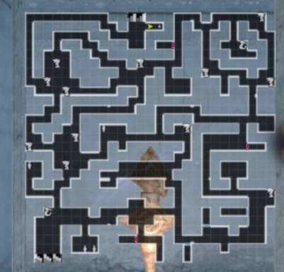
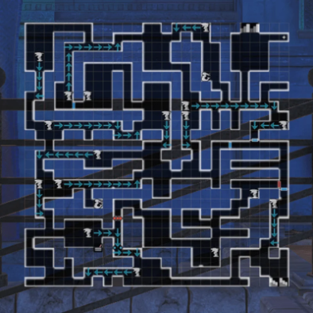
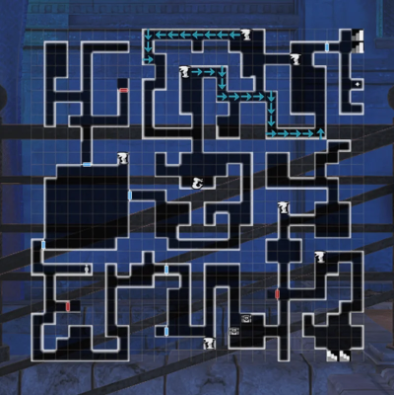
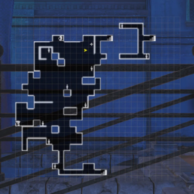

# The Trade Waterways

??? note "Some tips for this Abyss before starting"
    - To make the run easier, one can grind out Undead March Request from the Beginning Abyss to get to level 40 and complete the Grade Up exam.
    - A vast majority of the enemies in this Abyss are water element, so it helps to get as many earth-element weapons and armor (preferably to +10) from Earth Den BF1.
    - Iron/Steel level gear are commonplace drops in this Abyss, so it's recommended to begin building some in preparation for the next Abyss.
    - ==Do not sell any Sahuagin Scales== when obtaining them as you begin this Abyss, as they are needed for a mandatory main story request.

Note: There are areas where you are carried by a strong current. You must unlock the ability to reverse the water statues. Some have a timer to become cursed again. Some areas will be completely submerged. You should lure monsters out of the water in these areas or they\`ll be stronger

??? map "1st District - Back Alley"
    

    ??? note "About this floor"
        - There are some locked doors here.  The key will become available to you later in the story and you can come back to collect any chests behind the doors.

??? map "2nd District - Black Market"
    

    ??? note "About this floor"
         - The mermaid statue on this and subsequent floors give important lore both contextually and are significant for being able to fight Octonarus. Make sure to get their knowledge.

??? map "3rd District - Iron Gate Street"
    

    ??? note "About this floor"
        - Your first scripted battle is on this floor against a Lizard Commander, at the end of the floor.  This is a strong enemy with a lot of armor.  The best strategy is to block and create openings if your team is undergeared and/or underleveled.

??? map "4th District - Boulevard"
    
    !!! note 
        When you’re locked in the room and drowning, you need to attempt to leave the area through both the upper left and upper right sections of the room you’re in, as well as attempt to go back into the current before you’re able to activate the statue to drain the water. Heal with items as needed and take as few steps as possible\!

    

??? map "5th District - Sunken City"
    

    ??? note "About this floor"
        There are quite a lot of flooded rooms in this floor. You cannot cast magic while underwater, so it's recommended to carry scrolls on spell users. Aquatic enemies like Sahuagin gain significant action speed and evasion while underwater. If possible, try to lure fights out of the water.

??? map "6th District - Warehouse"
    

    ??? note "About this floor"
        There is another scripted battle on this floor against an Oar Collector. It is advised to turn off the northwest most dragon statue via the north path before fighting the Oar Collector as it will grant 3 turns of unsubmerged combat before the water levels rise again.

??? map "7th District - Pier"
    

    ??? note "About this floor"
        There are no enemies on this floor, though there are things to find if you look around hard enough.

??? map "Seaside of the Dead"
    

    ??? note "About this floor"
        There are no enemies on this floor, though you can fight the Sahuagin for the object it picked up if you accepted the small quest from the woman above.

??? map "Lower Deck 1 -Ship's Hold-"
    

    ??? note "About this floor"
        There are a lot of enemy spawns on this floor, and no real way to avoid them as there are narrow corridors. This is also where you find the NPC with the key for all the locked doors in the previous floors.

??? map "Lower Deck 2 -Lounge-"
    

    ??? note "About this floor"
        Welcome to the farming floor. You will mainly be seeing this floor after coming up from the Lower Deck 1 Harken to farm the chests that spawn nearby the entrance. There are more scripted fights here related to the main story that will all take place in submerged areas. Remember to bring scrolls for your spellcasters!

??? map "Upper Deck -Arena-"
    

    ??? note "About this floor"
        There are no enemies of this floor, but there are a lot of mandatory deaths here. Make sure to take your party members out before going into a scripted death fight!
