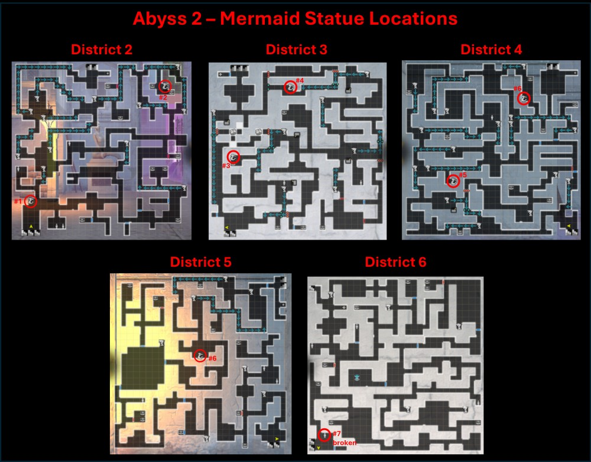
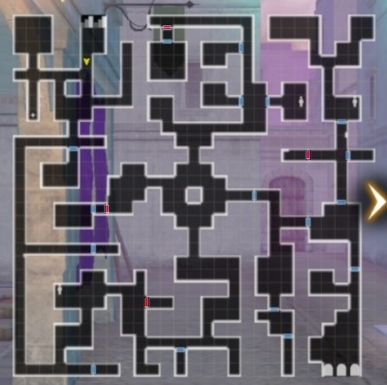
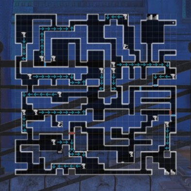
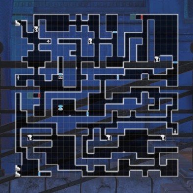
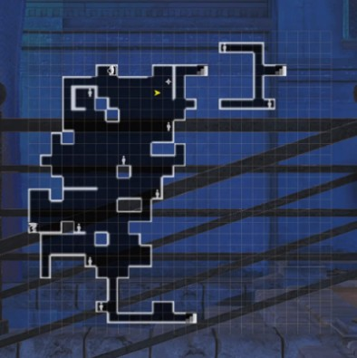
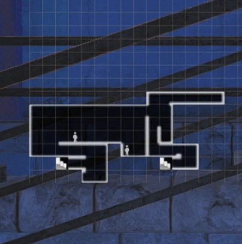
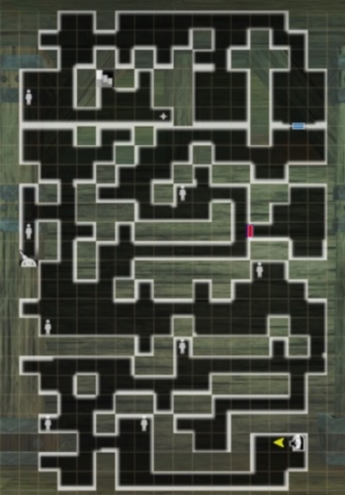
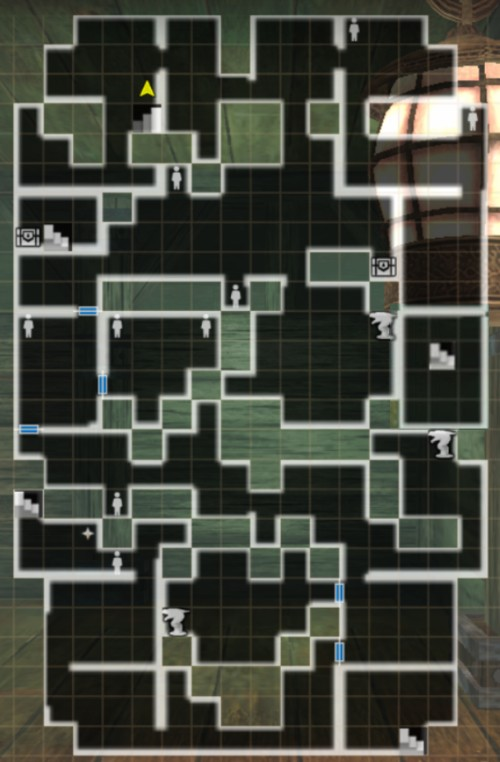
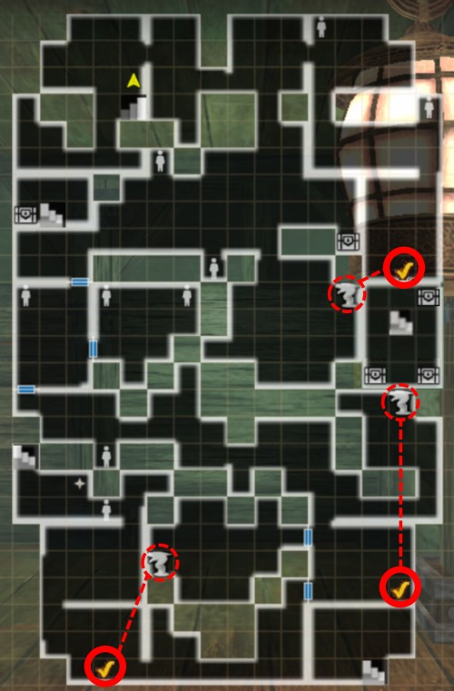

# The Trade Waterways
## Overview
The Trade Waterways are actually the western district of Port Town that has been overrun by monsters while the resident are suffering from some mysterious amnesia. Your overall goal is not to solve these problems, but actually to seek out a Missing Persion at the request of one of the world's main Political factions. (Abyss progress is fairly identical for al three factions.) In seeking this person you will progress through the 6 districts of the Trade Waterways, learning of some Arena attracting challengers. Making your way to the Pier at the water's edge, you will discover a large Ship housing this Arena on its deck, where upon you will find both the Missing Person and the influence of a Greater Warped One. Battling and manipulating your way through the Arena and bringing back the Missing Person are key to surviving this Abyss.

## Abyss notes:
??? note "Some tips for this Abyss before starting"

    - The Abyss is targeted toward parties level 30-40. Completion without advancing at least to Bronze Grade is possible but a significant challenge. One can grind out Undead March Request from the Beginning Abyss to level up.  
    - A vast majority of the enemies in this Abyss are water element, so it helps to get as many earth-element weapons and armor (preferably to +10) from the Earth Den.  Many monsters are also "Magical Beasts", so characters and weapons with the "Magical Beast-Slayer" trait are also  useful.  
    - Iron/Steel level gear are commonplace drops in this Abyss, so it's recommended to begin building some in preparation for Abyss 3.  
    - ==Do not sell all of the Sahuagin Scales you obtain== as you begin this Abyss, as they are needed for a mandatory late main story request.  You will need 5 each time you complete that request, and you'll have to go back to find more if you've sold them all.  
    - Fully completing this Abyss involves finding and reading all of the Mermaid statues.  Some are unreachable until you learn how to reverse the water statues. The map below shows their locations and 'message numbers' so you can locate any that you are missing:   

    ??? map "Mermaid Statue Locations"  
          

!!! note "There are areas where you are carried by a strong current. You must unlock the ability to reverse the water statues. Some have a timer to become cursed again. Some areas will be completely submerged, and water-type monsters will be much faster and stronger there. You should always try to lure monsters out of the water in these areas."

## Maps

!!! warning "Map Variations"  
    - Some floors have tile variations (shifts and rotations) randomly chosen when you start the abyss, and certain actions can reset the dungeon layout changing the variation you see. Two variations of the maps with tile changes are included below, but your maps and the location of certain events may not perfectly match these.  
    - Events and items on variable tiles always occur in the same rooms on those tiles even though they may have moved and rotated, so look for similar features. See [Map Variations page](../../mechanics/map-variations.md) for details.  

??? map "1st District - Back Alley"

    === "Variation 1"
        

    === "Variation 2"
        

    !!! note
        - There are some locked doors here.  The key will become available to you later in the story and you can come back to collect any chests behind the doors.

??? map "2nd District - Black Market"
    

    !!! note "About this floor"
         - The mermaid statue on this and subsequent floors give important lore both contextually and are significant for being able to fight Octonarus. Make sure to get their knowledge by clicking on each statue's plaque.

??? map "3rd District - Iron Gate Street"
    

    !!! note "About this floor"
        - Your first scripted battle is on this floor against a Lizard Commander, at the end of the floor.  This is a strong enemy with a lot of armor.  The best strategy is to block and create openings if your team is undergeared and/or underleveled.

??? map "4th District - Boulevard"
    

    !!! note "About this floor"
        This is the game's first Death Trap.  You will be locked in a room and drowning, taking gradual damage. Heal with items as needed and take as few steps as possible! To learn to activate the statue and drain the water you will need to try leaving the area through (1) the upper left and (2) upper right sections of the room you’re in as well as (3) attempt to go back into the current that pushed you into the room, then try to activate the statue.  (Some people have reported -version 1.13.0 and later- being unable to progress unless you first try to 'use' the statue, then try and fail to walk into all three paths out, and then try one more time to 'use' the statue. If you have repeat trouble you can try getting to this area with just the main character to avoid having to pay to resurrect your whole team multiple times.)

??? map "5th District - Sunken City"  

    === "Variation 1"  
          

    === "Variation 2"  
          
        
    !!! note "About this floor"  
        There are quite a lot of flooded rooms in this floor. You cannot cast magic while underwater, so carry scrolls on spell users, and trigger/lure enemies out of the water. Aquatic enemies like Sahuagin gain significant action speed and evasion boosts while underwater.

??? map "6th District - Warehouse"
    

    !!! note "About this floor"
        There is another scripted battle on this floor against an Oar Collector. It is advised to turn off the northwest most dragon statue via the north path before fighting the Oar Collector as it will grant 3 turns of unsubmerged combat before the water levels rise again.  The Oar Collector is vulnerable to Earth weapons and magic.  The only Camp in this Abyss is on this floor, but it's not nearly as convenient to access as the Abyss 1 B7F Camp. Take advantage of it to prepare for the Oar Collector.

??? map "7th District - Pier"
    

    !!! note "About this floor"
        There are no enemies on this floor, but a few important people to talk to, and some things to find if you look around hard enough.  This is also a common place to find some of the [wandering NPCs](./wandering-npcs.md) who roam the 2nd Abyss.  The small separate section in the northeast can be reached by the nearby stairs underwater.

??? map "Seaside of the Dead"
    

    !!! note "About this floor"
        There are no enemies on this floor, though you can fight the Sahuagin for the object it picked up if you accepted the small quest from the woman above.

??? map "Lower Deck 1 -Ship's Hold-"
    

    !!! note "About this floor"
        There are a lot of enemy spawns on this floor, and no real way to avoid them as there are narrow corridors. In the southwest you will find the NPC with the key for all the locked doors in the previous floors, as well as a 'magic shop' with a very knowledgable owner.

??? map "Lower Deck 2 -Lounge-"
    

    !!! note "About this floor"
        Welcome to the farming floor. This is one of the best places to get find equipment at this point of the game. You can come up from the Lower Deck 1 Harken, grab any chests that spawn in the northern half of the floor, leave, and repeat. There is the ship's cook here which will be central to some Arena progress, but his meals also give you a big once-per-visit stat restoration. There are more scripted fights here related to the main story that will take place in submerged areas. Remember to bring scrolls for your spellcasters, and look for the statues to temporarily drain the water!  

        The person blocking the stairs to the Upper Deck will tell you to get three arena tickets to proceed. We obtain these in the usual manner: murder.  You will need to win three fights in submerged areas at the locations shown below. Don't forget to reverse the nearby statuse to get a little dry time before they re-flood.
        ??? map "Ticket fight locations"
            

??? map "Upper Deck -Arena-"
    

    !!! note "About this floor"
        There are no enemies of this floor, but there are a lot of mandatory deaths here. You will need to beat five rounds to win, and several are scripted death fights. After each death, you will review options to 'strategize' and make them winable. You can harken to Lower Deck 2 and come up to the arena without risk of combat, so best to take your party members out before going into each a scripted death fight for the first time!  For fight descritions, see the [Arena section of the Important Requests page](./important-request-gwo.md/#arena).
        After winning a few rounds, stairs in the northwest become unblocked giving you access to a room with a chest of gold. Later you can get the key to the captain's treasure hold to open the trapdoor in the north east. Only after defeating the greater warped one can you can finally access the part of the deck with the major Harken. 
