# Port Town Grand Legion - Requests  
!!! note "Key locations can change due to some maps having variable layouts. See [Map Variations page](../../mechanics/map-variations.md) for details. "

## Watery Obstacle

### Defend My Shop from Goblins

??? info "Request"
    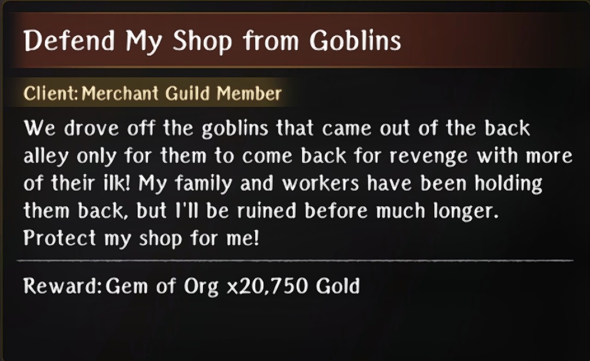

- Exterminate the goblins attacking the shop in Trading Waterway \-Entrance-

??? map "Location"
    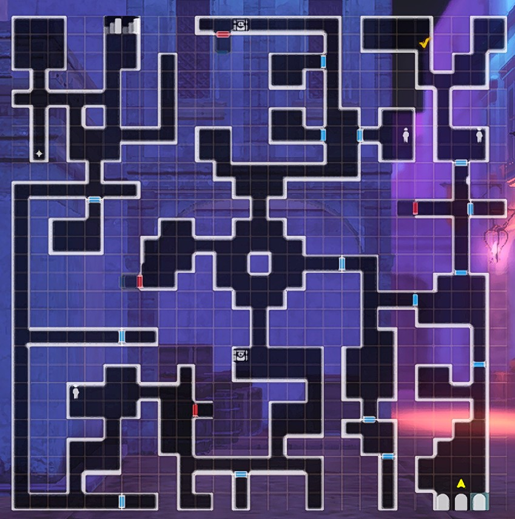

### Water God Statue Restoration Materials

??? info "Request"
    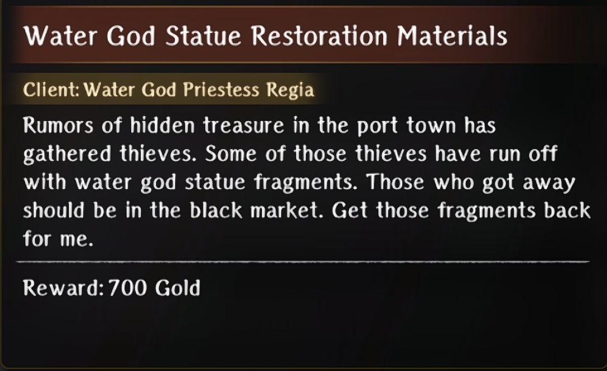

- Head to 2nd District \-Black Market- and defeat the 6 bands of fragment thieves  

!!! note
    If you want to be able to defeat all 6 bands you have to unlock the power to turn off the statues by progressing the story into the drowning section of Flooded Town wheel warp.

??? map "Locations"
    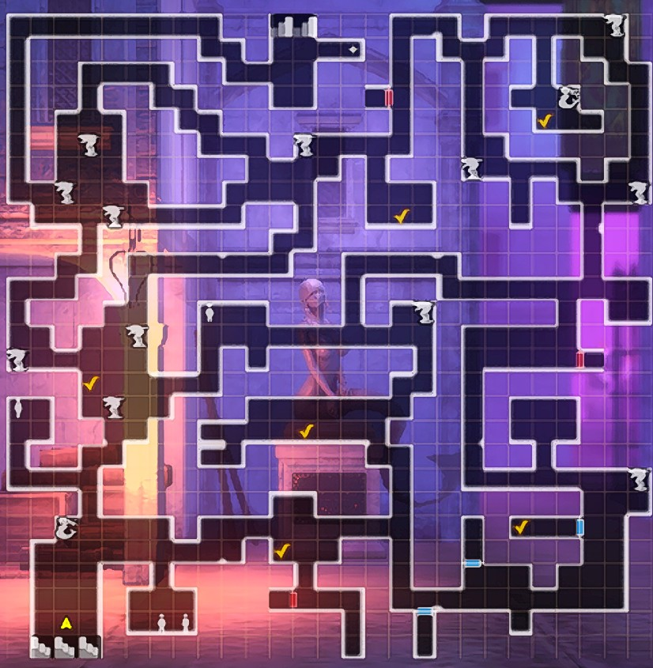

## Flooded Town

### Lizardman Raid

??? info "Request"
    

- Head to 3rd District \-Iron Gate Street- and defeat the Sahagin/Lizardmen assault

??? map "Location"
    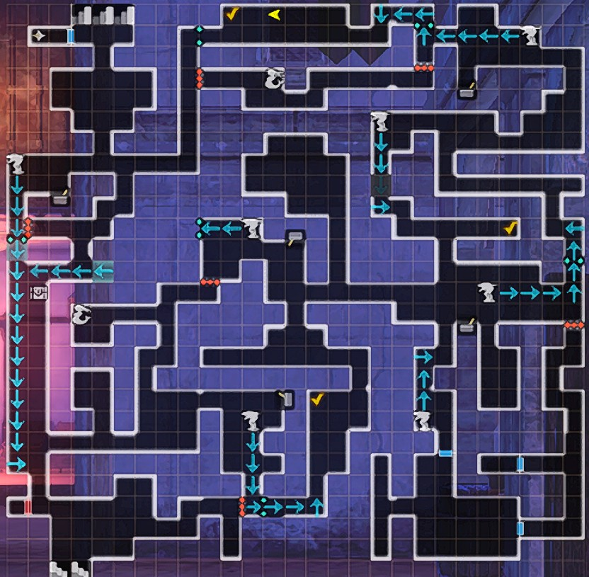

### Mackerel Sandwich Delivery

??? info "Request"
    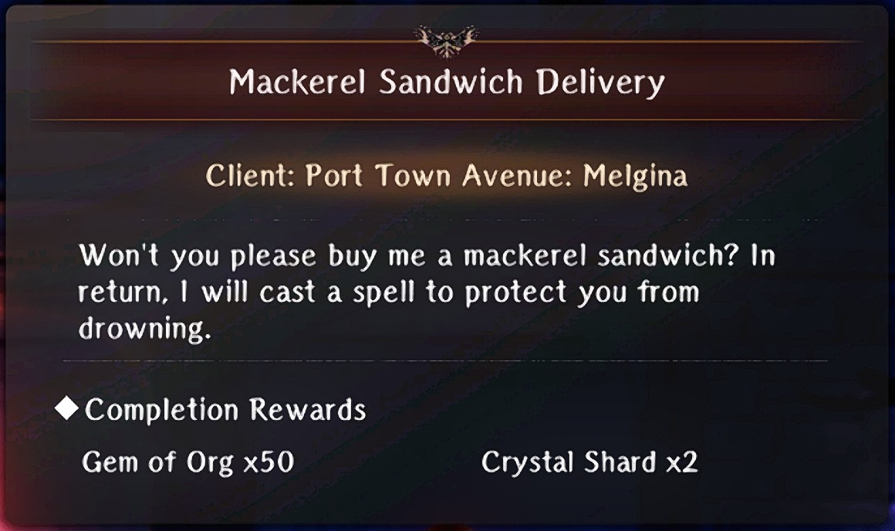

- Go back to the Port Town and speak with Tessa the Baker  
??? info "Tessa the Baker"
    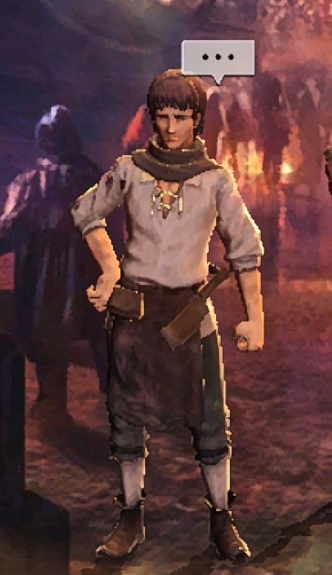
- Head back into x for a scene with the harassers and teach them a lesson  
- Head back to the 4th District \-Boulevard- and give Melgina the sandwich

### Rustproof Knife Delivery

??? info "Request"
    

- Go to Randolf (blacksmith) in the Royal Capital Luknalia   
- Complete Titanium Ore Delivery Request

### Titanium Ore Delivery

??? info "Request"
    

- Go to the goblin nest on B3 of Beginning Abyss and collect 3 Titanium ore  
- Turn the ore into Randolf

??? map "Goblin Nest Location"
    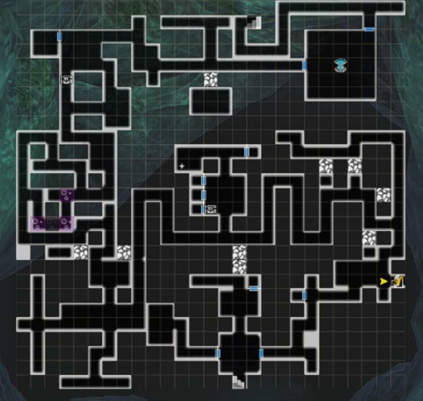

??? map "Titanium Ore Locations"
    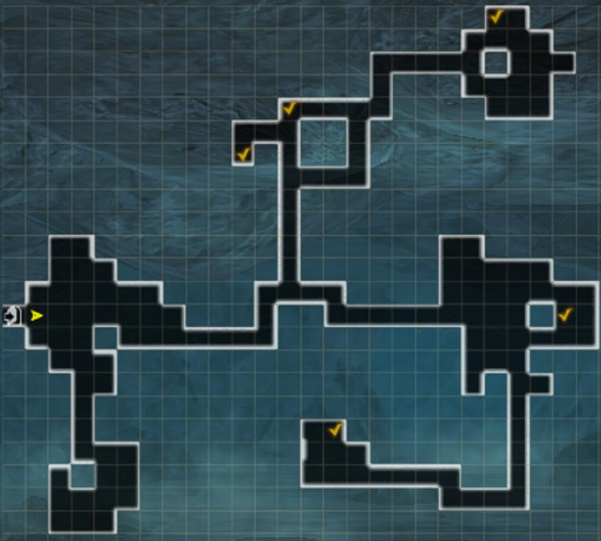

### Viscount Guane
After returning from the Flooded Town you will be approached by a representative of the faction you have chosen. If you already cleared each route, or want to redo the ending to the Viscounty Guane mission then you will have to curse wheel to before Flooded Town and then curse wheel to Flooded Town and immediately return to town. If you want to change faction you have to curse wheel to Search Request.

Aegon -> Princess Route

Egolion -> Pope Route

Goetia -> Admiral Route

??? note "Accepting the Request (all factions)"

    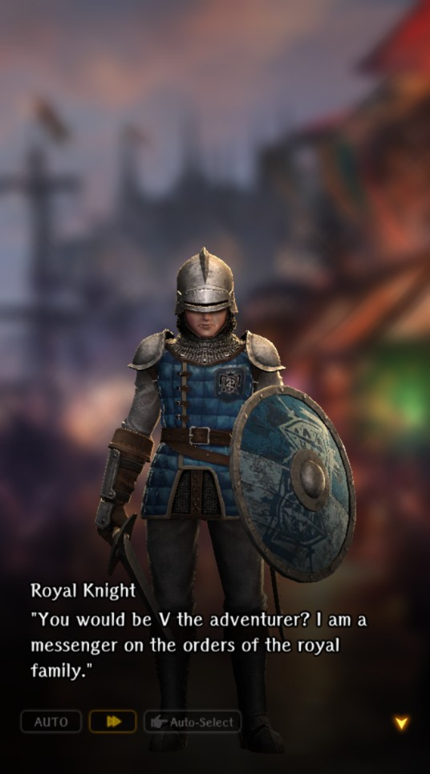
    
    1. Go to the Royal Capital's Adventurers Guild to attend the mission.
        
        
    
    2. "I'll go now." -> Cutscene (Choices in this Cutscene don't affect the ending)

??? note "Travel to Viscount Guane's lands"
    1. Head to Viscount Guane's lands from the World Map
    
        
    
    - You will encounter guards wanting a toll.
    
        
        
        You can either:
        
        a. Pay up (3000 gold)
        
        b. Force Your Way Through (Easy Fight)
    
        c. Turn back (You Leave the Quest Area)
    
        - However you get additional options when turning back. If you have a mage in your party you can select "Let's just bulldoze our way through" 
        
        This will cause the mage in your party to cause a distraction so you can bypass the encounter without paying and there is no mana cost. If you don't have a mage, you just enter the same route as "Force your way through"
    
        
    
        
    
        
    
    2. Now talk to all the NPCs.
        
        

??? note "Walkthrough - Princess Route"
    1. "I don't think so"
    
        
    
    
    2. < Block the sword > (Easy battle)
    
        
    
    3. "The commoner was not resisting"
    
        
    
    4. "What Guane is doing is wrong" 
    
        

??? note "Walkthrough -  Pontiff Route"
    1. < Put your hand on Tenet's shoulder >
    
        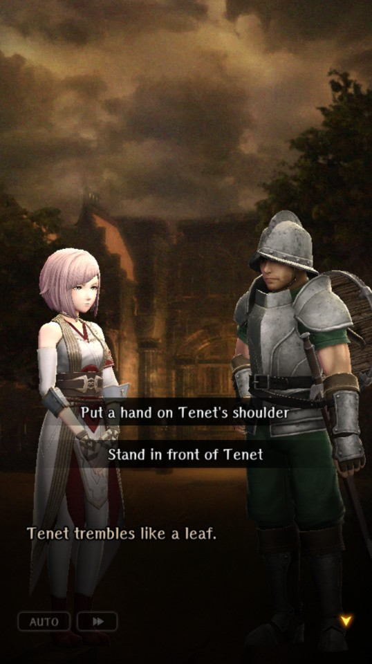
    
    2. "This warrants further investigation"
    
        
    
    3. < Do not accept payment>
    
        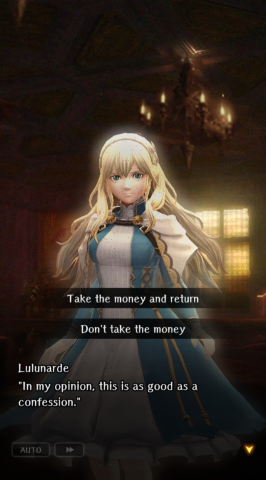

??? note "Walkthrough - Admiral Route"
    1. < Block the sword > (Easy battle)
    
        
    
    2. Catch the beastmen trafficking (it will be rejected)
    
        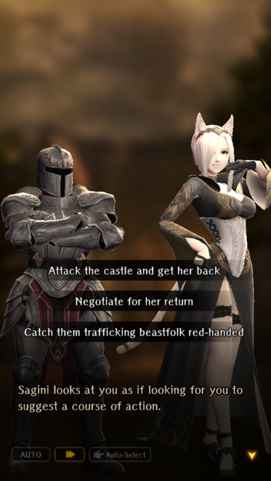
    
    3. Make Sagini a product
    
        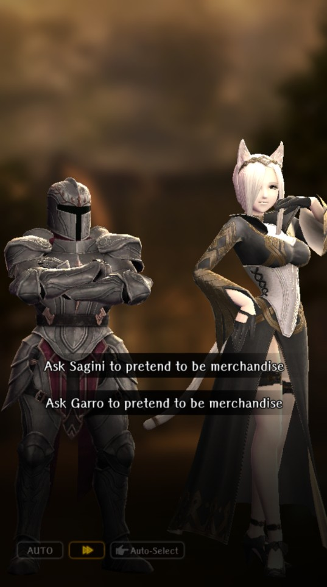
    
    4. Catch the beastmen trafficking (it will be rejected)
    
        
    
    5. Make Garo a product
    
        
    
    6. Catch the beastmen trafficking (they will relent and accept) 
    
        
    
        - If you have beastfolk in your party they will join in
    
        
    
        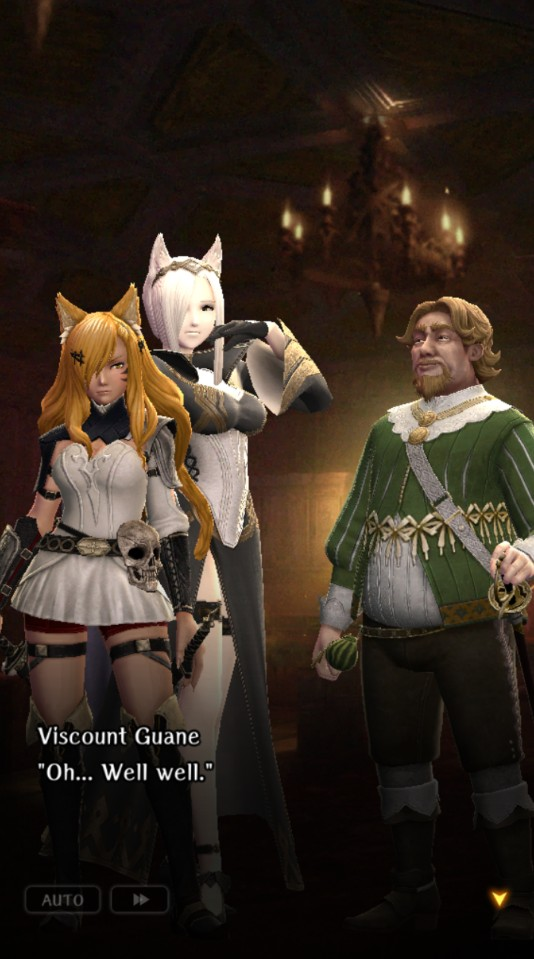
    
    7. Win the battle that comes after the cutscene. 
    
        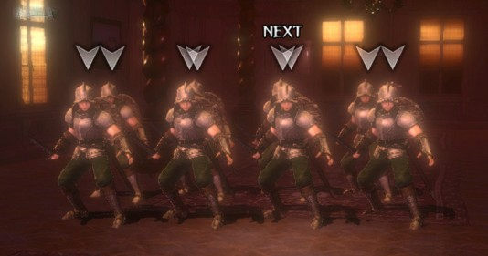

## Sunken City Arrival

### Fisherman Rescue

??? info "Request"
    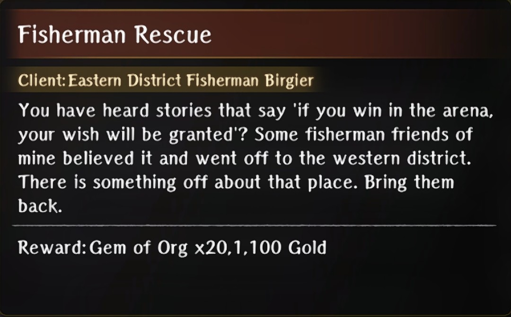

- Go to 4th District \-Boulevard- and meet the fisherman at the location marked by green  
- Go to the other marked location and begin a turn limited battle against enemies to save his friends 

??? map "Location"
    

## One-Eyed Sahuagin

### Retake Stolen Belongings from Robbers

??? info "Request"
    

- Go to 5th District \-Sunken City- and defeat the waves of ruffians

??? map "Location"
    

### Obtaining Titanium Ore

??? info "Request"
    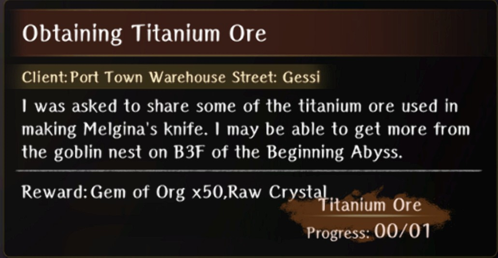

- Go to B3 of Beginning Abyss and head to the Goblin Nest (Refer to Titanium Ore Delivery Request under Flooded Town Requests for location)  
- Check all the locations for the ore that were marked in Titanium Delivery Request and then look for the Ore guy that was seen blocking the way earlier  
- After finding his body, fight the ambushing goblins off  
- Return that ore to Gessi

??? map "Location"
    

## Colossal Galleon

### Unnamed Request

!!! note
    We do not know if this request has any relevance at this time.

- This didn’t have a formal request show up in the request list.   
- An npc will mention that she lost her coral bracelet and if you go underneath the dock into the bridge.  
- There will be a sahagin cheering about a coral bracelet.   
- Defeat him and return it to her.

??? map "NPC location"
    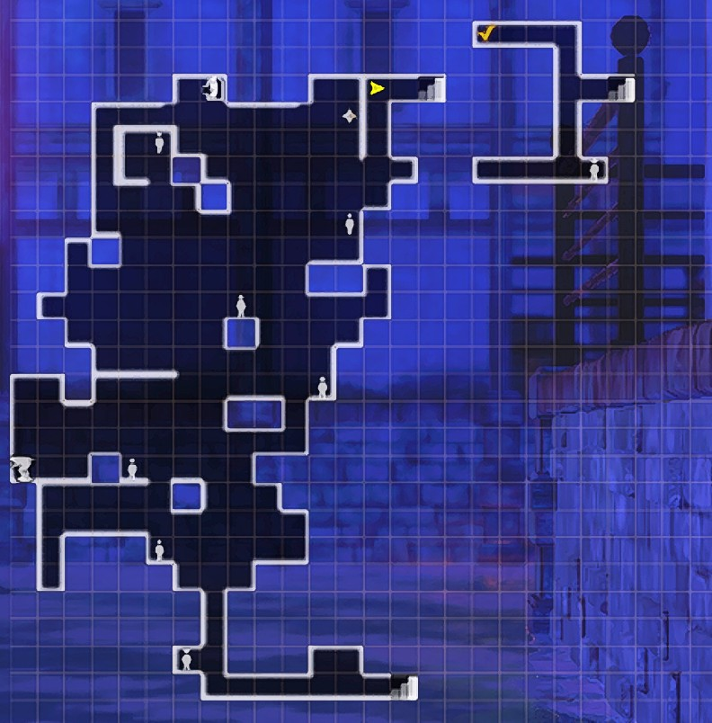

??? map "Sahuagin General Location"
    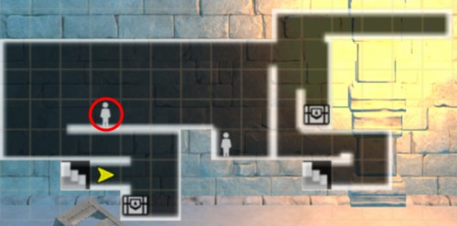

### Pirate’s Cutlass Delivery

??? info "Request"
    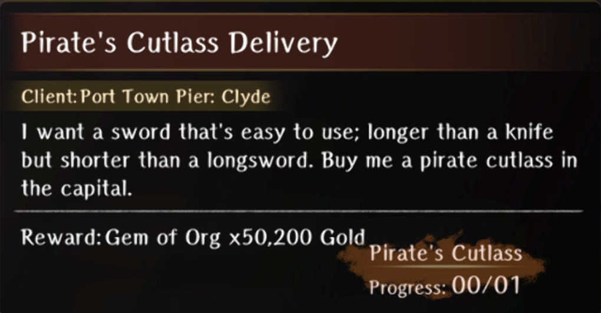

- Go to the item shop in Royal Capital Luknalia and talk to Walter to buy the Cutlass  
- Turn it in to Clyde

### Steel Wire Delivery

??? info "Request"
    
    

- Unlocks after Cutlass Delivery.

**Reward**: 50 Gems

## All Aboard

### Delivering Chamomile for the Dead

??? info "Request"
    

??? info "Requirements"
    - Defeat Bonnie and Clyde after defeating them each once per cursed wheel return.

- Warp to Grand Galleon (or anytime  between that and before Round 2) and talk to Bonnie and Clyde.
- Select the options: "You can start over now" → "You can run outside now".
- You will now receive a request from the Adventurer's Guild in the Royal Capital after heading there.
- After accepting the request go speak to Dana, the innkeeper  
- Go to Port Town Grand Legion and speak with Hille  

??? info "Hille"
    

- Go to the world map and head to Rain Shelter Cave  
- Beat the boss and take the exit in front of you

??? map "Location"
    

??? map "Alternate Map"
    

### Battle Item Set Delivery

??? info "Request"
    

??? info "Requirements"
    - Defeat Bonnie and Clyde after defeating them each once per cursed wheel return

1. Select options "You can start over now" and "If you go to the arena, you will die".
2. Head to Royal Capital Item Shop.
3. Head to Edge of Town and to Abyss entrance. Talk to suspicious man.
4. Talk to the human knight, the suspicious man again, and then the human knight again.
5. Defeat the enemy at the end of the road.
6. Return to the Item Shop and obtain combat tools.
7. Give them to Bonnie and Clyde.
8. Fight them in the Arena.

### Two-Headed Serpents

??? info "Request"
    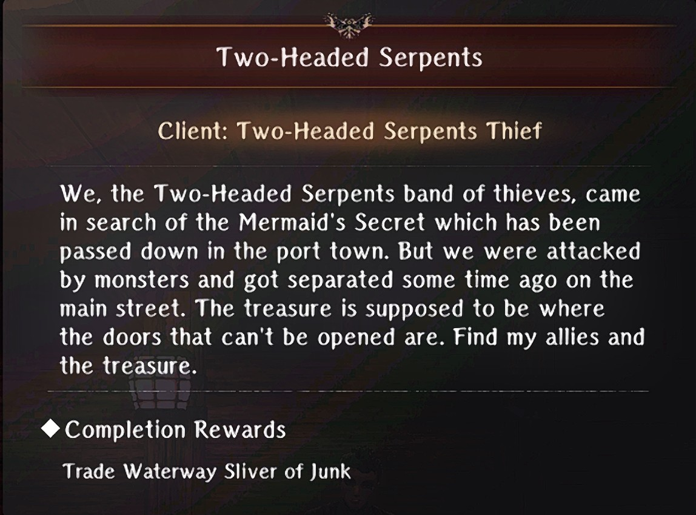

- Go to x and speak to the thief

??? map "Thief Location"
    

- Find his two friends  
- Find the Mermaid’s Secret 

??? map "Mermaid Secret Location: 2nd District \-Black Market-"
    

??? map "Friend Locations: 1st District \-Back Alley-"
    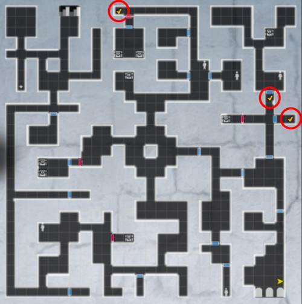

    !!! note
        The NPC icon was in the circle but the body was bugged where the arrow points

    !!! warnING
        The friends may be in different locations. Look for person silhouettes on the maps and check them.

### Servant and Cargo Recovery

??? info "Request"
    

- Go to 6th District \-Warehouse District- and speak to the maid.(She’s green marked)  
- Defeat the enemies attacking the maids. (Turn limited)  
  - You end up having to choose between saying the maids died or turning them into the merchant.
  - Selecting "Look the other way and let them go" rewards you with a bondmate "Doris the Frightened Maid" which is a Air-element bondmate that gives Sleep Tolerance.
  - Selecting "Turn them all over to the merchant" rewards you with "Bloodstained Gloves" which give Humanoid Resistance.

??? map "Location"
    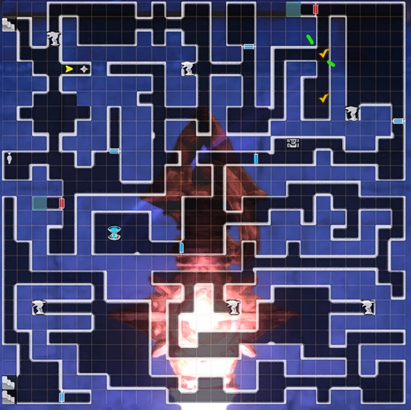

### Repel Enemy Forces

??? info "Request"
    

- Go to 7th District \-Pier-  
- Defeat waves of Warped Ones

??? map "Location"
    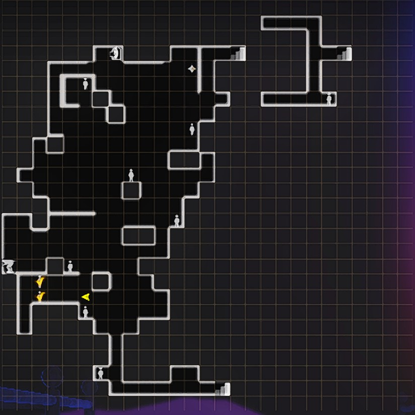

## Rickert’s Shop

### Oar Collector Extermination

??? info "Request"
    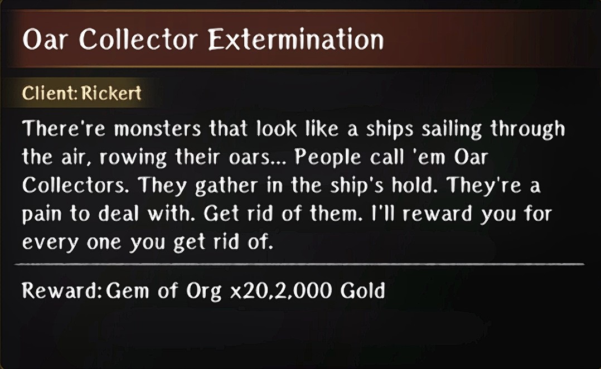

- Go to Lower Deck 1 \-Ship’s Hold-   
- Defeat the Oar Collectors

??? map "Locations"
    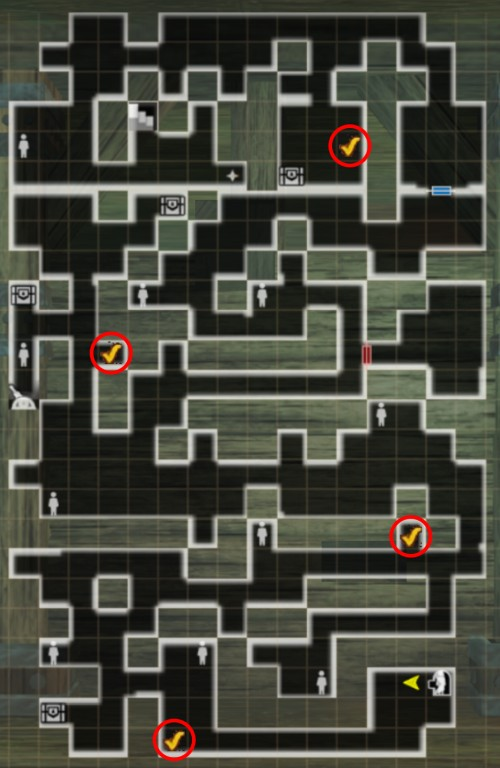

### Scorpion Woman Legs and Herb Procurement

??? info "Request"
    

- Go to Beginning Abyss B3

??? map "Scorpion Woman Locations"
    

??? map "Herb Locations"
    

??? map "Alternate Herb Locations"
    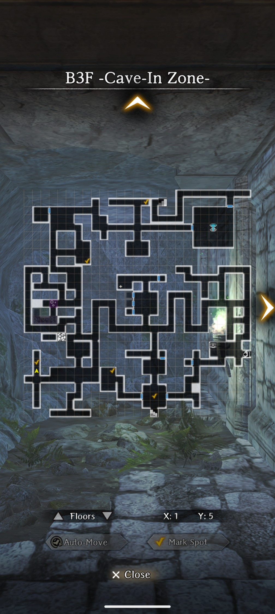

    !!! note
        It is possible that there are other locations than the above two specified, so if neither of those maps work for you, you can check the bottom-right side or just explore everywhere!

### Giant Insect Procurement

??? info "Request"
    

- Head to Den of Earth and fight some Desert Flies

??? map "Location"
    

### Minotaur Spare Rib Procurement

??? info "Request"
    

- Go to Lower Deck 2 \-Lounge-  
- Slay some minotaurs and collect 1 Minotaur Head and 4 Minotaur Spare Leg

??? map "Locations"
    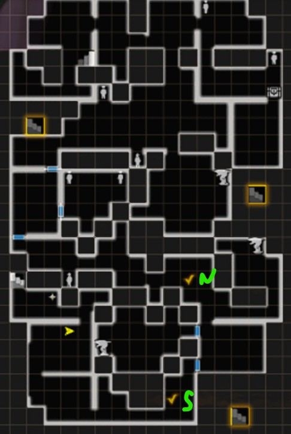

    !!! note
        Not sure if this will be the case for everyone but the south mark gave me Minotaur head every battle and the north mark gave me Spare Leg every battle, I reset encounters by going back to town and went back in to respawn them and such was the case until I turned in the quest. The mobs move as well so marks an approximation and not exact location.

### Hydra Plant Procurement

??? info "Request"
    

- Head to Valeon Grasslands on the world map  

??? map "Valeon Grasslands"
    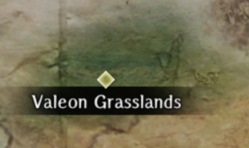

- Defeat 4 Hydra Plants around the area  

    !!! warning
        There is no map in this area so be careful walking around  

    ??? info "Tip"
        To avoid as many battles as possible, the icon on the overworld for the plants is a slime. Credit to Proto.
        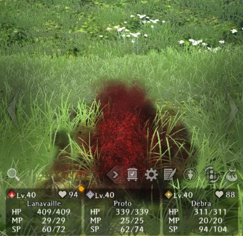

### Obtaining KnightQuil

??? info "Request"
    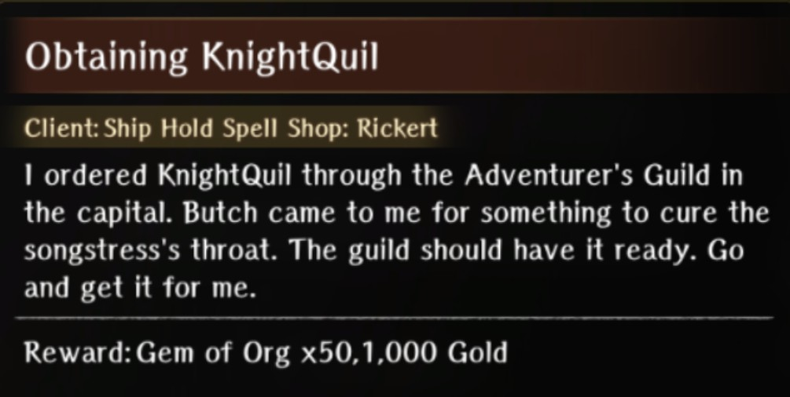

!!! note
    The easiest time to complete this is after Arena Round 1 and before Arena Round 2

- Speak to Butch on Upper Deck \-Arena- to see he wants Knightquil then talk to Rickert  

??? map "Butch Location"
    

- Go to the tavern in the Royal Capital Luknalia to collect the KnightQuil  
- Head to Edge of Town to see that monsters are attacking and blocking the harken so take the Back Alley  
- The nearest Harken is broken so repair that and travel back to Rickert  
- Give Knightquil to Butch  
- Fight Bonney/Clyde  
- Talk to goblin to find out about your next opponent. A scene should trigger where your missing person wins  
- Talk to your missing person after the fight and he'll mention he's withdrawing from arena

## Arena Round 1

### Eradicate Warped Ones Belowdecks

??? info "Request"
    

- Defeat 5 warped one enemies in the ship.   
  Note: There is no specific area on the map, just defeat overworld enemies.

### Purple Garlic Delivery

??? info "Request"
    

- Go to the Tavern and speak with Migrant Man to learn location of Purple Garlic  
- Head to the Valeon Grasslands on the world map  
- Speak with the Peddler, he isn’t too far from the entrance  
- Get his goods back from the thieves that escaped to the north  
  
??? info "Thief Appearance"
    There is no map in the grasslands but this is what the thieves look like on the overworld.

    

    ??? info
        For the last 2 thieves you’ll need to go between 2 trees and click the rubble. If it won’t let you interact with it then try circling around till you can. Then head west for the peddler’s goods.

        

### Exterminate Farm Monsters

??? info "Request"
    

- To obtain this request, talk to the chef across from Reprobus on Lower Deck 1 after losing to him.  
??? map "Lower Deck 1 Chef location"  
       

- This will cause the request to show up in the Royal Capital Adventurer's Guild.   
- At the farm, selecting the option to wait will cause you to be ambushed, while the other option will give you iniative.
- Defeat the Warped One and turn in the request to receive Mimint. You may now give this ingredient to the Head Chef on Lower Deck 2 for Mimint Potage.

## Arena Round 3

### Pickerel’s Report

??? info "Request"
    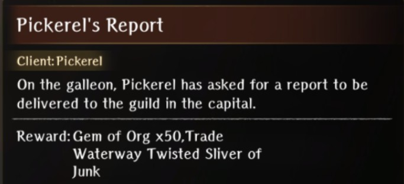

- Go to Adventurer’s guild in the Royal City Capital.  
- Complete Temple Food Assistance Request.  
- Speak to Pickerel at Upper Deck \-Arena-.

!!! info "Tip"
    - An easy way to find rabbits is to enter the B4F Harken in Abyss 1. A group of 3 bunnies is guaranteed to spawn on the room next to it, which is a very fast way to fulfill the requirement.

### Temple Food Assistance

??? info "Request"
    

- Go to Beginning Abyss B4 and gather 5 Vorpal Bunny Meat from Vorpal Bunny enemies  

??? info "Tip"
    If you still have an incomplete Relentless Massacre Rabbit quest, you can repeatedly interact with the same body and fight the rabbit until you collect all the mats without needing to look for them.  

- Go to Valeon Grasslands and gather 1 Wild Carrot, they grow near white flowers.  

??? info "White Flowers"
    

    !!! warning
        You need to walk around this patch until you get 3 dialog prompts. If get frozen in dialog, toggling the "Auto" switch will unlock you.

- Turn in the materials at the Temple in Port Town Grand Legion. You can then complete the request back at the Royal Capital, then head back to Pickerel on the ship.

### Monster Bird Soup

??? info "Request"
    

!!! info
    This request is exclusive to the Pontiff route

!!! danger
    This request leads to a boss that is arguably harder than the true greater warped one of this abyss.

    ??? info "Read if you have trouble with Pickerel spawning"
        The easiest way to get him to spawn seems to be to do the following:
        - Wheel to the Admiral route and make sure you have killed Melgina or Octo
        - Wheel to Arena 3 of the Pontiff route
        - Find Pickerel at the marked location

- Complete all three important request routes (Princess, Pontiff, and Admiral). You will also need to have to sabotaged the Vernant fight via Pickerel replacing his potion with onion soup in a different route.
- Wheel back to Round 3 Pontiff and talk to the goblin so you can see that you're fighting Pickerel.  
- Go to x and find him at the location in the image to overhear him talking to the head chef  
- Speak with the head chef and he’ll tell you where to pick up the ingredients to make the soup  
- Head to Valeon Grasslands and you’ll see a slave that runs away, just run a bit forward and you’ll see him on a hill then talk to him  
- Follow the slaves instructions to get to the poison swamps  
- Fight the bird and kill it  
- Use your right hand to restore the bird nest then head to the eggs left of the nest to restore them and head out by using the cart  
    
??? map "Pickerel's Location" 
    

### Prevent Vernant from Entering the Arena

??? info "Request"
    

- Beat Vernant twice, once where he has his herbs and once where you've swapped them out
- Complete the Monster Bird Soup request
- Wheel back and complete [Pickerel's Report](requests.md#pickerels-report) again
- Once you report back to Pickerel, you will have a new dialog option to trick Vernant and lock him away
- (Optional) Find the first merchant in the 2nd District (room immediately north of the mermaid statue you see when you enter). You will have to disable the current to get there
- Find the second merchant at the Pier
- Find the pale elf at the Pier
- Pay him for the Ipiamarum or kill him for it. It makes no difference
- Take the Ipiamarum back to Pickerel
- Go to the mysterious door that seemed to have absolutely no purpose prior to now
- Wait and see has no negative implications here, but you need to lock the door to proceed
- I wonder if Pickerel is a ninja...

## Arena Round 5

### Murder Investigation

??? info "Request"
    

- Go speak to Head Cook at Lower Deck 2 \-Lounge-  
- Collect the Holly  

??? info "Holly Location"
    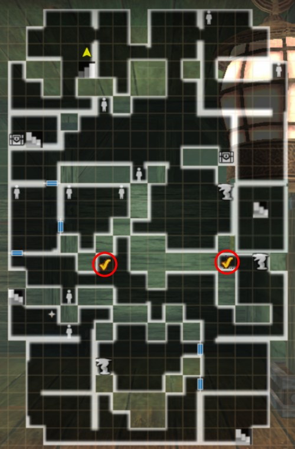

- Expose Marin as the warped one and defeat her.   
- Marin can at any location with an NPC icon on the minimap. If you talk to people, they will point you to where she went.

### Gathering Sahuagin Scales

- You may talk to Rickert to get an idea of how to deal with Geuzen's singing. She will suggest Comadora Peppers.
- Talk to the chef, not the head chef, in the dining hall about Comadora Peppers.
- Go to the Royal Capital to receive the request.

??? info "Request"
    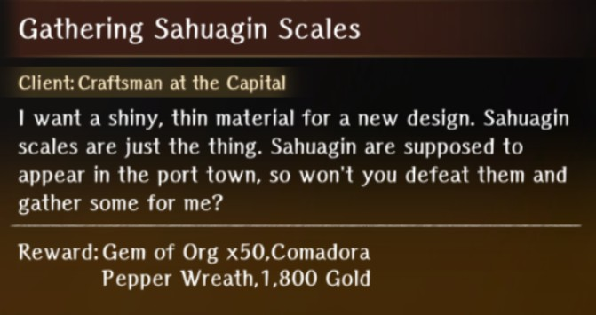

- Defeat any Sahuagin in Port Town Grand Legion Abyss to collect scales.

## Return to the Capital

### Arena Tourney Hosted by Avare\!

??? info "Request"
    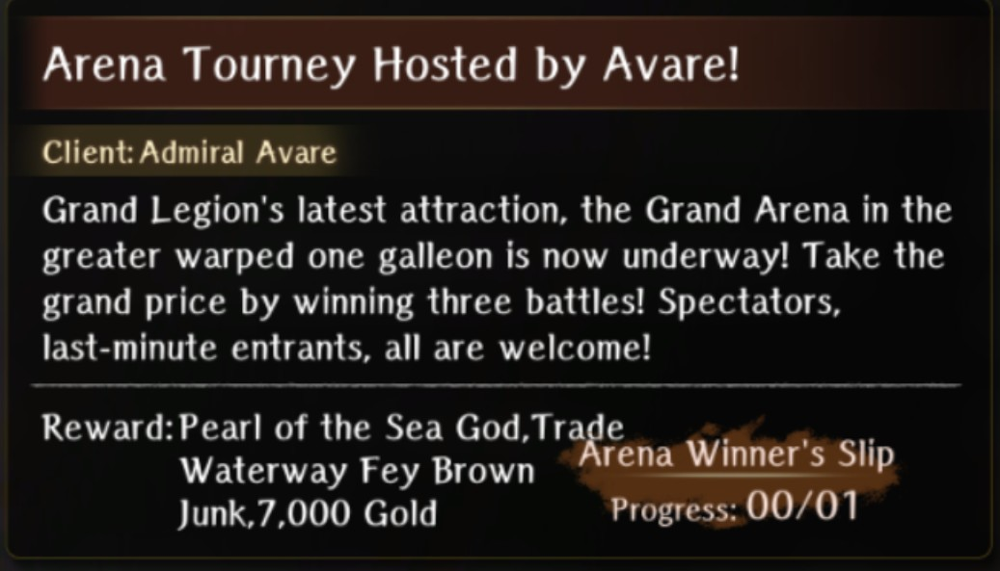

- Go to Upper Deck \-Arena- where the goblin that started the arena fights was and there should be a new NPC there now.  
- Complete the fights

### Recovery of Belongings

1. Cutscene will play in town when this request is available.
2. Accept the request in the featured tab in Adventurer's Guild.
3. Head to edge of town and head to 1st District harken then head to entrance of 2nd District.
4. Walk forwards the side of the Mermaid Statue. A cutscene will play where you need to walk forwards and to the left to find the belongings. You will need to look down and pick it up from the body by interacting with the shiny object.
5. Head to the middle of the map that leads to a dead end on the left. Save the alchemist there from some sahuagin. The request is now completed.
6. Head back to town and turn in the request. The alchemist will give u more work at the royal capital. 

### Recovery of Research Materials

1. Head to B5F \-Warped One's Nest-. Walk to the end of the hallway across from the harken when you teleport in. There is a goblin NPC that will trigger a fight showcasing the Eye of VITRIOL's visual indicator in combat. 
2. Turn in the request back at the adventurer's guild
3. Head to edge of town to unlock the Black Barrel Tavern on the world map. Relicbrewing is now unlocked.
