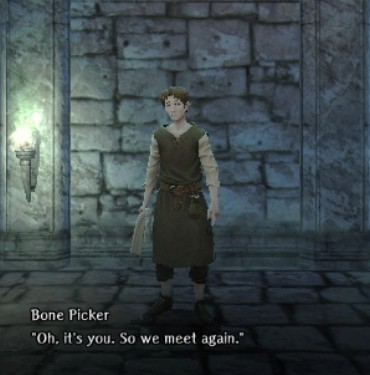
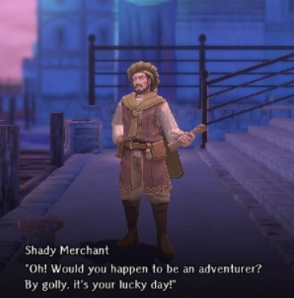
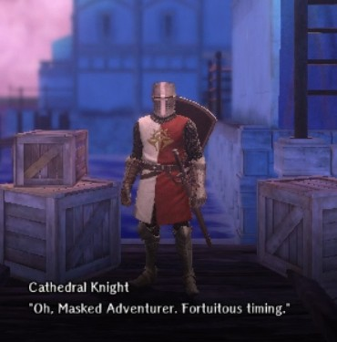
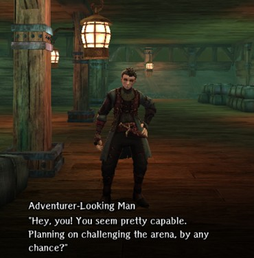
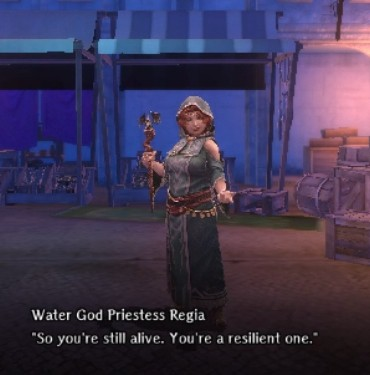

# Trade Waterways Wandering NPC Guide

There are a number of characters that wander the Abyss who you may encounter.  They may be a help, a threat, or simply a distraction. These chance encounters often present you with a choice of interactions that may bring you additional riches or even personality changes.  

## Bone Picker  
"Might I interest you in some slightly used body parts?" (again)
  
??? note "Details"  
    - Location: Most floors (Districts 1-7 and Ship levels 1 & 2)  
    - Interaction Options:  
        - The Bone Picker has several items he'll sell to the player:  
            - Healing Potions - Always available  
            - Adventurer's Remains - 1,000gp - Once every 7 days  
            - (If unlocked) Mausoleum Bone Tallow - 10,000gp - Once every 7 days   
    - Notes: The cooldown timer on Remains and Tallow appear to be 7 days from the last time collected, not tied to the weekly game reset.  If you have insufficient gold, the interaction will be dismissed without affecting any cooldown timers.  

## Shady Merchant  
"These top-quality artifacts can be yours today for the bargain price of 5,000... no only 2,000 gp! Quantities limited, act now before they're gone!"
  
??? note "Details"  
    - Location: Port Town Districts 1-7  
    - Interaction Options: Paying 2,000gp will give you one random but usually good quality Trade Waterways Junk. 

## Faction NPC   
This wandering NPC will be a differnt character on each Faction route, but the interactions are the same. He will first greet you several times,then ask for aid, and eventually reward you with small items and treasures.  

=== "Pontiff Route"
      
    Cathedral Knight  
    
=== "Princess Route"  
      
    Royal Knight  
    
=== "Admiral Route"  
      
    Sea Freighter Agent

??? note "Details"  
    - Location: All levels except Ship Arena.  
    - Interaction Options:  
       - The first few meetings he will simply greet you politely.  
       - Twice, he will be 'ailing'. First he requests an Antitoxin, then an Invigorating Draught.  
       - After providing both requested items, every subsequent meeting he will gift you a magic scroll, some sellable items, or Sahuagin Scales.  
    - Note: If you don't have the item needed or choose not to help, the request will eventually be repeated at a later meeting.

## Adventurer-Looking Man  
This adventurer is apparently interested in checking out the competition, and maybe improving his odds.  
  
??? note "Details"  
    - Location: District 7 and Ship levels 1 & 2.  
    - Interaction Options:  
        - The adventurer asks if you're headed to the Arena.  
            - Answering yes will randomly trigger either a friendly chat with a small gift, or an attack by a group of Hostile Adventurers.   
            - If he attacks, the combat will provide a chest with a moderate amount of gold.   

## Water God Priestess Regia  
"Hello, do you have a minute to talk about our watery sea god?"  
  
??? note "Details"  
    - Location: Districts 2-7  
    - Regia appear as a wandering NPC after you've completed her [Water God Statue Request](./requests.md#water-god-statue-restoration-materials) in District 2.  
    - Interaction Options:  
        - Regia will offer to heal the party for 1,000 gp.
        - After the 5th interaction, she tells you the sauhagin have been upset with her for helping you, and she won't appear anymore.
        - You can then [find Regia in District 2 to get her as a bondmate](../../adventurer-customization/bondmates/port-town-grand-legion/bondmates.md#water-god-priestess-regia). 
        - After getting her as a bondmate she will not appear as a wandering NPC any more.  

## Ugo
"Don't ask me how I havent been eaten yet."
  
??? note "Details"  
    - Location: Ship 1 and 2 
    - Ugo appears as a wandering NPC after you've fully completed the [Oar Collector Extermination request](./requests.md#oar-collector-extermination) in Ship 1.  
    - Interaction Options:  
        - Ugo is a budding entrepreneur, and will happily sell you some of Rickert's magic items. We assume she is aware of this arrangement.  
        - If you buy everything he has to offer he will give you a free item as a bonus.  
        - As long as you have bought something from him once, after defeating the Abyss 2 Greater Warped One and before returnjng to town, you can find him waiting at Rickert's shop [where you will get him as a bondmate](../../adventurer-customization/bondmates/port-town-grand-legion/bondmates.md#ugo-in-the-ships-hold).
        - After getting him as a bondmate he will not appear as a wandering NPC any more.  
