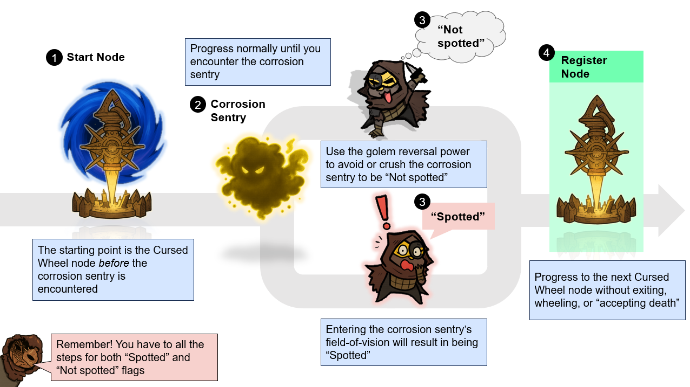
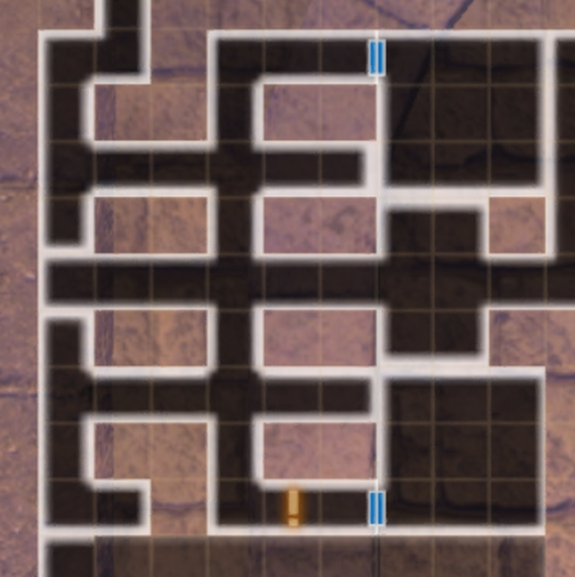
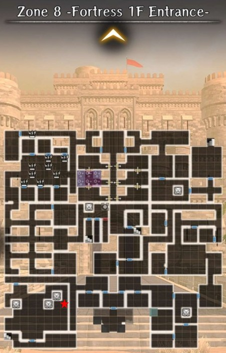
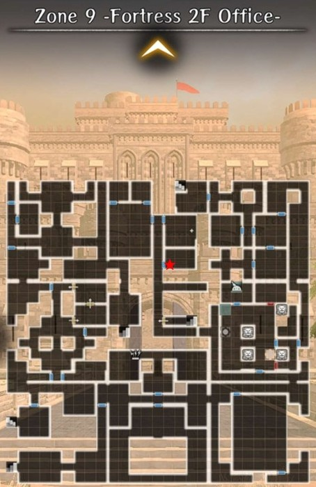
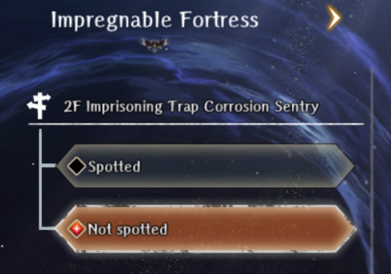

# Corrosion Sentries 

!!! warning "Work in Progress" 
            - Overhauling page formatting 
            - Corrosion sentries [10] and [12] are bugged - workaround solution added

## Overview 

!!! warning "Introduction" 

    - The purpose of this page is to assist any players that are missing a corrosion sentry in their Cursed Wheel
    - It is a mechanic that is poorly explained, but critical to the endings and access to the Rank 12 Bounty - Cyclops
    - The "True" version of the Greater Warped One (GWO) can only be fought after registering all 13 Corrosion Sentries

### Corrosion Mechanics

??? note "Corrosion"

    === "Overview"

        - Central mechanic of the Abyss with major changes to what areas are accessible depending on its level
        - Increased when your party enters the field of view of a corrosion sentry
        - Cannot be decreased while in the Abyss, but can be changed in the Cursed Wheel

    === "Corrosion Effects"
    
        - Fortress Appearance - Wall goo becomes more prominent with high corrosion
        - Request Availability - Some requests become unavailable as essential NPCs are driven insane or die as a result of high corrosion, which affects what endings are available
        - Monsters - Different monsters spawn, with stronger monsters at lower corrosion 
        - Greater Warped One - The Greater Warped One is much stronger at lower corrosion, gaining new abilities and increased damage and health

    === "Corrosion Sentries"
        - Total of 13 corrosion sentries that appear as stationary flying enemies
        - Stepping into their field of view sounds an alarm, increases the Fortress's corrosion level, and counts as a "Spotted" flag in the Cursed Wheel
        - Corrosion sentries are not the same thing as standard floor sentries, which are simply powered-up normal enemies 

    === "Duke's Room"

        - Easy way to tell your level of corrosion during the end game 
        - Cursed Wheel to "Fortress 3rd Floor Arrival" and check the map  
        
            

            
            

??? note "Golems"
    - Golems walk forwards when activated, destroying traps, damaged walls, and sentries in their path until they reach a solid wall or door.
    - Golems are only available after reaching Zone 10 on a first run and acquiring the golem reversal power before fighting the Greater Warped One

### Corrosion Sentry Registration

??? note "Requirements" 

    === "Summary" 
        
        !!! warning "To register a corrosion sentry the following must be true:"
        
            - "Spotted" at least once
            - "Not Spotted" at least once
            - Started at a Cursed Wheel node BEFORE encountering the corrosion sentry on the normal progression path AND made it to the next Cursed Wheel node without exiting, wheeling, or "accepting death"

    === "Flags" 

        - The "Spotted" and "Not spotted" designations are hidden flags the game tracks. The flags are only permanently saved after reaching the next Cursed Wheel node along the normal progression route.

            ??? warning "Flag Definitions"
            
                - "Spotted" = Entering a corrosion sentry's field of view
                - "Not Spotted" = Moving past a corrosion sentry without entering its field of view, which requires the golem reversal power 
                - For each corrosion sentry both flags must be properly registered for it to appear in the Cursed Wheel
                
        - During a first run you will be automatically "Spotted" by every corrosion sentry in order to progress. A small number of corrosion sentries are located in areas that cannot be accessed until the overall Abyss corrosion level is lowered.
        - The golem reveral power can be used to block a corrosion sentry's line-of-sight or crush them outright. Note that normal sentries have no effect on flags, registration, or the Abyss corruption level. 
  
    === "Registration Nodes"
            
        - To complicate matters the flags need to be triggered using the correct starting and ending Cursed Wheel nodes. 
        - This guide uses "Start" and "Register" nodes throughout.  

            ??? warning "Node Definitions"
        
            - "Start" node: The node you wheel to first at the beginning of the process. The game requires a fresh encounter with the corrosion sentry for its flags to update
            - "Register" node: The ending node where the game will update any flags. It is also the node that the corrosion sentry is listed under when it becomes available in the Cursed Wheel. Note that you can _never_ register a corrosion sentry by wheeling to its own node as the starting point 
            
??? note "Putting it All Together" 

    === "Summary" 
    
        - Each corrosion sentry requires a separate run (Start node > Register node) for each flag ("Spotted" and "Not spotted")
        - Once both flags are registered correctly the corrosion sentry will appear in the Cursed Wheel 
        - Corrosion sentries in the Cursed Wheel can be toggled ("Spotted" or "Not spotted") to manipulate the overall Abyss corrosion level

    === "Registration Flowchart"

        

        
        

## Corrosion Sentry Guide

??? warning "Topics Covered"

    - Locations of all 13 corrosion sentries 
    - Pathing instructions for confusing areas. All map directions are based on the floor map
    - Golem power reversal directions 
    - Registration nodes and directions for "Spotted" and "Not spotted" runs 
    - Important time-saving tips, warnings, and other notes
    - Picture of the Cursed Wheel entry 

    Notes:
    
    - A few of the Cursed Wheel nodes have more than one corrosion sentry. These corrosion sentries have an additional prefix ("2F North" Corrosion Sentry) to distinguish them from each other.
    - The guide is structured as a series of nested drop-down menus that can be kept open or collapsed. Each entry has a [#] that follows the order of appearance in the Cursed Wheel.   

### Secret Passage Minor Harken

??? note "Corrosion Sentry [1]"
    ??? map "Location"
    
        

        
        

    
    ??? map "Golem Directions"
    
        

        
        

        - Push the golem to the right to block the corrosion sentry's field of view

    ??? warning " Cursed Wheel Registration"

        === "Spotted"
            - Automatically "Spotted" on first run 

        === "Not Spotted"
            Cursed Wheel Nodes
            
            - Start: "Hidden Passage" (Beginning of Zone 1)
            - Register: "Secret Passage Minor Harken" (Zone 1 Harken)
            
            Directions
            
            - From "Hidden Passage" walk the full length of Zone 1 until you reach the corrosion sentry in the bottom left-hand corner. Its location does not change even with different map variations 
            - Push the golem to the right > "Not spotted" flag triggered
            - To register exit via the Zone 1 Harken ("Secret Passage Minor Harken")  

    ??? note "Cursed Wheel Entry"
        

        
        

### Enshadowed Well of Life 

??? note "Corrosion Sentry [2]"

    ??? tip "Time-saving Tip" 
        - Corrosion sentries [2], [3], and [4] can all be registered in the same run
        - Registering [3] and [4] requires defeating the Necrocore boss located at the end of Zone 3
        - For under-leveled or -geared players it is recommended to carry a Hook of Harken 

    ??? map "Location"
    
        

        
        

    ??? map "Golem Directions"
    
        

        
        

        - Push the golem to the left to block the corrosion sentry's field of view 

    ??? warning "Cursed Wheel Registration"

        === "Spotted"
            - Automatically "Spotted" on first run 

        === "Not Spotted"
        
            Cursed Wheel Nodes
            
            - Start: "Secret Passage Minor Harken" (Zone 1 Harken)
            - Register: "Enshadowed Well of Life" (Zone 2 Fountain)

            Directions
            
            - The end goal is a drop-down hole located in the NE corner of Zone 2
            - Push the golem to the left > "Not spotted" flag triggered
            - To register proceed to the Zone 2 Fountain ("Enshadowed Well of Life") 
            - To exit use a Hook of Harken, take the path back to the Zone 1 Harken, or defeat the Necrocore boss to access the Zone 3 Harken. See "Exiting from Zone 2 Fountain" for details 

            Notes

            - Corrosion sentries [3] and [4] can be registered after reaching the Zone 2 Fountain

        === "Path to Corrosion Sentry" 
            
            ??? map "Zone 2 - Old Secret Passage B2F"
                
                

                
                

                
            ??? map "Zone 3 - Old Secret Passage B3F"
                
                

                
                

            - Follow the red path

        === "Exiting from Zone 2 Fountain"

            ??? note "Path to Zone 1 Harken"
                
                ??? map "Zone 2 - Old Secret Passage B2F"
                
                    

                    
                    

                
                ??? map "Zone 3 - Old Secret Passage B3F"
                
                    

                    
                    
  

                - From the corrosion sentry [3] exit through the southern door 
                - Ignore the sentry to the immediate left and keep heading south. Turn right and pass 2 small dungeon cells. At the end of the path there is a dead-end with a drop-down hole to Zone 3 
                - Once you land in Zone 3 go left, up, right, up and take the stairs to Zone 2 
                - Head through the 1-way door. Take the stairs directly in front of you to return to the Zone 1 Harken and exit 

            ??? note "Path to Zone 3 Harken"

                === "Map"
                
                    ??? map "Zone 2 - Old Secret Passage B2F"
                    
                        

                        
                        

            
                    ??? map "Zone 3 - Old Secret Passage B3F"
            
                        

                        
                        

    
                    - From the Zone 2 Fountain follow the light blue and green paths
                    - The Necrocore boss must be defeated to access the Zone 3 Harken to exit 

                === "Boss: Necrocore"
        
                    - Race: Undead
                    - Abilities: Instant-Death
                    
                    Necrocore is undead and requires Expulsion weapons to do full damage. Its "Spear of Doom" attack can insta-kill an adventurer. To ncrease insta-kill tolerance:
                    
                    - Gear (Helm of Malice, Skull Necklace)
                    - Bondmates (Elequon)
                    - Adventurer passives (Red Beard, Galina)
                    - Harken blessings
                    - Well of the Mind nodes for the MC

    ??? note "Cursed Wheel Entry"
    
        

        
        

### Secret Path Keeper Vanquished

??? warning "Important Notes for [3] and [4]"

    === "Warning! Boss"
    
        - Registering corrosion sentries [3] and [4] requires defeating the Necrocore boss located at the end of Zone 3"

    === "Registration"
    
        - Corrosion sentry [4] must be registerd **twice** for both "Spotted" and "Not spotted"
        - Corrosion sentry [4] requires a low Abyss corrosion level to access. Toggle all the corrosion sentries to "Not spotted" in the Cursed Wheel beforehand
        - Corrosion sentries [3] and [4] can be registered in the same run 

#### South Corrosion Sentry 

??? note "South Corrosion Sentry [3]"

    ??? map "Location"
    
        

        
        

    ??? map "Golem Directions"
    
        

        
        

        - Ignore the nothern golem 
        - Push the southern golem to the left

    ??? warning "Cursed Wheel Registration"

        === "Spotted"
            - Automatically "Spotted" on first run 

        === "Not Spotted"
        
            Cursed Wheel Nodes
            
            - Start: "Enshadowed Well of Life" (Zone 2 Fountain)
            - Register: "Secret Path Keeper Vanquished" (Zone 3 Necrocore boss defeated) 

            Directions

            - From the Zone 2 Fountain head south through the door and follow the path to the right to the large room. Ignore the golem directly in front of you
            - Head south and approach the corrosion sentry carefully as it has a large field of view
            - Push the southern golem to the left > "Not spotted" flag triggered
            - The golem only partially blocks the corrosion sentry's field of view, so be careful when exiting through the southern door as you can still be "Spotted"
            - To register defeat the Necrocore boss ("Secret Path Keeper Vanquished") located at the end of Zone 3. See "Necrocore > Path to Necrocore" for directions
            - To exit use the the Zone 3 Harken 

            Notes
            
            - To the north is corrosion sentry [4] that can be registered in the same run"

        === "Boss: Necrocore"
     
            ??? map "Path to Necrocore"
            
                ??? map "Zone 2 - Old Secret Passage B2F"
                
                    

                    
                    

        
                ??? map "Zone 3 - Old Secret Passage B3F"
        
                    

                    
                    

    
                - From the Zone 2 Fountain follow the light blue and green paths
    
            ??? danger "Fight Details"
        
                - Race: Undead
                - Abilities: Instant-Death
                
                Necrocore is undead and requires Expulsion weapons to do full damage. Its "Spear of Doom" attack can insta-kill an adventurer. To ncrease insta-kill tolerance:
                
                - Gear (Helm of Malice, Skull Necklace)
                - Bondmates (Elequon)
                - Adventurer passives (Red Beard, Galina)
                - Harken blessings
                - Well of the Mind nodes for the MC 

    ??? note "Cursed Wheel Entry"
    
        

        
        

#### Central Corrosion Sentry 

??? note "Central Corrosion Sentry [4]"

    !!! warning "Warning" 
        - Corrosion sentry [4] must be done **twice** to register both the "Spotted" and "Not spotted" flags. It is not possible to be "Spotted" on a first run due to corrosion blocking the hallway
        - Requires a low Abyss corrosion level to access
        - Toggle all corrosion sentries to "Not spotted" in the Cursed Wheel beforehand

    ??? map "Location"
    
        

        
        

    ??? map "Golem Directions"
    
        

        
        

        - Ignore the southern golem
        - Push the northern golem up

    ??? note "Cursed Wheel Registration"

        === "Spotted"
        
            Cursed Wheel Nodes
        
            - Start: "Enshadowed Well of Life" (Zone 2 Fountain)
            - Register: "Secret Path Keeper Vanquished" (Zone 3 Necrocore boss defeated) 

            Directions
            
            - From the Zone 2 Fountain head south through the door and follow the path to the right to the large room
            - Ignore the golem directly in front of you and head north. The corruption sentry is in an alcove in the upper right-hand corner 
            - Stand in its field-of-view > "Spotted" flag triggered
            - To register defeat the Necrocore boss ("Secret Path Keeper Vanquished") located at the end of Zone 3. See "Necrocore > Path to Necrocore" for directions
            - To exit use the the Zone 3 Harken

            Notes

            !!! tip "To the south is corrosion sentry [3] that can be registered in the same run"

            !!! bug "Potential exploit" 
            
                - Some players have reported a bug that can trigger the "Spotted" flag _without_ defeating the Necrocore boss 
                - Steps: Wheel to "Enshadowed Well of Life" (Zone 2 Fountain), get "Spotted", and then exit via a Hook of Harken or the Zone 1 Harken
                - Once back in town wheel to "Secret Path Keeper Vanquished" and then exit via the Zone 3 Harken
                - Do a "Not spotted" run to see if the corrosion sentry appears in the Cursed Wheel 
                - The bug may have been patched. Proceed at your own risk

        === "Not Spotted"
        
            Cursed Wheel Nodes
            
            - Start: "Enshadowed Well of Life" (Zone 2 Fountain)
            - Register: "Secret Path Keeper Vanquished" (Zone 3 Necrocore boss defeated)  
            
            Directions

            - From the Zone 2 Fountain head south through the door and follow the path to the right to the large room
            - Push the golem directly in front of you up > "Not spotted" flag triggered
            - To register defeat the Necrocore boss ("Secret Path Keeper Vanquished") located at the end of Zone 3. See "Necrocore > Path to Necrocore" for directions
            - To exit use the the Zone 3 Harken 

            Notes

            !!! tip "To the south is corrosion sentry [3] that can be registered in the same run"

    ??? danger "Necrocore"
    
        ??? map "Path to Necrocore"

            ??? map "Zone 2 - Old Secret Passage B2F"
            
                

                
                

    
            ??? map "Zone 3 - Old Secret Passage B3F"
    
                

                
                
   
                
            - From the Zone 2 Fountain follow the light blue and green paths

        ??? danger "Boss Fight Details"
    
            - Race: Undead
            - Abilities: Instant-Death
            
            Necrocore is undead and requires Expulsion weapons to do full damage. Its "Spear of Doom" attack can insta-kill an adventurer. To increase insta-kill tolerance:
            
            - Gear (Helm of Malice, Skull Necklace)
            - Bondmates (Elequon)
            - Adventurer passives (Red Beard, Galina)
            - Harken blessings
            - Well of the Mind nodes for the MC 

    ??? note "Cursed Wheel Entry"
        

        
        

## Fortress Lower Floors Cleared

??? note "Corrosion Sentry [5]"

    ??? map "Location"
    
        

        
        

    ??? map "Golem Directions"
    
        

        
        

            
        - Push the bottom (1) golem to the right to block the corruption sentry's field-of-view
        - Push the top (2) golem up to block the sentry's field-of-view

        !!! danger "There is a sentry (blue ★) directly north of the corrosion sentry"

    ??? note "Cursed Wheel Registration"

        === "Spotted"
            - Automatically "Spotted" on first run 
            
        === "Not Spotted"
        
            Cursed Wheel Nodes
            
            - Start: "Fortress Basement Arrival" (Zone 5 entrance) 
            - Register: "Fortress Lower Floors Cleared" (enter Zone 6)
            
            Directions

            - Proceed through Zone 5 until you reach the corrosion sentry. Its location does not change even with different map variations 
            - Push the bottom golem to the right to block the corruption sentry's field-of-view > "Not spotted" flag triggered
            - Push the top golem up to block the sentry's field-of-view  
            - To register go up the stairs to Zone 6 ("Fortress Lower Floors Cleared") 
            - To exit go back downstairs and use the Zone 5 Harken

            Notes
            
            !!! danger "There is a sentry directly north of the corrosion sentry"     
            !!! warning "The registration node is entering Zone 6 _not_ the Zone 5 Harken to avoid exiting prematurely" 
                      
    ??? note "Cursed Wheel Entry"
    
        

        
        

## Portrait Gallery Minor Harken

??? note "Corrosion Sentry [6]"

    ??? map "Location"
    
        

        
        

    ??? map "Golem Directions"
    
        

        
        

                
        - Push the top (1) and bottom (2) golems to the left
        - Push the middle (3) golem up to crush the corrosion sentry 

        !!! danger "There are 2 sentries (blue ★) in the area"

    ??? note "Cursed Wheel Registration"

        === "Spotted"
            - Automatically "Spotted" on first run 
            
        === "Not Spotted"

            Cursed Wheel Nodes
            
            - Start: "Fortress Lower Floors Cleared" (Zone 6 entrance) 
            - Register: "Portrait Gallery Minor Harken" (Zone 6 Harken)

            Directions
            
            - Proceed through Zone 6 until you reach the area with 3 golems. Its location does not change even with different map variations
            - Push the top and bottom golems to the left to clear the path for the middle golem
            - Push the middle golem up, which will crush the corrosion sentry > "Not spotted" flag triggered 
            - To register head up and to the right to exit via the Zone 6 Harken

            Notes

            !!! danger "There are 2 sentries in the area"

    ??? note "Cursed Wheel Entry"
    
        

        
        

## Ghosts of Yore Vanquished

??? note "Corrosion Sentry [7]"

    ??? map "Location"
    
        

        
        

    ??? map "Golem Directions"
    
        === "Corrosion Sentry"
        
            

            
            

            
            - The corrosion sentry room can be rotated 90 degrees depending on the map variation
            - The golem push order remains the same

            !!! danger "There are 3 sentries in the area"

        === "Doll"
        
            

            
            

            - Requires walking through poison tiles
            - Poison tiles can cause the game to lag and a roaming sentry may spot you 

            !!! danger "There are 3 sentries in the area"

    ??? note "Cursed Wheel Registration"

        === "Spotted"
            - Automatically "Spotted" on first run 
            
        === "Not Spotted"
        
            Cursed Wheel Nodes
            
            - Start: "Portrait Gallery Minor Harken" (Zone 6 Harken)
            - Register: "Ghosts of Yore Vanquished" (Doll boss defeated)

            Directions
            
            - From the Zone 6 Harken go up the stairs and proceed through Zone 7 until you reach the large room with 6 golems 
            - Zone 7 can roll different map variations. The large room might be rotated, but the golem pushing order remains the same (see "Golem Directions - Corrosion Sentry")
            - Crush the corrosion sentry > "Not spotted" flag triggered 
            - To register proceed to the end of Zone 7 and defeat the Doll boss ("Ghosts of Yore Vanquished")
            - To exit use the Zone 7 Harken

            Notes
            
            !!! danger "There are 3 sentries in the large room with the corrosion sentry"
            !!! tip "Alternative Doll kill method"
                - Fighting the Doll boss again is not mandatory
                - It can be crushed with a golem (see "Golem Directions - Doll") for a hidden achievement

    ??? note "Cursed Wheel Entry"
    
        

        
        

## Fortress 2F Minor Harken 

??? warning "Registration Note"

    - To register corrosion sentries [8] and [9] you must do the entire route from the Zone 7 Harken ("Ghosts of Yore Vanquished") to the Zone 9 Harken ("Fortress 2F Minor Harken") without exiting, wheeling, or "accepting death"
    - Corrosion sentry [9] is encountered before [8], but are listed in the opposite order in the Cursed Wheel. Scroll down and start with corrosion sentry [9] first

??? tip "Time-saving Tip"

    - Both corrosion sentries can be registered at the same time to avoid multiple runs

### 2F North Corrosion Sentry 

??? note "2F North Corrosion Sentry [8]"

    !!! warning "Corrosion sentry [8] is located in Zone 9, but requires using the golem reversal power in Zone 10"

    ??? map "Location"
    
        

        
        

    ??? map "Golem Directions"
            
        

        
        

        - Push the top (1) golem to the right to block the sentry's field-of-view
        - Push the bottom (2) golem down to create a new drop-down hole

        !!! danger "There is a sentry (blue ★) in the upper right-hand corner"

    ??? note "Cursed Wheel Registration"

        === "Spotted"
            - Automatically "Spotted" on first run 
            
        === "Not Spotted"
        
            Cursed Wheel Nodes
            
            - Start: "Ghosts of Yore Vanquished" (Zone 7 Harken) 
            - Register: "Fortress 2F Minor Harken" (Zone 9 Harken)

            Directions

            - From the Zone 7 Harken proceed through the Fortress (Zones 8-10) until you reach Zone 10, which has a fixed map layout
            - The final room in Zone 10 has 2 golems, a sentry, and a drop-down hole in the bottom-left corner
            - Push the top golem to the right to block the sentry's field-of-view
            - Push the bottom golem down to create a new drop-down hole to Zone 9
            - Drop down the new hole and you will land behind the corrosion sentry > "Not spotted" flag triggered
            - To register go to the Zone 9 Harken on the other side of the hallway and exit 

            Notes

            !!! danger "There is a sentry in the upper right-hand corner"
            !!! warning "Do not drop down the bottom left-hand hole as you will be "Spotted" when you land"
            
    ??? note "Cursed Wheel Entry"
    
        

        
        

### 3F West Corrosion Sentry

??? note "3F West Corrosion Sentry [9]"

    !!! warning "Mandatory mini-quest required (see "Winding Key Collection")"

    ??? map "Location"
    
        

        
        

    ??? map "Golem Directions"
            
        

        
        

        - Push the golem to the right to break the wall to access the adjacent room
        - The next room has the automaton and mini-quest (see "Winding Key Collection")

    ??? note "Cursed Wheel Registration"

        === "Spotted"
            - Automatically "Spotted" on first run 
            
        === "Not Spotted"
        
            Cursed Wheel Nodes
            
            - Start: "Ghosts of Yore Vanquished" (Zone 7 Harken) 
            - Register: "Fortress 2F Minor Harken" (Zone 9 Harken)

            Directions
            
            - From the Zone 7 Harken proceed through Zones 8-10 until you reach Zone 10, which has a fixed map layout
            - North of the stairs to Zone 9 there will be a room with a golem in it. Push the golem to the right to break the wall
            - In the adjacent room examine the skeleton, which will spawn an automaton and a map on the floor nearby
            - The map marks the locations of 3 winding keys on the previous floors (Zones 8 and 9) (see "Winding Key Collection")
            - Return to Zone 10 after collecting the winding keys and interact with the automaton 
            - Exit the room and walk into the hallway with the corrosion sentry. The automaton will activate and the corrosion sentry will give chase > "Not spotted flag triggered"
            - To register continue north to the last room in Zone 10, drop down the hole to Zone 9, and exit via the Zone 9 Harken ("Fortress 2F Minor Harken") across the hallway

            Notes
            
            !!! danger "Do not enter the hallway with the corrosion sentry to avoid being "Spotted""
            !!! tip "Corrosion sentry [8] can be registered in the same run. Proceed to the last room in Zone 10"

    ??? note "Winding Key Collection"
    
        === "Overview"
        
            - The locations of the 3 winding keys are marked on your map with a yellow "!" symbol
            - The keys are always in the same location (tile set) even with different map variations 
            - There are 2 keys in Zone 8 and 1 key in Zone 9

        === "Winding Key 1 - Zone 9"
        
            

            
            

            - Located in Zone 9
            - There is a roaming sentry circling the outer area

        === "Winding Key 2 - Zone 8"
        
            

            
            

            - Located in Zone 8
            - Next to the room with a golem and 3 breakable walls
            
        === "Winding Key 3 - Zone 8"
        
            

            
            

            - Located in Zone 8
            - In the hallway with 3 roaming sentries that move back-and-forth through the hallways
            - Be careful as it is easy to be spotted

    ??? note "Cursed Wheel Entry"
    
        

        
        

## Fortress 3rd Floor Arrival

??? warning "Registration Note"

    - To register corrosion sentries [10]-[13] you must do the entire route from the Zone 9 Harken ("Fortress 2F Minor Harken") to the Zone 10 Fountain ("Fortress 3rd Floor Arrival") without exiting, wheeling, or "accepting death" 
    - Corruption sentry [10] and [12] are frequently missed as most players leave immediately and do not continue to the Zone 10 Fountain to register 

!!! bug "Critical Bug"

    - "Corrosion sentries [10] and [12] cannot be registered properly at the Zone 10 Fountain ("Fortress 3rd Floor Arrival
    - To register you need to start at the Zone 9 Harken ("Fortress 2F Minor Harken") and in one full run defeat GWO 6 ("Blackmail" ending) or GWO 8 ("Blackmail" ending) since their registration node is "Triumphant Return"
    - Easiest way to do this is on your final run as long as you do not encounter either of them on the way to the GWO fight ("Not spotted") 

!!! tip "Time-saving tip"

    - Corrosion sentries [10]-[13] are the most time-intensive to register 
    - Corrosion sentries [10] and [12] are not accessible on a first run and are tied to requests related to the endings:
        - Corrosion sentry [10]: [Search for the Missing Girl](./requests.md#search-for-the-missing-girl)
        - Corrosion sentry [12]: [Blackmail Resolution](./requests.md#blackmail-resolution)
    - This means that you will have to do a complete run (Start node > Register node) for both flags. It is recommended to continue to the Zone 10 Fountain after being "Spotted" the first time
    - For corrosion sentries [11] and [13] you will be "Spotted" on a first run. You can include their "No spotted" runs when registering corrosion sentry [10] and/or [12] 

### 1F Servant's Quarters Corrosion Sentry 

??? note "1F Servant's Quarters Corrosion Sentry [10]"

    !!! warning
        - Corrosion sentry [10] requires a low Abyss corrosion level to access. Toggle all the corrosion sentries to "Not spotted" in the Cursed Wheel beforehand
        - Corrosion sentry [10] must be run _twice_ for both the "Spotted" and "Not spotted" flags. It is not encounterd during a first run
        
        !!! bug "The registration node is "Triumphant Return", which requires either the "Blackmail" or "Mastermind" endings 

    ??? map "Location"
    
        

        
        

    
    ??? map "Path to Zone 9 - 1F Servant's Quarters"
    
        

        
        

    
    ??? note "Cursed Wheel Registration"
    
        === "Spotted"

            Cursed Wheel Nodes
            
            - Start: "Fortress 2F Minor Harken" (Zone 9 Harken) 
            - Register: "Triumphant Return" ("Blackmail" or "Mastermind" ending)

            Directions 
            
            - Visiting this room is required to complete the [Search for the Missing Girl](./requests.md#search-for-the-missing-girl) request
            - Inspect the bookcase and pick up the tattered rag (key valuable) > "Spotted" flag triggered 
            - To register proceed to the Zone 10 Fountain ("Fortress 3rd Floor Arrival")
            - To exit use the southern teleport tile in Zone 10 to warp to the Zone 9 Harken

            Notes

            !!! tip "Time-saving tip" 
                - After picking up the tattered rag continue to the Zone 10 Fountain to register the "Spotted" flag
                - Incorporate any missing corrosion sentries on this run, if possible
            
        === "Not Spotted"
        
            Cursed Wheel Nodes
            
            - Start: "Fortress 2F Minor Harken" (Zone 9 Harken) 
            - Register: "Fortress 3rd Floor Arrival" (Zone 10 Fountain)

            Directions 
            
            - Visiting this room is required to complete the [Search for the Missing Girl](./requests.md#search-for-the-missing-girl) request
            - Enter the room and ignore the corrosion sentry > "Not spotted" flag triggered
            - To register proceed to the Zone 10 Fountain ("Fortress 3rd Floor Arrival")
            - To exit use the southern teleport tile in Zone 10 to warp to the Zone 9 Harken

            Notes

            !!! tip 
                - A "No spotted" run can be done at any time
                - Corrosion sentry [12] (2F Soldier's Room) also requires a separate "No spotted" run where you ignore the corrosion sentry and do not enter its room. It is recommended to do both at the same time  

    ??? note "Cursed Wheel Entry"
    
        

        
        

### 1F Southwest Corrosion Sentry 

??? note "1F Southwest Corrosion Sentry [11]"

    ??? map "Location"
    
        

        
        

    
    ??? map "Golem Directions"
    
        

        
        

        - Push the middle golem (1) down
        - Push the left-hand golem (2) to the right, which will crush the corrosion sentry 
        - Push the far right-hand golem (3) down, which will break a wall and allow access to the Zone 9 stairs

        !!! danger "There are 3 sentries (blue ★) in the area"

    ??? note "Cursed Wheel Registration"
    
        === "Spotted"
            - Automatically "Spotted" on first run 
            
        === "Not Spotted"
        
            Cursed Wheel Nodes
            
            - Start: "Fortress 2F Minor Harken" (Zone 9 Harken) 
            - Register: "Fortress 3rd Floor Arrival" (Zone 10 Fountain)
            
            Directions
            
            - From the Zone 9 Harken go south and follow the path to Zone 8 
            - Proceed to the end of Zone 8. This room has a fixed location and will always be in the bottom-left corner of Zone 8 
            - See "Golem Directions" to crush the corrosion sentry > "Not spotted" flag triggered
            - Exit the room through the newly created hole in the wall
            - To register continue through Zone 9 to the Zone 10 Fountain
            - To exit use the southern teleport tile in Zone 10 to warp to the Zone 9 Harken

            Notes

            !!! danger "There are 3 sentries in the room with the corrosion sentry"

    ??? note "Cursed Wheel Entry"
    
        

        
        

### 2F Soldier's Room Corrosion Sentry 

??? note "2F Soldier's Room Corrosion Sentry [12]"

    ??? map "Location"
    
        

        
        

    
    ??? note "Cursed Wheel Registration"
    
        === "Spotted"
        
            Cursed Wheel Nodes
            
            - Start: "Fortress 2F Minor Harken" (Zone 9 Harken) 
            - Register: "Triumphant Return" ("Blackmail" or "Mastermind" ending)

            Directions
            
            - Automatically "Spotted" on first run 
            - Required quest

            Note
            
        === "Not Spotted"
        
            Cursed Wheel Nodes
            
            - Start: "Fortress 2F Minor Harken" (Zone 9 Harken) 
            - Register: "Triumphant Return" ("Blackmail" or "Mastermind" ending)

            Directions
            
            - xx

            Note 

            - xx
                 
    ??? note "Cursed Wheel Entry"
    
        

        
        

### 2F Imprisoning Trap Corrosion Sentry 

??? note "2F Imprisoning Trap Corrosion Sentry [13]"

    ??? map "Location"
    
        

        
        

    
    ??? map "Golem Directions"
    
        

        
        

        - Push the golem (1) closest to the room entrance to the right onto the switch
        - Go into the next room and push the golem (2) up to break the wall 
        - Push the golem (3) in this room to the left to crush the corruption sentry 
        - Push the final golem (4) to the left to open the door to the switch room
        - Flip the switch and all the remaining doors will unlock

        !!! danger "There is a sentry (blue *) in the room"
        !!! warning "This room might be rotated, but the pushing order remains the same. Use the entrance door as a reference point"
    
    ??? note "Cursed Wheel Registration"
    
        === "Spotted"
            - Automatically "Spotted" on first run 
            
        === "Not Spotted"
        
            Cursed Wheel Nodes
            
            - Start: "Fortress 2F Minor Harken" (Zone 9 Harken) 
            - Register: "Fortress 3rd Floor Arrival" (Zone 10 Fountain)
            
            Directions
            
            - From the Zone 9 Harken proceed through Zones 8 and 9 until you encounter the "imprisoning room" 
            - The location of this room in Zone 9 can change due to different map variations, but it cannot be missed
            - See "Golem Directions" to crush the corrosion sentry > "Not spotted" flag triggered
            - To register continue through Zone 9 to the Zone 10 Fountain
            - To exit use the southern teleport tile in Zone 10 to warp to the Zone 9 Harken

            Notes

            !!! danger "There is a sentry in the corruption sentry room"

    ??? note "Cursed Wheel Entry"
    
        

        
        

    
