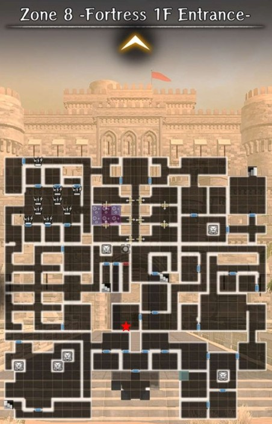

# Corrosion Sentries Locations

## Overview

There are a total of 13 corrosion sentries you can encounter in Guarda Fortress. 

## Mechanics

??? note "Corrosion"
    - Corrosion is a central mechanic of this Abyss, with major changes depending on the level of corrosion.
    - Corrosion is increased when your party enters the sight area of a Corrosion Sentry.
    - Corrosion cannot be decreased whilst in the Abyss, but can be changed by modifying Causality in the **Cursed Wheel**.

    ??? note "Corrosion Effects"
        - **Fortress Appearance:** Slime becomes more prominent with high Corruption.
        - **Quest Availability:** Some quest-lines become unavailable as essential NPCs are driven insane or die as a result of high Corruption. This affects which endings are available.
        - **Monsters:** Different monsters spawn, with stronger monsters at lower Corruption. 
        - **Greater Warped One:** The Greater Warped One is much stronger at lower Corruption, gaining new abilities and increased damage and health.

        ??? note "How to tell corruption level based on the Duke's room:"
    
            

??? note "Golems"
    - Golems walk forwards when activated, destroying traps, damaged walls, and sentries in their path until they reach a solid wall or door.
    - Golems are only available after defeating the Greater Warped One at least once.

## First run - things to know

## Registering Corrosion Sentries in the Cursed Wheel

There are a total of 13 corrosion sentries that you can encounter and

How this sectionis structured
[#] = Corrosion Sentry order number (1-13)
[Name of Cursed Wheel Node] - [Corrosion Sentry Toggle Name] - [Zone (Floor, 1-10)]

CW = Cursed Wheel
Beginning node = start
Registration node = end
Node = CW jump point 

All directions are based on the MAP
KEY POINT = Registration node = what it's toggled under

<Content begins here>

## Old Secret Passage (Zones 1-3)

### Secret Passage Minor Harken

??? note "Corrosion Sentry [1]"

    ??? map "Location"
    
        

        
        

    
    ??? map "Golem Directions"
    
        

        
        

        - Push the golem to the right to block the corrosion sentry's field of view

    ??? note " Cursed Wheel Registration"

        === "Spotted"
            - Automatically "Spotted" on first run 

        === "Not Spotted"
            Cursed Wheel Nodes
            
            - Start: "Hidden Passage" (Beginning of Zone 1)
            - Register: "Secret Passage Minor Harken" (Zone 1 Harken)
            
            Directions
            
            - From "Hidden Passage" walk the full length of Zone 1 until you reach the corrosion sentry in the bottom left-hand corner. Its location does not change even with different map variations 
            - Push the golem to the right > "Not spotted" flag triggered
            - To register exit via the Zone 1 Harken ("Secret Passage Minor Harken")  

    ??? note "Cursed Wheel Entry"
        

        
        

### Enshadowed Well of Life 

!!! tip "Time-saving Tip"
    - Corrosion sentries [2], [3], and [4] can all be registered in the same run
    - Registering [3] and [4] requires defeating the Necrocore boss at the end of Zone 3
    - Corrosion sentry [4] requires a low Abyss corrosion level to access. Toggle all corrosion sentries to "Not spotted" in the Cursed Wheel beforehand

??? note "Corrosion Sentry [2]"
          
    ??? map "Location"
    
        

        
        

    ??? map "Golem Directions"
    
        

        
        

        - Push the golem to the left to block the corrosion sentry's field of view 

    ??? note "Cursed Wheel Registration"

        === "Spotted"
            - Automatically "Spotted" on first run 

        === "Not Spotted"
        
            Cursed Wheel Nodes
            
            - Start: "Secret Passage Minor Harken" (Zone 1 Harken)
            - Register: "Enshadowed Well of Life" (Zone 2 Fountain)

            Directions:

            - Follow the red path, which will take you through Zones 2 and 3 to reach the drop-down hole located in the NE corner of Zone 2

            ??? map "Path to corrosion sentry" 
            
                ??? map "Zone 2 - Old Secret Passage B2F"
                    
                    

                    
                    

                    
                ??? map "Zone 3 - Old Secret Passage B3F"
                    
                    

                    
                    

                
            - Push the golem to the left > "Not spotted" flag triggered
            - To register proceed to the Zone 2 Fountain ("Enshadowed Well of Life")

            !!! tip "Time-saving Tip"
                - Heat south from the Zone 2 Fountain to register corrosion sentries [3] and [4]
                - Requires defeating the Necrocore boss at the end of Zone 3. See their entries for details 
            
            - To exit use a Hook of Harken, defeat the Necrocore boss to access the Zone 3 Harken, or take the path back to the Zone 1 Harken 

        === "How to exit from Zone 2 Fountain"

            ??? map "Path back to Zone 1 Harken to exit"
                
                ??? map "Zone 2 - Old Secret Passage B2F"
                
                    

                    
                    

                
                ??? map "Zone 3 - Old Secret Passage B3F"
                
                    

                    
                    

        
                - From the "South" corrosion sentry [3] exit through the southern door 
                - Ignore the sentry to the immediate left and keep heading south. Turn right and pass 2 small dungeon cells. At the end of the path there is a dead-end with a drop-down hole to Zone 3 
                - Once you land in Zone 3 go left, up, right, up and take the stairs to Zone 2 
                - Head through the 1-way door. Take the stairs directly in front of you to return to the Zone 1 Harken and exit   

            ??? map "Path to Necrocore and Zone 3 Harken to exit"
        
                - From the Zone 2 Fountain follow the light blue and green paths
        
                ??? map "Zone 2 - Old Secret Passage B2F"
                
                    

                    
                    

        
                ??? map "Zone 3 - Old Secret Passage B3F"
        
                    

                    
                    

                !!! danger "The Necrocore boss must be defeated to access the Zone 3 Harken to exit"

                ??? danger "Boss Fight Details"
    
                    - Race: Undead
                    - Abilities: Instant-Death
                    
                    Necrocore is undead and requires Expulsion weapons to do full damage. Its "Spear of Doom" attack can insta-kill an adventurer. To ncrease insta-kill tolerance:
                    
                    - Gear (Helm of Malice, Skull Necklace)
                    - Bondmates (Elequon)
                    - Adventurer passives (Red Beard, Galina)
                    - Harken blessings
                    - Well of the Mind nodes for the MC

    ??? note "Cursed Wheel Entry"
    
        

        
        

### "Secret Path Keeper Vanquished"

!!! danger "Boss Fight Ahead" 
    - Registration requires defeating the Necrocore boss located at the end of Zone 3

!!! warning
    - Corrosion sentry [4] must be registerd _twice_ for both "Spotted" and "Not spotted"
    - Corrosion sentry [4] requires a low Abyss corrosion level to access. Toggle all the corrosion sentries to "Not spotted" in the Cursed Wheel beforehand
    
!!! tip "Time-saving Tip"
    - Corrosion sentries [3] and [4] can be registered in the same run 

??? note "South Corrosion Sentry [3]"

    ??? map "Location"
    
        

        
        

    ??? map "Golem Directions"
    
        

        
        

        - Ignore the nothern golem 
        - Approach carefully as the corrosion sentry has a wide field-of-view
        - Push the southern golem to the left

    ??? note "Cursed Wheel Registration"

        === "Spotted"
            - Automatically "Spotted" on first run 

        === "Not Spotted"
        
            Cursed Wheel Nodes
            
            - Start: "Enshadowed Well of Life" (Zone 2 Fountain)
            - Register: "Secret Path Keeper Vanquished" (Zone 3 Necrocore boss defeated) 

            Directions:
            
            - From the Zone 2 Fountain head south through the door and follow the path to the right to the large room. Ignore the golem directly in front of you
            - Head south and approach the corrosion sentry carefully as it has a large field of view
            - Push the southern golem to the left > "Not spotted" flag triggered
            - The golem only partially blocks the corrosion sentry's field of view, so be careful when exiting through the southern door as you can still be "Spotted"

            !!! tip "Time-saving Tip"
                - To the north is corrosion sentry [4] that can be registered in the same run. See its entry for details

            - To register defeat the Necrocore boss ("Secret Path Keeper Vanquished") located at the end of Zone 3. See "Necrocore > Path to Necrocore" for directions.
            - To exit use the the Zone 3 Harken it was blocking  

    ??? danger "Necrocore"
 
        ??? map "Path to Necrocore"
    
            - From the Zone 2 Fountain follow the light blue and green paths
    
            ??? map "Zone 2 - Old Secret Passage B2F"
            
                

                
                

    
            ??? map "Zone 3 - Old Secret Passage B3F"
    
                

                
                

    
        ??? danger "Boss Fight Details"
    
            - Race: Undead
            - Abilities: Instant-Death
            
            Necrocore is undead and requires Expulsion weapons to do full damage. Its "Spear of Doom" attack can insta-kill an adventurer. To ncrease insta-kill tolerance:
            
            - Gear (Helm of Malice, Skull Necklace)
            - Bondmates (Elequon)
            - Adventurer passives (Red Beard, Galina)
            - Harken blessings
            - Well of the Mind nodes for the MC 

    ??? note "Cursed Wheel Entry"
    
        

        
        

    
??? note "Central Corrosion Sentry [4]"

    !!! warning "Warning" 
        - Corrosion sentry [4] must be done _twice_ to register both the "Spotted" and "Not spotted" flags. It is not possible to be "Spotted" on a first run due to corrosion blocking the hallway
        - Requires a low Abyss corrosion level to access. Toggle all corrosion sentries to "Not spotted" in the Cursed Wheel beforehand

    ??? map "Location"
    
        

        
        

    ??? map "Golem Directions"
    
        

        
        

        - Ignore the southern golem
        - Push the northern golem up

    ??? note "Cursed Wheel Registration"

        === "Spotted"
        
            Cursed Wheel Nodes
        
            - Start: "Enshadowed Well of Life" (Zone 2 Fountain)
            - Register: "Secret Path Keeper Vanquished" (Zone 3 Necrocore boss defeated) 

            Directions:
    
            - From the Zone 2 Fountain head south through the door and follow the path to the right to the large room
            - Ignore the golem directly in front of you and head north. The corruption sentry is in an alcove in the upper right-hand corner 
            - Stand in its field of view > "Spotted" flag triggered
            
            !!! tip "Time-saving Tip"
                - To the south is corrosion sentry [3] that can be registered in the same run. See its entry for details
            
            - To register defeat the Necrocore boss ("Secret Path Keeper Vanquished") located at the end of Zone 3. See "Necrocore > Path to Necrocore" for directions
            - To exit use the the Zone 3 Harken it was blocking 
            
            !!! bug "Optional bug exploit" 
            
                - Some players have reported a bug that can trigger the "Spotted" flag _without_ defeating the Necrocore boss 
                - Steps: Wheel to "Enshadowed Well of Life" (Zone 2 Fountain), get "Spotted", and then exit via a Hook of Harken or the Zone 1 Harken
                - Once back in town wheel to "Secret Path Keeper Vanquished" and then exit via the Zone 3 Harken
                - Do a "Not spotted" run to see if the corrosion sentry was registered 

                !!! warning "The bug may have been patched, so proceed at your own risk"

        === "Not Spotted"
        
            Cursed Wheel Nodes
            
            - Start: "Enshadowed Well of Life" (Zone 2 Fountain)
            - Register: "Secret Path Keeper Vanquished" (Zone 3 Necrocore boss defeated)  
            
            Directions:
            
            - From the Zone 2 Fountain head south through the door and follow the path to the right to the large room
            - Push the golem directly in front of you up > "Not spotted" flag triggered

            !!! tip "Time-saving Tip"
                - To the south is corrosion sentry [3] that can be registered in the same run. See its entry for details
                
            - To register defeat the Necrocore boss ("Secret Path Keeper Vanquished") located at the end of Zone 3. See "Necrocore > Path to Necrocore" for directions
            - To exit use the the Zone 3 Harken it was blocking 
    
    ??? danger "Necrocore"
    
        ??? map "Path to Necrocore"
            
            - From the Zone 2 Fountain follow the light blue and green paths

            ??? map "Zone 2 - Old Secret Passage B2F"
            
                

                
                

    
            ??? map "Zone 3 - Old Secret Passage B3F"
    
                

                
                
   

        ??? danger "Boss Fight Details"
    
            - Race: Undead
            - Abilities: Instant-Death
            
            Necrocore is undead and requires Expulsion weapons to do full damage. Its "Spear of Doom" attack can insta-kill an adventurer. To increase insta-kill tolerance:
            
            - Gear (Helm of Malice, Skull Necklace)
            - Bondmates (Elequon)
            - Adventurer passives (Red Beard, Galina)
            - Harken blessings
            - Well of the Mind nodes for the MC 

    ??? note "Cursed Wheel Entry"
        

        
        

## Prehistoric Corridor (Zones 5-7)

### Fortress Lower Floors Cleared

??? note "Corrosion Sentry [5]"

    ??? map "Location"
    
        

        
        

    ??? map "Golem Directions"
    
        

        
        

        !!! danger "Sentry Alert"
            - There is a sentry (blue ★) directly north of the corrosion sentry
            - Be careful to avoid its field of view when pushing the golems
            
        - Push the bottom (1) golem to the right to block the corruption sentry's field of view
        - Push the top (2) golem up to block the sentry's field of view

    ??? note "Registration"

        === "Spotted"
            - Automatically "Spotted" on first run 
            
        === "Not Spotted"
        
            Cursed Wheel Nodes
            
            - Start: "Fortress Basement Arrival" (Zone 5 entrance) 
            - Register: "Fortress Lower Floors Cleared" (enter Zone 6)
            
            Directions:
            
            - Proceed through Zone 5 until you reach the corrosion sentry. Its location does not change even with different map variations 
            
            !!! danger "Sentry Alert"
                - There is a sentry (blue ★) directly north of the corrosion sentry 
                - Be careful to avoid its field of view when pushing the golems

            - Push the bottom golem to the right to block the corruption sentry's field of view
            - Push the top golem up to block the sentry's field of view  

            !!! warning  "The registration node is entering Zone 6 _not_ the Zone 5 Harken" 
            
            - To register go up the stairs to Zone 6 ("Fortress Lower Floors Cleared") 
            - To exit go back downstairs and use the Zone 5 Harken
                      
    ??? note "Cursed Wheel Entry"
    
        

        
        

### "Portrait Gallery Minor Harken"

??? note "Corrosion Sentry [6]"

    ??? map "Location"
    
        

        
        

    ??? map "Golem Directions"
    
        

        
        

        !!! danger "Sentry Alert"
            - There are 2 sentries (blue ★) in the area
            - Be careful to avoid their field of view when pushing the golems
                
        - Push the top (1) and bottom (2) golems to the left
        - Push the middle (3) golem up to crush the corrosion sentry 

    ??? note "Registration"

        === "Spotted"
            - Automatically "Spotted" on first run 
            
        === "Not Spotted"
        
            Cursed Wheel Nodes
            
            - Start: "Fortress Lower Floors Cleared" (Zone 6 entrance) 
            - Register: "Portrait Gallery Minor Harken" (Zone 6 Harken)

            Directions:
            
            - Proceed through Zone 6 until you reach the area with 3 golems. Its location does not change even with different map variations
            
            !!! danger "Sentry Alert"
                - There are 2 sentries (blue ★) in the area
                - Be careful to avoid their field of view when pushing the golems
                
            - Push the top and bottom golems to the left
            - Push the middle golem up, which will crush the corrosion sentry > "Not spotted" flag triggered 
            - To register head up and to the right to exit via the Zone 6 Harken
     
    ??? note "Cursed Wheel Entry"
    
        

        
        

### Ghosts of Yore Vanquished

??? note "Corrosion Sentry [7]"

    ??? map "Location"
    
        

        
        

    ??? map "Golem Directions"
    
        === "Corrosion Sentry"
        
            

            
            

            !!! danger "Sentry Alert"
                 - There are 3 sentries (blue ★) in the area
                - Be careful to avoid their field of view when pushing the golems
            - The corrosion sentry room can be rotated 90 degrees depending on the map variation
            - The golem push order remains the same

        === "Doll"
        
            

            
            

            !!! danger "Sentry Alert"
                - There are 3 sentries (blue ★) in the area and it is easy to get cornered if not timed properly
                - The large humanoid sentry icon is a battle with a Cyclops

            - Requires walking through poison tiles
            - Poison tiles can cause game lag and a roaming sentry may spot you and catch up

    ??? note "Registration"

        === "Spotted"
            - Automatically "Spotted" on first run 
            
        === "Not Spotted"
        
            Cursed Wheel Nodes
            
            - Start: "Portrait Gallery Minor Harken" (Zone 6 Harken)
            - Register: "Ghosts of Yore Vanquished" (Doll boss defeated)

            Directions:
            
            - From the Zone 6 Harken go up the stairs and proceed through Zone 7 until you reach the large room with 6 golems. 
            - Zone 7 can roll different map variations. The large room might be rotated, but the golem pushing order remains the same (see "Golem Directions - Corrosion Sentry")

            !!! danger "Sentry Alert"
                - There are 3 sentries (blue ★) in the area
                - Be careful to avoid their field of view when pushing the golems
            - Crush the corrosion sentry > "Not spotted" flag triggered 
            - To register proceed to the end of Zone 7 and defeat the Doll boss ("Ghosts of Yore Vanquished")
            
            !!! warning "Alternative kill method"
                - Fighting the Doll boss again is _not_ mandatory
                - It can be crushed with a golem (see "Golem Directions - Doll") for a hidden achievement
                
            - To exit use the Zone 7 Harken

    ??? note "Cursed Wheel Entry"
    
        

        
        

## Fortress (Zones 8-10)

### Fortress 2F Minor Harken 

!!! warning 

    - To register corrosion sentries [8] and [9] you must do the entire route from the Zone 7 Harken ("Ghosts of Yore Vanquished") to the Zone 9 Harken ("Fortress 2F Minor Harken") without exiting or wheeling elsewhere. It is roughly 50% of the Fortress floors (Zones 8-10), so plan accordingly
    - Corrosion sentry [9] is encountered before [8], but are listed in the opposite order in the Cursed Wheel. Scroll down and start with corrosion sentry [9] first

!!! tip "Time-saving Tip" 
    
    - Both corrosion sentries can be registered at the same time to avoid multiple runs

??? note "2F North Corrosion Sentry [8]"

    ??? map "Location"
    
        

        
        

    ??? map "Golem Directions"
            
        

        
        

        !!! danger "Sentry Alert"
            - There is a sentry (blue ★) in the upper right-hand corner
            - Be careful to avoid its field of view when pushing the golems
            
        - Push the top (1) golem to the right to block the sentry's field of view
        - Push the bottom (2) golem down to create a new drop-down hole

    ??? note "Cursed Wheel Registration"

        === "Spotted"
            - Automatically "Spotted" on first run 
            
        === "Not Spotted"
        
            Cursed Wheel Nodes
            
            - Start: "Ghosts of Yore Vanquished" (Zone 7 Harken) 
            - Register: "Fortress 2F Minor Harken" (Zone 9 Harken)

            Directions:

            - From the Zone 7 Harken proceed through the Fortress (Zones 8-10) until you reach Zone 10, which has a fixed map layout
            - The final room on this half of Zone 10 has 2 golems, a sentry (blue ★), and a drop-down hole in the bottom-left corner. Do _not_ drop down that hole otherwise you will be "Spotted" when you land in Zone 9
            - Push the top golem to the right to block the sentry's field of view
            - Push the bottom golem down to create a new drop-down hole to Zone 9
            - Jump down the newly created hole and you will land behind the corrosion sentry > "Not spotted" flag triggered
            - To register go to the Zone 9 Harken on the other side of the hallway and exit 

    ??? note "Cursed Wheel Entry"
    
        

        
        

    
??? note "3F West Corrosion Sentry [9]"

    !!! warning "Warning"
        - Mandatory mini-quest required (see "Wind-up key collection")

    ??? map "Location"
    
        

        
        

    ??? map "Golem Directions"
            
        

        
        

        - Push the golem to the right to break the wall to access the adjacent room
        - The next room has the wind-up doll and associated mini-quest (see "Wind-up key collection")

    ??? note "Cursed Wheel Registration"

        === "Spotted"
            - Automatically "Spotted" on first run 
            
        === "Not Spotted"
        
            Cursed Wheel Nodes
            
            - Start: "Ghosts of Yore Vanquished" (Zone 7 Harken) 
            - Register: "Fortress 2F Minor Harken" (Zone 9 Harken)

            Directions:
            
            - From the Zone 7 Harken proceed through the Fortress (Zones 8-10) until you reach Zone 10, which has a fixed map layout

            !!! danger "Warning! Do not enter the hallway with the corrosion sentry to avoid being "Spotted""
                
            - North of the stairs to Zone 9 there will be a room with a golem in it. Push the golem to the right to gain access to the adjoining room
            - In this new room examine the skeleton on the floor, which will spawn an automaton doll and a map on the floor nearby
            - The map will mark 3 locations on the previous floors (Zones 8 and 9) that require backtracking to pick up wind-up keys for the doll. See "Wind-up key collection" for location details
            - After obtaining the 3 wind-up keys return to Zone 10 and interact with the doll 
            - Now walk into the corrosion sentry's line-of-sight, the doll will activate, and the corrosion sentry will give chase > "Unspotted" flag triggered
            
            !!! tip "Time-saving Tip"
                - Procced to the last room in Zone 10 to register corrosion sentry [8]. See its entry for details

            - To register drop down the hole to Zone 9 and exit via the Zone 9 Harken ("Fortress 2F Minor Harken") across the hallway

    ??? note "Wind-up key collection"

        === "Wind-up Key 1"
        
            

            
            

        === "Wind-up Key 2"
        
            

            
            

            
        === "Wind-up Key 3"
        
            

            
            

        - The locations of the 3 wind-up keys are marked on your map with a yellow "!" symbol
        - The keys are always in the same location (tile set) even with different map variations 
        - There are 2 keys in Zone 8 and 1 key in Zone 9
        - Zone 9: (X: 7, Y: 12)
        - Zone 8: (X: 4, Y: 9) and (X: 7 and Y: 19)

    ??? note "Cursed Wheel Entry"
    
        

        
        

### "Fortress 3rd Floor Arrival"

!!! warning "Warning"

    - To register corrosion sentries [10]-[13] you must do the entire route from the Zone 9 Harken ("Fortress 2F Minor Harken") to the Zone 10 Fountain ("Fortress 3rd Floor Arrival") without exiting or wheeling elsewhere. It is the other half of the Fortress floors (Zones 8-10), so plan accordingly
    - Corruption sentry [12] is particularly buggy 

!!! tip "Time-saving tip"

    - These are the most time-intensive corrosion sentries to register. It is possible to register the "Not spotted" flag for all 4 in one run with a little planning
    - The rooms with corrosion sentries [10] and [12] are not accessible on your first run and are tied to quests related to the endings
        - Corrosion sentry [10] = "Search for the Missing Girl" request 
        - Corrosion sentry [12] = "Blackmail Resolution." 
    - This means that you will have to do them both twice. It is in your best interest to head to the Zone 10 Fountain after being "Spotted" the first time you encounter them as part of their respective quests.
    - For corrosion sentries [11] and [13] you can be "Spotted" during your first run and you can include their "No spotted" run when registering [10] and/or [12] 

??? note "1F Servant's Quarters Corrosion Sentry [1]"

    ??? map "Location"
    
        

        
        

    ??? map "Path to 1F Servant's Quarters"
    
        

        
        

    ??? note "Cursed Wheel Registration"

        === "Spotted"
            - Automatically "Spotted" on first run 
            
        === "Not Spotted"
        
            Cursed Wheel Nodes
            
            - Start: "Fortress 2F Minor Harken" (Zone 9 Harken) 
            - Register: "Fortress 3rd Floor Arrival" (Zone 10 Fountain)
            
            Directions:
            
            - Proceed through Zone 5 until you reach the corrosion sentry. Its location does not change even with different map variations 
            - Push the bottom golem to the right to block the corruption sentry's field of view
            - Push the top golem up to block the sentry's field of view  
            - To register go up the stairs to Zone 6 ("Fortress Lower Floors Cleared") 
            - To exit use the Zone 5 Harken
            
            !!! Time-saving Tip 
                - The registration node is entering Zone 6 _not_ the Zone 5 Harken 
                 
    ??? note "Cursed Wheel Entry"
    
        

        
        

