# Corrosion Sentries Locations

## Overview

There are a total of 13 corrosion sentries you can encounter in Guarda Fortress. 

## Mechanics

??? note "Corrosion"
    - Corrosion is a central mechanic of this Abyss, with major changes depending on the level of corrosion.
    - Corrosion is increased when your party enters the sight area of a Corrosion Sentry.
    - Corrosion cannot be decreased whilst in the Abyss, but can be changed by modifying Causality in the **Cursed Wheel**.

    ??? note "Corrosion Effects"
        - **Fortress Appearance:** Slime becomes more prominent with high Corruption.
        - **Quest Availability:** Some quest-lines become unavailable as essential NPCs are driven insane or die as a result of high Corruption. This affects which endings are available.
        - **Monsters:** Different monsters spawn, with stronger monsters at lower Corruption. 
        - **Greater Warped One:** The Greater Warped One is much stronger at lower Corruption, gaining new abilities and increased damage and health.

        ??? note "How to tell corruption level based on the Duke's room:"
    
            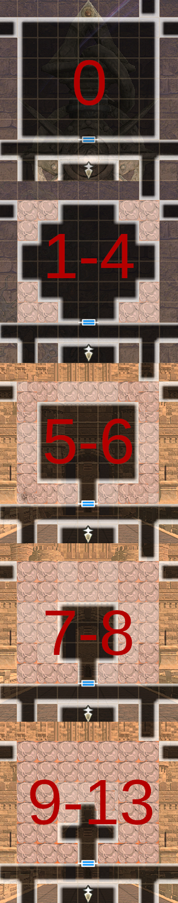

??? note "Golems"
    - Golems walk forwards when activated, destroying traps, damaged walls, and sentries in their path until they reach a solid wall or door.
    - Golems are only available after defeating the Greater Warped One at least once.

## Registering Corrosion Sentries in the Cursed Wheel

There are a total of 13 corrosion sentries that you can encounter and

## Guide

How this sectionis structured
[#] = Corrosion Sentry order number (1-13)
[Name of Cursed Wheel Node] - [Corrosion Sentry Toggle Name] - [Zone (Floor, 1-10)]

CW = Cursed Wheel
Beginning node = start
Registration node = end
Node = CW jump point 

All directions are based on the MAP
KEY POINT = Registration node = what it's toggled under

??? note "[1] Secret Passage Minor Harken - Corrosion Sentry - Zone 1"

    ??? map "Location"
    
        

        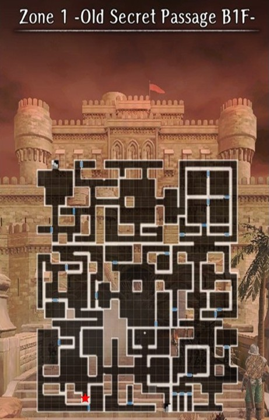
        

    
    ??? note "Golem Directions"
    
        

        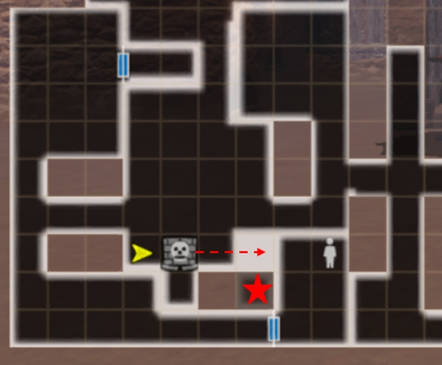
        

        - Push the golem to the right to block the corrosion sentry's field of view

    ??? note " Cursed Wheel Registration"

        === "Spotted"
            - Automatically "Spotted" on first run 

        === "Not Spotted"
            Cursed Wheel Nodes
            
            - Start: "Hidden Passage" 
            - Register: "Secret Passage Minor Harken"
            
            Directions
            
            - From "Hidden Passage" walk the full length of Zone 1 until you reach the corrosion sentry in the bottom left-hand corner. Its location does not change even with different map variations 
            - Push the golem to the right > "Not spotted" flag triggered
            - To register exit via the Zone 1 Harken ("Secret Passage Minor Harken")  

    ??? note "Cursed Wheel Entry"
        

        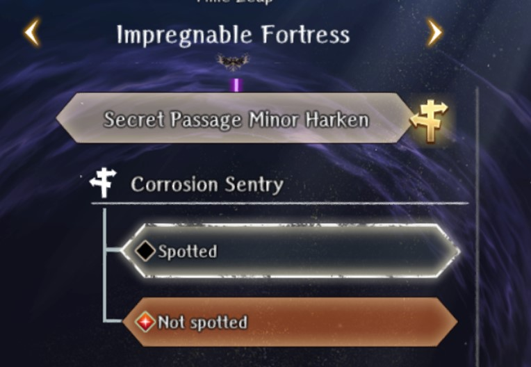
        

??? warning "Routing Tip"
    - Corrosion sentries [2], [3], and [4] can all be registered in the same run
    - Registering [3] and [4] requires defeating the Zone 3 Necrocore boss

??? note "[2] Enshadowed Well of Life - Corrosion Sentry - Zone 3"
          
    ??? map "Location"
    
        

        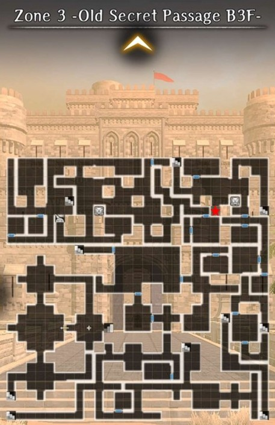
        

    ??? note "Golem Directions"
    
        

        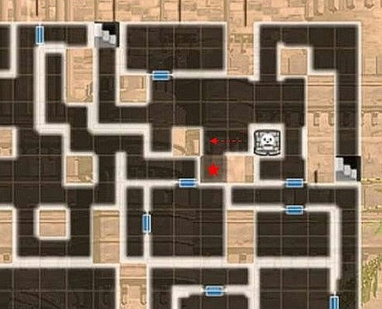
        

        - Push the golem to the left to block the corrosion sentry's field of view 

    ??? note "Registration"

        === "Spotted"
            - Automatically "Spotted" on first run 

        === "Not Spotted"
            Cursed Wheel Nodes
            
            - Start: "Secret Passage Minor Harken" (Zone 1 Harken)
            - Register: "Enshadowed Well of Life" (Zone 2 Fountain)

            Directions:

            - Follow the red path

            ??? "Path to [2] corrosion sentry" 
            
                    ??? map "Zone 2 - Old Secret Passage B2F"
                    
                    

                    
                    

                    
                    ??? map "Zone 3 - Old Secret Passage B3F"
                    
                    

                    
                    

                
            - There is a hole in the northeast corner of Zone 2 that drops you down to Zone 3. The corrosion sentry is around the corner 
            - Push the golem to the left > "Not spotted" flag triggered
            - To register proceed to the Zone 2 Fountain ("Enshadowed Well of Life")
            - To exit use a Hook of Harken, defeat the Necrocore boss in Zone 3, or take the route back to the Zone 1 Harken 

    ??? map "How to exit from the Zone 2 Fountain"
    
        

        
        

        
        - **NEED TO CREATE MAP**
        - From the Zone 2 Fountain proceed south past the Southern [3] corrosion sentry. Go through the door 
        - Ignore the sentry to your immediate right and keep heading south. At the bottom of the map there is a dead-end with a hole to drop down to Zone 3 
        - Once you land in Zone 3 go up, to the right, and up to the stairs to Zone 2. Head through the 1-way door and the stairs in front of you will take you back to the Zone 1 Harken   
        
    ??? note "Cursed Wheel Entry"
    
        

        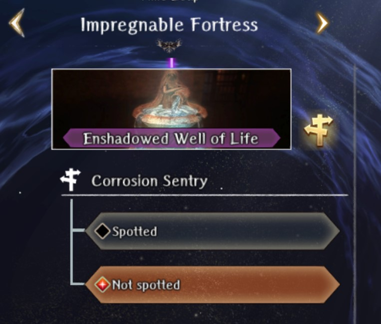
        

??? note "[3] Secret Path Keeper Vanquished - South Corrosion Sentry - Zone 2"

    !!! warning 
        - Registration requires defeating the Necrocore boss in Zone 3
    
    ??? warning "Routing Tip"
        - Corrosion sentry [4] is located directly north of this one and can be registered at the same time
        - Corrosion sentry [4] requires a low Abyss corrosion level to access 
        - Toggle all corrosion sentries to "Not Spotted" in the Cursed Wheel beforehand

    ??? map "Location"
    
        

        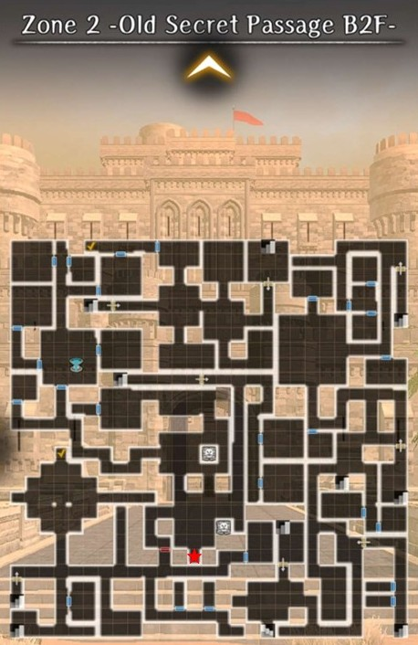
        

    ??? note "Golem Directions"
    
        

        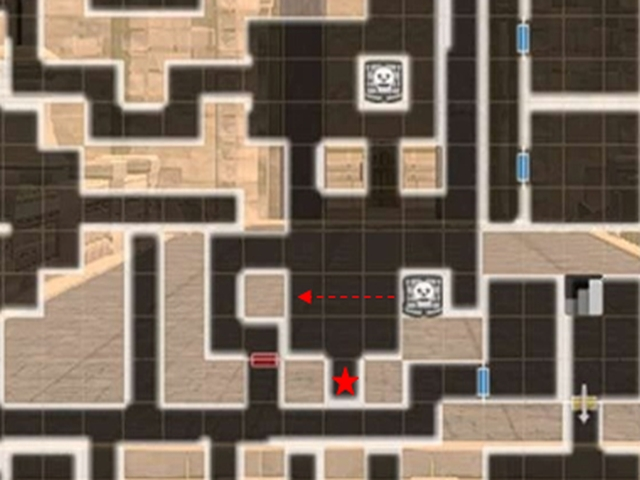
        

        - Ignore the nothern golem 
        - The corrosion sentry's field of view is quite large, so proceed carefully
        - Push the southern golem to the left 
        - The golem only partially blocks its field of view and you can still be accidentally "Spotted"

    ??? note "Registration"

        === "Spotted"
            - Automatically "Spotted" on first run 

        === "Not Spotted"
            Cursed Wheel Nodes
            
            - Start: "Enshadowed Well of Life" (Zone 2 Fountain)
            - Register: "Secret Path Keeper Vanquished" (Zone 3 Necrocore boss defeated) 

            Directions:
            
            - From the Zone 2 Fountain head south through the door and follow the path to the right to the large room. Ignore the golem directly in front of you
            - Head south and approach the corrosion sentry carefully as it has a large field of view
            - Push the southern golem to the left > "Not spotted" flag triggered
            - The golem only partially blocks the corrosion sentry's field of view, so be careful when exiting through the southern door
            - Note: To the north is corrosion sentry [4] that can be registered in the same run. See its entry for details
            - Proceed to the Necrocore boss in Zone 3, defeat it, and exit via the Harken behind it
 
    ??? map "Directions to Zone 3 Necrocore boss"

        - From the Zone 2 Fountain follow the light blue path south

        ??? map "Zone 2 - Old Secret Passage B2F"
        
            

            
            

        ??? map "Zone 3 - Old Secret Passage B3F"

            

            
            

 ??? danger "Boss: Necrocore"

    - Race: Undead
    - Abilities: Instant-Death

    Necrocore is undead and requires Expulsion weapons to do full damage. Its "Spear of Doom" attack can insta-kill an adventurer. There are several ways to increase insta-kill tolerance, including gear (Helm of Malice, Skull Necklace), bondmates (Elequon), adventurer passives (Red Beard, Galina), Harken blessings, and Well of the Mind nodes for the MC. 

    ??? note "Cursed Wheel Entry"
    
        

        
        

??? note "[4] Secret Path Keeper Vanquished - Central Corrosion Sentry - Zone 2"

    !!! warning 
        - This corrosion sentry must be done _twice_ to register both the "Spotted" and "Not spotted" flags. It is not possible to be "Spotted" on a first run due to corrosion blocking the hallway
        - Registration requires defeating the Necrocore boss in Zone 3
        - Requires a low Abyss corrosion level to access
        - Toggle all corrosion sentries to "Not Spotted" in the Cursed Wheel beforehand
    
    ??? warning "Routing Tip"
        - Corrosion sentry [3] is located directly south of this one and can be registered at the same time

    ??? map "Location"
    
        

        
        

    ??? note "Golem Directions"
    
        

        
        

        - Ignore the southern golem
        - Push the northern golem up

    ??? note "Registration"

        === "Spotted"
            Cursed Wheel Nodes
            - Start : "Enshadowed Well of Life" (Zone 2 Fountain)
            - Register : "Secret Path Keeper Vanquished" (Zone 3 Necrocore boss defeated) 

            Directions:
    
            - From the Zone 2 Fountain head south through the door and follow the path to the right to the large room
            - Ignore the golem directly in front of you and head north
            - The corruption sentry is in an alcove in the upper right-hand corner 
            - Stand in its field of view > "Spotted" flag triggered
            - Note: To the south is corrosion sentry [3] that can be registered at the same time. See its entry for details
            - Proceed to the Necrocore boss in Zone 3, defeat it, and exit via the Harken behind it
            
            Optional: 
            
            - Some players have reported triggering the "Spotted" flag without defeating the Necrocore boss in Zone 3
            - If you would like to test this potential bug, then CW to "Enshadowed Well of Life" (Zone 2 Fountain), get "Spotted", and then exit via a Hook of Harken or the Zone 1 Harken
            - Once back in town CW to "Secret Path Keeper Vanquished" and then exit via the Zone 3 Harken
            - Do a "Not spotted" run to see if the corrosion sentry was registered 

        === "Not Spotted"
            Cursed Wheel Nodes
            - Start: "Enshadowed Well of Life" (Zone 2 Fountain)
            - Register: "Secret Path Keeper Vanquished" (Zone 3 Necrocore boss defeated)  
            
            Directions:
            
            - From the Zone 2 Fountain head south through the door and follow the path to the right to the large room
            - Push the golem directly in front of you up > "Not spotted" flag triggered
            - Note: To the south is corrosion sentry [3] that can be registered at the same time. See its entry for details
            - Proceed to the Necrocore boss in Zone 3, defeat it, and exit via the Harken behind it

    ??? map "Directions to Zone 3 Necrocore boss"

        - From the Zone 2 Fountain follow the light blue path south

        ??? map "Zone 2 - Old Secret Passage B2F"
        
            

            
            

        ??? map "Zone 3 - Old Secret Passage B3F"

            

            
            
   

 ??? danger "Boss: Necrocore"

    - Race: Undead
    - Abilities: Instant-Death

    Necrocore is undead and requires Expulsion weapons to do full damage. Its "Spear of Doom" attack can insta-kill an adventurer. There are several ways to increase insta-kill tolerance, including gear (Helm of Malice, Skull Necklace), bondmates (Elequon), adventurer passives (Red Beard, Galina), Harken blessings, and Well of the Mind nodes for the MC. 

    ??? note "Cursed Wheel Entry"
    
        

        
        

??? note "[5] Fortress Lower Floors Cleared - Corrosion Sentry - Zone 5"

    ??? map "Location"
    
        

        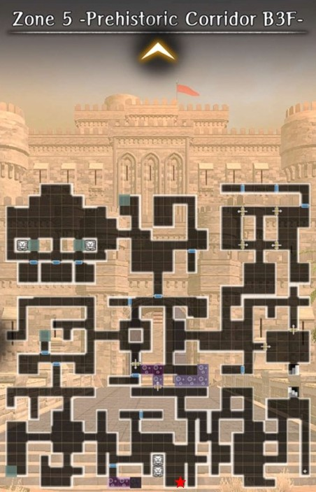
        

    ??? note "Golem Directions"
    
        

        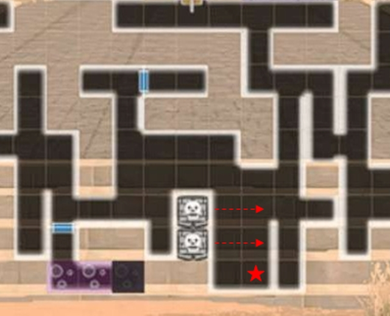
        

        - Push the bottom golem to the right to block the corruption sentry's field of view
        - Push the top golem up to block the sentry's field of view

    ??? note "Registration"

        === "Spotted"
            - Automatically "Spotted" on first run 
            
        === "Not Spotted"
            Cursed Wheel Nodes
            - Start: "Fortress Basement Arrival" (Zone 5 entrance) 
            - Register: "Fortress Lower Floors Cleared" (enter Zone 6)
            
            Directions:
            
            - Proceed through Zone 5 until you reach the corrosion sentry. Its location does not change even with different map variations 
            - Push the bottom golem to the right to block the corruption sentry's field of view
            - Push the top golem up to block the sentry's field of view  
            - To register go up the stairs to Zone 6 ("Fortress Lower Floors Cleared") and then exit via the Zone 5 Harken
            
            !!! Warning
                - The registration node is entering Zone 6 _not_ the Zone 5 Harken 
                 
    ??? note "Cursed Wheel Entry"
    
        

        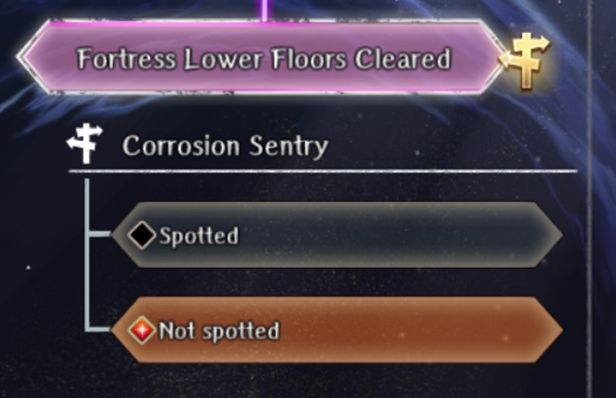
        

??? note "[6] Portrait Gallery Minor Harken - Corrosion Sentry - Zone 6"

    ??? map "Location"
    
        

        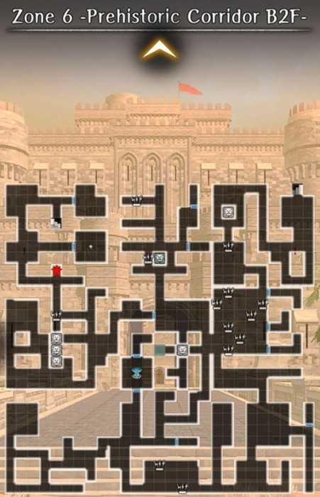
        

    ??? note "Golem Directions"
    
        

        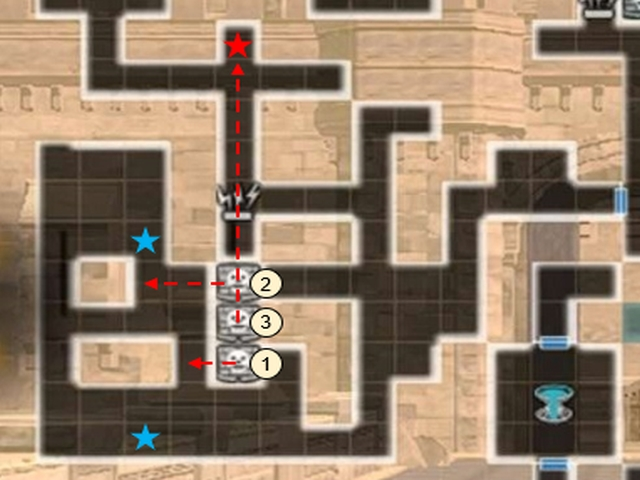
        

        - Push the top (1) and bottom (2) golems to the left
        - Push the middle (3) golem up to crush the corrosion sentry 

    ??? note "Registration"

        === "Spotted"
            - Automatically "Spotted" on first run 
            
        === "Not Spotted"
            Cursed Wheel Nodes
            - Start: "Fortress Lower Floors Cleared" (Zone 6 entrance) 
            - Register: "Portrait Gallery Minor Harken" (Zone 6 Harken)

            Directions:
            
            - Proceed through Zone 6 until you reach the area with 3 golems. Its location does not change even with different map variations 
            - Push the top and bottom golems to the left
            - Push the middle golem up, which will crush the corrosion sentry > "Not spotted" flag triggered 
            - Note: There are 2 normal sentrys in the area. Be careful to avoid their field of view when pushing the golems
            - To register exit via the Zone 6 Harken
     
    ??? note "Cursed Wheel Entry"
    
        

        
        

    
??? note "[7] Ghosts of Yore Vanquished - Corrosion Sentry - Zone 7"

    ??? map "Location"
    
        

        
        

    ??? note "Golem Directions"
    
        === "Corrosion Sentry"
        
            

            
            

            - The map variation you roll may have the room rotated
            - The golem push order remains the same
            - There are 3 normal sentrys in the area, so be careful to avoid their field of vision
        
        === "Doll"
        
            

            
            

            - There are several roaming sentrys in the area
            - Requires walking through poison tiles
            - Poison tiles can cause the game to lag and a roaming sentry may spot you and catch up

    ??? note "Registration"

        === "Spotted"
            - Automatically "Spotted" on first run 
            
        === "Not Spotted"
            Cursed Wheel Nodes
            - Start: "Portrait Gallery Minor Harken" (Zone 6 Harken)
            - Register: "Ghosts of Yore Vanquished" (Doll boss defeated)

            Directions:
            
            - From the Zone 6 Harken go up the stairs and proceed through Zone 7 until you reach the large room with 6 golems. Zone 7 can roll different map variations. The large room might be rotated, but the golem pushing order remains the same. See "Golem Directions - Corrosion Sentry"
            - Crush the corrosion sentry > "Not spotted" flag triggered 
            - To register proceed to the end of Zone 7 and defeat the Doll boss or crush it (see "Golem Directions - Doll") for a hidden achievement. Exit via the Zone 7 Harken
     
    ??? note "Cursed Wheel Entry"
    
        

        
        

         
