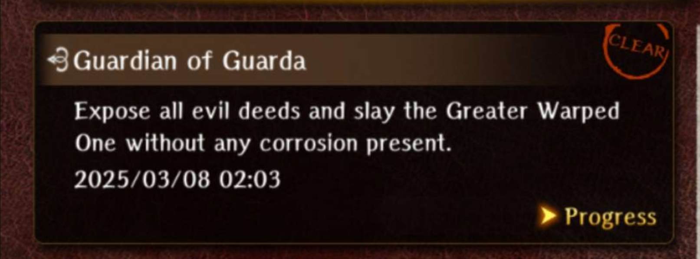

# Guarda Fortress - Important Request and Greater Warped One

## Endings

### Mandatory - Getting Murdered

This mandatory ending is triggered when killing the Greater Warped One for the first time.

You don't have the ability to activate **Golems**, nor the requisite **Knowledge** to complete requests required for [Stopping the Blackmailer](#stop-the-blackmailer-and-save-the-duke).

#### Outcome

Killed by the Duke's servant, Lily.

#### Requirements

1. Defeat the Greater Warped One of the Guarda Fortress Abyss.

#### Rewards

- Well of the Mind Lantern (VIT)
  - The lantern is given when reversing the Golem, just before the fight against the Greater Warped One.

### Alternate - Getting Murdered

#### Outcome

Killed by the Duke's servant, Alan.

#### Requirements

1. Meet the Duke's party.
2. Fail to save Liam or fail to notify Alan that she was saved.
3. Defeat the Greater Warped One of the Guarda Fortress Abyss.

#### Rewards

- None

### Mandatory - Getting Executed

#### Outcome

Executed in town due to accusations by Guardian Knight Dalian.

#### Requirements

1. Meet the Duke's party.
2. Save a young girl named Liam (Alan and Lily's daughter) and notify Alan when meeting the Duke's party.
3. Fail to give "Blackmail Evidence" to Guardian Knight Dalian.
4. Defeat the Greater Warped One of the Guarda Fortress Abyss.

#### Rewards

- None

### Stop the Blackmailer and Save the Duke

This is the first ending you will obtain that successfully completes the "Duke Ixion" request.

#### Outcome

Saved the Duke, but did not find the culprit behind the sinister events in Guarda.

#### Requirements
1. Meet the Duke's party.
2. Save Liam and notify Alan when meeting the Duke's party.
3. Give Guardian Knight Dalian evidence of the Duke's betrayal.
4. Defeat the Greater Warped One of the Guarda Fortress Abyss.
5. Have a Maximum of 8 Corruption Levels (Spotted 8 Times)

##### Saving Liam

You can save Liam once you receive "Lily and Alan's Guild Request".

See [Search for the Missing Girl Request](./requests.md#search-for-the-missing-girl)

#### Rewards

- Well of the Mind Lantern (DEX)

### Stop the Mastermind and Save the Duke

#### Outcome

Saved the Duke and apprehended the mastermind.

#### Requirements
1. Successfully saved Duke Ixion in a previous run.
2. Meet the Duke's party.
3. Save Liam and notify Alan when meeting the Duke's party.
4. Give "Mastermind Evidence" to Clemente.
5. Defeat the Greater Warped One of the Guarda Fortress Abyss.
6. Have a Maximum of 6 Corruption Levels (Spotted 6 Times) 

#### Walkthrough

1. Warp to Zone 4 Tunnels and talk to the amnesiac skeleton Duke Elequon.
2. Warp to Zone 6 and speak with an NPC sand ghost. Give it the password to gain access to a hidden room.
3. Enter room and interact with all the items in the room. Make sure to pick up the Master Key. (It is not necessary to enter Elequon's room)
4. When passing Zone 9, do not enter the blackmail evidence room, as it will trigger a corruption sentry.
5. Head to Zone 10 and enter the room across the room containing the Teleporter and interact with all the items inside.
6. Travel to Royal Capital Luknalia and gamble with the swindlers. If you win, you gain mastermind items. If you cannot win, you can die and then tell Lulu that they are blowing on the dice. You will use Lulu's recommended strategy of letting them go first. Tell them you know Lady Luck afterwards, and you can avoid the fight.
7. Head back to the culprit's room and solve the Statue Puzzle from the hints on the floor. You do this by stepping on the rubble in the corner of the room, which will give you a random hint for the Statue Puzzle. 
8. Head to the culprit's room and give the evidence to Clemente.
9. Defeat the Greater Warped One.

#### Rewards

- Well of the Mind Lantern (LUC)

## Greater Warped One

### Gatekeeper

#### Characteristics

* The Gatekeeper himself has no elemental weaknesses
* Has high defense. When attacking the body, it's recommended to use moves with defense penetration.
* Will scale in difficulty depending on the ending and amount of "corruption" from being spotted by the sentries.
* Has a very large array of skills that he can use, and as such battles can vary quite drastically.
* Fight is somewhat long, has around ~3 main discernable phases.

??? note "Approximate HP Thresholds for certain corruption levels"
    - 6 Corruption: Phase 1: 5k HP | Phase 2: 19k HP | Phase 3: 3.5k HP
    - 0 Corruption: Phase 1: 8k HP | Phase 2: 34k HP | Phase 3: 8k HP

#### Battle Tips

##### Recommended Party Composition

- At least 2 Fighters, 1 Priest, 1 Knight, and 1 Ninja. 3 Fighters is ideal, as they have the most efficient damage for SP cost (Full Power Strike). Ninja for dissipation. Knight for Knight's Defense for more consistent runs through phase 1. Priest because obviously.
- Give Nourishing Draughts + Elixirs to the backline.

!!! note "For sake of clarity, tips will be separated into his three phases"

##### Phase 1

* Phase 1 has the lowest HP of the phases, but is the phase with the most uncertainty as he has access to nearly every skill in his arsenal
* He has 2 tentacles that spawn with his main body. Tentacles in general will just grab a character for the main body to punch for a large amount of damage. These are dodgeable on lower difficulties.
* He may cast Wrath randomly, which provides him with 8 turns of damage buff, but 8 turns of defense reduction and accuracy reduction. If you take too long, he will cast Unyielding Will, which removes all debuffs and buffs on himself and gives himself 8 turns of resistance. Ninjas can dissipate the damage buff, which is highly recommended as the damage buff is quite huge.
* He may also roar with or without warning during this phase, which will shuffle the rows of the team. It's advised to take this time to heal up if necessary and swap rows back. If extremely unlucky, he may also take a deep breath followed by Great Roar, which will shuffle rows and stun the team.
* It's generally advised to kill the tentacles first, as they contribute to doing a lot of single target damage. Keep in mind though, at random, he may be capable of resurrecting one of them albeit at lower HP.
* After dealing enough damage, he will throw a golem at a random target, but it's recommended to keep this for the next phase.
* It's advised to burn through this phase ASAP due to it's randomness and potential to waste a lot of resources and/or wipe the team entirely.
* The best way to deal with Phase 1 in a consistent manner is to use Full Power Strike on both tentacles, then finishing it up with some high level skills. Make sure the Knight goes last and uses Knight's Defense to mitigate damage from any skills. Makaltu is very useful here to surviving the initial couple of rounds. Once the tentacles are down, keep using Full Power Strike on the body.

##### Phase 2

* He will enter this phase when dealing enough damage, as the gate will fully open exposing the weakpoint. During this phase, the Gatekeeper will generally do nothing and attempt to close the gate
* The main body will fall down and possibly get up several times during this phase. It's advised to slow your damage down but keep the damage consistent, as you will need to conserve your resources for the next phase. This phase has the largest HP pool of all three phases.
* When the body is on the floor, use Right Hand of Reversal on the golem, as it will deal a lot more damage. The damage will scale with any damage buffs the MC has on.
* The weakpoint in this phase can only be hit by ranged weapons and not spears, though Sneak Attack from a thief will reach it. The weak point can possibly die before the Gatekeeper moves on to the next phase, as it's just there to help speed up your damage.
* Fighters should continue using Full Power Strike.
* If on a harder difficulty, it's recommended to use support characters to start handing out nourishing draught to your damage dealers to prepare for the next phase.

##### Phase 3

* He enters this phase typically when he gets a free roar off when it's not his turn and "Gathering his last strength". In doing so he will gain some undispellable damage, CT, and damage reduction buffs. You will get 2 free turns as he will be attempting to close the door. Attacks from him at this point deal fatal levels of damage.
* If you have more than 4 Corruption, he will not get a free roar, but rather just "ROAR" in text.
* There is another golem throw around this time.
* You must essentially also "gather your last strength" and throw all the damage you can onto him at this point. Continue using Full Power Strike, but switch to your strongest moves if possible.
* Depending on the difficulty based on route and corruption, he may also respawn both tentacles.
* If you do not do enough damage in time, he will inevitably spam Deep Roar, which will switch rows and stun most of your team, effectively ending your run.

??? note "Note about no Corruption Runs" 

    

    It is extremely difficult to attempt a no corruption run. There is nothing to gain from this except 50 gems and an achievement to flex.
