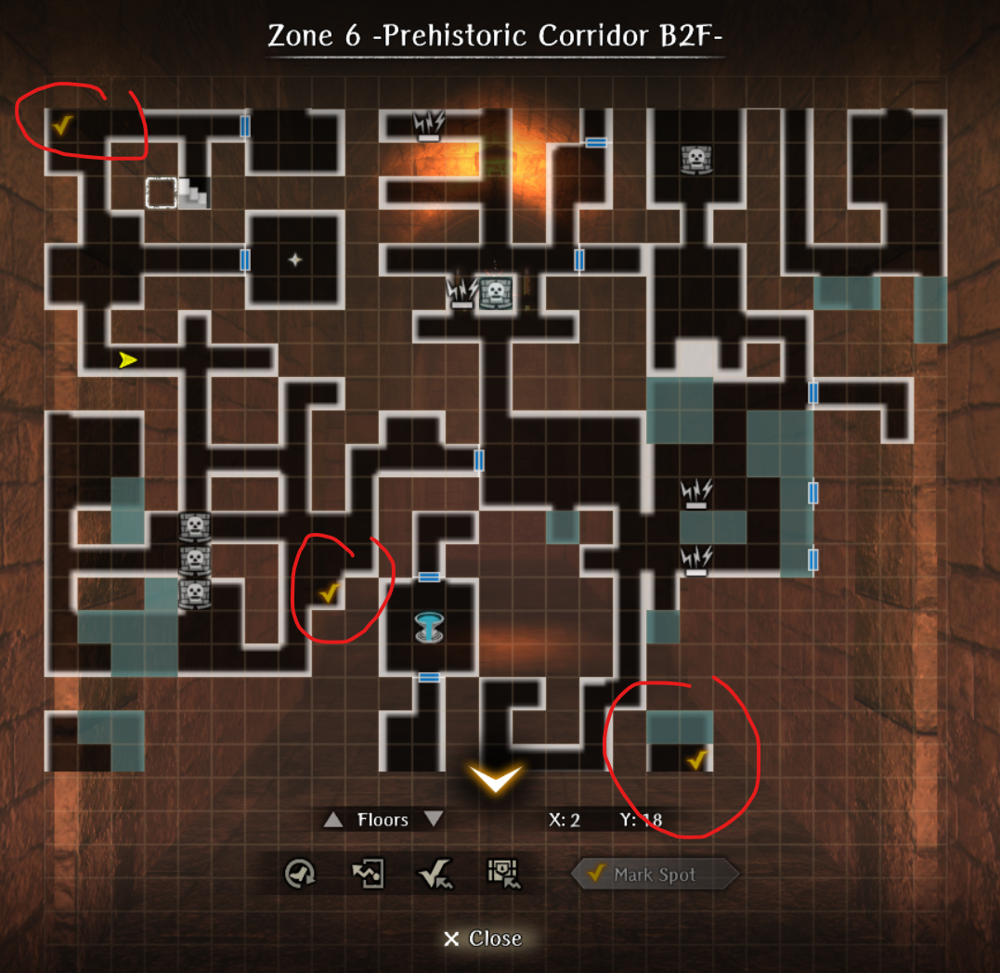
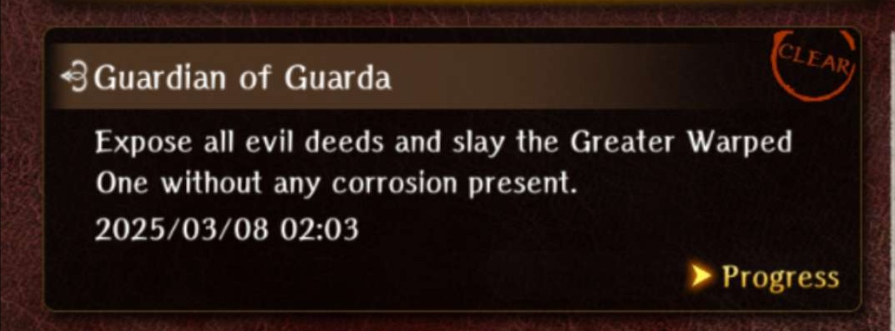

# Guarda Fortress - Important Request and Greater Warped One

!!! warning "Read Me"
    - Major spoilers ahead.
    - We are working on adding additional information on key steps and requirements for each ending.

## Endings Overview

=== "Basics" 

    - A3 has a total of 4 endings. The ending names (or "runs") are used interchangeably on the Discord, Reddit, and other places.
        - Stabbed - Bad 1
        - Executed - Bad 2
        - Blackmail - Good
        - Mastermind - True
    - The objective is to save Duke Ixion and solve the mystery of who is trying to assassinate him. The first 2 "bad" endings are mandatory, but you gain key information to avoid dying on subsequent runs.
    - After your first run there is a major story request tied to each of the endings that must be completed before fighting the GWO. 
    - To progress to A4 you need to clear the Blackmail ending.

=== "Corrosion Mechanic" 

    - Unique to A3 is the corrosion mechanic. The GWO generates corrosion, which is visually represented by the amount of white "goo" on the walls. High levels of corrosion will also block off entire areas, which contain important NPCs, Knowledge, request items, etc.  
    - You will eventually gain the power to lower the overall Abyss corrosion level to access new areas. The mechanic is confusing and bug-ridden, and will take time to fully understand.  
    - The dedicated corrosion mechanic page is located [here](./corrosion.md). It is not relevant on your first run, but mandatory reading after you acquire the Golem reversal power.  

=== "Other"

    - A3 is a significant jump in difficulty. It is normal to struggle in Z1-3 until you have better gear and higher levels. It also has the largest number of floors with [map variations](../../mechanics/map-variations.md). Your maps may not always match what is shown on the site. 
    - With normal progression you should reach Level 60 by the end of your first run. With the addition of A4 you have the option to take the Copper exam that raises the level cap to 70. 
    - Most players do a different faction for each ending. It is possible to complete all 4 on the same faction. 
    - None of the Important Request faction rewards are particularly valuable.
    - Faction requests are located [here](./requests.md##old-district-slum-faction-quests). 

=== "Abbreviations"
    
    - A3 - Abyss 3
    - A4 - Abyss 4
    - CW - Cursed Wheel
    - GWO - Greater Warped One
    - Z - Zone, Abyss 3 refers to floors as "Zones"
    - Z# - Floor number (1-10)

=== "Special Endings" 

    - Defeat GWO 0 on the Mastermind ending.  
        - GWO 0 requires all 13 corrosion sentries to be registered and toggled to "Not Spotted" in the CW. 
        - Gives a secret achievement (Guardian of Guarda). 
        - Unlocks the Rank 12 Cyclops bounty. All other bounties must be completed. You do not need to defeat GWO 0, but simply reach the fight and let MC die. This may be patched in the future.  
    - Give Mastermind Evidence to Alberio. 
        - On the Mastermind ending when you reach Ixion's room you will be prompted to give the evidence to either Clemente or Alberio. 
        - Giving it to Alberio leads to a secret ending and hidden achievement (Heads Aligned, Fates Sealed). 
        - You will lose the Mastermind Evidence from your Valuables and will have to reset the CW and redo the steps again.  

## Stabbed - Bad Ending 1

=== "Summary" 

    - This is a mandatory ending and cannot be skipped. 
    - The first run is a tutorial for A3. The goal is to get familiar with each floor, new enemies, and the wandering sentries. 
    - For a per floor guide see [Maps](./maps.md).
    - Do not waste your time:
        - Trying to activate the dormant golems. The Golem reversal power is learned right before the GWO fight.  
        - Finding a way into areas blocked by corrosion. They will be accessible on future runs.  
        - Avoiding the corrosion sentries. Corrosion sentries are the stationary, flying enemies that will sound an alarm when you step into their field of vision. This is intended and a required step to register them properly in the CW. 

=== "Guide"

    - From the Z10 Fountain head south to Ixion's room. All the wandering sentries can be avoided. 
    - Watch the brief scene in Ixion's room and proceed to the southern balcony area. This is the point of no return. Be careful as there are 2 wandering sentries roaming the area. 
    - Approach the giant lever and an alarm will go off. Flying enemies (Evil Eyes) will surround you and corrosion will block the exit. Do not panic. They move extremely slowly and can be avoided. To progress, you need to reach the other side of the golem via looping around the perimeter of the balcony.  
    - Warning! On the balcony there is a forced encounter against 2x Evil Eyes. On future runs there is only 1 forced encounter.  
    - Interact with the golem for a brief cutscene with Lulu. Type in "Golem" to gain the Golem reversal power. You will have another forced encounter against 2x Evil Eyes. Reverse the golem and move forward as there is another enemy to your immediate left.  
    - Walk over to the golem to set off the Singal Rocket. Now head back to the balcony and jump off. You will be forced off the balcony if the corrosion catches up to you, but will not incur any HP damage. 
    - Defeat the GWO. 
    - Warning! Speak with the servant's Lily and Allen immediately after defeating the GWO to gain important Knowledge for your second run. If you exit the front entrance camp area the ending cutscene will begin. [Editor's Note: Whether this conversation procs or not on your first run has been inconsistent. There are other ways to gain the Knowledge, see the next run for details].    

=== "Tip"
    
    - If you do not have enough resources to defeat the GWO -after- getting the Golem reversal power, then have the MC die to an Evil Eye or the GWO and "Accept death". Have the rest of your team defend to cut down on revival costs.
    - After zoning back in, heal at the Inn. 
    - Go to the Ruins - Cursed Wheel and jump to Fortress 3rd Floor Arrival, which will take you to the Z10 Fountain. 
    - With the Golem reversal power learned there is only one forced encounter with the 2x Evil Eyes, which should help preserve your resources. Bringing additional MP and SP pots is recommended. 

=== "Outcome"

    - Once you leave the front entrance area the Duke's servant, Lily, will stab you.
    - Her daughter, Liam, has been kidnapped and is being used as leverage to coerce her and Alan into killing Duke Ixion.  

=== "Rewards"

    - Well of the Mind Lantern (VIT)
    - The lantern is given when reversing the Golem, just before the GWO fight. 

## Executed - Bad Ending 2

=== "Summary" 

    - This is a mandatory ending and cannot be skipped. 
    - For the second run there are 3 primary objectives:
        - Save Liam to avoid being stabbed.
        - Collect key Knowledge. This requires lowering the overall Abyss corrosion level to access new areas. It is best to do this step now versus backtracking in the future. 
        - Register corrosion sentries in the CW. With the the Golem reversal power you can now destroy or block the line of sight of the corrosion sentries that "spotted" you on your first run. 
        - Note that the Saving Liam request gives you access to corrosion sentry [[10]](./corrosion.md#1f-servants-quarters-corrosion-sentry) and requires a low Abyss corrosion level otherwise the door will be inaccessible. 
    - Before you begin, review the corrosion sentry registration mechanics [here](./corrosion.md) and all 13 locations. 

=== "Guide"

    - Cursed Wheel Settings
        - Fortress 3rd Floor Arrival - Abducted Child is toggled to either "Rescued in critical condition" or "Rescued safely".  
        - At least 8 corrosion sentries are toggled to "Spotted". Any corrosion sentry (out of 13) not registered is automatically counted as "Spotted." For an example of how to do the math see [here](./corrosion.md#__tabbed_5_3).
        - If you do not have at least 8 "Spotted" corrosion sentries toggled, then everyone in Ixion's room will be dead. See [here](./corrosion.md#__tabbed_1_4). 
    - With everything toggled correctly jump to Fortress 3rd Floor Arrival, which places you at the Z10 Fountain. Make your way south to Ixon's room, which should now have fewer corrosion tiles than before.  
    - Enter Ixion's room and speak with Liam's dad, Alan. Tell him that you rescued Liam safely and watch a short cutscene. 
    - Speak with everyone in the room for additional information about what is going on. Exit and head south. 
    - On your second run you do not need to examine the lever. Head directly to the outer balcony to reach the back of the golem. There is now only 1 forced encounter against the 2x Evil Eyes. 
    - Reverse the golem and repeat the same steps as before. 
    - Defeat the GWO. 
    
=== "Saving Liam" 

    - [Search for the Missing Girl](./requests.md#search-for-the-missing-girl) is the primary request for the second run.
    - It is a Guild request, but requires Knowledge that Liam has been kidnapped. See the request page for details on how to unlock.        
    - The request has multiple endings. To progress you only need to rescue Liam in "critical condition". The "rescued safely" endings gives Liam's bondmate (Stun Tolerance) if you speak to hear after defeating the GWO. It is fixed at Level 1. 
    - Only needs to be completed once. The outcome is saved as a toggle in the CW under Fortress 3rd Floor Arrival - Abducted Child sub-node. Make sure you speak with Graham and Remi at the front entrance (tent by the well entrance) after saving Liam to make sure it registers properly.  
    
=== "Key Knowledge and Items"

    === "Leto Paintings" 

        === "Z6 Locations" 

            - Leto Painting 1 - Z6 - This location can vary depending on your map variation, see map tab for the tile set.
            - Leto Painting 2 - Z6 - Northwest of the Fountain. 
            - Leto Painting 3 - Z6 - Next to stairs to Z7, requires low Abyss corrosion level to view.

        === "Z6 Map" 
        
            

            
            

    === "Tale of Bordaon" 

        - Tale of Bordaon 1 - Speak with the SE skelete in the central room. 
        - Tale of Bordaon 2 - Speak with NE skeleton in the central room after acquiring the Knowledge of Leto Paintings 1-3.

=== "Outcome"

    - You saved Liam, but Guardian Knight Dalian accuses you of being Ixion's murderer because you are wearing a mask.

=== "Rewards"

    - As a reward you get your head chopped off, congrats!

=== "Alternate Ending"

    - Conditions:
        - You have the Knowledge that Liam was kidnapped, but did -not- save her; or,
        - Saved Liam in any condition, but did -not- tell Alan she was rescued safely.
    -  After defeating the GWO, Alan will stab you. It is the same outcome as Bad Ending 1, but with Alan killing you versus Lily. 
    - If you did save Liam, but still got stabbed, then double-check your Abducted Child sub-node was toggled correctly. 

## Blackmail - Good Ending

=== "Summary" 

    - This is a mandatory ending and cannot be skipped. Once cleared it will unlock A4 since Ixion survives and completes the requirements for the major faction request. 
    - The primary objective is to complete all steps associated with the request [Blackmail Resolution](./requests.md##blackmail-resolution). Securing the Blackmail Evidence will gain Dalian's trust so that you can avoid being executed. 
    - The Blackmail Resolution request:
        - Is a multi-chain request that will take you to several different locations.
        - Has the "Gambler's" boss fight, which some players consider more difficult than the Doll or the GWO.  
        - Gives you access to Corrosion sentry [[12]](./corrosion.md#2f-soldiers-room-corrosion-sentry). Note that it has a bugged registration requirement. See the page for details. 
    - Continue to register corrosion sentries that you may have missed if you plan to do the Mastermind GWO 0 ending. 
    - The GWO 8 fight will be a step-up in difficulty from what you have experienced so far, but is still manageable. 

=== "Guide"

    - Warning! Make sure the Blackmail Evidence is in your Valuables inventory before beginning otherwise you will default to Bad Ending 2.  
    - Cursed Wheel Settings
        - Fortress 3rd Floor Arrival - Abducted Child is toggled to either "Rescued in critical condition" or "Rescued safely".  
        - At least 8 corrosion sentries are toggled to "Spotted". Any corrosion sentry (out of 13) not registered is automatically counted as "Spotted." For an example of how to do the math see [here](./corrosion.md#__tabbed_5_3).
        - If you do not have at least 8 "Spotted" corrosion sentries toggled, then everyone in Ixion's room will be dead. See [here](./corrosion.md#__tabbed_1_4). 
        - At this point you likely have several corrosion sentries registered. You can opt to have fewer "Spotted", but GWO 6 and below is a significantly more difficult fight and is not necessary for this ending. 
    - With everything toggled correctly jump to Fortress 3rd Floor Arrival, which places you at the Z10 Fountain. Make your way south to Ixon's room. 
    - Enter Ixion's room and speak with Liam's dad, Alan. Tell him that you rescued Liam safely and watch a short cutscene. 
    - Next, speak with Dalian and hand over the Blackmail Evidence. 
    - Head directly to the outer balcony to reach the back of the golem. Per usual there is only 1 forced encounter against the 2x Evil Eyes. 
    - Reverse the golem and repeat the same steps as before. 
    - Defeat the GWO. 

=== "Outcome"

    - Ixion is saved and you can now progress to A4. 
    - A new CW node called Triumphant Return is now unlocked. To unlock the Harken you need to manually walk from the Z9 Harken. Once completed it should be permanently unlocked, but people have reported bugs in the past. 
    - Several post-GWO requests are now available at the A3 Guild. 

=== "Rewards"

    - Well of the Mind Lantern (DEX).

## Stop the Mastermind and Save the Duke

#### Outcome

Saved the Duke and apprehended the mastermind.

#### Requirements
1. Successfully saved Duke Ixion in a previous run.
2. Save Liam and notify Alan when meeting the Duke's party.
3. Give "Mastermind Evidence" to Clemente when meeting the Duke's party.
4. Have a Maximum of 6 Corruption Levels (Spotted 6 Times) 

#### Outcome

Saved the Duke and apprehended the mastermind.

#### Requirements

1. Successfully saved Duke Ixion in a previous run.
2. Save Liam and notify Alan when meeting the Duke's party.
3. Give "Mastermind Evidence" to Clemente when meeting the Duke's party.
4. Have a Maximum of 6 Corruption Levels (Spotted 6 Times) 

#### Guide

!!! warning "Proceeding With Caution" 
    - It is possible to do a zero corruption run during this run. Keep in mind the note about no corruption runs, this is much more difficult. 
    - At some point when returning to town, before interacting with the Duke's party, save Liam. 
    - Do not approach the Duke's party until you have all required key items. If you do, before you have the necessary items, you will need to cursed wheel back. Check key items to ensure you have everything, then proceed.
    - When passing Zone 9, do not enter the blackmail evidence room, as it will trigger a corruption sentry, potentially ruining a no corruption run.

1. Progress to Zone 4 Tunnels (or warp if you can \[Fortress Basement Arrival is nearest\]) and talk to the amnesiac skeleton Duke Elequon. He will give you a secret password (you don't need to remember it).
2. Progress (or warp if you can) to Zone 6 and speak with a NPC Sand Ghost. Give it the password to gain access to a hidden room.
3. Enter room and interact with all the items in the room. Make sure to pick up the Master Key. (Note: entering Elequon's room, on the westside of Zone 10, is solely fiscal).
4. Progress to Zone 10 and enter the locked room (the room opposite of the one containing the Teleporter). Interact with all the items inside the mastermind's room. (You can get an achievement for disregarding Lulunarde's warnings.) After interacting with all the shinies (the tapestry and bedstand) you will find Alberio's *Deposit Ticket*. Take the teleporter in the room opposite and then the Harken back to town. (If you have yet to save Liam, this is a good time to do so.)
5. Travel to Royal Capital Luknalia and gamble with the swindlers. When they question your authority either answer will do. They will play a slightly different game this time. It is impossible to win this game, even after resurgence---they are 'rigging the rules'. You will be forced into a tough fight (~8000+/char). If you win, you gain *Alberio's Secret Note*. If you die, you chose to tell Lulu that they are 'blowing on the dice', make them bet first, betray '*Lady Luck*' to them, and then receive *Alberio's Secret Note*.
6. To get a clue on how to solve the puzzle ahead ('Buried in a mound of forgotten remnants, the path to a hidden door awaits') head back to Alberio's room. 'The mound' refers to stepping on the rubble in the corner of the room. It will give you a random hint for the Statue Puzzle. Proceed towards the Duke's party. As you make your away around the patrolling enemies you will find half of the statues in one room and the other half in the next room as you follow their patrol path. Note the direction the busts are facing. This is similar to the statue puzzle in Abyss 1. Answers: One who moves slowly is one who knows contemplation---Speed Lowest; Ye who boasts of mighty strength---Strength Highest; The utmost life reveals the true path---HP Highest, The one who mastered foolishness will see the truth---IQ Lowest; Only one of fleeting life knows the proper choice---(Fortitude Lowest?). With the correct bust intact head back to Alberio's room. The item that was superfluous now has a use, taking it will lead to Alberio's Secret Room. Here can be found the 'Mastermind's Evidence'. (Achievement---You Mustn't Touch! Mustn't Ever Touch: Touch both cursed items.)
7. Once solved, head to the Duke's party and give the evidence to Clemente[^1].
8. Notify Liam's parents of their child's whereabouts.
9. Defeat the Greater Warped One.

#### Rewards

- Well of the Mind Lantern (LUC)

## Greater Warped One

### Gatekeeper

#### Characteristics

* The Gatekeeper himself has no elemental weaknesses
* Has high defense. When attacking the body, it's recommended to use moves with defense penetration.
* Will scale in difficulty depending on the ending and amount of "corruption" from being spotted by the sentries.
* Has a very large array of skills that he can use, and as such battles can vary quite drastically.
* Fight is somewhat long, has around ~3 main discernable phases.

??? note "Approximate HP Thresholds for certain corruption levels"
    - 6 Corruption: Phase 1: 5k HP | Phase 2: 19k HP | Phase 3: 3.5k HP
    - 0 Corruption: Phase 1: 8k HP | Phase 2: 34k HP | Phase 3: 8k HP

#### Battle Tips

##### Recommended Party Composition

- At least 2 Fighters, 1 Priest, 1 Knight, and 1 Ninja. 3 Fighters is ideal, as they have the most efficient damage for SP cost (Full Power Strike). Ninja for dissipation. Knight for Knight's Defense for more consistent runs through phase 1. Priest because obviously.
- Give Nourishing Draughts + Elixirs to the backline.

!!! note "For sake of clarity, tips will be separated into his three phases"

##### Phase 1

* Phase 1 has the lowest HP of the phases, but is the phase with the most uncertainty as he has access to nearly every skill in his arsenal
* He has 2 tentacles that spawn with his main body. Tentacles in general will just grab a character for the main body to punch for a large amount of damage. These are dodgeable on lower difficulties.
* He may cast Wrath randomly, which provides him with 8 turns of damage buff, but 8 turns of defense reduction and accuracy reduction. If you take too long, he will cast Unyielding Will, which removes all debuffs and buffs on himself and gives himself 8 turns of resistance. Ninjas can dissipate the damage buff, which is highly recommended as the damage buff is quite huge.
* He may also roar with or without warning during this phase, which will shuffle the rows of the team. It's advised to take this time to heal up if necessary and swap rows back. If extremely unlucky, he may also take a deep breath followed by Great Roar, which will shuffle rows and stun the team.
* It's generally advised to kill the tentacles first, as they contribute to doing a lot of single target damage. Keep in mind though, at random, he may be capable of resurrecting one of them albeit at lower HP.
* After dealing enough damage, he will throw a golem at a random target, but it's recommended to keep this for the next phase.
* It's advised to burn through this phase ASAP due to it's randomness and potential to waste a lot of resources and/or wipe the team entirely.
* The best way to deal with Phase 1 in a consistent manner is to use Full Power Strike on both tentacles, then finishing it up with some high level skills. Make sure the Knight goes last and uses Knight's Defense to mitigate damage from any skills. Makaltu is very useful here to surviving the initial couple of rounds. Once the tentacles are down, keep using Full Power Strike on the body.

##### Phase 2

* He will enter this phase when dealing enough damage, as the gate will fully open exposing the weakpoint. During this phase, the Gatekeeper will generally do nothing and attempt to close the gate
* The main body will fall down and possibly get up several times during this phase. It's advised to slow your damage down but keep the damage consistent, as you will need to conserve your resources for the next phase. This phase has the largest HP pool of all three phases.
* When the body is on the floor, use Right Hand of Reversal on the golem, as it will deal a lot more damage. The damage will scale with any damage buffs the MC has on.
* The weakpoint in this phase can only be hit by ranged weapons and not spears, though Sneak Attack from a thief will reach it. The weak point can possibly die before the Gatekeeper moves on to the next phase, as it's just there to help speed up your damage.
* Fighters should continue using Full Power Strike.
* If on a harder difficulty, it's recommended to use support characters to start handing out nourishing draught to your damage dealers to prepare for the next phase.

##### Phase 3

* He enters this phase typically when he gets a free roar off when it's not his turn and "Gathering his last strength". In doing so he will gain some undispellable damage, CT, and damage reduction buffs. You will get 2 free turns as he will be attempting to close the door. Attacks from him at this point deal fatal levels of damage.
* If you have more than 4 Corruption, he will not get a free roar, but rather just "ROAR" in text.
* There is another golem throw around this time.
* You must essentially also "gather your last strength" and throw all the damage you can onto him at this point. Continue using Full Power Strike, but switch to your strongest moves if possible.
* Depending on the difficulty based on route and corruption, he may also respawn both tentacles.
* If you do not do enough damage in time, he will inevitably spam Deep Roar, which will switch rows and stun most of your team, effectively ending your run.

??? note "Note about no Corruption Runs" 

    

    It is extremely difficult to attempt a no corruption run. There is an achievement to obtain + this route is required for unlocking the cyclops bounty at bounty rank 12.

<!-- Footnotes -->

[^1]: Presenting the evidence to Alberio has yet to be tried.