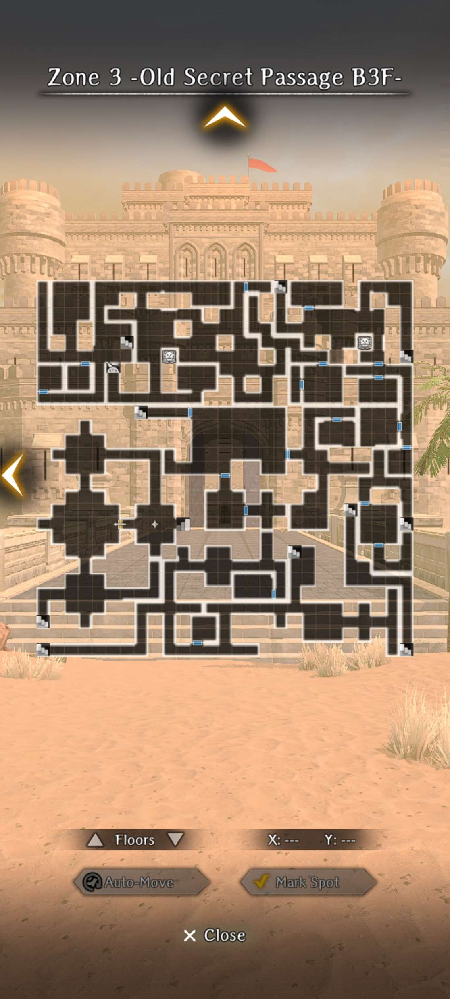
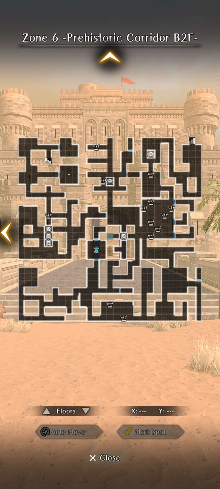
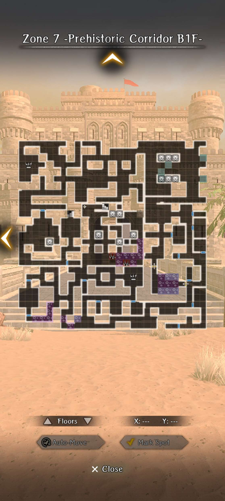
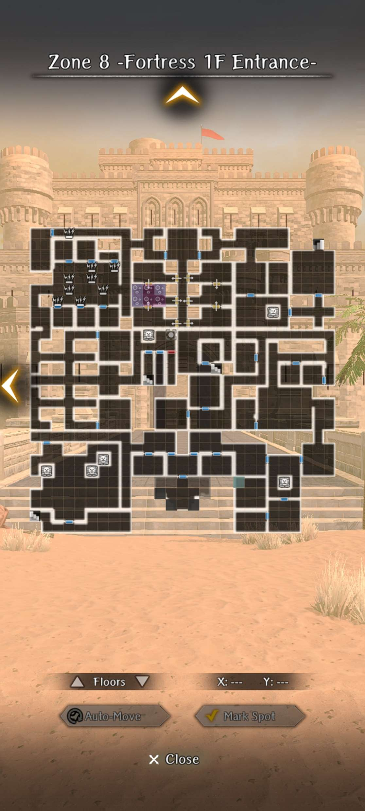
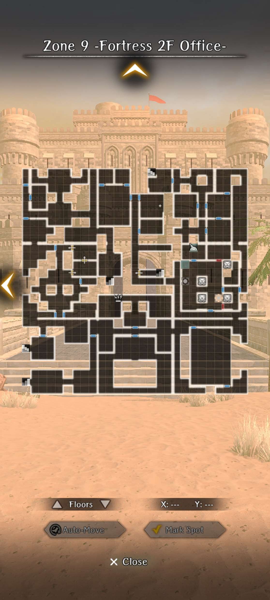
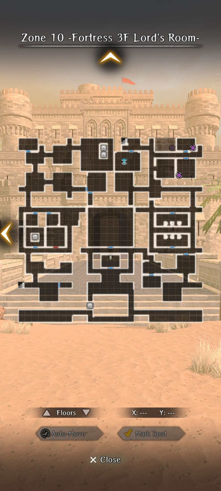
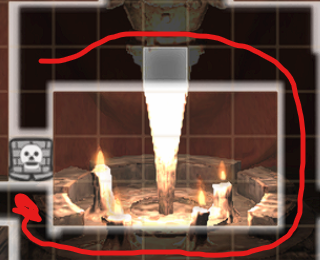

# Guarda Fortress

!!! warning "Under Construction - thank you for your patience"

## Key Mechanics

??? note "Corruption"
    - Corruption is a central mechanic of this Abyss, with major changes depending on the level of Corruption.
    - Corruption is increased when your party enters the sight area of a Corruption Sentry.
    - Corruption cannot be decreased whilst in the Abyss, but can be changed by modifying Causality in the **Cursed Wheel**.

    ??? note "Corruption Effects"
        - **Fortress Appearance:** Slime becomes more prominent with high Corruption.
        - **Quest Availability:** Some quest-lines become unavailable as essential NPCs are driven insane or die as a result of high Corruption. This affects which endings are available.
        - **Monsters:** Different monsters spawn, with stronger monsters at lower Corruption. 
        - **Greater Warped One:** The Greater Warped One is much stronger at lower Corruption, gaining new abilities and increased damage and health.

??? note "Golems"
    - Golems walk forwards when activated, destroying traps, damaged walls, and sentries in their path until they reach a solid wall or door.
    - Golems are only available after defeating the Greater Warped One at least once.

### Saving the Duke

There are three routes to choose for the Gaurda Fortress Abyss:

1. Princess Pulgritte
2. Pontiff Dua Lipa
3. Admiral Avare

You gain access to the Gaurda Fortress area once accepting the "Duke Ixion" request from the **Royal Capital Luknalia** Adventurer's Guild.

!!! note "There may be variations in maps for every zone. General chunks will be the same but may be rotated or located in a different spot"

??? map "Zone 1 -Old Secret Passage B1F-"
    

    ??? note "Enemies"
        - Skeleton Warrior
        - Skeleton Mage
        - Poltergeist
        - Sandman
        - **NEW - Combat Sentry**
        - **NEW - Corruption Sentry**

    ??? note "Combat Sentry"
        - Combat Sentries are dangerous enemy spawns that patrol around the map in short fixed routes.
        - Once spotted, you will be able to see their sight area highlighted in orange on the map.
        - Entering their sight area will cause the sentry to chase your party, however their movement is much slower than regular enemies.
        - These encounters can be challenging for the unprepared party, featuring new enemies such as the Cyclops, and more powerful versions of regular enemies with increased health and damage.

    ??? note "Corruption Sentry"
        - Entering the sight area of a Corruption Sentry will trigger a short cutscene and increase Corruption.
        - See [Corruption](#key-mechanics) for more information about Corruption Sentries.

    ??? note "Walkthrough"
        1. Fight your way through B1F until you pass a Sentry to reach the **Minor Harken**.
        2. Travel south from the Harken and descend the stairs to B2F.

??? map "Zone 2 -Old Secret Passage B2F-"
    

    ??? note "Enemies"
        - Skeleton Warrior
        - Skeleton Mage
        - Combat Sentry: Necromancer and Skeletons
        - Corruption Sentry
        - ?

    ??? note "Walkthrough"
        Navigate your way through the Pit Trap Puzzle to the final area of B3F.

        - This floor is full of hidden pit traps which will drop you into the floor below, B3F.
        - Fortunately this does not deal any damage to your party.
        - You will need to repeatedly trigger these traps to fall down to B3F and find stairs back to B2F.
        - In order to navigate to the exit, follow the paths marked on these maps:

            1. Red
            2. Orange
            3. Drop down the north-west most pitfall trap and follow the Light Blue line to a lever. Hit the Lever to open the Red door that blocks the Light Orange path.
            4. Light Orange
            5. Green

        !!! map "Zone 2 -Old Secret Passage B2F-"
            

        !!! map "Zone 3 -Old Secret Passage B3F-"
            

??? map "Zone 3 -Old Secret Passage B3F-"
    

    ??? note "Enemies"
        - Skeleton Warrior
        - Skeleton Mage
        - Combat Sentry: Necromancer and Skeletons
        - Corruption Sentry
        - ?

    ??? danger "Boss: Necrocore"
        After falling through B2F's final Pit Trap, you will land in the final area of B3F. Take a few steps north and you will encounter the first Boss Encounter of Guarda Fortress Abyss.

        - Race: Undead
        - Abilities: Instant-Death

        This undead horse is a more powerful version of the enemy found in Crucible Mausoleum, carrying a similar array of instant-death skills like "Spear of Doom".

??? map "Zone 4 -Tunnel-"
    

    !!! note
        - The Tunnel is inhabited by (mostly) friendly undead NPCs.
        - Speak to the skeletons to acquire key Knowledge.

??? map "Zone 5 -Prehistoric Corridor B3F-"
    

    ??? note "Enemies"
        - **NEW - Combat Sentry: Cyclops**
        - **NEW - Combat Sentry: Scorpion Queen**
        - Corruption Sentry

??? map "Zone 6 -Prehistoric Corridor B2F-"
    

    ??? note "Enemies"
        - Combat Sentry: Cyclops
        - Combat Sentry: Scorpion Queen
        - ?

??? map "Zone 7 -Prehistoric Corridor B1F-"
    

    ??? note "Enemies"
        - Combat Sentry: Cyclops
        - Combat Sentry: Scorpion Queen
        - ?

    ??? danger "Boss: Doll"
        - Abilities: Charm, Confuse, MP Drain

        The doll is the first real wall of the Guarda Fortress abyss and can be very challenging, as it's purely RNG-based. She attacks twice in each turn, hits hard with single and row target attacks, has a full party charm that drains MP, and casts a confusion that targets three party members at random. She has approximately 11k HP and high evasion, so she's fairly squishy...if you're able to hit her.

        !!! note "Tips"
            - If you've been keeping yourself low level to maximize experience gains, you might consider leveling up to at least 55
            - Buy some scrolls in town for your damage dealers to cast KINAPIC and remove confusion
            - Cast BATILGREF on the doll to lower her evasion and slow her down
            - Stack KINAPIC from scrolls and your priest(s) to give both rows enhanced resistance
            - Remove confusion and charm with your damage dealers via scrolls so your healers can focus on that

??? map "Zone 8 -Fortress 1F Entrance-"
    

    ??? note "Enemies"
        - Combat Sentry: Cyclops
        - Combat Sentry: Scorpion Queen
        - ?

??? map "Zone 9 -Fortress 2F Entrance-"
    

    ??? note "Enemies"
        - Combat Sentry: Cyclops
        - Combat Sentry: Scorpion Queen
        - ?

??? map "Zone 10 -Fortress 3F Lord's Room-"
    
    
    If your corruption level is not too high, you will find the Duke's party on this floor.

    ??? note "Enemies"
        - Combat Sentry: Cyclops
        - Combat Sentry: Scorpion Queen
        - ?

    ??? map "Path to boss"
        In order to reach the boss, you must circle around to the other side of the stone pillar and interact with it. Along the way, you will encounter one mandatory sentry battle and on your first run, you will encounter a second mandatory sentry battle during the dialog prompts.
        
        

    !!! danger
        [Greater Warped One](important-request-gwo.md)

??? map "Catacomb"
    

    ??? note "Solution to Candle Puzzle Door"
        
