# Guarda Fortress

!!! warning "Map Variations"  
    - Some floors have tile variations (shifts and rotations) randomly chosen when you start the abyss, and certain actions can reset the dungeon layout changing the variation you see. Your maps and the location of certain events may not perfectly match these.  
    - Events and items on variable tiles always occur in the same rooms on those tiles even though they may have moved and rotated, so look for similar features. See [Map Variations page](../../mechanics/map-variations.md) for details.  

## Key Mechanics

??? note "Sentries"  

    - There are two types of monsters keeping watch in areas of this Abyss: Combat Sentries and Corrosion Sentries.  
    - All sentries have a sight area in which they can see you. Once you 'see' the Sentry, their sight area will be shown in red on your minimap.  
    - Once a Sentry triggers if you enter their sight area, the effect will depend on the Sentry type.  
    - Corrosion Sentries are generally fixed in location and sight area. See "Corrosion" below for the effect of getting seen by a Corrosion Sentry.  
    - Combat Sentries cover or moving patrol area and their moving sight area shown on your minimap. You can trigger multiple Combat Sentries at once if their sight areas overlap.  
    - A Combat Sentry will pursue you and attack if they spot you.  Like most monsters, they have a set pursuit range after which they will return to their normal position/path.  
    - <em><b>Combat Sentries are meant to be avoided, not fought.</b> By watching and timing their paths and moving sight areas, it is possible to avoid fighting any Sentries in Abyss 3</em>.  
    - Avoiding many sentries requires timing and sometimes deliberately triggering and running away from a Sentry so that you can get around it while returning to its normal path. The player can move faster than Sentries whether triggered or untriggered and sometimes you can just run right past them.  
    - Be careful trying to use 'Auto-move' to pass Sentries, as the game's chosen auto-path can sometimes be unpredictable and take you right into their path.  
    - Combat Sentries can be a variety of monster types, but will be much more powerful than the same type of monster encountered as a normal wandering monster.  See type descriptions with each map below.  
    - As of June 2026, it is possible to attempt to flee from a fight with a Combat Sentry. Reports are that fleeing has a low success rate, and failed attempts do lose a character turn.  
    - Be aware both fleeing from a Combat Sentry and getting killed by one in battle and Rising Again can result in unexpected dungeon placement for you and the Sentry, who will often still be triggered and pursue you again.  
    - Ranger traps: Most Sentries after Zone 4 are Large creatures, making Bear Traps ineffective in freezing a Combat Sentry.  A Log trap may move and alter the path of a Combat Sentry, which could possibly be a useful tool for navigation past them except reports of effectiveness are mixed (especially with a Triggered Sentry).  
    - Farming Sentries can be a high Experience activity once you're powerful enough to do it.  

??? note "Corrosion"  
    - Corrosion is a central mechanic of this Abyss, with major changes depending on the level of Corrosion.  
    - Corrosion is increased when your party enters the sight area of a Corrosion Sentry.  
    - Corrosion cannot be decreased whilst in the Abyss, but can be changed by modifying Causality in the **Cursed Wheel**.  

    ??? note "Corrosion Effects"  
        - **Fortress Appearance:** Slime becomes more prominent with high Corrosion.  
        - **Quest Availability:** Some quest-lines become unavailable as essential NPCs are driven insane or die as a result of high Corrosion. This affects which endings are available.  
        - **Monsters:** Different monsters spawn, with stronger monsters at lower Corrosion.  
        - **Greater Warped One:** The Greater Warped One is much stronger at lower Corrosion, gaining new abilities and increased damage and health.  

        ??? note "How to tell Corrosion level based on the Duke's room:"  
    
            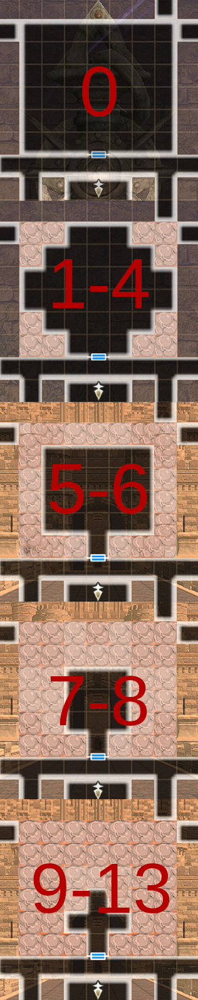  

??? note "Golems"  
    - Golems walk forwards when activated, destroying traps, damaged walls, and sentries in their path until they reach a solid wall or door.  
    - Golems are only available after defeating the Greater Warped One at least once.  

## Maps

As is Abyss 2, there are three request choices to choose from for the Gaurda Fortress Abyss:  

1. Princess Pulgritte  
2. Pontiff Leaufonde  
3. Admiral Avare  

You gain access to the Gaurda Fortress town once accepting one of those "Duke Ixion" requests from the **Royal Capital Luknalia** Adventurer's Guild.  

??? map "Entrance Area"  
    pending  

??? map "Zone 1 -Old Secret Passage B1F-"  
    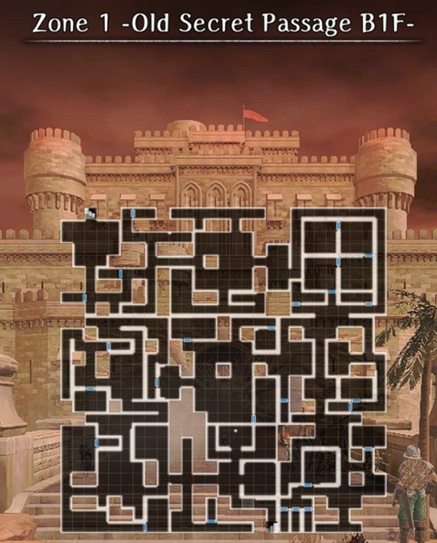

    ??? note "Sentry Types"
        - Combat Sentry: Necromancer and Skeletons  

    ??? note "Combat Sentry"
        - Combat Sentries are dangerous enemy spawns that patrol around the map in short fixed routes.  
        - Once you see them, you will be able to see their sight area highlighted in orange on the map.  
        - Entering their sight area will cause the Sentry to chase your party, however their movement is much slower than regular enemies.  
        - These encounters can be challenging for the unprepared party, as they are more powerful versions of regular enemies with increased health and damage.  

    ??? note "Corrosion Sentry"  
        - Entering the sight area of a Corrosion Sentry will trigger a short cutscene and increase Corrosion.  
        - See [Corrosion](#key-mechanics) for more information about Corrosion Sentries.  

    ??? note "Walkthrough 1st Run"  
        1. Fight your way through B1F until you pass a Sentry to reach the **Minor Harken**.  
        2. Travel south from the Harken and descend the stairs to B2F.  

    ??? note "Walkthrough 2nd Run and onwards"  
        1. You can use the golem nearby to block the view of the Sentry.  
        2. Continue as usual.  

??? map "Zone 2 -Old Secret Passage B2F-"  
    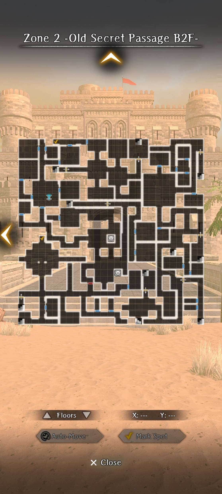  

    ??? note "Sentry Types"  
        - Combat Sentry: Necromancer and Skeletons  

    ??? note "Walkthrough 1st Run"  
        Navigate your way through the Pit Trap Puzzle to the final area of B3F.  

        - This floor is full of hidden pit traps which will drop you into the floor below, B3F.  
        - Fortunately this does not deal any damage to your party.  
        - You will need to repeatedly trigger these traps to fall down to B3F and find stairs back to B2F.  
        - In order to navigate to the exit, follow the paths marked on these maps:  

            1. Red  
            2. Orange  
            3. Blue  
            4. Green  

        - The lever must be activated at the end of the Orange route to continue on the blue path.  
        - The Harken is after the boss at the end of the Green route.  

        !!! map "Zone 2 -Old Secret Passage B2F-"  
            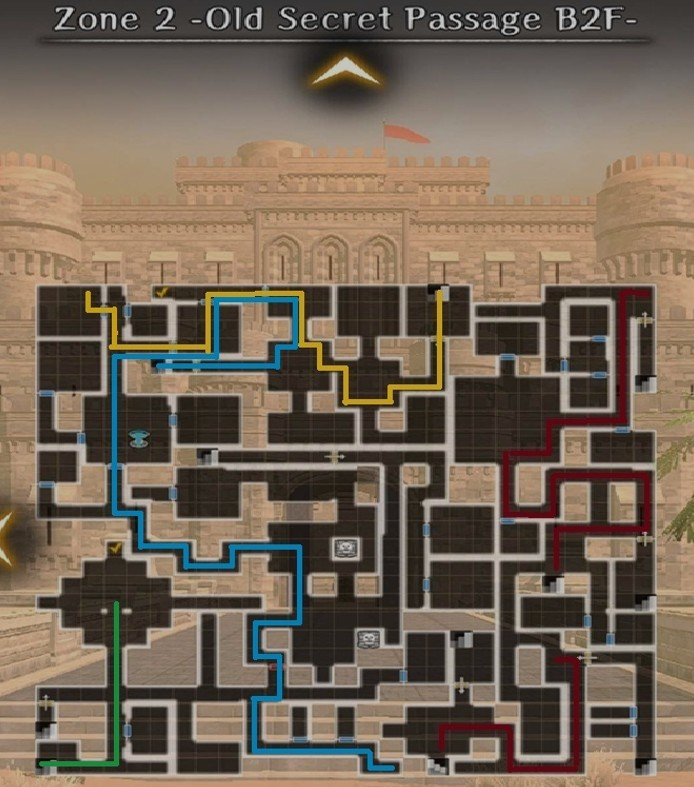  

        !!! map "Zone 3 -Old Secret Passage B3F-"  
            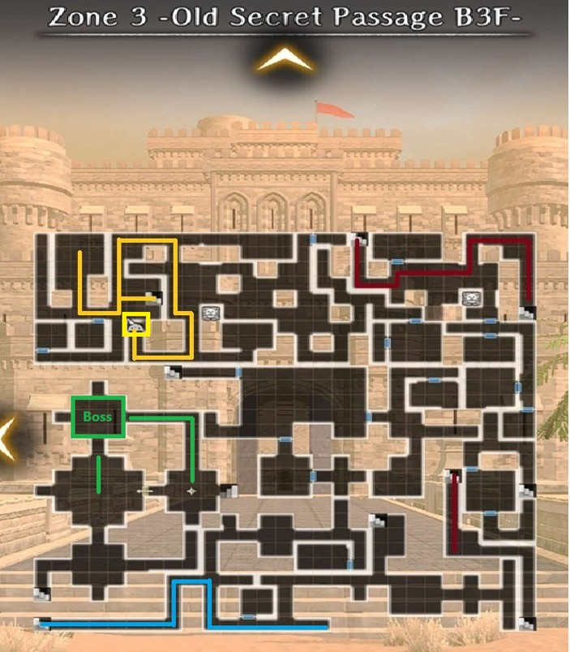  

    ??? note "Walkthrough 2nd Run and onwards"  
        1. This will be about the same, except the golems can be used to block the Corrosion Sentry's line of view. The top golem is optional but the bottom golem is necessary to block the view of the sentry in the way.  
        2. Continue as usual.  

??? map "Zone 3 -Old Secret Passage B3F-"  
    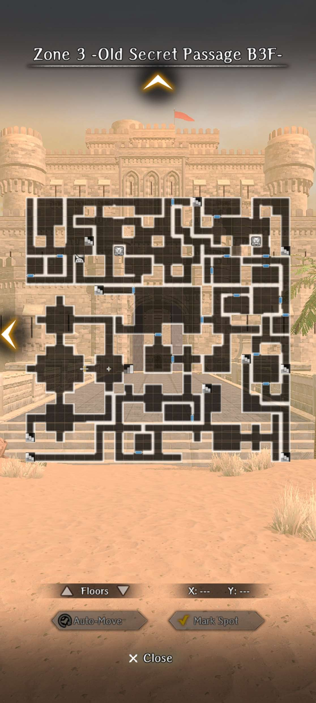  

    ??? note "Sentry Types"  
        - Combat Sentry: Necromancer and Skeletons  

    ??? danger "Boss: Necrocore"  
        After falling through B2F's final Pit Trap, you will land in the final area of B3F. Take a few steps north and you will encounter the first Boss Encounter of Guarda Fortress Abyss.  

        - Race: Undead  
        - Abilities: Instant-Death  

        This undead horse is a more powerful version of the enemy found in Crucible Mausoleum, carrying a similar array of instant-death skills like "Spear of Doom" as well as Mazelos and multi-ally targeting spear attacks.  

    ??? note "Walkthrough 1st Run"  
        - See Zone 2 Walkthrough 1st Run.  

??? map "Zone 4 -Tunnel-"  
    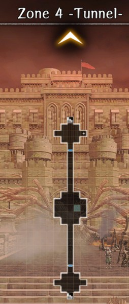  

    ??? note "Walkthrough"  
        - The Tunnel is inhabited by (mostly) friendly undead NPCs.  
        - Speak to the skeletons to acquire key Knowledge.  

??? map "Zone 5 -Prehistoric Corridor B3F-"  
    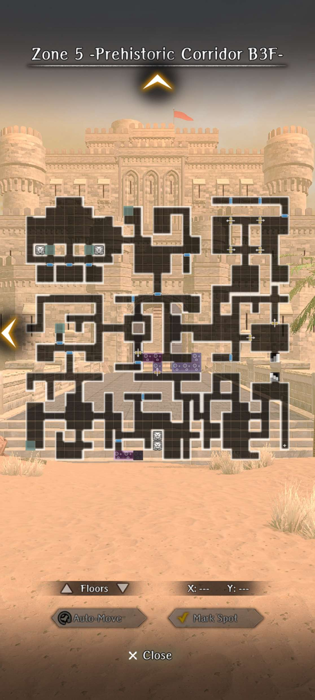  

    ??? note "Sentry Types"  
        - Combat Sentry: Cyclops + 2-3 Banshees  
        - Combat Sentry: 2x Minotaurs + 1 Chimera  
        - Combat Sentry: Scorpion Woman + (3 Chimeras or 2 Banshees)  
        - Combat Sentry: Necrocore + 3-6 Poltergeists  

    ??? note "Walkthrough 1st Run"  
        - Upon returning from this floor to town, the slum faction request will become available.  
        - It should be a straight shot to the end of this floor. There is no need to enter through any one-way doors past the first room of this floor. There will be a lot of sentry patrols around the end of the floor, so be cautious about maneuvering as you get closer to the end.  

    ??? note "Walkthrough 2nd Run and onwards"  
        1. There is only 1 golem that is needed to be pushed in this map, and it's the bottom one of the two at the bottom of the map.  
        2. Continue on as usual.  

??? map "Zone 6 -Prehistoric Corridor B2F-"  
    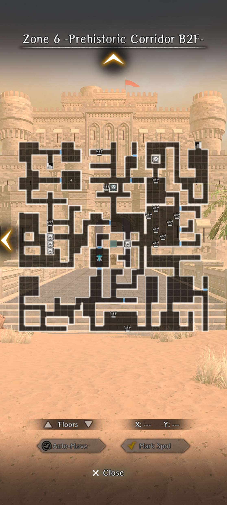  

    ??? note "Enemies"  
        - Combat Sentry: Cyclops + 2-3 Banshees
        - Combat Sentry: Scorpion Queen + (3 Chimeras or 2 Banshees)
        - Combat Sentry: 2x Minotaurs + 1 Chimera

    ??? note "Walkthrough 1st Run"
        - There are three paintings on this floor that give key knowledge. The painting at the very end will not be available to view until the second run onwards.  
        - Alarm traps are introduced on this floor. Generally, they just spawn 1 or 2 hostile enemies nearby, but they can be easily avoided. The very last alarm trap on the floor before the Cross Intersection will spawn a Corrosion Sentry that is unavoidable on the 1st Run.  
        
    ??? note "Walkthrough 2nd Run and onwards"
        1. The concept of crushing alarm traps is introduced in this map. You need to crush the alarm trap near the end to prevent it from spawning the Corrosion Sentry.  
        2. Remember to view the painting near the end of the map.  

        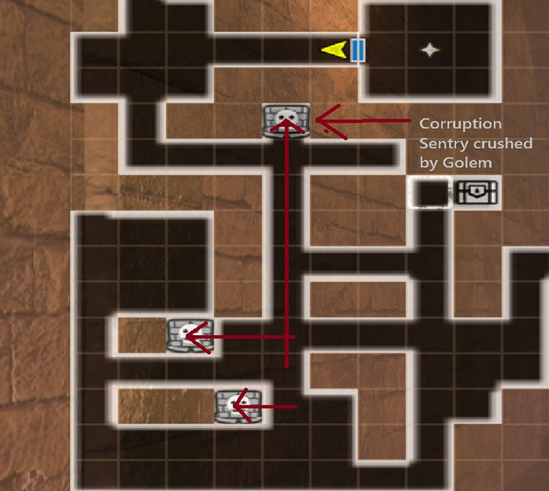

    ??? note "Painting Locations" 

        
        *Note: Requires a low Abyss corrosion level to remove the gunk on the walls.  

??? map "Zone 7 -Prehistoric Corridor B1F-"
    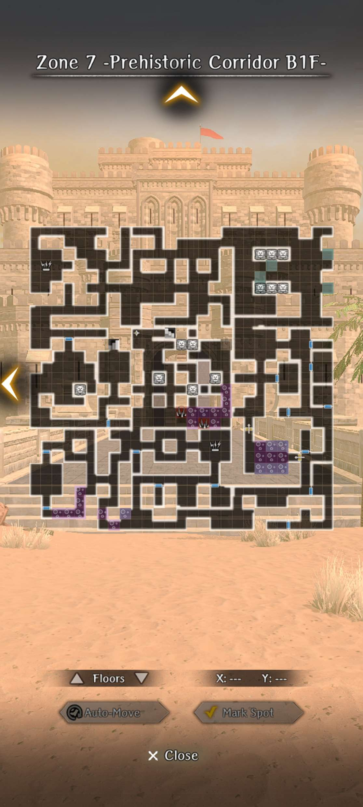

    ??? note "Enemies"
        - Combat Sentry: Cyclops + 2-3 Banshees  
        - Combat Sentry: Scorpion Queen + (3 Chimeras or 2 Banshees)  
        - Combat Sentry: 2x Minotaurs + 1 Chimera  

    ??? note "Walkthrough 1st Run"
        - A somewhat difficult floor due to being a battle of attrition in saving resources to fight the floor boss. There is no need to enter any one-way doors and it's not necessary to step on any poison tiles on the first run through.  

    ??? note "Walkthrough 2nd Run and onwards"
        1. The concept of crushing sentries is introduced on this map. You will need to do so to pass by the Corrosion Sentry in the room with 6 Golems in two parallel lines.  
        2. Near the end, you can skip the Doll boss entirely by crushing them with a Golem.  

        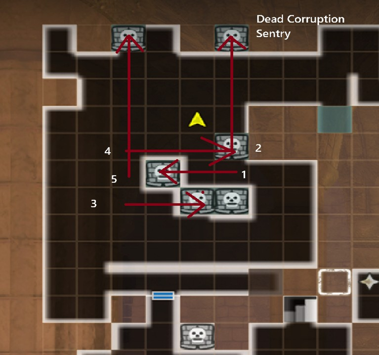
        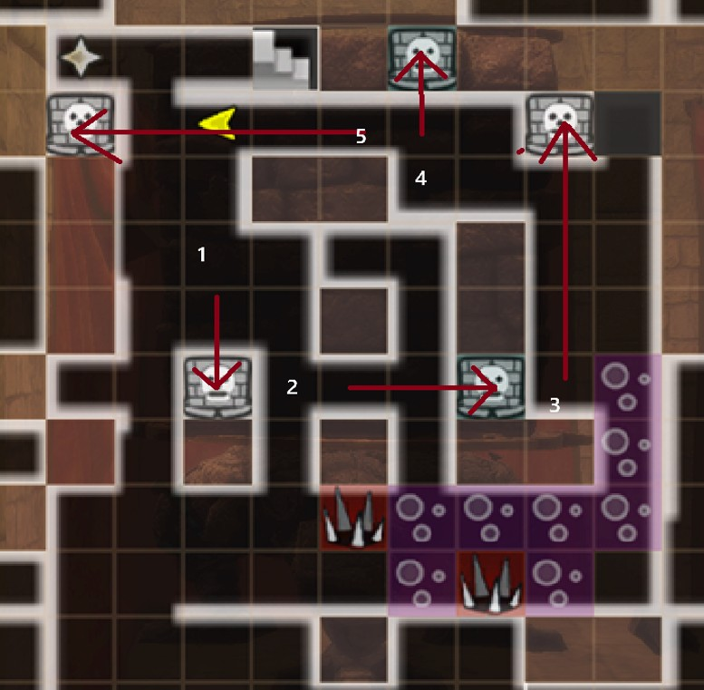

    ??? danger "Boss: Doll"  

        === "Overview" 
        
            - Stats
                - HP: 11K
                - Abilities: Party-wide Charm that drains MP, Confusion on 3 randomly-selected targets, ST physical attack
                - Very high EVA
                
            - Strategy
                - Doll is the first real progression gate for most players in Abyss 3. Charm and confuse are nasty status effects and she is difficult to hit. Fortunately, she has very low HP.   
                - Recommend you level up your units to at least 55-60 so you have access to Full Power Strike (Fighters) and Knight's Defense.  
                - Put multiple Scrolls of Sedation (Item Shop) on all of your DPS units to cast Reilis to remove charm or confusion.  
                - Cast Batilgref to lower her EVA and ASPD.  
                - Kinapic can be stacked if you use both the spell and scroll (Item Shop) for additional status resistance.  
                - You want to make sure that your Priests/Mages move first so they can start a status clearing chain with Reilis or Sedation Scrolls. It is also less deadly if they are confused or charmed and attack before your other units.  
                - Removing everyone's equipment in advance is also viable. Equipping gear does not consume a unit's action and cuts down on the chance you will 1-shot your own units.  
                - The general rhythm of the battle is to clear status effects immediately (or kill the unit for a free clear) and use your hardest hitting DPS attacks. The danger with using FPS is that the attack gets canceled if Charm or Confuse lands.  
                - It also does not hurt to give your DPS units Dios and/or Madios and a 2H staff in their inventory for emergency healing if your healers cannot keep up.  
                
        === "Status Tolerance 101"  
        
            - This is the first fight in the game were stacking status tolerance gear and understanding the Fortitude system is important. Read about it in detail [here](https://wizardry.fasterthoughts.io/mechanics/traits-and-stats/#resistance).  
            - Do -not- fight the Doll when you have under 51 Fortitude as your status tolerance resistance incurs a massive penalty.  
            - Kinapic is a useful spell, but to truly increase your resistance against status tolerance you need to rely on equipment, bondmates, etc.  
            - Tip! You can tell if a unit (or enemy) is 100% immune to a status effect if the "MISS" does -not- show up when the spell or skill is used on them.  
            - The equipment list below can help your team reach near immunity against Doll because requires a fair amount of grinding. It is easiest to put 1-2* copies of gear on your support units as long as they can maintain high ASPD.  
            - Charm and Confuse Equipment 
                - Format - Name: # Tolerance (Farming Location)  
                - Circlet: 30 Tolerance (Abyss 3)  
                - Light Helmet of Separation: 20 Tolerance (Cave of Separation)  
                - Light Gauntlets of Separation: 20 Tolerance (Cave of Separation)  
                - Heat-Haze Light Armor Boots: 20 Tolerance (Sand Shadow Cave)  
                - Mauve Shield: 30 Tolerance (Cave of Flowers)  
            - Bondmates
                - Gigi: 10 at Level 1 (Abyss 2); cannot be raised further.  
                - Bibi and Eugen: 27 at Level 5 (Abyss 3).  
            - Synergies
                - Clarissa provides a flat 50 Tolerance to all adjacent Neutral units.  
            - Unique Discipline  
                - Both Lana and Abenius gain additional tolerance at higher discipline levels.  
        

??? map "Zone 8 -Fortress 1F Entrance-"  
    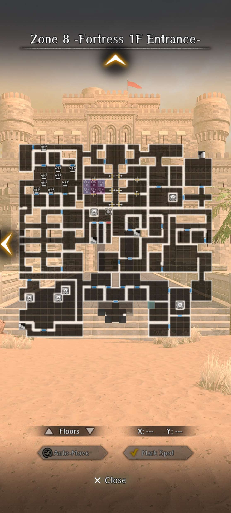

    ??? note "Sentry Types"  
        - Combat Sentry: Cyclops + (2 Succubus + 1 Vampire or 1 Minotaur + 1 Succubus)  
        - Combat Sentry: 2 Vampires + 2 Succubus  
        - Combat Sentry: 1 Greater Demon + 1 Minotaur  

    ??? note "Walkthrough 1st Run (1st Half from Zone 8 to 9)"  
        1. From this point onwards, there are no rest points until the Zone 9 Harken is reached. However, it is not as simple as walking from Zone 8 to Zone 9. It will be a walk from Zone 8 to Zone 10 and then falling down to the Zone 9 Harken. There is no need to walk through one-way doors.  
        2. Luckily, you won't need to explore a whole floor each time but rather just small portions of each floor. It is recommended however to carry a lot of consumables before continuing, as the Sentries on this floor are a lot stronger than previous floors.  

    ??? note "Walkthrough 1st Run (2nd Half from Zone 9 to Zone 8 back to Zone 9)"  
        - You will drop down and the nearby door is blocked by corrosion. Ignore this for now and continue onwards. You're forced to pass by a Corrosion Sentry in the bottom left of the map.  

    ??? note "Walkthrough 2nd Run and onwards (1st Half from Zone 8 to 9)"  
        - There is not much difference from the 1st run, you simply walk through as usual. There will be a demonstration of using the Right Hand Reversal mechanic to use Golems to step on buttons near the end of this half.  

    ??? note "Walkthrough 2nd Run and onwards (2nd Half from Zone 9 to Zone 8 back to Zone 9)"  
        1. When dropping down this time, the room that was previously blocked by corrosion is now open. You must go into this room to obtain the request for saving Liam. There is also a rag in this room that triggers a Corrosion Sentry if obtained, but is necessary for saving Liam unharmed. You can Cursed Wheel away the corrosion stack from this encounter.
        2. In addition, you can use the Right Hand Reversal mechanic to bypass the Corrosion Sentry in the bottom left of the map.  

        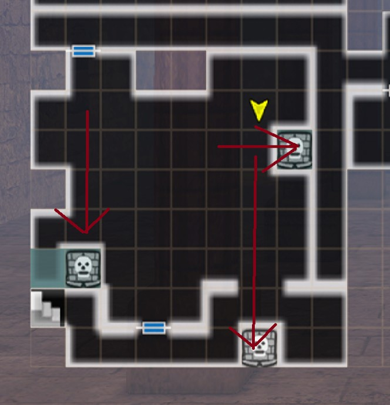

??? map "Zone 9 -Fortress 2F Entrance-"  
    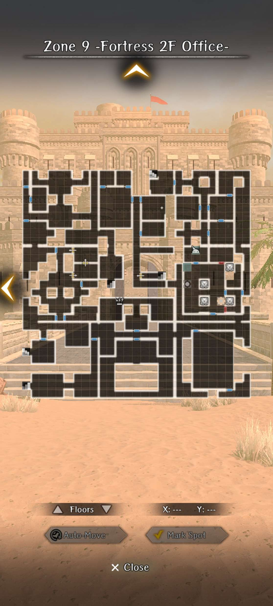

    ??? note "Enemies"  
        - Combat Sentry: Cyclops + (2 Succubus + 1 Vampire or 1 Minotaur + 1 Succubus)  
        - Combat Sentry: 2 Vampires + 2 Succubus  
        - Combat Sentry: 1 Greater Demon + 1 Minotaur'  

    ??? note "Walkthrough 1st Run (1st Half from Zone 9 to Zone 10)"  
        - There may be a room that will lock behind you on this floor. There is a rotating sentry and Corrosion Sentry inside. You will need to get seen by the Corrosion Sentry to access the door with the switch that opens the door out of this room. Otherwise it will be straightforward.  

    ??? note "Walkthrough 1st Run (2nd Half from Zone 8 to Zone 10)"  
        - Similar to the 1st Half depending on map generation.  

    ??? note "Walkthrough 2nd Run and onwards (Both Halves)"  
        - The trap room that previously locked you in with a Corrosion Sentry can be solved now. This room may show up on either half of this floor.  

        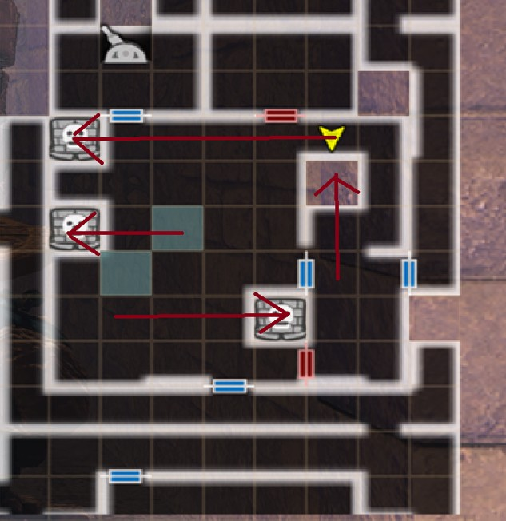  

??? map "Zone 10 -Fortress 3F Lord's Room-"  
    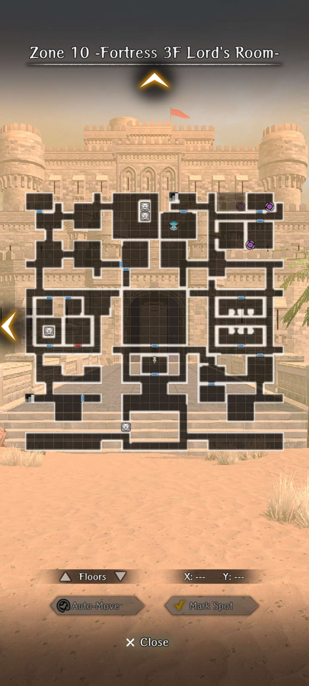  
    
    If your Corrosion level is not too high, you will find the Duke's party on this floor.  

    ??? note "Enemies"  
        - Combat Sentry: Cyclops + (2 Succubus + 1 Vampire or 1 Minotaur + 1 Succubus)  
        - Combat Sentry: 2 Vampires + 2 Succubus  
        - Combat Sentry: 1 Greater Demon + 1 Minotaur  

    ??? note "Walkthrough 1st Run (1st Half Zone 9 to Zone 10 to Zone 9)"  
        - It's a relatively chill walk to the top middle room. You are forced to trigger a Corrosion Sentry while passing by. Upon reaching the top middle room, you'll need to drop down via a hole on the bottom left of the room. This drop you into the sight of the Corrosion Sentry, but right outside of the Zone 9 Harken.  

    ??? note "Walkthrough 1st Run (2nd Half Straight to the Duke)"  
        - There is a fountain to heal up at before heading to the final room. There are a lot of sentry patrols on this floor, but they can all be avoided by carefully tailing behind them. The statue rooms are not relevant on the 1st run but can be used to hide from the sentries if you get seen. After arriving at the final room, you can begin the GWO fight by interacting with the lever further down from the room.  

    ??? note "Walkthrough 2nd Run and onwards (1st Half Zone 9 to Zone 10 to Zone 9)"  
        1. The Corrosion Sentry in this path can be avoided now. You will need to do the puzzle that is initiated by pushing the golem in the room nearby through the wall. There will be a skeleton on the floor that needs to be interacted with, which will then spawn a doll and map on the floor nearby. The map will mark 3 locations on the previous two floors that you will need to backtrack to in order to pick up wind-up keys for the doll automaton. The 3 locations will always be the same regardless of map configuration. After obtaining 3 wind-up keys, return to the doll in the Zone 10 room and interact with it. Afterwards, walk to the tile right outside of the Corrosion Sentry's sight.  
            - Zone 9: X:7, Y:12  
            - Zone 8: X:4, Y:9 | X:7, Y:19  
        2. In the room before dropping down to the Corrosion Sentry, you can open a different hole with a Golem so you don't get seen.   

            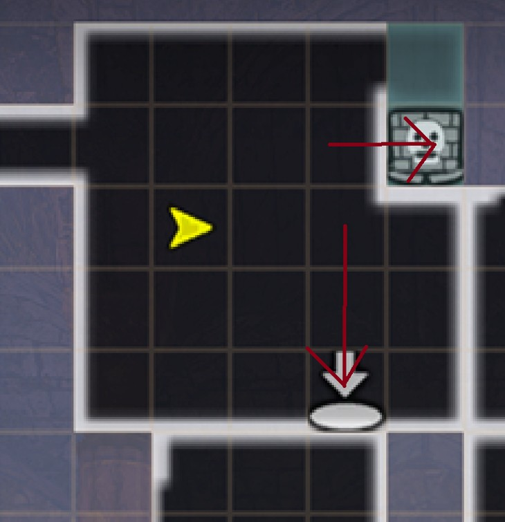

    ??? note "Walkthrough 2nd Run and onwards (2nd Half straight to the Duke)"  
        - It's generally the same this time. Depending on which ending run you are there may be different things to do though. You don't need to interact with the Lever this time and can just walk directly to the ramparts of the castle.  
        
    ??? map "Path to boss"  
        In order to reach the boss, you must circle around to the other side of the stone pillar and interact with it. Along the way, you will encounter one mandatory sentry battle and on your first run, you will encounter a second mandatory sentry battle during the dialog prompts.  
        
        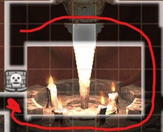

    !!! danger  
        [Greater Warped One](important-request-gwo.md)  

??? map "Catacomb"
    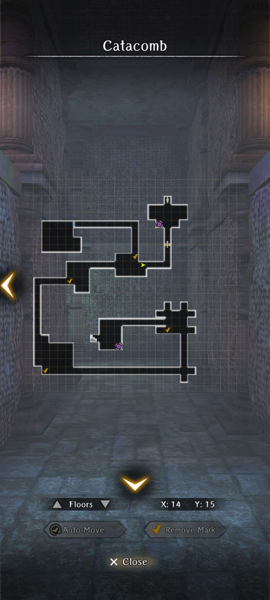  

    ??? note "Solution to Candle Puzzle Door"
        
