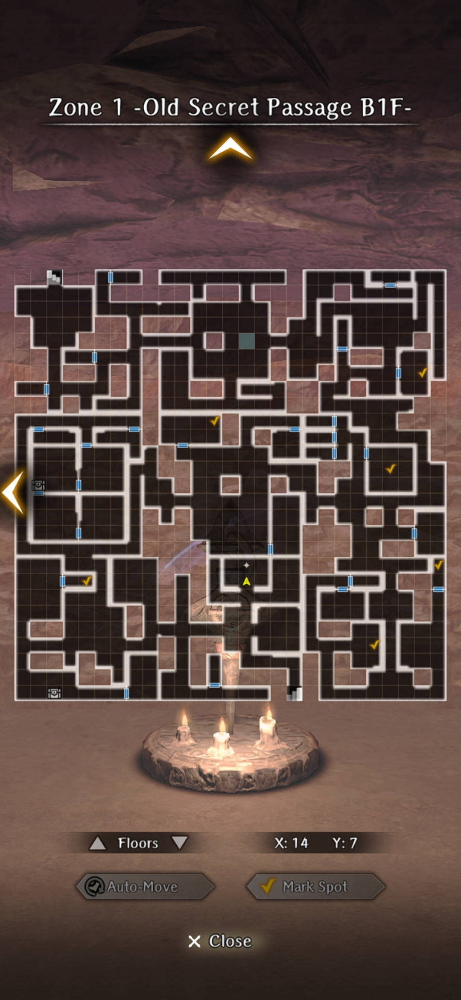
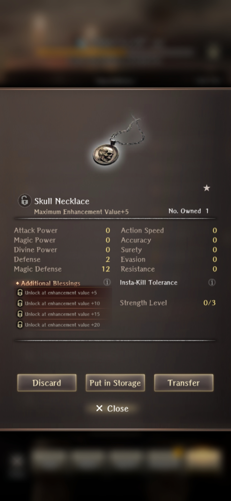
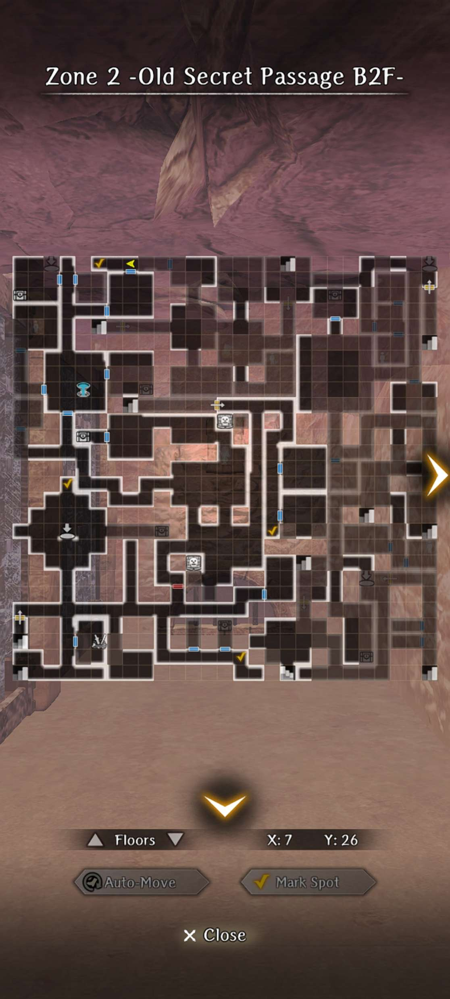
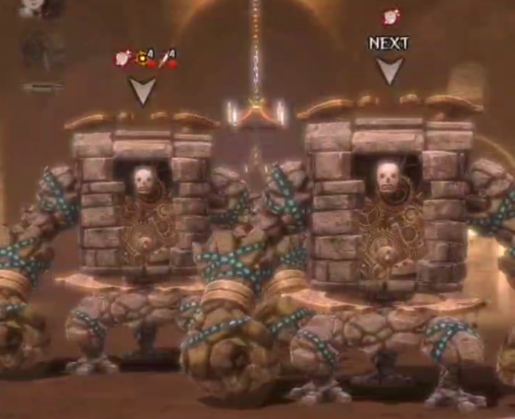

# Impregnable Fortress

## Request to Rescue the Duke

### Search for the Missing Girl

!!! note "This request is integral to the main story, and is available at the very start of Abyss 3 once the knowledge is obtained, but cannot be completed until Zone 8 is reached."

??? note "Requirements"
    - Finish first run of Abyss 3 (you get stabbed)
    - Obtain knowledge of Lily and Alan (Talk to them after defeating the GWO in 1st run, when you can limp around talking to people) OR talk to NPC on Zone 9 on low corruption.
    - Subsequently enter servant's room on low corruption, which is located right after you drop down at the end of the hallway from the Zone 9 Harken. Get the information on the table, and optionally the tattered rag (you may cursed wheel the corruption away if you'd like)

##### Rescuing the little girl in Critical Condition (No dog)

1. Select the 55 gold option when posting the request, or select the 1550 gold option but not having the tattered rag on you.
2. Talk to everyone in Guarda for information. It is crucial to talk to the innkeeper.
3. You will be led to the Royal Capital, namely the outskirts. Only the NPCs with bags are necessary to interact with.
4. You will be led back to Guarda, where you need to find the individual with a crate outside the Well entrance to the Abyss.
5. Returning to town will give a cutscene of the innkeeper telling you where the kidnappers are. You will immediately be thrown into a fight after with various thieves and 2 mages.
6. Talk to Raimi at the tent. You will need to remember to talk to Lily and Alan in the Duke's room later to show them the child is safe (this is a lie).

##### Rescuing the little girl in Critical Condition (Dog)

1. Select the 1550 gold option when posting the request and having the tattered rag.
2. The 1st option when talking to the dogkeeper is not important, but the second option is. Ask him what you need to get for the dog.
3. Get 10 meat directly from an NPC in Guarda.
4. Get to the wheat room in Zone 8. You need low corruption for the door to not be blocked. There will be a battle with Succubi.
5. Obtain the rights to the dog on return to Guarda. Remember that the innkeeper was the one who told you about the kidnappers, so head there.
6. Thrown into the fight again with various thieves and 2 mages. Dog dies from getting kicked and little girl is not doing so well.
7. Talk to Raimi at the tent. Once again, remember to talk to Lily and Alan in the Duke's room later to show them the child is safe (this is a lie again).

??? map "Location of Wheat Room"
    

##### Rescuing the little girl safely

!!! warning "As of patch 1.4.0, there is a bug where saving the little girl does not unlock her bondmate if done on True ending because the parents are missing"

1. You must have rescued the girl before in critical condition with the dog.
2. On the second option, tell him you already know what you need for the dog, "All Right"
3. Get 5 meat directly from an NPC in Guarda. Obtain wheat from the room in Zone 8. Battle with Succubi.
4. Return to town, get the dog, and head to the inn.
5. This time however, the dog and little girl are safe.
6. Talk to Knight Commander at the tent this time. Remember to talk to Lily and Alan in the Duke's room later to show them the child is safe (true this time).
7. Talk to the couple after defeating the GWO to obtain "Kidnapped Girl Liam" as a bondmate, who is a water element bondmate that gives Stun Tolerance.

### Blackmail Resolution

!!! note "This request is integral to the main story, and is available at the very start of Abyss 3 once the knowledge is obtained, but cannot be completed until Zone 9 is reached."

??? note "Requirements"
    - Defeating the Gatekeeper after rescuing the child in any condition
    - Tale of Bordaon 1 and Tale of Bordaon 2 knowledge from talking to the skeletons in Zone 4.

- Talk to the maid at the Entrance to the Abyss
- Follow her to the temple and answer her questions correctly with the knowledge you have.
- Accept the request made by Dalian's wife. The conversation options with her are not important.
- Get more information at the Tavern, which leads you to the Royal Capital outskirts again. The Boss will be near the entrance. You must NOT take the harken around or the conversation will not trigger properly. You can choose to pay the adventurers off or fight them (They are somewhat annoying as the thief can apply critical poison)
- Win or Lose the gambling event (it is rigged). You will engage in a fight afterwards. Obtain a mask and key.
- Turn in the request and then with the key, head to the room next to Floor 9 Harken. Explore the room for evidence
- Talk to Dalian in the Duke's Room (don't forget Alan and Lily), and proceed to defeat the GWO for the good ending.
- Head to the Tavern afterwards to obtain "Guardian Knight Dalian" as a bondmate, who is a earth element bondmate that gives Defense Power.

## Infiltrating the Fortress

## Hidden Passage

## Secret Passage Minor Harken

### Putting Evil Spirits to Rest

- Go to Zone 1, preferably via Harken as it's faster. 
- The encounters will not be marked on the map, but can be seen on the minimap as stationary enemies. Encounters have 2 to 5 poltergeists
- After the 3rd and 4th encounters, your entire party will be paralyzed
- After the 5th encounter, your entire party will be critical poisoned
- After defeating the 6th encounter you receive a Lily of Eternity (sells for 92,000 gold)

??? note "Tips"

    - Bring Scrolls of Purification. All poltergeist encounters are in a single line and can be instakilled with MAREIN.
    - Use CORTU to survive the MA- spells they throw out.

??? map "Locations"
    

??? note "Reward"
    

## Enshadowed Well of Life

### Bodyguard for Ruins Exploration

!!! warning "This request cannot be fully completed until the second run of Abyss 3, after the main character learns the right hand technique for this abyss."

- Pick up the brick connoisseur at the tavern upon taking the request.
- Go to **Zone 2 -Old Secret Passage B2F-** to begin. It is faster to take the Zone 3 Harken and take the stairs up to Zone 2.
- There will be 4 locations where you need to fight varying amounts of Sand Apparitions. The brick you need to interact with will be right next to the fights.
- Return to tavern and watch him get arrested for trespassing if you have discovered all 4 brick types.

??? map "Locations"
    

    ??? note "Enemies"
    - Middle Left marker - 4 total Sand Apparitions. 2 front, 2 back
    - Bottom Middle marker - 8 total Sand Apparitions. 3 front, 3 middle, 2 back
    - Middle Middle marker - 1 total Sand Apparition. (This is the inaccessible brick on 1st run of Abyss 3)
    - Top Left marker - 2 total Sand Apparitions.

??? note "Rewards"
    If obtaining all 4 brick types + returning to tavern, obtain "Enthusiastic Carpenter Hans" as a bondmate, who is an earth element bondmate that gives Resistance.

??? note
    If you rerun this request, Lulu will give you the option of telling him he is going to get arrested at the tavern. Doing so will not grant the bondmate, but Hans will give you a Crimson Lustrous Ore (9000g) for your troubles.

## Secret Path Keeper Vanquished

## Fortress Basement Arrival

### Forbidden Area Search Escort

- Pick up Endy at the Tavern upon taking their request
- Head to **Zone 3 -Old Secret Passage B3F-** via Zone 3 Harken and take the stairs up and then the stairs nearby down for ideal pathing.
- Encounters are already marked on the map as "people" to talk to. You will be asked a trivia question and then be sent into an easy fight if the question is answered correctly.
- Upon finishing the third encounter, you may choose to listen in or not on the conversation. Your choice here does not matter with regards to the reward.
- You will automatically be sent back to town and will be asked a question by Endy. The correct answer to Endy's final question is "Nothing is more precious than life".

??? map "Locations"
    

??? note "Answers to the Old Man's questions"

    - MAERLIK
    - Guarda
    - Luknalia
    - Confusion
    - Bugs
    - MORLIS
    - Level drain
    - Opening the gate
    - Spells become stronger

    !!! note
        If you answer one of the old mage’s trivia questions wrong, the summoned opponents are much tougher than if you answer correctly. You can still get the bond with a wrong answer.
        You can also restart the quest without wheeling around by returning to the adventurer’s guild, abandoning the request and then taking it again. 

??? note "Rewards"
    - Finishing all 3 encounters will grant 2 random Abyss 3 junk.
    - If Endy's final question is answered correctly, obtain "Endy the Mage" as a bondmate, who is a fire element bondmate that gives Evasion.

### Old District (Slum) Faction Quests

Upon reaching Zone 4's Harken and returning, you will receive a message from the respective faction to return to the Royal Capital to receive a request, all of which take part in a slum and then immediately a cave. Normally, the reward for all of them are just gold, but upon doing them all correctly, not only do you receive more gold in general but also receive a LUK lantern if all are done perfectly.

##### Royal Family Route (Perfect Run)
- Get briefed on the mission at the Royal Capital by accepting the request at the Tavern.
- Go to the slums and talk to everyone. Take the little girl with you for Elmon to clean up. Disagree with Princess Pulgritte.
- Leave to West Cave to gather food for the slums. 
- It does not matter where you get the meat or if you go over the necessary meat (3, Lulu will inform you when you have enough), but if the head Gorgon is too difficult, you may kill the random Gorgon around the cave or walk around the head Gorgon and farm meat from the dead ones through a crack in the wall.
- Return to the slums to receive your gold reward after the cutscene.

??? map "Locations"

##### Pontiff Route
- Get briefed on the mission at the Royal Capital by accepting the request at the Tavern.
- Go to the slums and talk to everyone.
- Head to the Cursed Cave and make your way around talking to NPCs that show up on the map. There are only 2 Heretics in the entire cave.
- The two people that lured people in with spike traps are Heretics, you must select the option that they are. Win the fight against them.
- The next Heretic is the Carpenter-looking NPC who killed someone at the start of the cave. Look for them and they will automatically be declared a heretic since they turn into a warped one. Win the battle.
- Choose to "Investigate Ted" after the battle and head back to the Slums. It is advised to heal before going to this fight. This fight will also be signfiicantly easier with a Ninja with lvl 2 Dissipation.
- Upon confronting the one-legged NPC named Ted and declaring him a Heretic, you will go into a fight with Ted in the backline and several random NPCs in the frontline. They all hit relatively hard, especially Ted himself casting AOE magic. The main gimmick of the fight though is that he casts defense magic on everyone that make physical damage useless for 12 turns. If you do not have a ninja, it will be a battle of attrition where it's preferred to bring 1-2 healers, 1 mage, and have frontline defend.
- Leave the slums to receive your gold reward after the cutscene.

!!! note "If you do not have a mage, you can also farm LA- level spell scrolls from the Greater Demon that spawns in Abyss 1 after completing the B8F request"

??? map "Locations"

##### Admiral Route

- Get briefed on the mission at the Royal Capital by accepting the request at the Tavern. You will need to collect 3 orphans for the Admiral.
- Go to the slums and talk to everyone. Do not take the little girl.
- Leave the slums and head to the Southern Cave and talk to the NPCs around the map. You are looking for Colette.
- There will be orphans that randomly spawn after a fight as well, and here you are looking for Hugo and Leo in that order. Leo will only come with you if you took Colette AND Hugo first.
- After taking all 3 orphans, you will automatically finish the request, and talk to the Admiral in the cutscene. You must tell him to accept Leo's offer despite the financial loss.
- You will receive your gold reward after the cutscene.

??? map "Locations"

## Fortress Lower Floors Cleared

## Portrait Gallery Minor Harken

### Search for Missing Person

!!! warning "As of version 1.4.0, this quest is bugged sometimes. The trigger for the quest does not activate properly, and is instead in a different room"

- Go to **Zone 4 -Underground Tunnel-** to talk to the Singing Skeleton right next to the Harken to accept the request.
- Go to **Zone 5 -Prehistoric Corridor B3F-** via stairs from Zone 4, as this is usually closer to quest location.
- Look for the specific dead end corridor that has the encounter.
- You will enter a fight similar to the necromancer sentry battles in Zone 1 to Zone 3. However, the Mage Skeleton in this fight can cast CC outside of its turn.
- Win the fight within a certain number of turns.
- Return to Zone 4 and talk to the Singing Skeleton for the reward.

??? map "Locations"
    

    ??? note
        The map location shown is what the hallway looks like. It can be in different locations depending on the map variation. If the quest does not trigger at that spot, it will trigger in topmost room across from the hallway.

??? note "Rewards"
    Returning the skeleton's friend will grant 2 random Abyss 3 junks and the bondmate "Singing Skeleton in the Tunnel", who is a dark element bondmate that gives defense power.

## Ghosts of Yore Vanquished

### Antique Scarlet Doll

!!! warning "As of version 1.4.0, this quest is bugged sometimes. The spot with the Grey Doll spawn is inaccessible if cursed wheeling from Ghosts Of Yore Vanquished or beyond. One must Cursed wheel to Portait Gallery Minor Harken, clear the floor boss, then attempt the request."

- Teleport to Zone 6 Harken and walk up the stairs to Zone 7.
- Go to each location indicated (maps might be different due to Abyss 3 variation, so look for similar room formats). Each location is not indicated on the map, but will be shown as stationary monster encounters on the minimap.
- Each fight will be against a much weaker version of the Zone 7 Floor Boss. They may or may not be accompanied by other weak enemies.
- Upon collecting all 4 dolls, Lulu will note that there is no Scarlet Doll. This is true, so head back to the tavern
- You have the choice of handing a singular doll, handing all the dolls, or handing no dolls. Pick an option.

??? map "Locations"
    

??? note "Rewards"
    - Select handing a singular doll will grant a measly crimson ore
    - Select handing all the dolls in will grant a Crimson Lustrous Ore (9k gold) and a Goatskin Cloak (White 1* trinket with petrification resistance)
    - Select handing no dolls, will present the true ending, in which an Antique Ring (100k gold) drops from the grey doll.

## Fortress 2F Minor Harken

### Water Hauling

- Harken to Zone 9 and walk all the way to the indicated location (maps may be different due to Abyss 3 variation, so look for similar room formats).
- You will need to fetch water from the Zone 10 fountain. Head over there, but make sure you know the path back and forth very well.
- Restore the fountain, but ==DO NOT CAMP== at the fountain as it will drain all the water, thus cancelling the request. You must bring the water back to the pot in Zone 9.
- In every room on the way back to Zone 9, there will be several encounters with common Zone 9 monsters. There are 2 encounters per room. Engaging in a fight accidentally will make you spill your water. It is recommended to kill all invisible encounters before getting water in order to only have to deal with visible encounters.
- In order to get the true reward for this, you must select the second option in her dialogue, where you say everyone is angry at her for shirking her duties.

??? map "Locations"
    

??? note "Rewards"
    - If you select the correct option, you will obtain "Brita the Lazy Handmaiden" as a bondmate, who is a water element bondmate that grants Charm Tolerance.

## Fortress 3rd Floor Arrival

## Triumphant Return

### Ominous Shadow Investigation

??? note "Requirements"
    Attained [Guarda Fortress Abyss Good Ending](./important-request-gwo.md#good-ending)

- Accept the request at the Tavern and head to **Zone 10 -Fortress 3F Lord's Room-**. Talk to the NPC on the map nearby the Greater Harken.
- Warp to the Zone 7 Harken and walk upwards to Zone 10's Library and talk to the NPC. Choose the Investigate option.
- Head to Zone 4 Tunnel to find the mysterious man attacked by enemies after he opens the manhole cover at the middle.
- You will have to fight 2 Skeleton Giants (front row) and 2 Vampires (back row). They are about the same strength as normal versions in Abyss 3.
- Return to tavern to turn in the request. You now have access to a new area **Catacomb** from Zone 4.

### Obtain Research Materials

??? note "Requirements"
    - Completed Ominous Shadow Investigation (See above)
    - Completed the door puzzle in Catacomb.

??? map "Candle Locations for Door Puzzle"
    

    - Note: Light the candlesticks in order listed for the door to open.

- Accept request at the Tavern and head to **Catacomb** from Zone 4. There will be 4 Ebongold coin locations. They are indicated below as red stars.
- After collecting a coin, a monster will spawn nearby. You don't need to fight them but they typically block the way.

??? map "Coin Locations"
    

    - Note: The location at the bottom left is located on the wall, you will need to look up.

- Upon collecting the final coin, there will be one more monster spawn. This fight is voluntary but actually gives an extra Ebongold coin.
- You will be teleported back to town. Turn in the request and receive a Fey Catacomb Junk and 10k extra gold from Dr. Raimi.

### Expedition to Clear the Fortress Lower Levels

??? note "Requirements"
    Attained [Guarda Fortress Abyss Good Ending](./important-request-gwo.md#good-ending)

- Go to **Zone 6 -Prehistoric Corridor B2F-** and walk a few steps out of the Harken room
- Engage in 3 back-to-back fights and win.
- Return to Tavern for reward.

??? note "Enemies"
    - 1st Battle: 1 Necrocore + 1 Poltergeist in the front row. 1 Giant Skeleton + 1 Poltergeist in the back row.
    - 2nd Battle: 1 Minotaur + 1 Gorgon in the front row. 1 Chimera in the back row.
    - 3rd Battle: 2 Greater Demons in the front row. When one dies, the other enters a rage mode.

??? note "Rewards"
    - "Duke Ixion" as a bondmate, who is a light element bondmate that gives Magic Power + MP
    - Handkerchief Embroidered with Gold Thread (can sell for 100k)
    - Knight's Cloak (White 1* trinket with "Way of the Knight")

### Missing Companion

??? note "Requirements"
    - Attained [Guarda Fortress Abyss Good Ending](./important-request-gwo.md#good-ending)
    - Attained [Rescuing Liam Safely](./requests.md#rescuing-the-little-girl-safely)

!!! warning "This request leads to a boss fight that is possibly very time-consuming and arguably more difficult than that of the average fight with the GWO of this abyss."

1. After accepting the quest, head to Edge of Town to receive more information.
2. Head to **Zone 5 -Prehistoric Corridor B3F-** and seek out the dog and adventurers.

??? note "Enemies"

    !!! danger "Enemies"
        

    **Boss: Offensive Golem**

    Will buff itself with an attack + accuracy buff for 4 turns, and it will have the capacity to one shot even tanks that are defending. It will generally spam an AOE frontline attack, but can sometimes do a column attack. Very rarely, it will decide to basic attack. Every 4 turns, it will rebuff itself for another 4 turns. When it's about to die, it will buff itself with an accuracy buff and damage buff for 4 turns that isn't as strong as its usual buff. However, the attack buff does not stack with the other attack buff, but the accuracy buffs stack.

    **Boss: Defensive Golem**

    It will buff itself on turn 1 with invulnerability (it will take 0 damage permanently). It also has the same moveset as the Offensive Golem in which it spams an AOE frontline attack or a column attack. It occasionally uses basic attacks. Every 4 turns, it will rebuff itself with the invulnerability (despite it having no duration). When it's about to die, it will buff itself with an accuracy buff and damage buff that are very mild for 4 turns.

??? note "Saving the Dog and Adventurers"
    If you choose to save both the dog and adventurers at the same time, you will need to fight BOTH, and the invulnerability buff of the defensive golem applies to the offensive golem (but not the other way around for the offensive buff). If you choose to save only either one, you will still need to fight both golems, but one at a time instead.

??? note "Strategy"
    ^^Frontline:^^
    Frontline preferably 3 Knights/Fighters/Priest (any combination) with 300+ DEF. Ideally they should have the skill Self-healing with a Divine Power Staff switch for bonus healing. It's also preferable to have entire inventories of Ultra Healing.

    ^^Backline:^^
    Backline preferably 1 Priest, 1 opening-hitter DPS, 1 Ninja. Ninja and Priest are required, all 3 backline should have self-healing with a Divine Power switch if they're not healers. Bring as many SP and MP pots as possible. This can be a long battle.

    ^^Strategy:^^
    If your team is fast enough, you have 1 turn to burn the defense golem for as much HP as possible in 1 turn. You need to use defense penetration skills or extremely high level skills, otherwise you will do nothing substantial. 

    Once the golems buff, ==you must have the ninja use dissipation on the offensive golem==. All units should defend at this point and wait for one of the golems to cause an opening. On average, the offensive golem hits for 200-250 to defending frontline without his damage buff.

    Once an opening is created, have your backline opening-hitter do their strongest move against the golem. Every 4 turns, the golems will rebuff. You can tell when they are about to rebuff when the offensive golem has 1 turn of accuracy buff left. At this time it is safe to not defend with frontline and use Self-healing or Potions. This will keep MP costs down, but if you don't have a lot of MP, then it's okay to run another priest/mage with heals. 

    Repeat until both are dead. Use heals as often as possible. Makaltu might be worth using at low levels to reduce ur overall mp cost in the fight by a bit but it's not necessary, and you will die regardless if the offensive golem moves to the frontline and attacks with the damage buff up. 

    The defensive golem will likely die first, and the offensive golem will actually remove its invulnerability buff once it reache's near death. Dissipation still removes the damage buff first. It will still have quite a bit of HP so continue the strategy and only attack when it has 1 turn of accuracy left.

??? note "Additional Notes"
    - If you only save the dog, you get nothing but the stated gold in the request.
    - The quest is not repeatable once the bondmate has been obtained (Unsure if this is intended or not)

??? note "Rewards"
    If you save both the dog and the adventurers, you will receive the bondmate "Eugen and Bibi" which is a void element bondmate with confusion tolerance.

### Emergency Occurrence

??? note "Requirements"
    Attained [Guarda Fortress Abyss True Ending](./important-request-gwo.md#true-ending)

!!! warning "This request leads to a boss fight that is arguably more difficult than that of the average fight with the GWO of this abyss."

1. After accepting the quest, head to Edge of Town to receive more information.
2. Head to **Zone 3 -Old Secret Passage B3F-** and walk slightly north of the Harken.

??? note "Enemies"

    !!! danger "Enemies"
        

    **Boss: Necrocore**

    This boss will always act three times at the start of the fight. It will cast "Summon Undead", which summons a Sand Apparition + Skeleton Giant to the same row and a Skeleton Mage, Gluttonous Maw, and Red Spinner Woman to the back row. It will then cast "March of the Undead" which will grant a 10 turn Attack, Accuracy and Defense buff to all enemies. Finally, it will randomly use a skill from a standard Necrocore. Most of the time afterwards, it will act like a typical Necrocore, but can recast "Summon Undead" and/or "March of the Undead" typically at turn 5+.

##### Strategy

^^Frontline:^^
    Preferably very tanky damage dealers Fighters are preferred (as they have Full Power Strike), but Knights can be used too for DPS purposes if they have high level damage skills. Try not to use Light element adventurers, as all the damage done by the enemies are Dark. It's almost MANDATORY to have Assault guard level 1 on all the frontline (Not necessary if you have Undead Resistance and/or Dark Element).

^^Backline:^^
    Two priests are preferred, especially if at least one of them can cast mage skills (Kantios). They ideally should both have Madios LvL 3+ and Makaltu Lvl 3+. If you do not have a Knight in the frontline OR are using the Knight for DPS purposes only, you ==WILL need a knight SPECIFICALLY to cast Knight's Defense.== Assault Guard is preferred on all the backline as well.

==The Knight casting Knight's Defense needs to be slower than all other party members==, but still be around ~70 ASPD give or take a few to not be outsped later in the fight by the Necrocore. 

Generally speaking, you should try to have Undead Slayer gear for the boss if normal gear isn't doing enough damage.

^^Strategy:^^
    Essentially, this fight is a DPS race to see whether your team can kill the Necrocore before it wipes your team. The fight will ALWAYS start out as an Ambush, and as such, the Necrocore always gets a free hit on your party. He hits EXTREMELY hard and easily deals 500+ damage on an assault guarded frontline with 300+ defense. It's acceptable to restart if he does Spear Thrust instead of Zelos or Mazelos, as those are not affected by the attack buff he casts. Essentially you will be spamming Full Power Strike on Fighters OR Heavy Attack/Precision Strike/Armor Pierce LVL 3+ every turn on ONLY the Necrocore, as the fight will end once the Necrocore dies. Makaltu will help a lot with surviving the onslaught of damage every turn, as it's quite a lot EVEN with Knight's Defense. Two priests are preferred, as you often will need to cast Madios Lvl 3+ on both rows. When you do not need to heal, attempt to cast Kantios on the back row and then the front row. This will reduce the amount of damage you may take, as most of the basic enemies have Instant Kill moves or skills that deal a lot of AOE damage. It's also preferrable for the support adventurers to carry nourishing draught if you need more turns to deal with the Necrocore.

??? note "Additional Notes"
    - If you die, you don't need to use any Flame of Resurrection as there is a Harken nearby, but you will still lose 5 fortitude on all allies.
    - Dissipation does not work here very well, as the Necrocore can rebuff at any time. In addition, the attack buff is dispelled after the accuracy buff, and the defense buff is not dispellable despite being multi-turn.

??? note "Rewards"
    You will obtain "Graham, Knight Commander of Guarda" as a bondmate, who is a fire element bondmate with Attack Power and Stone Resistance.
