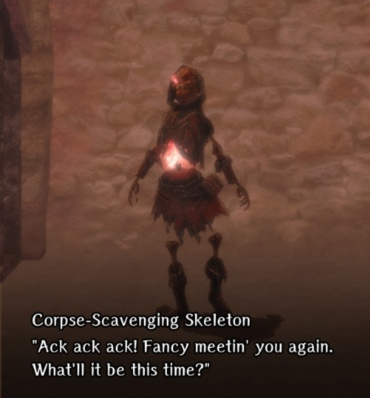

# Impregnable Fortress Wandering NPC Guide

There are a number of characters that wander the Abyss who you may encounter.  They may be a help, a threat, or simply a distraction. These chance encounters often present you with a choice of interactions that may bring you additional riches or even personality changes.  

Work in progress.  [Contributions welcome](../../index.md#contributing).

## Corpse-Scavenging Skeleton
Made a deal with Morgus, now making deals with you.
  
??? note "Details"  
    - Location: Zones 1 - ?
    - Interaction Options:  
       
            - The Corpse-Scavenging Skeleton has several items he'll sell you:  
            - Premium Potion (Greater Healing) - 100gp - Always available              
            - Strange  Potion (Extra Healing) - 1,000gp - Once every 7 days  
            - Mysterious Potion (Extreme Healing)- 1,500gp - Once every 7 days  
            - Adventurer's Remains - 1,000gp - Once every 7 days  
            - (If unlocked) Mausoleum Bone Tallow - 10,000gp - Once every 7 days  
    
    - Personality Impact: None known.  
    - Notes: The cooldown timer on Remains and Tallow appear to be 7 days from the last time collected, not tied to the weekly game reset.  If you have insufficient gold, the interaction will be dismissed without affecting any cooldown timers.  

<!--
## Old Castle Ruins

### Skilled Adventurer
I know you're in a hurry, but let's sing some campfire songs and roast marshmallows.

-->
