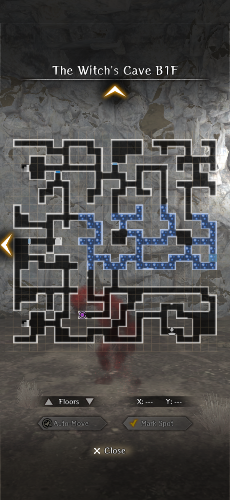
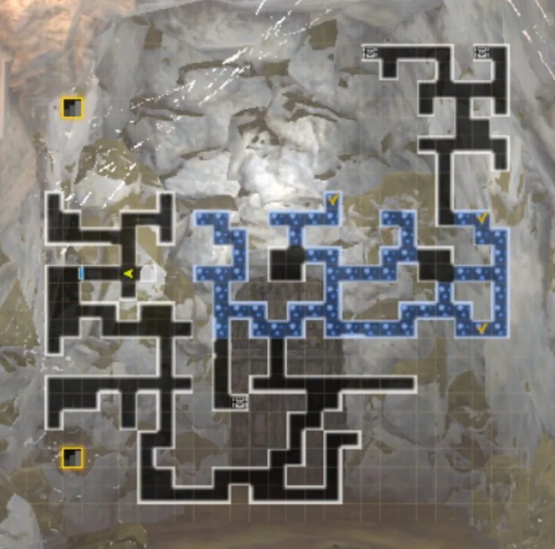

## Blizzard Blocking the Path

### Witch Hunt in Elden Hill Village (1st Faction Request)

##### Overview 

The faction requests are unlocked after entering Route 4 for the first time. The objectives of each faction are slightly different, but they all focus on stopping the witch burnings in Elden Hill Village and identifying the underlying cause. 

- Upon returning to Isberg a messenger will ask you to return to Royal Capital Luknalia
- Go to the Guild, speak with Arna, and accept the invitation
- If you leave immediately, then to accept the request in the future select "Talk" in the Guild
- All of the faction requests take place in Elden Hill Village and share the same map  

??? warning "Important Notes"

    === "Faction Affinity"
    
        - Supporting a faction in a previous Abyss influences certain outcomes 
        - Max faction affinity requires selecting that faction in the Cursed Wheel for Abyss 2 and 3
        - Max faction affinity is mandatory for the Best endings, 2 Guiding Lights (Luck), unique Calm Wind gear, and extra junk rewards
        - Faction affinity is denoted with a *
    
            !!! note "Set max faction affinity in the Cursed Wheel before starting to avoid potentially having to redo an ending" 
    
    === "Endings" 

        Overview
        
        - 10 unique endings across all factions have been identified 
        - Some endings may have been missed as of 1/1 
        - Known endings are sufficient for unlocking the 2 Guiding Lights (Luck)
        - Princess faction is listed with 4 endings as the Best ending has 2 distinct sub-endings with different rewards and scenes 
    
        Endings per Faction
    
        - Princess: 4 
        - Pontiff: 3
        - Admiral: 3
        - Total: 10 

    === "Reset Request" 
    
        - Deepsnow Hinterlands Entrance > Blizzard Blocking the Path (Route 4 entrance) > Exit via Route 3 Harken
        - Deepsnow Hinterlands Entrance > Minor Harken Beyond the Blizzard (Route 5 Harken) > Exit via nearby Harken
        - Note: The 1st faction request is technically first unlocked when you enter Route 3 for the first time. However, it can only be reset using the Route 4 or 5 Cursed Wheel node. It is in your best interest to reach one of those two floors if you plan to do all of the endings before progressing with the main story 
    
??? tip "Guiding Lights"

    === "Unlock Conditions" 

        !!! warning "Friendly warning in advance that 1) the unlock conditions are likely bugged and 2) the process can be time-consuming and frustrating." 

        What is going on?
                
        - The main issue is Discord members have reported wildly inconsistent unlocking conditions. 
        - As of 1/3/26 we have confirmed that there is only 1 Guiding Light (Luck) tied to the 1st faction requests. 
        - The problem is that for some members it only unlocks _after_ clearing the 3rd or 4th GWO fight. For others it's been unlocked on their first run before the GWO is ever encountered. 
        - Clearing the 4th GWO fight has been giving a Guiding Light (Luck) consistently, so that does not appear to be bugged.  
        - Until this is addressed all we can do is list the conditions that have been reported as "working". These might not work for you. 
        - It is also possible that this was shadow-patched at some point and is driving the inconsistencies between the older and newer reports. I have no idea.  
        - Remember to double-check that "max faction affinity" is set-up in your Cursed Wheel before you begin as it is a requirement. 
                
        Potential Unlock Conditions  
                
        - Any Best ending
        - All 3 Best endings (Note: This is likely the the intended condition)
        - Clear the 4th GWO fight + do each Best Ending until it appears

    === "Confirmed"
    
        - Max faction affinity is required 
        - A Guiding Light will dissolve if it's already been received 
        - The 2nd faction quests do not have a Guiding Light that has been found even with all 3 "best" ending. They also have nothing to do with unlocking the 1st faction request Guiding Light, so please do not waste your valuable gaming time testing to see if that does anything.

    === "Contact" 
    
        - Please DM or ping @lightbearer on the Discord if you can confirm or provide additional information. 

??? note "The Witch's Cave"

    ??? note "Overview" 
    
        === "Notes"
        
            - Each faction can only access certain areas of the map, but all progress is permanently recorded
            - Full map completion requires doing other faction quests
            - Stone pillars block pathways, cannot be move, and their locations change depending on the faction  
            - Faction objectives are completed only in Elden Hill Village and the Witch's Cave 
            - Enemy level is 65
            - Some chests have high Find/Trap Disarm requirements even at 150/150
    
        === "Sleep Tiles"
                            
            - A new dungeon mechanic that limits traversal 
            - After 10 steps you will lose consciousness and be teleported back to your starting point 
            - During an enemy encounter all team members will be asleep at the start of battle  
            - Aggro and bait enemies onto normal tiles for easier fights

    ??? map "The Witch's Cave - B1F"    
        

        
        

    
    ??? map "The Witch's Cave - B2F" 
        

        
        

##### Chancellor Serpens (Princess) Route 

- The goal of the Princess route is to solve Rosa's mysterious affliction that the villagers believe is the work of a witch.
- Pulgritte thinks that if Rosa is cured, then the villagers will stop the witch burnings. To develop a solution, you can consult with an Herbalist, Physician, or Mystic. 

??? note "Princess Ending Guides"

    ??? note "Bad Ending - Consult with an Herbalist"

        === "Walkthrough"

            - Speak to the Herbalist in town who recommends Sleepmoss to sedate the villagers  
            - Enter the Witch's Cave 
            - From the entrance head south and follow the path to the "sleepy tunnel" area (blue bubble tiles)  
            - Collect the 3 Sleepmoss using the small islands of normal tiles to reset the 10-step counter to progress deeper into the area 
            - Exit 
            - Speak to the Herbalist in town
        
                ??? warning "Rewards"
                    - 8,000 Gold
                    - 2 Junk*
                    - Scroll of Inferno

        === "Sleepmoss Locations"
            
            

            
            

    ??? note "Good Ending - Consult with a Physician"

        === "Walkthrough"
   
            - Speak to Raimi in town who recommends Slatewillow to cure Rosa's condition
            - Enter the Witch's Cave 
            - The Slatewillow is located at the end of a one-way path through B1F and B2F, including part of the "sleepy tunnel" area (blue bubble tiles). Low-level teams should consider bringing MP and SP pots as insurance given the area's mob density 
            - From the entrance head to the southeast to access a drop-down point to B2F. The room you drop into has 4 enemies in a small space, increasing your risk of an ambush. 
            - Exit the room, follow the path west, and then north (southern stairs are a dead-end)
                - The side area with the Cyclops + Bigfoot fight is optional 
            - Head north and take the stairs to B1F
            - Go south through the "sleepy tunnel" area                     
            - The Slatewillow is located in front of the teleporter and will be automatically picked up
            - Exit 
            - Speak with Raimi in town  
        
                ??? warning "Rewards"
                    - Achievement: A Terrible Nightmare
                    - 15,000 Gold 

        === "Drop-down to B2F"
            
            

            
            

        === "Optional Boss: Cyclops + Bigfoot"
            
            - More details to be added soon
            - Battle is against a Cyclops (~25,000 HP) and a Bigfoot, both level 70 
            - At ~80% HP the Cyclops will summon another Bigfoot
            - Cyclop's "Wheeling Cleave" can kill multiple team members 
    
    ??? tip "Best Ending - Consult with a Mystic*"
        
        - The Aegon Route* leads to the Best ending and requires max faction affinity
        - The default Mystic Route has a different map layout and quest giver
        - The Fellwisp will only spawn on the Aegon Route although the Cyclops + Bigfoot fight is available on both 
        
        ??? tip "Best Ending - Aegon Route*"

            === "Walkthrough"

                - Speak to Dylanhardt in town and select the option to return to the Royal Capital 
                - Meet with Aegon and he recommends Fellwisp to cure Rosa and Sar-moon Herb to calm the villagers
                - Return to Elden Hill Village and enter the Witch's Cave 
                - Go north, take the stairs to B2F, and collect both request items
                    - The Cyclops + Bigfoot boss fight is mandatory for the Fellwisp* 
                    - The Sar-moon Herb is located to the northeast of the Cyclop's room
                - Exit 
                - Speak with Dylanhardt in town 
                - Ending sequence begins automatically 
                
                    - "Foolish parent" or "Foolish child" options do not seem to impact the endings
                    - After the scene Pulgritte and Dylandhardt will leave 
                    - Choose whether to tell Mayor Oswald the truth about Rosa's true nature 
    
                    ??? warning "Ending Choices"
                    
                        ??? tip "Sub-Ending A: "Tell the Truth"*"
                        
                            !!! warning "Rewards"
                                - Achievement: One Who Carries the Future of Her Land
                                - 11,000 Gold 
                                - The game considers this ending the "best" one for purposes of getting the Guiding Light (Luck)
                
                        ??? note "Sub-Ending B: "Do Not Tell the Truth""
                            - The threaten Rosa options do not seem to have any impact on the ending
                
                            !!! warning "Rewards"
                                - Achievement: One Who Carries the Future of Her Land
                                - 9,000 Gold 
                                - 1 Junk*

            === "Fellwisp Location"
            
                

                
                

    
                - Located in B2F in a side room 
                - Defeating the Cyclops + Bigfoot is required for the Best ending and will not respawn once defeated

            === "Sar-moon Herb Location"
            
                

                
                

                
                - Located in the northeast area and requires reversing a stone to access
                - Multiple enemies will spawn after it is picked up  
                              
            === "Boss: Cyclops + Bigfoot"
                
                - More details to be added soon
                - Battle is against a Cyclops (~25,000 HP) and a Bigfoot, both level 70 
                - At ~80% HP the Cyclops will summon another Bigfoot
                - Cyclop's "Wheeling Cleave" can kill multiple team members 
    
        ??? note "Bad Ending - Mystic Route"

            === "Walkthrough"

                - Enter the Witch's Cave 
                - Head south to the person icon on the map, speak with the Mystic, and select "Talk about Elden Hill Village"
                - The Mystic recommends using Sar-moon Herb to calm the villagers 
                - Head downstairs to B2F 
                    - The side area with the Cyclops + Bigfoot fight is optional
                - Collect the Sar-moon Herb in the northeast corner 
                - Return to B1F 
                - Speak to the Mystic and give her the Sar-Moon Herb 
                - Go north to exit 
                - Speak with Dylanhardt  
        
                    ??? warning "Rewards"
                        - 9,000 Gold
                        - Calm Wind Crest
                        - 2 Junk
                        - Same ending scenes as Bad Ending - Consult with an Herbalist 
                
            === "Sar-moon Herb Location"
        
                

                
                

                
                - Located in the northeast area and requires reversing a stone to access
                - Multiple enemies will spawn after it is picked up  

            === "Optional Boss: Cyclops + Bigfoot"
                
                - More details to be added soon
                - Battle is against a Cyclops (~25,000 HP) and a Bigfoot, both level 70 
                - At ~80% HP the Cyclops will summon another Bigfoot
                - Cyclop's "Wheeling Cleave" can kill multiple team members 

##### Pontiff Route

- The Pontiff route is a race against time to discover the identity of the witch to stop the ongoing witch burnings. The goal is to open the door to the witch's room on B2F as fast as possible.
- A demonic brazier blocks entry to the witch's room until you have made a certain number of offerings. However, each time you return to town for an offering an innocent person is burned.  

??? warning "Mechanics" 

    ??? note "Demonic Brazier"

        === "Process"
            
            - Interact with the brazier and it will request an offering
            - Collect the offering via fighting enemies or returning to town 
            - Give the offering to the brazier to unlock a nearby door 
            - Investigate the unlocked area until Lulu makes a comment 
            - Return to the brazier for a new offering request 
            - Repeat until the witch's door is unlocked
            - On a subsequent run you can speak with Tenet in town to reduce the total number of offering requests
        
        === "Offering Requests"
        
            - Request 1 - 3 Rabbits - Defeat 3 different enemy groups with vorpal bunnies
            - Request 2 - Hen - Return to town and speak with Tenet
            - Request 3 - Living Blood - Defeat 2 different enemy groups with "monsters" (magical-beast, demi-human)
            - Request 4 - Infant (Lamb) - Return to town and speak with Tenet
            - Request 5 - Sheep - Return to town and speak with Tenet
    
        === "Tenet Offerings" 

            Basics 
            
            - Only available after a first run
            - Talk to Tenet in town before entering the Witch's Cave
            - Select 1 of the 3 offerings in advance, reducing the total number of brazier requests 
            
            Total Brazier Requests
            
            - Do not talk to Tenet: 5 
            - Hen: 4  
            - Infant (Lamb): 2 
            - Sheep: 1 (Unlocks the witch's door) 
    
    ??? note "Witch Burnings"

        Basics
    
        - Returning to town for an offering results in a witch burning
        - The total number of witch burnings determines whether Elencia is alive or dead after the boss fight
    
        Elencia's Status 
        
        - Witness 0-3 witch burnings = Elencia Alive
        - Witness 4+ witch burnings = Elencia Dead
        - Requirement for triggering a witch burning scene is unclear. Based on limited testing:
            - Number of battles and/or 
            - Returning to town after giving an offering, but _before_ accepting the next brazier request

??? note "Pontiff Ending Guides"

    ??? warning "Requirements"

        === "Endings" 
                    
            - Total of 3 confirmed endings 
                - Bad - Elencia Dead (4+ witch burnings) 
                - Good - Elencia Alive (0-3 witch burnings) + "Tell the Truth" 
                - Best - Elencia Alive (0-3 witch burnings) + "Condemn the Witch" 

            - Rewards
                - Junk is not rewarded if any witch burnings are witnessed
                - Full gold reward is always given

        === "What Ending Should I Do First?"
        
            If you plan to do all 3 endings:
            
            - Bad Ending - Elencia Dead as all 5 brazier offering requests are required on a first run
                - Returning to town only for the brazier offerings results in 3 witch burnings = Elencia Alive
                - An extra step is required. You must return to town an additional time after giving the brazier 3 Rabbits or Living Blood to see a 4th witch burning = Elincia Dead 
            - Select the Sheep from Tenent in town for the other 2 endings (Good, Best)
                - The Sheep immediately unlocks the witch's door, ensures 0 deaths, and Elencia will be alive after the boss fight
            
            If you only want the Guiding Light (Luck): 
            
            - Best Ending - Elencia Alive - "Condemn the Witch"
    
    ??? note "Bad Ending - Elencia Dead"

        === "Walkthrough" 
        
            - First run: Must witness a 4th witch burning
            - Subsequent runs: Do not speak with Tenet + witness a 4th witch burning
              
            - Enter the Witch's Cave 
            - Complete all 5 brazier offering requests
                - Returning to town for only the offering requests results in 3 witch burnings and Elencia will be alive after the boss fight
                - This is not the outcome we want as Elencia must be dead. You must make an additional trip back to town to witness a 4th witch burning 
                - Return to town after offering the 3 Rabbits or Living Blood and exploring the unlocked room; but, do _not_ accept the next brazier request
            - When returning to the brazier with the Sheep additional enemies will spawn ("ROAR") in the B2F hallway
            - Offer the Sheep to the brazier and unlock the witch's room 
            - Fight the Witch boss 
            - Elencia will be dead after the boss fight 
            - Exit 
            - Return to town 
            - Ending sequence begins automatically 
            
                ??? warning "Rewards"
                    - Achievement: A Witch There Was 
                    - 9,000 Gold
                    - Achievement is shared with Admiral - Good Ending - Elencia Dead and can only be received once

        === "Boss: Witch"

            === "Mechanics" 

                - Witch (Humanoid) in the backrow and 2 Evil Eyes (Magical Being) in the frontrow 
                - The fight presents itself as a standard DPS race - kill the Witch before she wipes out your entire party with LA- spells. In reality it is a "gimmick" fight that requires understanding the Witch's AI behavior. 
    
                - Witch 
                    - HP: ~8,000
                    - Opens with a non-turn action that applies Batilgref to the front row
                    - If she takes any damage, then she will begin a cycle of using Mentual Unity twice followed by a LA- spell that will likely kill multiple units, especially if a Type (element) advantage is present
                    - If she takes no damage, then she will cast a debuff or status affliction followed by a MA- spell
                    - If she casts Katino (sleep), then she will use a MA- spell on that same row
                    - If she casts Dilto (ACC down), then she will use the MA- spell on either row  
    
                - Evil Eyes
                    - HP: ~12,000 
                    - These enemies behave exactly like their Abyss 3 (Corrosion Eye) counterparts, but with slightly elevated stats
                    - Laser Eye attack hits an entire row for physical damage that can be evaded 
                    - Single-target laser can hit any unit for physical damage 
                    - Can Skill- or Spell- Bind a single target 
                    - Can Petrify a single target 

            === "Low-level Strategy" 

                - Recommended units: 3 DPS, 2 Priests, 1 Knight
                - The key to the fight is to not attack the Witch - at all - until the Evil Eyes are dead
                - Use only single-target or row attacks on the Evil Eyes
                - Fighters
                    - Earth-Splitting Strike (level 62), Heavy Attack 3-5, or Decisive Torso Strike 1-3 can do respectable damage
                    - Full Power Strike (FPS) is powerful, but risky since the Evil Eyes could Skill-bind that unit before they act
                - Priests
                    - Bringing 2 Priests is recommended since you will need to remove debuffs with Abit (ideally, Abit 2, Daniel's potential inherit) and recover from row attacks with Madios
                    - If any of your DPS are cross-classed with Priest (MC, Abenius, Bugen, Gerulf, etc.) they can also spot heal (put a 2H staff in their inventory) or help clear debuffs, especially Batilgref 
                - Once the Evil Eyes are dead it is critical to kill the Witch as quickly as possible with FPS or your strongest attacks before she begins her cycle of 2x Mentual Unity into a LA- spell. If you brought Yuzaki now is the time to use Hue 1-3   
                - If you cannot kill her in 1 round, then: 
                    - Bring a Knight and use Knight's Defense to reduce her spell damage by 50%; make sure they move last in your turn order
                    - Cortu spell + Cortu scroll stack for additional spell damage mitigation
                    - MC's Chrono 1-2 from the Well of the Mind can serve as an emergency button to push her back in the turn order and give additional breathing room 

            === "1-Round Kill Strategy" 

                - Requirements
                    - Level 70
                    - +20 Silver/Ebon bows or 2H spears 
                    - High-level skills (Heavy Attack 5-7, Decisive Torso Strike 3-5, Hue 3-5, All-Out Strike, Shedding etc.)
                - The Witch has extremely low HP (~8,000) and can be killed with ranged weapons if your team is sufficiently powerful
                - The goal is maximum damage. You can bring 5 DPS + 1 Priest or 6 DPS + recovery items to deal with the 2 Evil Eyes afterwards 
                - The downside of bringing Yuzaki is that while Hue 3-5 is powerful it may not hit the Witch at all, but is useful for killing the Evil Eyes
                - If you do not have highly leveled skills, then it is possible to kill her with multiple Fighters using All-Out Strike
                - Speed strats like using Chrono 1-2, Shedding, Porto, Batilgref, etc. are less useful since it is likely the Witch will get at least 1 LA- spell off before they go into effect on the next turn

    ??? note "Good Ending - Elencia Alive - "Tell the Truth""
    
        === "Walkthrough" 
        
            - First run: Default ending if returning to town only for the offering requests (3 witch burnings)
            - Subsequent runs: Talk to Tenet in town and select the Sheep (0 witch burnings) 
              
            - Enter the Witch's Cave
            - Complete all 5 brazier offering requests
            - When returning to the brazier with the Sheep (5th offering) additional enemies will spawn ("ROAR") in the B2F hallway 
            - Unlock the witch's room and defeat the boss 
            - Elencia will be alive, but unconscious after the boss fight 
                - "Examine the body"
                - "Examine the head" 
                - "Pull it out"
            - Exit 
            - Return to town 
            - Ending sequence begins automatically 
            
                - "Prepare yourself" (Skips villager fight)
                - "Tell the Truth"
                
                ??? warning "Rewards"
                
                    - 11,000 Gold
                    - 2 Junk (Sheep for 0 deaths, subsequent runs only)

        === "Boss: Witch"

            === "Mechanics" 

                - Witch (Humanoid) in the backrow and 2 Evil Eyes (Magical Being) in the frontrow 
                - The fight presents itself as a standard DPS race - kill the Witch before she wipes out your entire party with LA- spells. In reality it is a "gimmick" fight that requires understanding the Witch's AI behavior. 
    
                - Witch 
                    - HP: ~8,000
                    - Opens with a non-turn action that applies Batilgref to the front row
                    - If she takes any damage, then she will begin a cycle of using Mentual Unity twice followed by a LA- spell that will likely kill multiple units, especially if a Type (element) advantage is present
                    - If she takes no damage, then she will cast a debuff or status affliction followed by a MA- spell
                    - If she casts Katino (sleep), then she will use a MA- spell on that same row
                    - If she casts Dilto (ACC down), then she will use the MA- spell on either row  
    
                - Evil Eyes
                    - HP: ~12,000 
                    - These enemies behave exactly like their Abyss 3 (Corrosion Eye) counterparts, but with slightly elevated stats
                    - Laser Eye attack hits an entire row for physical damage that can be evaded 
                    - Single-target laser can hit any unit for physical damage 
                    - Can Skill- or Spell- Bind a single target 
                    - Can Petrify a single target 

            === "Low-level Strategy" 

                - Recommended units: 3 DPS, 2 Priests, 1 Knight
                - The key to the fight is to not attack the Witch - at all - until the Evil Eyes are dead
                - Use only single-target or row attacks on the Evil Eyes
                - Fighters
                    - Earth-Splitting Strike (level 62), Heavy Attack 3-5, or Decisive Torso Strike 1-3 can do respectable damage
                    - Full Power Strike (FPS) is powerful, but risky since the Evil Eyes could Skill-bind that unit before they act
                - Priests
                    - Bringing 2 Priests is recommended since you will need to remove debuffs with Abit (ideally, Abit 2, Daniel's potential inherit) and recover from row attacks with Madios
                    - If any of your DPS are cross-classed with Priest (MC, Abenius, Bugen, Gerulf, etc.) they can also spot heal (put a 2H staff in their inventory) or help clear debuffs, especially Batilgref 
                - Once the Evil Eyes are dead it is critical to kill the Witch as quickly as possible with FPS or your strongest attacks before she begins her cycle of 2x Mentual Unity into a LA- spell. If you brought Yuzaki now is the time to use Hue 1-3   
                - If you cannot kill her in 1 round, then: 
                    - Bring a Knight and use Knight's Defense to reduce her spell damage by 50%; make sure they move last in your turn order
                    - Cortu spell + Cortu scroll stack for additional spell damage mitigation
                    - MC's Chrono 1-2 from the Well of the Mind can serve as an emergency button to push her back in the turn order and give additional breathing room 

            === "1-Round Kill Strategy" 

                - Requirements
                    - Level 70
                    - +20 Silver/Ebon bows or 2H spears 
                    - High-level skills (Heavy Attack 5-7, Decisive Torso Strike 3-5, Hue 3-5, All-Out Strike, Shedding etc.)
                - The Witch has extremely low HP (~8,000) and can be killed with ranged weapons if your team is sufficiently powerful
                - The goal is maximum damage. You can bring 5 DPS + 1 Priest or 6 DPS + recovery items to deal with the 2 Evil Eyes afterwards 
                - The downside of bringing Yuzaki is that while Hue 3-5 is powerful it may not hit the Witch at all, but is useful for killing the Evil Eyes
                - If you do not have highly leveled skills, then it is possible to kill her with multiple Fighters using All-Out Strike
                - Speed strats like using Chrono 1-2, Shedding, Porto, Batilgref, etc. are less useful since it is likely the Witch will get at least 1 LA- spell off before they go into effect on the next turn
    
    ??? tip "Best Ending - Elencia Alive - "Condemn the Witch"*"

        === "Walkthrough" 
        
            - First run: Default ending if returning to town only for the offering requests (3 witch burnings)
            - Subsequent runs: Talk to Tenet in town and select the Sheep (0 witch burnings) 
              
            - Enter the Witch's Cave
            - Complete all 5 brazier offering requests
            - When returning to the brazier with the Sheep (5th offering) additional enemies will spawn ("ROAR") in the B2F hallway 
            - Unlock the witch's room and defeat the boss 
            - Elencia will be alive, but unconscious after the boss fight 
                - "Examine the body"
                - "Examine the head" 
                - "Pull it out"
            - Exit 
            - Return to town 
            - Ending sequence begins automatically 
            
                - "Prepare yourself" (Skips villager fight)
                - "Condemn the Witch"
            
                ??? warning "Rewards"
                
                    - Achievement: Condemn the Witch
                    - 17,000 Gold
                    - 2 Junk (Sheep for 0 deaths, subsequent runs only)
                    - Calm Wind Stun Guard*
         
        === "Boss: Witch"

            === "Mechanics" 

                - Witch (Humanoid) in the backrow and 2 Evil Eyes (Magical Being) in the frontrow 
                - The fight presents itself as a standard DPS race - kill the Witch before she wipes out your entire party with LA- spells. In reality it is a "gimmick" fight that requires understanding the Witch's AI behavior. 
    
                - Witch 
                    - HP: ~8,000
                    - Opens with a non-turn action that applies Batilgref to the front row
                    - If she takes any damage, then she will begin a cycle of using Mentual Unity twice followed by a LA- spell that will likely kill multiple units, especially if a Type (element) advantage is present
                    - If she takes no damage, then she will cast a debuff or status affliction followed by a MA- spell
                    - If she casts Katino (sleep), then she will use a MA- spell on that same row
                    - If she casts Dilto (ACC down), then she will use the MA- spell on either row  
    
                - Evil Eyes
                    - HP: ~12,000 
                    - These enemies behave exactly like their Abyss 3 (Corrosion Eye) counterparts, but with slightly elevated stats
                    - Laser Eye attack hits an entire row for physical damage that can be evaded 
                    - Single-target laser can hit any unit for physical damage 
                    - Can Skill- or Spell- Bind a single target 
                    - Can Petrify a single target 

            === "Low-level Strategy" 

                - Recommended units: 3 DPS, 2 Priests, 1 Knight
                - The key to the fight is to not attack the Witch - at all - until the Evil Eyes are dead
                - Use only single-target or row attacks on the Evil Eyes
                - Fighters
                    - Earth-Splitting Strike (level 62), Heavy Attack 3-5, or Decisive Torso Strike 1-3 can do respectable damage
                    - Full Power Strike (FPS) is powerful, but risky since the Evil Eyes could Skill-bind that unit before they act
                - Priests
                    - Bringing 2 Priests is recommended since you will need to remove debuffs with Abit (ideally, Abit 2, Daniel's potential inherit) and recover from row attacks with Madios
                    - If any of your DPS are cross-classed with Priest (MC, Abenius, Bugen, Gerulf, etc.) they can also spot heal (put a 2H staff in their inventory) or help clear debuffs, especially Batilgref 
                - Once the Evil Eyes are dead it is critical to kill the Witch as quickly as possible with FPS or your strongest attacks before she begins her cycle of 2x Mentual Unity into a LA- spell. If you brought Yuzaki now is the time to use Hue 1-3   
                - If you cannot kill her in 1 round, then: 
                    - Bring a Knight and use Knight's Defense to reduce her spell damage by 50%; make sure they move last in your turn order
                    - Cortu spell + Cortu scroll stack for additional spell damage mitigation
                    - MC's Chrono 1-2 from the Well of the Mind can serve as an emergency button to push her back in the turn order and give additional breathing room 

            === "1-Round Kill Strategy" 

                - Requirements
                    - Level 70
                    - +20 Silver/Ebon bows or 2H spears 
                    - High-level skills (Heavy Attack 5-7, Decisive Torso Strike 3-5, Hue 3-5, All-Out Strike, Shedding etc.)
                - The Witch has extremely low HP (~8,000) and can be killed with ranged weapons if your team is sufficiently powerful
                - The goal is maximum damage. You can bring 5 DPS + 1 Priest or 6 DPS + recovery items to deal with the 2 Evil Eyes afterwards 
                - The downside of bringing Yuzaki is that while Hue 3-5 is powerful it may not hit the Witch at all, but is useful for killing the Evil Eyes
                - If you do not have highly leveled skills, then it is possible to kill her with multiple Fighters using All-Out Strike
                - Speed strats like using Chrono 1-2, Shedding, Porto, Batilgref, etc. are less useful since it is likely the Witch will get at least 1 LA- spell off before they go into effect on the next turn

##### Admiral Route

- The Admiral's goal is to stop the witch hunts at the request of the elven Kinlord and his representative, Elinas, whose territory is adjacent to Elden Hill Village.
- To put an end to the witch burnings Pickerel suggests finding a "true" witch, threatening the local cleric to bring in the Cathedral Church, or sedating the villagers.   

??? warning "Mechanics"

    ??? note "Note on Initial Choices" 
    
        - The Admiral route is deceptively structured as the initial choices of "Capture a witch" or "Threaten" have no impact on the ending
        - The number of brazier requests determines whether Elencia is alive or dead after the boss fight
        - Elencia's post-battle status (dead or alive) determines the ending
        - The "Prepare Sedative" option is self-contained and separate from the brazier offerings mechanic    
    
    ??? note "Demonic Brazier Offerings"

        === "Process"
    
            - Interact with the brazier and it will request an offering
            - Collect the offering via fighting enemies or returning to town 
            - Give the offering to the brazier to unlock a nearby door 
            - Investigate the unlocked area until Lulu makes a comment 
            - Return to the brazier for a new offering request 
            - Repeat until the witch's door is unlocked
            - On a subsequent run you can speak with Elinas in town to reduce the total number of offering requests
    
        === "Offering Requests"
        
            - Request 1:  3 Rabbits - Defeat 3 different enemy groups with vorpal bunnies
            - Request 2:  Broom - Return to town and speak with Elinas
            - Request 3:  Living Blood - Defeat 2 different enemy groups with "monsters" (magical-beast, demi-human)
            - Request 4:  Infant (Lamb) - Return to town and speak with Elinas
            - Request 5:  Gold Ore - Defeat 3 back-to-back groups of tough enemies 

        === "Elinas Offerings" 

            Basics 
            
            - Only available after a first run
            - Talk to Elinas in town before entering the Witch's Cave
            - Select 1 of the 2 offerings in advance, reducing the total number of brazier requests 
            
            Total Brazier Requests
            
            - Do not talk to Elinas: 5 
            - Broom: 4 
            - Infant (Lamb): 2 

??? note "Admiral Ending Guides" 

    ??? warning "Requirements"

        - Total of 3 confirmed endings 
            - Possible another ending exists that has yet to be identified (as of 1/1)
            - When selecting either "Capture a witch" or "Threaten" on a first run you will always get the Best ending (Elencia Alive) since you have to collect all 5 brazier offerings
    
        - Endings 
    
            - Bad - Prepare Sedative 
            - Good - Elencia Dead (Pick Infant (Lamb) on subsequent runs)
            - Best - Elencia Alive (Pick Broom on subsequent runs)
            
        - Rewards
        
            - No extra junk is given as a reward on any ending
            - Full gold reward is always given

    ??? note "Bad Ending - Prepare Sedative"

        === "Walkthrough" 
    
            - Speak to Raimi in town who recommends Sar-moon Herb in the Witch's Cave to calm the villagers
            - Enter the Witch's Cave 
            - Head north and down the stairs to B2F
                - The side area with the Cyclops + Bigfoot is optional
            - Collect the Sar-moon Herb in the northeast corner 
            - Exit
            - Speak with Raimi in town
        
                ??? warning "Rewards"
                    - 7,000 Gold
                    - Scroll of Torrent 
                    - Admiral is displeased with this approach 

        === "Sar-moon Herb Location"
        
            

            
            

            
            - Located in the northeast area and requires reversing a stone to access
            - Multiple enemies will spawn after it is picked up  
        
        === "Optional Boss: Cyclops + Bigfoot"
            
            - More details to be added soon
            - Battle is against a Cyclops (~25,000 HP) and a Bigfoot, both level 70 
            - At ~80% HP the Cyclops will summon another Bigfoot
            - Cyclop's "Wheeling Cleave" can kill multiple team members 

    ??? note "Good Ending - Elencia Dead"

        === "Walkthrough" 

            - Can only be done on a subsequent run
            - Select "Capture a witch" or "Threaten" it does not matter 
            - Speak with Cleric Ludwin in town and confirm you will help search for the witch
            - Speak with Elinas and pick the Infant (Lamb) 
            - Enter the Witch's Cave 
                - Head south and take the stairs down to B2F
            - Go up and to the right to the large room with multiple doors and interact with the brazier. Offer the Infant (Lamb) and explore the southeast room at the end of the path until Lulu comments 
            - Return to the brazier and it will request the Gold Ore 
            - Go back upstairs to B1F  
            - Exit 
            - Rest at the inn to recover for the upcoming boss fight 
            - Return to the brazier and offer the Gold Ore to unlock the witch's room 
            - Unlock the witch's room and defeat the boss 
            - Elencia dies after the boss fight 
            - Exit 
            - Return to town 
            - Ending sequences will begin automatically  
    
                ??? warning "Note on Ending Choices" 
            
                    - Outside a few different lines of flavor text, the 2 choices presented when consoling Cleric Ludwin and reporting to the Admiral all lead to the same ending and 14,000 gold reward 
                    - This differs from the Princess route where the ending choices _do_ lead to modified sub-ending scenes and different rewards
                    - This could potentially be a bug or there is some combination of responses that has not yet been identified  
                
                ??? warning "Rewards"
                
                    - Achievement: A Witch There Was 
                    - 14,000 Gold
                    - Calm Wind Resistram* 
                    - Achievement is shared with Pontiff - Bad Ending - Elencia Dead and can only be received once
                    - The Admiral is satisfied with this outcome 

        === "Gold Ore Location"
    
            

            
            

                
            - Located directly across from the entrance 

        === "Enemy Gauntlet" 
    
            - Before picking up the Gold Ore a group of 3 enemies will appear behind you
            - Forced to fight a series of back-to-back battles with tough enemies  

            Fights 
            
            - Fight 1:  2 Big Slime (front); Evil Eye (back)
            - Fight 2:  Greater Demon and Lesser Demon (front); 2 Succubus (back)
            - Fight 3:  3 Bigfoot Child (front); Bigfoot (back)

        === "Boss: Witch"

            === "Mechanics" 

                - Witch (Humanoid) in the backrow and 2 Evil Eyes (Magical Being) in the frontrow 
                - The fight presents itself as a standard DPS race - kill the Witch before she wipes out your entire party with LA- spells. In reality it is a "gimmick" fight that requires understanding the Witch's AI behavior. 
    
                - Witch 
                    - HP: ~8,000
                    - Opens with a non-turn action that applies Batilgref to the front row
                    - If she takes any damage, then she will begin a cycle of using Mentual Unity twice followed by a LA- spell that will likely kill multiple units, especially if a Type (element) advantage is present
                    - If she takes no damage, then she will cast a debuff or status affliction followed by a MA- spell
                    - If she casts Katino (sleep), then she will use a MA- spell on that same row
                    - If she casts Dilto (ACC down), then she will use the MA- spell on either row  
    
                - Evil Eyes
                    - HP: ~12,000 
                    - These enemies behave exactly like their Abyss 3 (Corrosion Eye) counterparts, but with slightly elevated stats
                    - Laser Eye attack hits an entire row for physical damage that can be evaded 
                    - Single-target laser can hit any unit for physical damage 
                    - Can Skill- or Spell- Bind a single target 
                    - Can Petrify a single target 

            === "Low-level Strategy" 

                - Recommended units: 3 DPS, 2 Priests, 1 Knight
                - The key to the fight is to not attack the Witch - at all - until the Evil Eyes are dead
                - Use only single-target or row attacks on the Evil Eyes
                - Fighters
                    - Earth-Splitting Strike (level 62), Heavy Attack 3-5, or Decisive Torso Strike 1-3 can do respectable damage
                    - Full Power Strike (FPS) is powerful, but risky since the Evil Eyes could Skill-bind that unit before they act
                - Priests
                    - Bringing 2 Priests is recommended since you will need to remove debuffs with Abit (ideally, Abit 2, Daniel's potential inherit) and recover from row attacks with Madios
                    - If any of your DPS are cross-classed with Priest (MC, Abenius, Bugen, Gerulf, etc.) they can also spot heal (put a 2H staff in their inventory) or help clear debuffs, especially Batilgref 
                - Once the Evil Eyes are dead it is critical to kill the Witch as quickly as possible with FPS or your strongest attacks before she begins her cycle of 2x Mentual Unity into a LA- spell. If you brought Yuzaki now is the time to use Hue 1-3   
                - If you cannot kill her in 1 round, then: 
                    - Bring a Knight and use Knight's Defense to reduce her spell damage by 50%; make sure they move last in your turn order
                    - Cortu spell + Cortu scroll stack for additional spell damage mitigation
                    - MC's Chrono 1-2 from the Well of the Mind can serve as an emergency button to push her back in the turn order and give additional breathing room 

            === "1-Round Kill Strategy" 

                - Requirements
                    - Level 70
                    - +20 Silver/Ebon bows or 2H spears 
                    - High-level skills (Heavy Attack 5-7, Decisive Torso Strike 3-5, Hue 3-5, All-Out Strike, Shedding etc.)
                - The Witch has extremely low HP (~8,000) and can be killed with ranged weapons if your team is sufficiently powerful
                - The goal is maximum damage. You can bring 5 DPS + 1 Priest or 6 DPS + recovery items to deal with the 2 Evil Eyes afterwards 
                - The downside of bringing Yuzaki is that while Hue 3-5 is powerful it may not hit the Witch at all, but is useful for killing the Evil Eyes
                - If you do not have highly leveled skills, then it is possible to kill her with multiple Fighters using All-Out Strike
                - Speed strats like using Chrono 1-2, Shedding, Porto, Batilgref, etc. are less useful since it is likely the Witch will get at least 1 LA- spell off before they go into effect on the next turn
    
    ??? tip "Best Ending - Elencia Alive"

        === "Walkthrough" 

            - First run - You will always receive this ending on a first run since you have to complete all 5 offering requests 
            - Subsequent runs - Pick the Broom from Elencia in town
              
            - Select "Capture a witch" or "Threaten" it does not matter 
            - Speak with Cleric Ludwin in town and confirm that you will help search for the witch
            - Enter the Witch's Cave 
            - Head south and take the stairs down to B2F 
            - Go up and to the right to the large room with multiple doors  
            - Interact with the brazier 
            - Complete the 5 offering requests 
            - Exit and rest at the inn to recover for the upcoming boss fight 
            - Return to the brazier and offer the Gold Ore to unlock the witch's room 
            - Unlock the witch's room and defeat the boss 
            - Elencia is alive, but unconscious after the boss fight 
            - Exit 
            - Return to town 
            - Ending sequences will begin automatically  
            
                ??? warning "Rewards"
                    - Achievement: You Are Permitted to Call My Name, But Only Once 
                    - 19,000 Gold
                    - The Admiral is pleased with this outcome

        === "Gold Ore Location"
    
            

            
            

                
            - Located directly across from the entrance 

        === "Enemy Gauntlet" 
    
            - Before picking up the Gold Ore a group of 3 enemies will appear behind you
            - Forced to fight a series of back-to-back battles with tough enemies  

            Fights 
            
            - Fight 1:  2 Big Slime (front); Evil Eye (back)
            - Fight 2:  Greater Demon and Lesser Demon (front); 2 Succubus (back)
            - Fight 3:  3 Bigfoot Child (front); Bigfoot (back)

        === "Boss: Witch"

            === "Mechanics" 

                - Witch (Humanoid) in the backrow and 2 Evil Eyes (Magical Being) in the frontrow 
                - The fight presents itself as a standard DPS race - kill the Witch before she wipes out your entire party with LA- spells. In reality it is a "gimmick" fight that requires understanding the Witch's AI behavior. 
    
                - Witch 
                    - HP: ~8,000
                    - Opens with a non-turn action that applies Batilgref to the front row
                    - If she takes any damage, then she will begin a cycle of using Mentual Unity twice followed by a LA- spell that will likely kill multiple units, especially if a Type (element) advantage is present
                    - If she takes no damage, then she will cast a debuff or status affliction followed by a MA- spell
                    - If she casts Katino (sleep), then she will use a MA- spell on that same row
                    - If she casts Dilto (ACC down), then she will use the MA- spell on either row  
    
                - Evil Eyes
                    - HP: ~12,000 
                    - These enemies behave exactly like their Abyss 3 (Corrosion Eye) counterparts, but with slightly elevated stats
                    - Laser Eye attack hits an entire row for physical damage that can be evaded 
                    - Single-target laser can hit any unit for physical damage 
                    - Can Skill- or Spell- Bind a single target 
                    - Can Petrify a single target 

            === "Low-level Strategy" 

                - Recommended units: 3 DPS, 2 Priests, 1 Knight
                - The key to the fight is to not attack the Witch - at all - until the Evil Eyes are dead
                - Use only single-target or row attacks on the Evil Eyes
                - Fighters
                    - Earth-Splitting Strike (level 62), Heavy Attack 3-5, or Decisive Torso Strike 1-3 can do respectable damage
                    - Full Power Strike (FPS) is powerful, but risky since the Evil Eyes could Skill-bind that unit before they act
                - Priests
                    - Bringing 2 Priests is recommended since you will need to remove debuffs with Abit (ideally, Abit 2, Daniel's potential inherit) and recover from row attacks with Madios
                    - If any of your DPS are cross-classed with Priest (MC, Abenius, Bugen, Gerulf, etc.) they can also spot heal (put a 2H staff in their inventory) or help clear debuffs, especially Batilgref 
                - Once the Evil Eyes are dead it is critical to kill the Witch as quickly as possible with FPS or your strongest attacks before she begins her cycle of 2x Mentual Unity into a LA- spell. If you brought Yuzaki now is the time to use Hue 1-3   
                - If you cannot kill her in 1 round, then: 
                    - Bring a Knight and use Knight's Defense to reduce her spell damage by 50%; make sure they move last in your turn order
                    - Cortu spell + Cortu scroll stack for additional spell damage mitigation
                    - MC's Chrono 1-2 from the Well of the Mind can serve as an emergency button to push her back in the turn order and give additional breathing room 

            === "1-Round Kill Strategy" 

                - Requirements
                    - Level 70
                    - +20 Silver/Ebon bows or 2H spears 
                    - High-level skills (Heavy Attack 5-7, Decisive Torso Strike 3-5, Hue 3-5, All-Out Strike, Shedding etc.)
                - The Witch has extremely low HP (~8,000) and can be killed with ranged weapons if your team is sufficiently powerful
                - The goal is maximum damage. You can bring 5 DPS + 1 Priest or 6 DPS + recovery items to deal with the 2 Evil Eyes afterwards 
                - The downside of bringing Yuzaki is that while Hue 3-5 is powerful it may not hit the Witch at all, but is useful for killing the Evil Eyes
                - If you do not have highly leveled skills, then it is possible to kill her with multiple Fighters using All-Out Strike
                - Speed strats like using Chrono 1-2, Shedding, Porto, Batilgref, etc. are less useful since it is likely the Witch will get at least 1 LA- spell off before they go into effect on the next turn

## Short Rest in the Cabin

### Search for the Missing Persons (2nd Faction Request)

##### Overview 

The faction requests are unlocked after entering Route 9 for the first time. The objective is to search for traces of two missing people and to discover why the faction called upon you, the Masked Adventurer, instead of employing their own members. 

Upon entering the Royal Capital, the faction representative will appear to discuss the missing persons. 

- Agree to help twice when prompted
- Head to the Guild and accept the request under the Royal Capital tab 
- If you decline at any point the faction representative will not appear again and the Cursed Wheel must be reset

??? warning "Important Notes"

    ??? warning "Best Ending Requirements"
    
        - Knowledge of [reversing nullstones](./important-request-gwo.md#saving-iris) (clear 3rd GWO fight)
        - Knowledge of [shortcuts](./important-request-gwo.md#learning-the-truth) to open the mine walls on Route 7 to speed up the search (optional) 
        - Cursed Wheel - Short Rest in the Cabin
            - North Lakeshore Cabin - "Fixed it up"
            - Dwarves' Cave - Any
            - Village Adults - "Did not encounter them"
                - If the village adults have been captured, then the first body will be in poor condition and the request will end. This outcome is a node in the Cursed Wheel and can be missed 
    
    ??? note "Reset Faction Request" 
    
        - Deepsnow Hinterlands Entrance > Short Rest in the Cabin 
        - Subsequent runs - "Did not take the request" under the "Search for..." sub-menu
    
    ??? danger "Warning! Blind Runs" 
    
        - Strongly recommend _not_ doing a blind run
        - The majority of the request is searching for interactable objects (white shiny stars) across multiple floors
        - Interactable objects are easy to miss in snowy environments, do not have sound cues, and often do not appear unless you are standing directly on its tile  

??? note "Bigfoot Cave"

    ??? note "Summary"
    
        - Location of the second missing person for all 3 faction requests
        - Requires knowledge of [reversing nullstones](./important-request-gwo.md#saving-iris) (clear 3rd GWO fight)
        - Map completion resets upon Cursed Wheeling
        - Mandatory Bigfoot boss fight
        - Not a mob dense area during the request with few fights on the path to the boss's room 
        - Primary danger is being Chilled or Frozen before reaching the boss
        - Enemy level is 70
        - Enemies: Bigfoot, Bigfoot Child, Ice Cloud, Snow Slime, Abyssal Insects, Ice and Earth Entities
    
    ??? map "Bigfoot Cave"
    
        

        
        

##### Faction Request Guides 

??? note "Princess Route - Search for Missing Royal Knights"

    1. Head back to Isberg. Talk to Old Lady NPC in town and pay 300G. Head to the Inn, talk to the NPC and pay 300G.
    2. Head to Mayor's House in Route 3 and obtain a faction-related Helmet and the Rockhome Village Key. To avoid a long walk through the spike traps, return to the Harken and select Route 2. From the Route 2 Harken re-enter Route 3.
    3. Head to the two locked houses on the bottom-left side of the map. The top house will contain some faction-related clothing. The left house will contain an ambush after passing by the 1st door inside. Defeat all 6 Desert Insects and collect the faction-related insignia on the floor.
    4. Head to the house at the bottom middle of Route 3 (where Mike, one of the village adults, was killed by goblins). Enter the house and find the body of one of the Royal Knights.
    5. Head back to the Royal Capital's Adventurer's Guild and turn in the body for revival. Gain some more information about the situation and about how the other person leaves wax tablets ("tablets") as clues.
    6. Head back to Route 3 and find the tablets in this order: 
        - (X:11, Y:25) - Northwest of the Harken on the ground by a tree
        - (X:26, Y:24) - Few steps southeast of Route 4 entrance
    7. Harken to Route 6 and enter Route 7. Find the tablets in this order: 
        - (X:13, Y:23) - Central 3x3 room 
        - (X:16, Y:22) - Right-hand dead-end of 3x3 room
    8. Exit back to the Route 6 Harken and select Route 7. If you have the shortcut ability and mined the coal walls, then you can walk directly to the tablets. Find the tablets in this order: 
        - (X:19, Y:7) - Northwest of Route 8 stairs
        - (X:18, Y:19) - Northwest of the nullstone icon in a small (2x1) dead-end 
        - (X:15, Y:24) - Few steps south of the Harken
    9. From the Route 7 Harken go left and exit to Route 9. Find the tablet at: 
        - (X:1, Y:7) - Upper left-hand side of the first house in the grass
    10. Return to the Route 7 Harken and select Route 9. From the Route 9 Harken go to Route 10. Find the tablets in this order: 
        - (X:25, Y:4) - Few steps north of Route 10 entrance 
        - (X:20, Y:6) - Tile left of the first Stone God altar
        - (X:1, Y:9) -  From the top of the bottom-left house walk 1 step north 
        - (X:2, Y:15) - First tile in the northwest blizzard zone 
        - (X:3, Y:24) - Directly ahead after exiting the northwest blizzard zone  
        - (X:1, Y:24) - Check the nullstone 
        - Optional: Return to town via the shortcut or use the Route 10 Fountain to recover your team's health for the upcoming boss fight.
    11. Reverse the nullstone and head into the Bigfoot Cave. You will need to make your way to the very last room on the bottom right. 
    12. There will be a Bigfoot boss blocking your way. The fight has the Bigfoot Elder with 1 Baby Bigfoot in the front, and 2 Baby Bigfoot in the back. All of the babies can move twice a turn. After the Bigfoot Elder takes a certain amount of damage, he will Pound Chest and resummon any dead Baby Bigfoot. If any Baby Bigfoot are revived in this manner, they will immediately throw a snowball at a random teammate. From this point on, the Bigfoot Elder will repeatedly Pound Chest will taking any damage, so it's recommended to kill him first before all the babies.
    13. Look into the pile of poop in the next room. The second person you're looking for has red hair.
    14. Bring the head back to the Royal Capital and complete the request.
    15. Reward - Gem of Org x50 (one-time only), 30,000 Gold, Giant Beast Ape Heavy Armor, and Elliot, the Lamenting Broth (Attack Power) as a bondmate.

??? note "Pontiff Route - Search for Adherent Acquaintances" 

    1. Head back to Isberg. Talk to Old Lady NPC in town and pay 300G. Head to the Inn, talk to the NPC and pay 300G.
    2. Head to Mayor's House in Route 3 and obtain a faction-related Helmet + Rockhome Village Key. To avoid a long walk through the spike traps, return to the Harken and select Route 2. From the Route 2 Harken re-enter Route 3.
    3. Head to the two locked houses on the bottom-left side of the map. The top house will contain some faction-related clothing. The left house will contain an ambush after passing by the 1st door inside. Defeat the 2 Vorpal Bunnies and 3 Snow Slimes. Collect the faction-related insignia on the floor. Exit and return to the Route 2 Harken.
    4. Select Route 5 and walk to Route 6. Head to the house on the far left-hand side (where Otto, one of the village adults, was). You will find the body of Sir William, one of the two missing persons, in the backyard.
    5. Head back to the Royal Capital's Adventurer's Guild and turn in the body for revival. Gain some more information about the situation and about how Agnes would leave wax tablets ("tablets") as clues.
    6. Head back to Route 3 and look for tablets in this order: 
        - (X:2, Y:25) - Far northwest house with nullstone in the backyard   
        - (X:11, Y:25) - Northwest of the Harken on the ground by a tree 
        - (X:23, Y:25) - Few steps left of the Route 4 entrance
    7. Harken to Route 6 and enter Route 7. Find the tablets in this order:
        - (X:13, Y:23) - Central 3x3 room 
        - (X:16, Y:22) - Right-hand dead-end of 3x3 room
    8. Exit back to the Route 6 Harken and select Route 7. If you have the shortcut ability and mined the coal walls, then you can walk directly to the tablets. Find the tablets in this order: 
        - (X:19, Y:7) - Northwest of Route 8 stairs 
        - (X:18, Y:19) - Northwest of the nullstone icon in a small (2x1) dead-end 
        - (X:15, Y:24) - Few steps south of the Harken
    9. From the Route 7 Harken go left and exit to Route 9. Find the tablet at:
        - (X:1, Y:7) - Upper left-hand side of the first house in the grass 
    10. Return to the Route 7 Harken and select Route 9. From the Route 9 Harken go to Route 10. Find the tablets in this order: 
        - (X:25, Y:4) - Few steps north of Route 10 entrance 
        - (X:20, Y:6) - Tile left of the first Stone God altar
        - (X:1, Y:9) -  From the top of the bottom-left house walk 1 step north 
        - (X:2, Y:15) - First tile in the northwest blizzard zone 
        - (X:3, Y:24) - Directly ahead after exiting the northwest blizzard zone  
        - (X:1, Y:24) - Check the nullstone 
        - Optional: Return to town via the shortcut or use the Route 10 Fountain to recover your team's health for the upcoming boss fight.
    11. Reverse the nullstone and head into the Bigfoot Cave. You will need to make your way to the very last room on the bottom right.
    12. There will be a Bigfoot boss blocking your way. The fight has the Bigfoot Elder by themselves. After taking a certain amount of damage, they will begin self-buffing. Each buff lasts 10 turns, and can knock previous buffs off (3 buff limit). Alternatively, you can dissipate the buffs yourself.
    13. This is the point where the endings diverge. 
    14. Look into the pile of poop in the next room. 
        - Selecting "Agnes is not here" leads to the "best" ending where you receive the bondmate
        - Selecting any head leads to the default ending
    15. If you selected:
        - "Agnes is not here", then go to the nullstone, reverse it, and type "Noah" into the prompt and then exit
        -  Any of the heads, then exit 
        - Using a Hook of Harken seems to be bugged, so it is strongly suggested that you manually walk to the exit 
    16. Head back to the Royal Capital to turn in the request. Sir William will leave for the nullstone. 
    17. Reward - Gem of Org x50 (one-time only), 30,000 Gold, and a Giant Beast Ape Robe.
    18. If you selected "Agnes is not here" and did NOT bring back a head, then return to the nullstone in the Bigfoot Cave for a scene to learn the truth about Agnes's fate. After the cutscene you will receive William, the Remorseful Husband (Divine Power) as a bondmate.

??? note "Admiral Route - Search Bernard and Young Laurent"

    1. Head back to Isberg. Talk to Old Lady NPC in town and pay 300G. Head to the Inn, talk to the NPC and pay 300G.
    2. Head to Mayor's House in Route 3 and obtain a faction-related sword + a key.
    3. Head to the two locked houses on the left side of the map in Route 3. The top house will contain some faction-related clothing. The left house will contain an ambush after passing by the 1st door inside. Defeat all 6 Dragonflies and collect the faction-related insignia on the floor.
    4. Head to Route 4's Harken and walk to (X:16, Y:14). The father's body will be there.
    5. Head back to the Royal Capital's Adventurer's Guild and turn in the body for revival. Gain some more information about the situation and about how the other person leaves wax tablets as clues.
    6. Harken to Route 2 and enter Route 3, then look for Wax Tablets in this order: 
        - (X:6, Y:17) - Located behind the 2nd house by the entrance
        - (X:2,Y:2) - Located a few steps from the Route 3 entrance
    7. Return to Route 2 and find a tablet at: 
        - (X:21, Y:19) - Few steps southwest of the reversal tree stump
    8. Head to Route 7 from Route 6's Harken and find two more tablets in this order: 
        - (X:13, Y:23) - Central 3x3 room 
        - (X:16, Y:22) - Right-hand dead-end of 3x3 room
    9. Head out to Route 6 Harken and head to Route 7 Harken or, if you have mined the coal walls, walk directly to the tablets in this order: 
        - (X:19, Y:7) - Northwest of Route 8 stairs 
        - (X:18, Y:19) - Northwest of the nullstone icon in a small (2x1) dead-end  
    10. From the Route 7 Harken go left and exit to Route 9. Find the tablet at:
        - (X:1, Y:7) - Upper left-hand side of the first house in the grass 
    11. Head back to Route 7 Harken and Harken to Route 9 Harken, then head to Route 10. Find tablets in this order: 
        - (X:25, Y:4) - Few steps north of Route 10 entrance 
        - (X:20, Y:6) - Tile left of the first Stone God altar
        - (X:4, Y:3) - On the bridge to the far left house
        - (X:1, Y:9) -  From the top of the bottom-left house walk 1 step north 
        - (X:2, Y:15) - First tile in the northwest blizzard zone 
        - (X:3, Y:24) - Directly ahead after exiting the northwest blizzard zone  
        - (X:1, Y:24) - Check the nullstone 
    12. Reverse the nullstone and head into the Bigfoot Cave. LULU text with pool of blood. You will need to make your way to the very last room on the bottom right.
    13. There will be a Bigfoot boss blocking your way. The fight has a normal Bigfoot in the front row and the Elder Bigfoot in the backrow. Upon taking enough damage, the Elder Bigfoot will summon another Bigfoot. He can do this multiple times.
    14. Look into the pile of poop in the next room. Dig deeper into the poo 3 times, in which you'll find the actual body of the son.
    15. Head back to the Royal Capital to deliver the dead body. 
    16. Complete the request and receive Gem of Org x50 (one-time only), 20,000 gold, Giant Beast Ape Light Armor, and Bernard, Father Restored to Life (MAG Power) as a bondmate.

