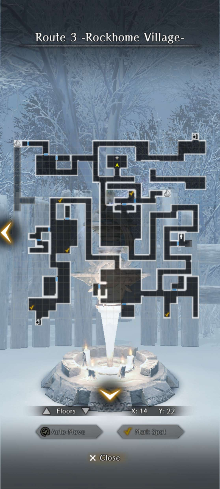
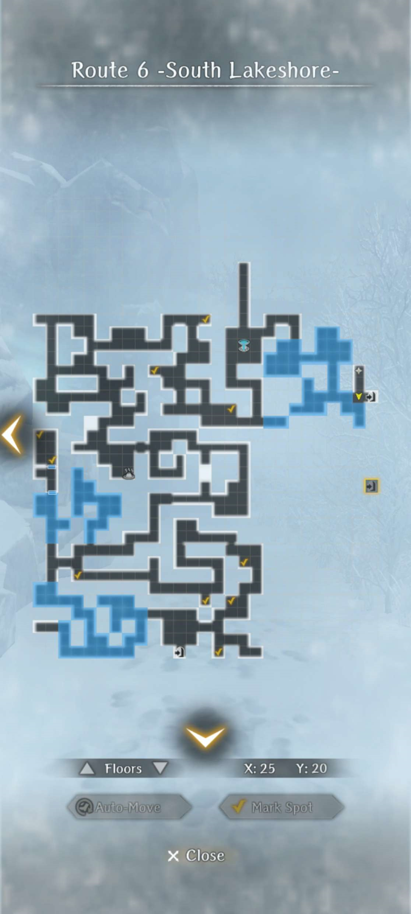
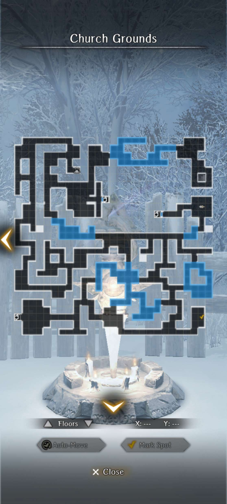

# Maps for Abyss 4

!!! warning "Map Variations"  
    - Some floors have tile variations (shifts and rotations) randomly chosen when you start the abyss, and certain actions can reset the dungeon layout changing the variation you see. Your maps and the location of certain events may not perfectly match these.  
    - Events and items on variable tiles always occur in the same rooms on those tiles even though they may have moved and rotated, so look for similar features. See [Map Variations page](../../mechanics/map-variations.md) for details.  
    

## Main Abyss Maps

??? map "Route 1 -Beginning of the Snowy Road-"

    === "Initial Map"
        

    === "Post GWO + Knowledge"
        

??? map "Route 2 -Path of the Nullshadow-"

    === "Initial Map"
        

    === "Post GWO + Knowledge"
        

??? map "Route 3 -Rockhome Village-"

    === "Initial Map"
        

    === "Post GWO + Knowledge"
        

??? map "Route 4 -Snowy Road to the Mine-"

    === "Initial Map"
        

    === "Post GWO + Knowledge"
        

??? map "Route 5 -Whiteout-"

    === "Initial Map"
        

    === "Post GWO + Knowledge"
        

??? map "Route 6 -South Lakeshore-"

    === "Initial Map"
        

    === "Post GWO + Knowledge"
        

??? map "Route 7 -Depleted Mine 1F-"

    === "Initial Map"
        

    === "Post GWO + Knowledge"
        

??? map "Route 8 -Depleted Mine B1F-"

    === "Initial Map"
        

    === "Post GWO + Knowledge"
        

??? map "Route 9 -North Lakeshore-"

    === "Initial Map"
        

    === "Post GWO + Knowledge"
        

??? map "Route 10 -Path to the Church-"

    === "Initial Map"
        

    === "Post GWO + Knowledge"
        

??? map "Church Grounds"

    === "Initial Map"
        

    === "Post GWO + Knowledge"
        

## Faction Request Maps

??? map "Witch's Cave B1F"

    

??? map "Witch's Cave B2F"

    

??? map "Bigfoot Cave"

    

## Miscellaneous Maps

??? map "Dwarves Cave"

    

??? map "Herbalist Shrine B1F"

    

??? map "Chapel"

    
