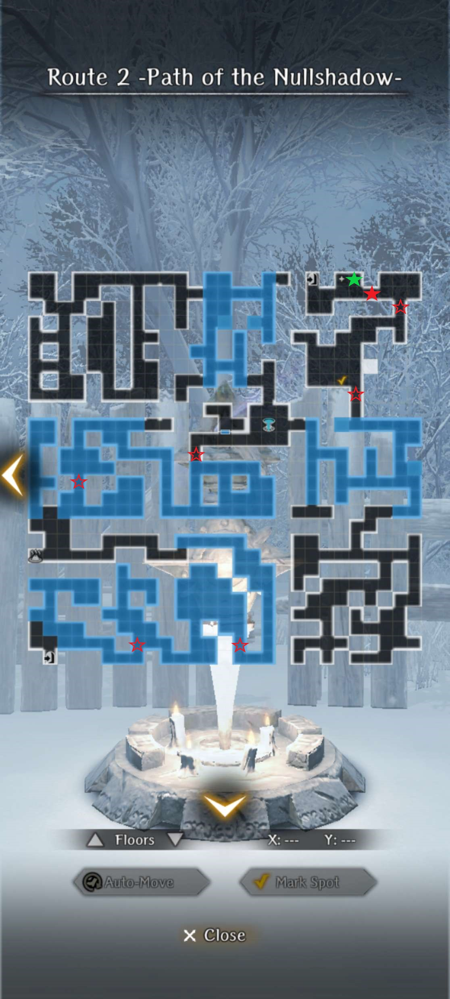

# Deepersnow Hinterlands

!!! warning "Work In Progress"
    - Ctrl + F5 to refresh the page for new updates

## Snowy Forest Minor Harken

### Recovery of Salted Pork

??? warning "Important Notes"

    - No pre-requisite requests
    - Recommend entering Route 2 from the Route 1 Harken as the boss's location is based on your starting point. Entering from the Route 2 Harken has the boss fight commence in a blizzard zone, which makes the fight significantly more difficult
    - Bigfoot fights at discovery points can be as challenging as the boss and you may encounter more than one in a single run
    - Side areas do not contain discovery points
    - Bring SP items in case of multiple Bigfoot fights

??? note "Request Guide"

    === "Walkthrough"
    
        - Accept the request and enter Route 2 via the Route 1 Harken (recommended) or the Route 2 Harken. 
        - The objective is to traverse all of Route 2 from beginning to end to locate the stolen Salted Pork.
        - At 6 fixed locations (red stars) along the main path the Bigfoot Child will stop and make a sound. After the short scene you have the option to "Let it go" or "Stop it". If you opt to let it explore, then 3 randomized events can occur: 
        - You will need to "Let it go" at least 4 times and one of those events must be a Bigfoot fight. Otherwise, the boss will not appear and the request will fail. Use the Fountain and hot spring on the floor to recover prior to engaging the boss (filled-in red star).
        - The boss fight is against a Bigfoot + 2 Bigfoot Child in the frontline, 2 Bigfoot Child in the backline.
        - After the fight you will be given the option to "Spare" or "Kill" the Bigfoot and its child. The only difference is the former gives a new bondmate and the latter gives additional gold. 
        - Remember to pick up the Salted Pork (green star) next to the Harken before exiting. It's easy to miss.
        - Return to the Guild and submit the request.

            ??? warning "Rewards"
            
                ??? note "Spare"
                - Gem of Org x20 (one-time only)
                - 8,000 Gold
                - Bigfoot's Offspring (Accuracy) 
                - Triffia removed from inventory 
                
                ??? note "Kill" 
                - Gem of Org x20 (one-time only)
                - 8,000 Gold 
                - Additional gold from request giver

    === "Map"

        ??? Map "Discovery Points"
        
            

            
            

    
    === "Bigfoot Child Audio Cues"
        - "Awooooon! Awooooon!" text with a "Mrrr" sound = Bigfoot fight 
        - "Kyoh! Kyoh!" text with a "Kyoh! Kyoh!" sound = Triffia 
        - "Kyoh! Kyoh!" text with a "Kyoh!" sound = Deep-snow Mushroom  
      
## Village Shut Away in Silence 

### Find My Sister Lisa

??? warning "Important Notes"

    - No pre-requisite requests

    "Perfect" Ending Requirements:
    
    - Knowledge of [reversing nullstones](./important-request-gwo.md#saving-iris) (clear 3rd GWO fight)
    - The nullstone in the upper left-hand corner of Route 3 cannot already be reversed before you accept the request
    - Cursed Wheel - Short Rest in the Cabin
        - North Lakeshore Cabin - "Fixed it up" as Maya needs to be accessible 
        - Village Adults - "Secured all of them" 
        - If the "Capture the Villagers" request is active, then Maya will not leave the cabin
    
??? note "Request Guide"

    - Accept the request from Marta at the Guild and go to Route 3.
    - Head to the Mayor's house in the middle of the map. Obtain the Town Register from the desk and then tap the shiny object on the bottom right of the bookcase for a box ("Box Carved with a Snowdrop Motif"), crude map, and a doll.
    - Step outside and watch a cutscene of hostile animals and monsters invading the town.
    - The objective is to kill all 7 enemy groups throughout the town and find the 3 hidden boxes drawn on the crude map. The final (third) box is not accessible until the end of the request. 

        ??? map "Hidden Box Locations"
        
            

            
            

            
            - Hidden Item 1: (X:7, Y:10) - Bottom-right area by the graveyard 
            - Hidden Item 2: (X:21, Y:1) - Bottom-left area by the 2 houses 
        
        ??? map "Enemy Locations"
        
            - Outside the Mayor's house - 3 Hobgoblins frontline, 3 Goblins backline
            - Path behind Mayor's house - 2 Ice Slimes + 1 Bigfoot frontline, 2 Ice Slimes + Ice Vorpal Bunny in the middle, and Bigfoot Child + Ice Slime backline
            - Top left house area - 2 Snow Wolves + 1 Bigfoot frontline, Snow Wolf + Bigfoot Child backline
            - Bottom right house area - 3 Hobgoblins frontline, 3 Goblins backline
            - Bottom middle house area - 2 Goblins frontline, 2 Goblins backline
            - Bottom middle house area (stationary): 2 Goblins frontline, 2 Goblins backline
            - Bottom left house area: 2 Ice Vorpal Bunnies, 3 Ice Slimes in the middle, 2 Bigfoot Child backline
        
     - Go to the upper-left house and reverse the nullstone in the backyard. If you cannot do so, then the request will fail upon exiting.
     - If you have finished all the listed steps, then Lulu will inform you the request is completed. If not, then you likely missed one of the roaming enemy groups. 
     - Return to the Guild, submit the request, and receive 10,000 Gold, 1 Junk, and Gem of Org x20 (one-time only).
     - Head to Route 9, enter the cabin, and speak with Maya by the fire. Return with Maya to the top-left nullstone in Route 3 to watch a cutscene.
     - The route is now open. Go down the path and prepare for a challenging fight against a Snowpeak Cyclops + Hobgoblin in the frontline, 3 Ice Slimes backline.
     - Pick up the last hidden box further down the path at (X:0, Y:16). Return to Maya and the Stonefolk for a cutscene. 
     - Head back to the Guild and speak with Marta to view the perfect ending. 

        ??? warning "Rewards"

            - Achievement - "The Two are Always Together"
            - Bondmate - Maya and Auntie Marta (Fear Tolerance)
            - 12,000 Gold   

## Blizzard Blocking the Path

### Find My Kitty

??? warning "Important Notes"

    - Pre-requisite requests:
        - [Recovery of Salted Pork](./requests.md#recovery-of-salted-pork) 
        - [Find my Sister Lisa](./requests.md#find-my-sister-lisa) 
    - The request will always end in failure if the pre-requisites are not completed beforehand
    - The Dried Fish Fragment from the little girl at the Guild is required to prevent the kitty from running away
    - Exiting to the world map and returning results in automatic request failure 
    - To reset, Cursed Wheel to Blizzard Blocking the Path, which will reset the request while keeping the pre-requisites flagged as completed

??? note "Request Guide" 

    - Accept the request and if all prerequisite requests are completed, then the little girl will give you the Dried Fish Fragment before you leave the Guild.
    - Head to Route 4. The kitty will always be located in one of the 3 non-removable blizzard zones. The challenge is that the white Nullshadow will pursue you as you search. It often appears behind you immediately after entering a blizzard zone.
    - Running away more than twice will result in request failure. Instead, let the Nullshadow kill your entire team as it will immediately despawn upon reviving and you can search freely. Some blizzard zones have side areas of 1-2 normal tiles that can also despawn your pursuer.
    - Finding the kitty is basically a game of hot-and-cold. As you explore it will make audible sounds with pop-up flavor text depending on your distance from its tile. The kitty will always be in the brush (i.e., walls). Although its location is randomized it seems to prefer being somewhere close to the swirling blizzards.

        ??? note "Meow-chanics ₍^. .^₎"
        
            - "You catch a faint, barely audible cray of some unseen creature" = Many tiles away, usually when you first enter the blizzard zone
            - "You catch a soft, thin mewing from somewhere. It sounds like a cat" = Few tiles away 
            - "You catch the sound of a mewing cat nearby. It seems somewhere close by" = Within 1-2 tiles

    - Catch the kitty once in each of the 3 blizzard zones. On the third attempt use the dried fish, which will complete the request.
    - The kitty is now permanently located at the Guild. It can also see Lulu!

        ??? warning "Rewards"
    
            - Gem of Org x20
            - 12,500 Gold
            - Deepsnow Hinterlands Roar Junk
            - Deepsnow Hinterlands Fey Roar Junk 

### Witch Hunt in Elden Hill Village (1st Faction Request)

##### Overview 

The faction requests are unlocked after entering Route 4 for the first time. The objectives of each faction are slightly different, but they all focus on stopping the witch burnings in Elden Hill Village and identifying the underlying cause.    

- Upon returning to Isberg a messenger will ask you to return to Royal Capital Luknalia
- Go to the Guild, speak with Arna, and accept the invitation
- If you leave immediately, then to accept the request in the future select "Talk" in the Guild
- All of the faction requests take place in Elden Hill Village and share the same map  

??? warning "Important Notes"

    ??? note "Faction Affinity"
    
        - Supporting a faction in a previous Abyss influences certain outcomes 
        - Max faction affinity requires selecting that faction in the Cursed Wheel for Abyss 2 and 3
        - Max faction affinity is mandatory for the Best endings, 2 Guiding Lights (Luck), unique Calm Wind gear, and extra junk rewards
        - Faction affinity is denoted with a *
    
        !!! warning "Set max faction affinity in the Cursed Wheel before starting to avoid potentially having to redo an ending" 
    
    ??? note "Faction Endings" 
        
        - 10 unique endings across all factions have been identified 
        - Some endings may have been missed as of 12/26 
        - Known endings are sufficient for unlocking the 2 Guiding Lights (Luck)
        - Princess faction is listed with 4 endings as the Best ending has 2 distinct sub-endings with different rewards and scenes 
    
        **Endings per Faction**
    
        - Princess = 4 
        - Pontiff = 3
        - Admiral = 3
        - Total = 10 

    ??? note "Reset Faction Request" 
    
        - Deepsnow Hinterlands Entrance > Blizzard Blocking the Path (Route 4 entrance) > Exit via Route 3 Harken
        - Deepsnow Hinterlands Entrance > Minor Harken Beyond the Blizzard (Route 5 Harken) > Exit via nearby Harken
    
    ??? tip "Guiding Lights"
    
        **Unlock Conditions (as of 12/27)** 

        - The unlock conditions for the 2 Guiding Lights (Luck) are not consistent with Discord members reporting the following:
            - Clear any Best ending
            - Clear all 3 Best endings
            - Clear the True ending (GWO 4th fight)
            - Clear the True ending (GWO 4th fight) + redoing the Best Endings until it appears
        - If one of these requirements does not work, then try the others 
        - Likely a bug is present unless Drecom programmed multiple unlock conditions for the same Guiding Light 
        - Max faction affinity is required (confirmed)
        - A Guiding Light will dissolve if it's already been received (confirmed)
        - Please DM or ping @lightbearer on the Discord if you can confirm or provide additional information 

??? note "The Witch's Cave"

    ??? note "Summary"
        - Each faction can only access certain areas of the map
        - Map progress is permanently recorded
        - Full map completion requires doing other faction quests
        - Stone pillars block pathways, cannot be move, and their locations change depending on the faction  
        - Faction objectives are completed only in Elden Hill Village and the Witch's Cave 
        - Enemy level is 65
        - Some chests have high Find/Trap Disarm requirements even at 150/150
        
            ??? warning "Sleep Tiles"  
                
                - A new dungeon mechanic that limits traversal 
                - After 10 steps you will lose consciousness and be teleported back to your starting point 
                - During an enemy encounter all team members will be asleep at the start of battle  
                - Aggro and bait enemies onto normal tiles for easier fights

    ??? map "The Witch's Cave - B1F"    
        

        
        

    
    ??? map "The Witch's Cave - B2F" 
        

        
        

##### Chancellor Serpens (Princess) Route 

The goal of the Princess route is to solve Rosa's mysterious affliction that the villagers believe is the work of a witch. Pulgritte thinks that if Rosa is cured, then the villagers will stop the witch burnings. To develop a solution, you can consult with an Herbalist, Physician, or Mystic. 

??? note "Princess Ending Guides"

    ??? note "Bad Ending - Consult with an Herbalist"
        - Speak to the Herbalist in town 
        - She recommends using Sleepmoss that grows in the Witch's Cave 
        - Enter the Witch's Cave 
        - From the entrance head south and follow the path to the "sleepy tunnel" area (blue bubble tiles)  
        - Collect the 3 Sleepmoss 
    
            ??? map "Sleepmoss Locations"
                

                
                

                
        - Use the small islands of normal tiles to reset the 10-step counter to progress deeper into the area 
        - Exit 
        - Speak to the Herbalist in town
        - Ending sequence begins automatically 
    
            ??? warning "Rewards"
                - 8,000 Gold
                - 2 Junk*
                - Scroll of Inferno
    
    ??? note "Good Ending - Consult with a Physician"
    
        - Speak to Raimi in town and he will privately evaluate Rosa
        - Upon returning recommends Slatewillow as a cure 
        - Enter the Witch's Cave 
        - The Slatewillow is located at the end of a long, one-way path through B1F and B2F 
        - Requires going through part of the "sleepy tunnel" area (blue bubble tiles)
        - Low-level teams should consider bringing MP and SP pots as insurance
        - From the entrance head to the southeast to access a dropdown point to B2F 
        
            ??? map "Dropdown to B2F"
                

                
                

            
        - The room you drop into has 4 enemies in a small space
        - Follow the path west and then north (southern stairs are a dead end)
        - The side area with the Cyclops + Bigfoot fight is optional as it has no special items or impact on the ending
        
            ??? danger "Cyclops + Bigfoot"
            
                - More details to be added soon
                - Battle is against a Cyclops (~25,000 HP) and a Bigfoot, both level 70 
                - At ~80% HP the Cyclops will summon another Bigfoot
                - Cyclop's "Wheeling Cleave" can kill multiple team members 

        - Head north and take the stairs to B1F
        - Go south through the "sleepy tunnel" area (blue bubble tiles)                    
        - The Slatewillow is in front of the teleporter and will be automatically picked up
        - Exit 
        - Speak with Raimi in town  
        - Ending sequence begins automatically 
    
            ??? warning "Rewards"
                - Achievement: "A Terrible Nightmare"
                - 15,000 Gold 
                - There is no known way to avoid this ending 
    
    ??? tip "Best Ending - Consult with a Mystic*"
        
        - The Aegon Route* leads to the Best ending and requires max faction affinity
        - The default Mystic Route has a different map arrangement and quest giver
        - The Fellwisp will only spawn on the Aegon Route although the Cyclops + Bigfoot fight is available on both 
        
        ??? tip "Best Ending - Aegon Route*"
        
            - Speak to Dylanhardt in town 
            - Select the option to return to the Royal Capital 
            - Meet with Aegon and he recommends Fellwisp to cure Rosa and Sar-moon Herb to calm the villagers
            - Return to Elden Hill Village 
            - Enter the Witch's Cave 
            - Go north and down the stairs to B2F
            - Both request items are located on this floor 
            
                ??? note "Fellwisp"  
                    ??? map "Fellwisp Location"
                        

                        
                        

            
                        - Located in B2F in a side room behind the Cyclops. Don't forget to pick it up after the battle!
                        - Defeating the Cyclops is required for the Best ending
                        - A challenging fight during the early game and you may have to return at a higher level or with better gear 
                        - Will not respawn once defeated
                        
                    ??? danger "Cyclops + Bigfoot"
    
                        - More details to be added soon
                        - Battle is against a Cyclops (~25,000 HP) and a Bigfoot, both level 70 
                        - At ~80% HP the Cyclops will summon another Bigfoot
                        - Cyclop's "Wheeling Cleave" can kill multiple team members 
    
                ??? map "Sar-moon Herb Location"
                    

                    
                    

                    
                    - Located in the northeast area and requires reversing a stone to access
                    - Multiple enemies will spawn after it is picked up  
    
            - Exit 
            - Speak with Dylanhardt in town 
            - Ending sequence begins automatically 
                - The "Foolish parent" or "Foolish child" option does not seem to impact the endings
                - After the scene Pulgritte and Dylandhardt will leave 
                - Choose whether to tell Mayor Oswald the truth about Rosa's true nature 
    
            ??? warning "Ending Choices"
            
                ??? note "Sub-Ending A: "Tell the Truth"*"
                
                    !!! warning "Rewards"
                        - Achievement: "One Who Carries the Future of Her Land"
                        - 11,000 Gold 
        
                ??? note "Sub-Ending B: "Do Not Tell the Truth""
                    - The options to threaten Rosa do not seem to have any impact on the ending
        
                    !!! warning "Rewards"
                        - Achievement: "One Who Carries the Future of Her Land"
                        - 9,000 Gold 
                        - 1 Junk*
    
        ??? note "Bad Ending - Mystic Route"
    
            - Enter the Witch's Cave 
            - Head south to the person icon on the map
            - Speak with the Mystic and select "Talk about Elden Hill Village"
            - The Mystic recommends using Sar-moon Herb to calm the villagers 
            - Head downstairs to B2F 
            
                ??? map "Sar-Moon Herb Location"
                
                    

                    
                    

                     
                    - Located in the northeast area and requires reversing a stone to access
                    - Multiple enemies will spawn after it is picked up  
                
            - The side area with the Cyclops + Bigfoot is optional. It has no items or impact on the ending
           
                ??? danger "Cyclops + Bigfoot"
                
                    - More details to be added soon
                    - Battle is against a Cyclops (~25,000 HP) and a Bigfoot, both level 70 
                    - At ~80% HP the Cyclops will summon another Bigfoot
                    - Cyclop's "Wheeling Cleave" can kill multiple team members 
    
            - Return to B1F 
            - Speak to the Mystic and give her the Sar-Moon Herb 
            - Go north to exit 
            - Speak with Dylanhardt  
            - Ending sequence begins automatically 
    
                ??? warning "Rewards"
                    - 9,000 Gold
                    - Calm Wind Crest
                    - 2 Junk
                    - Same ending scenes as "Bad Ending - Consult with an Herbalist" 

##### Pontiff Route

The Pontiff route is a race against time to discover the identity of the witch to stop the ongoing witch burnings. The goal is to open the door to the witch's room on B2F as fast as possible. 

A demonic brazier blocks entry to the witch's room until you have made a certain number of offerings. However, each time you return to town for an offering an innocent person is burned.  

??? warning "Mechanics" 

    ??? note "Brazier Offerings"

        ??? note "Process"
            
            - Interact with the brazier and it will request an offering
            - Collect the offering via fighting enemies or returning to town 
            - Give the offering to the brazier to unlock a nearby door 
            - Investigate the unlocked area until Lulu makes a comment 
            - Return to the brazier for a new offering request 
            - Repeat until the witch's door is unlocked
            - On a subsequent run you can speak with Tenet in town to reduce the total number of offering requests
        
        ??? note "Requests"
        
            - Request 1 - 3 Rabbits - Defeat 3 different enemy groups with vorpal bunnies
            - Request 2 - Hen - Return to town and speak with Tenet
            - Request 3 - Living Blood - Defeat 2 different enemy groups with "monsters" (magical-beast, demi-human)
            - Request 4 - Infant (Lamb) - Return to town and speak with Tenet
            - Request 5 - Sheep - Return to town and speak with Tenet
    
        ??? note "Tenet Town Offerings" 
        
            - Only available after a first run
            - Talk to Tenet in town before entering the Witch's Cave
            - Select 1 of the 3 offerings in advance, reducing the total number of brazier requests 
        
            **Total Brazier Requests**
            
            - Do not talk to Tenet = 5 
            - Hen = 4  
            - Infant (Lamb) = 2 
            - Sheep = 1 (Unlocks the witch's door) 
    
    ??? note "Witch Burnings"
    
        - Returning to town for an offering results in a witch burning
        - The total number of witch burnings determines whether Elencia is alive or dead after the boss fight
    
        **Elencia's Status** 
        
        - Witness 0-3 witch burnings = Elencia alive
        - Witness 4+ witch burnings = Elencia dead
        - The exact requirement for triggering a witch burning scene are unclear. Based on limited testing:
            - Number of battles and/or 
            - Returning to town after giving an offering, but before accepting the next brazier request

??? note "Pontiff Ending Guides"

    ??? warning "Requirements"
    
        - Total of 3 confirmed endings based on the number of witch burnings witnessed and dialogue choices in the final scene if Elencia is alive
        
        **Endings** 
        
        - Bad - Elencia dead (4+ witch burnings) 
        - Good - Elencia alive (0-3 witch burnings) + "Tell the Truth" 
        - Best - Elencia alive (0-3 witch burnings) + "Condemn the Witch" 
    
        **Rewards**
        
        - Junk rewards are reduced if any witch burnings are witnessed
        - Full gold reward is always given

        ??? note "What Ending Should I Do First?"
    
            **If you plan to do all 3 endings:**
        
            - "Bad Ending - Elencia Dead" is recommended since you have to do all 5 brazier offering requests on a first run
            - Returning to town _only_ for the brazier offerings results in 3 witch burnings = Elencia Alive 
            - An Extra step is required 
                - Return to town an additional time after giving the brazier 3 Rabbits or Living Blood to see a 4th witch burning = Elincia Dead 
            - Select the Sheep in town from Tenent for the other 2 endings (Good, Best)
            - The Sheep immediately unlocks the witch's door, ensures 0 deaths, and Elencia will be alive after the boss fight 
        
            **If you only want the Guiding Light (Luck):** 
        
            - "Best Ending - Elencia Alive - "Condemn the Witch""
    
    ??? note "Bad Ending - Elencia Dead"
         
        - First run - Must witness a 4th witch burning 
        - Second run - Do not speak with Tenet + must witness a 4th witch burning
        - Enter the Witch's Cave 
        - Complete all 5 brazier offering requests
        - Returning to town for only the offering requests = 3 witch burnings = Elencia is alive after the boss fight (you do not want this)
        - An _additional_ trip back to town to witness the 4th witch burning is required
        - Recommend going after giving the brazier the 3 Rabbits or Living Blood
        - When returning to the brazier with the Sheep additional enemies will spawn ("ROAR") in B2F
        
            ??? danger "Boss: Witch"
                - Details to be added soon 
    
        - Elencia will be dead after the boss fight 
        - Exit 
        - Return to town 
        - Ending sequence begins automatically 
        
            ??? warning "Rewards"
                - Achievement: "A Witch There Was" 
                - 9,000 Gold
                - Achievement is shared with "Admiral - Good Ending - Elencia Dead" and can only be received once
    
    ??? note "Good Ending - Elencia Alive - "Tell the Truth""
    
        - First run - Automatically if returning to town only for the offering requests (3 witch burnings)
        - Subsequent runs - Talk to Tenet in town and select the Sheep (0 witch burnings) 
        - Enter the Witch's Cave
        - Additional enemies will spawn ("ROAR") along the B2F path to the brazier
    
            ??? danger "Boss: Witch"
                - Details to be added soon
    
        - Elencia will be alive, but unconscious after the boss fight 
        - "Examine the body"
        - "Examine the head" 
        - "Pull it out" (Forced to select)
        - Exit 
        - Return to town 
        - Ending sequence begins automatically 
        
            - "Prepare yourself" (Either choice has no known impact, "Prepare" skips a fight)
            - "Tell the Truth"
            
            ??? warning "Rewards"
            
                - 11,000 Gold
                - 2 Junk (requires Sheep for 0 deaths)
    
    ??? tip "Best Ending - Elencia Alive - "Condemn the Witch"*"
    
        - First run - Automatically if returning to town only for the offering requests (3 witch burnings)
        - Subsequent runs - Talk to Tenet in town and select the Sheep (0 witch burnings) 
        - Enter the Witch's Cave
        - Additional enemies will spawn ("ROAR") along the B2F path to the brazier
    
            ??? danger "Boss: Witch"
                - Details to be added soon
    
        - Elencia will be alive, but unconscious after the boss fight 
        - "Examine the body"
        - "Examine the head" 
        - "Pull it out" (Forced to select)
        - Exit 
        - Return to town 
        - Ending sequences begins automatically   
        
            - "Prepare yourself" (Either choice has no known impact, "Prepare" skips a fight)
            - "Condemn the Witch"
        
            ??? warning "Rewards"
            
                - Achievement: "Condemn the Witch"
                - 17,000 Gold
                - 2 Junk (requires Sheep for 0 deaths)
                - Calm Wind Stun Guard* 

##### Admiral Route

The Admiral's goal is to stop the witch hunts at the request of the elven Kinlord and his representative, Elinas, whose territory is adjacent to Elden Hill Village. To put an end to the witch burnings Pickerel suggests finding a "true" witch, threatening the local cleric to bring in the Cathedral Church, or sedating the villagers.   

??? warning "Mechanics"

    ??? note "Note on Initial Choices" 
    
        - The Admiral route is deceptively structured as the initial choices of "Capture a witch" or "Threaten" have no impact on the ending
        - The number of brazier requests determines whether Elencia is alive or dead after the boss fight
        - Elencia's post-battle status (dead or alive) determines the ending
        - The "Prepare a sedative" option is self-contained and separate from the brazier offerings mechanic    
    
    ??? note "Brazier Offerings"

        ??? note "Process"
    
            - Interact with the brazier and it will request an offering
            - Collect the offering via fighting enemies or returning to town 
            - Give the offering to the brazier to unlock a nearby door 
            - Investigate the unlocked area until Lulu makes a comment 
            - Return to the brazier for a new offering request 
            - Repeat until the witch's door is unlocked
            - On a subsequent run you can speak with Elinas in town to reduce the total number of offering requests
    
        ??? note "Requests"
        
            - Request 1 - 3 Rabbits - Defeat 3 different enemy groups with vorpal bunnies
            - Request 2 - Broom - Return to town and speak with Elinas
            - Request 3 - Living Blood - Defeat 2 different enemy groups with "monsters" (magical-beast, demi-human)
            - Request 4 - Infant (Lamb) - Return to town and speak with Elinas
            - Request 5 - Gold Ore - Defeat 3 back-to-back groups of tough enemies 
        
        ??? note "Elinas Town Offerings" 
        
            - Only available after a first run
            - Talk to Elinas in town before entering the Witch's Cave
            - Select 1 of the 2 offerings in advance, reducing the total number of brazier requests 
            
            **Total Brazier Requests**
            
            - Do not talk to Elinas = 5 
            - Broom = 4 
            - Infant (Lamb) = 2 

??? note "Admiral Ending Guides" 

    ??? warning "Requirements"
    
        - Total of 3 confirmed endings 
        - Possible another ending exists that has yet to be identified (as of 12/22)
    
        **Endings** 
        
        - Bad - Prepare Sedative 
        - Good - Elencia dead (Pick Infant (Lamb) on subsequent runs)
        - Best - Elencia alive (Pick Broom on subsequent runs)
        - On a first run you will always get the Best ending (Elencia alive) since you have to collect all 5 brazier offerings
    
        **Rewards**
        
        - No extra junk is given as a reward on any ending
        - Full gold reward is always given
    
    ??? note "Bad Ending - Prepare Sedative"
    
        - Speak to Raimi in town 
        - Recommends gathering Sar-moon Herb in the Witch's Cave to calm the villagers
        - Enter the Witch's Cave 
        - Head north and down the stairs to B2F
        
            ??? map "Sar-Moon Herb Location"
                

                
                

             
                - Located in the northeast area and requires reversing a stone to access
                - Multiple enemies will spawn after it is picked up  
            
        - The side area with the Cyclops + Bigfoot is completely optional. It has no items or impact on the ending
        
            ??? danger "Cyclops + Bigfoot"
            
                - More details to be added soon
                - Battle is against a Cyclops (~25,000 HP) and a Bigfoot, both level 70 
                - At ~80% HP the Cyclops will summon another Bigfoot
                - Cyclop's "Wheeling Cleave" can kill multiple team members 
                
        - Exit
        - Speak with Raimi in town
        - Ending sequences begins automatically   
    
            ??? warning "Rewards"
                - 7,000 Gold
                - Scroll of Torrent 
                - Admiral is displeased with this approach 
    
    ??? note "Good Ending - Elencia Dead"
    
        !!! warning "Can only be done on a subsequent run"
         
        - Select "Capture a witch" or "Threaten" it does not matter 
        - Speak with Cleric Ludwin in town and confirm you will help search for the witch
        - Speak with Elinas and pick the Infant (Lamb) 
        - Enter the Witch's Cave 
        - Head south and take the stairs down to B2F 
        - Go up and to the right to the large room with multiple doors  
        - Interact with the brazier 
        - Offer the Infant (Lamb) and explore the SE room at the end of the path until Lulu comments 
        - Return to the brazier and it will request the Gold Ore 
        - Go back upstairs to B1F  
        
            ??? note "Gold Ore"
        
                ??? map "Gold Ore Location" 
                
                    

                    
                    

                    
                    - Located directly across from the entrance 
    
                ??? danger "Enemy Gauntlet"
                
                    - Before picking up the Gold Ore a group of 3 enemies will appear behind you
                    - Forced to fight a series of back-to-back battles with tough enemies
            
                    **Fights** 
                    
                    - Fight 1: 2 Big Slime (front); Evil Eye (back)
                    - Fight 2: Greater Demon and Lesser Demon (front); 2 Succubus (back)
                    - Fight 3: 3 Bigfoot Child (front); Bigfoot (back)
                    - Battle strategy to be added soon
    
        - Exit 
        - Rest at the inn to recover for the upcoming boss fight 
        - Return to the brazier and offer the Gold Ore to unlock the witch's room 
    
            ??? danger "Boss: Witch"
                - Details to be added soon
    
        - Elencia dies after the boss fight 
        - Exit 
        - Return to town 
        - Ending sequences will begin automatically  
    
            ??? warning "Note on Ending Choices" 
        
                - Outside a few different lines of flavor text, the 2 choices presented when consoling Cleric Ludwin and reporting to the Admiral all lead to the same ending and 14,000 gold reward 
                - This differs from the Princess route where the ending choices _do_ lead to modified sub-ending scenes and different rewards
                - This could potentially be a bug or there is some combination of responses that has not yet been identified  
            
            ??? warning "Rewards"
            
                - Achievement: "A Witch There Was" 
                - 14,000 Gold
                - Calm Wind Resistram* 
                - Achievement is shared with an ending in the Pontiff route ("Bad Ending - Elencia Dead") and can only be received once
                - The Admiral is satisfied with this outcome 
    
    ??? tip "Best Ending - Elencia Alive"
    
        - First run - You will always receive this ending on a first run since you have to complete all 5 offering requests 
        - Subsequent runs - Pick the Broom from Elencia in town
        - Select "Capture a witch" or "Threaten" it does not matter 
        - Speak with Cleric Ludwin in town and confirm that you will help search for the witch
        - Enter the Witch's Cave 
        - Head south and take the stairs down to B2F 
        - Go up and to the right to the large room with multiple doors  
        - Interact with the brazier 
        - Complete the 5 offering requests 
        
            ??? note "Gold Ore Offering"
        
                ??? map "Gold Ore Location" 
                    

                    
                    

        
                    - Located directly across from the entrance 
        
                ??? danger "Enemy Gauntlet"
                
                    - Before picking up the Gold Ore a group of 3 enemies will appear behind you
                    - You will have to fight a series of back-to-back fights with tough enemies
            
                    **Fights:** 
                    
                    - Fight 1: 2 Big Slime (front); Evil Eye (back)
                    - Fight 2: Greater Demon and Lesser Demon (front); 2 Succubus (back)
                    - Fight 3: 3 Bigfoot Child (front); Bigfoot (back)
                    - Battle strategy to be added soon
    
        - Exit and rest at the inn to recover for the upcoming boss fight 
        - Return to the brazier and offer the Gold Ore to unlock the witch's room 
    
            ??? danger "Boss: Witch"
                - Details to be added soon
    
        - Elencia is alive, but unconscious after the boss fight 
        - Exit 
        - Return to town 
        - Ending sequences will begin automatically  
        
            ??? warning "Rewards"
                - Achievement: "You Are Permitted to Call My Name, But Only Once" 
                - 19,000 Gold
                - The Admiral is pleased with this outcome

## Minor Harken Beyond the Blizzard

### Special Local Delicacy

This request doesn't have any pre-requisites.

- Get the request and head to Route 5.
- Simply go to every Ice Storm zone, including ones that have trees that can be reversed. Typically the interaction zone is near the middle of the zones. When you enter the cutscene, you will get a description of the zone. These conditions are always randomized on every run. You are allowed to go to a spot and leave and come back later.
- The options here are "The air here feels dry to you",  "You can feel a brisk breeze, gusts rippling your clothing", "There is a slight dampness in the air here". You are looking for "The air here feels dry to you".
- Upon selecting a spot, simply go through a 3 stage battle similar to that of previous abyss. You may tap out at any time. It is ideal to select a dry location where the Ice Storm may be removed via Right Hand of Reversal technique if possible.
- There are two known variations of battles
      1. 1st battle = 3 Goblins frontline + 1 Hobber backline. 2nd battle = 3 Snow Wolves frontline + 2 Baby Bigfoot backline. 3rd Battle = 3 Snow Wolves frontline, 2 Snow Hawks in the middle, 1 Big Snow Hawk backline.
      2. 1st battle = 3 Goblins frontline + 1 Hobber backline. 2nd battle = 3 Snow Slimes frontline, 3 Ice Clouds in the middle, 2 Ice Clouds backline. 3rd Battle = 2 Snow Hawks frontline, 2 Snow Hawks in the middle, 2 Big Snow Hawks backline.
- Once all 3 battles are completed, you are teleported back to the tavern with the requests completed. You will obtain some gold and an ice-wind trout.
- While the conditions are not entirely known, some suggestions involve doing the fight with the ice storm active in the area, and then taking extra time in the last fight (essentially become frozen). Upon completion, you will get an Ultimate Ice-Wind Trout instead, which heals slightly more than the normal trout. In addition, you will get a bondmate.

## Slaying the White Wolves

### Unforgivable Wolves

??? warning "Important Notes"

    - Pre-requisite request: 
        - [Special Local Delicacy](./requests.md#special-local-delicacy) 
        - If not completed the request will automatically fail otherwise 
    - Entering from the Route 6 Harken allows you to reverse the blizzard zones in advance before fighting
    - Cursed Wheeling twice on Truth of the Beautiful Ore and then wheeling to Slaying the White Wolves will automatically reverse all blizzard zones
    - There is no special text, sound, or battle music to signal a wolf pack encounter aside from the boss fight
    - Route 6 is extremely enemy dense with a high respawn rate, so try to avoid enemies or prepare accordingly
    - The Snow Wolf Leader is on par difficulty-wise as the Route 6 boss

??? note "Request Guide"

    - The objective is to hunt 4 wolf packs scattered across Route 6. The wolf pack locations are static, do not move on the field, and the order fought does not matter. 
    - The enemy composition of each fight progresses in a fixed order.

        ??? map "Wolf Pack Locations" 
        
            

            
            

            - (X:11,Y:19) - Southwest of the Fountain
            - (X:5,Y:18) - Next to upper-left reversal stump
            - (X:16,Y:16) - Northeast of middle reversal stump
            - (X:4,Y:1) - Southwest corner in blizzard zone (cannot reverse)
            - (X:1, Y:23) - Far northwest corner 

        ??? note "Wolf Pack Encounters"
        
            - Wolf Pack 1 - 4 Snow Wolves in a row
            - Wolf Pack 2 - 5 Snow Wolves, 3 in the front, 2 in the back
            - Wolf Pack 3 - 6 Snow Wolves, 3 in the front, 3 in the back
            - Wolf Pack 4 - 4 Snow Wolves in the front, 1 Snow Wolf Leader in the back
    
    - The wolf packs at (X:1, Y:23) and (X:11, Y: 19) are in a reversible blizzard zone and close to the Fountain. Recommend saving either for the boss fight. Do not leave the wolf pack in the bottom left at (X:4, Y:1) for last otherwise the boss will be fought in a blizzard.  
    - After defeating 3 wolf packs the 4th encounter will be a boss fight against the Snow Wolf Leader.
    - (Subsequent runs) A new option will appear to spare the Snow Wolf Leader. This skips the boss fight and gives a bondmate, Warg, Commander of the Deep Snow (Freeze Tolerance and Evasion). 
    - Exit and return to the Guild to submit the request.

        ??? warning "Rewards"
        
            - Gem of Org x20 (first-time only)
            - Snow Wolf Trapper Hat
            - 5,000 Gold 
            - Additional reward - 22,000 Gold 
            - Bondmate - Warg, Commander of the Deep Snow (subsequent runs only)

## Passed Through the Coal Mine

### Ore Mining

You need to complete Unforgivable Wolves. Otherwise, this request will automatically fail.

- Head to Route 7 from Route 6 Harken. This is because you will need to access both Route 7 to Route 8 entrances.
- The gist of this request is that you're picking up some rocks (shiny objects on the floor) in Route 8.
- The location of several high value rocks are typically static. For example, (X:4,Y:8) and (X:26,Y:21) are guarded by 2 Stonefolk frontline, and 2 Lamenting Snowfolk backline. They have much higher HP and DEF than randomly encountered ones. These rocks are silver ore.
- After collecting 5 rocks, return to turn them in. The merchant will test you on which rocks you think are most valuable and which are cheapest. He will pay you accordingly.
- After potentially getting scammed, he will answer what type of rock is what type of material. Request completed.
      1. Small Heavy White Stone = Silver, which coins are made of.
      2. Stone with Yellow Specks = Gold, but small amount so only worth 1/10th of a coin.
      3. Large Reddish Brown Stone = Iron (in high demand)
      4. Large Brownish-Green Stone = Copper (not worth much)
      5. Black Stone = Coal (not worth much)

??? map "Ore Locations"

    

    - Double marks = Boss enemy guarding ore

## Short Rest in the Cabin

### Search for the Missing Persons (2nd Faction Request)

##### Overview 

The faction requests are unlocked after entering Route 9 for the first time. The objective is to search for traces of two missing people and to discover why the faction called upon you, the Masked Adventurer, instead of employing their own members. 

Upon entering the Royal Capital, the faction representative will appear to discuss the missing persons. 

- Agree to help twice when prompted
- Head to the Guild and accept the request under the Royal Capital tab 
- If you decline at any point the faction representative will not appear again and the Cursed Wheel must be reset

??? warning "Important Notes"

    ??? warning "Best Ending Requirements"
    
        - Knowledge of [reversing nullstones](./important-request-gwo.md#saving-iris) (clear 3rd GWO fight)
        - Knowledge of [shortcuts](./important-request-gwo.md#learning-the-truth) to open the mine walls on Route 7 to speed up the search (optional) 
        - Cursed Wheel - Short Rest in the Cabin
            - North Lakeshore Cabin - "Fixed it up"
            - Dwarves' Cave - Any
            - Village Adults - "Did not encounter them"
                - If the village adults have been captured, then the first body will be in poor condition and the request will end. This outcome is a node in the Cursed Wheel and can be missed 
    
    ??? note "Reset Faction Request" 
    
        - Deepsnow Hinterlands Entrance > Short Rest in the Cabin 
        - Subsequent runs - "Did not take the request" under the "Search for..." sub-menu
    
    ??? danger "Warning! Blind Runs" 
    
        - Strongly recommend _not_ doing a blind run
        - The majority of the request is searching for interactable objects (white shiny stars) across multiple floors
        - Interactable objects are easy to miss in snowy environments, do not have sound cues, and often do not appear unless you are standing directly on its tile  

??? note "Bigfoot Cave"

    ??? note "Summary"
    
        - Location of the second missing person for all 3 faction requests
        - Requires knowledge of [reversing nullstones](./important-request-gwo.md#saving-iris) (clear 3rd GWO fight)
        - Map completion resets upon Cursed Wheeling
        - Mandatory Bigfoot boss fight
        - Not a mob dense area during the request with few fights on the path to the boss's room 
        - Primary danger is being Chilled or Frozen before reaching the boss
        - Enemy level is 70
        - Enemies: Bigfoot, Bigfoot Child, Ice Cloud, Snow Slime, Abyssal Insects, Ice and Earth Entities
    
    ??? map "Bigfoot Cave"
    
        

        
        

##### Faction Request Guides 

??? note "Princess Route - Search for Missing Royal Knights"

    1. Head back to Isberg. Talk to Old Lady NPC in town and pay 300G. Head to the Inn, talk to the NPC and pay 300G.
    2. Head to Mayor's House in Route 3 and obtain a faction-related Helmet and the Rockhome Village Key. To avoid a long walk through the spike traps, return to the Harken and select Route 2. From the Route 2 Harken re-enter Route 3.
    3. Head to the two locked houses on the bottom-left side of the map. The top house will contain some faction-related clothing. The left house will contain an ambush after passing by the 1st door inside. Defeat all 6 Desert Insects and collect the faction-related insignia on the floor.
    4. Head to the house at the bottom middle of Route 3 (where Mike, one of the village adults, was killed by goblins). Enter the house and find the body of one of the Royal Knights.
    5. Head back to the Royal Capital's Adventurer's Guild and turn in the body for revival. Gain some more information about the situation and about how the other person leaves wax tablets ("tablets") as clues.
    6. Head back to Route 3 and find the tablets in this order: 
        - (X:11, Y:25) - Northwest of the Harken on the ground by a tree
        - (X:26, Y:24) - Few steps southeast of Route 4 entrance
    7. Harken to Route 6 and enter Route 7. Find the tablets in this order: 
        - (X:13, Y:23) - Central 3x3 room 
        - (X:16, Y:22) - Right-hand dead-end of 3x3 room
    8. Exit back to the Route 6 Harken and select Route 7. If you have the shortcut ability and mined the coal walls, then you can walk directly to the tablets. Find the tablets in this order: 
        - (X:19, Y:7) - Northwest of Route 8 stairs
        - (X:18, Y:19) - Northwest of the nullstone icon in a small (2x1) dead-end 
        - (X:15, Y:24) - Few steps south of the Harken
    9. From the Route 7 Harken go left and exit to Route 9. Find the tablet at: 
        - (X:1, Y:7) - Upper left-hand side of the first house in the grass
    10. Return to the Route 7 Harken and select Route 9. From the Route 9 Harken go to Route 10. Find the tablets in this order: 
        - (X:25, Y:4) - Few steps north of Route 10 entrance 
        - (X:20, Y:6) - Tile left of the first Stone God altar
        - (X:1, Y:9) -  From the top of the bottom-left house walk 1 step north 
        - (X:2, Y:15) - First tile in the northwest blizzard zone 
        - (X:3, Y:24) - Directly ahead after exiting the northwest blizzard zone  
        - (X:1, Y:24) - Check the nullstone 
        - Optional: Return to town via the shortcut or use the Route 10 Fountain to recover your team's health for the upcoming boss fight.
    11. Reverse the nullstone and head into the Bigfoot Cave. You will need to make your way to the very last room on the bottom right. 
    12. There will be a Bigfoot boss blocking your way. The fight has the Bigfoot Elder with 1 Baby Bigfoot in the front, and 2 Baby Bigfoot in the back. All of the babies can move twice a turn. After the Bigfoot Elder takes a certain amount of damage, he will Pound Chest and resummon any dead Baby Bigfoot. If any Baby Bigfoot are revived in this manner, they will immediately throw a snowball at a random teammate. From this point on, the Bigfoot Elder will repeatedly Pound Chest will taking any damage, so it's recommended to kill him first before all the babies.
    13. Look into the pile of poop in the next room. The second person you're looking for has red hair.
    14. Bring the head back to the Royal Capital and complete the request.
    15. Reward - Gem of Org x50 (one-time only), 30,000 Gold, Giant Beast Ape Heavy Armor, and Elliot (Attack Power) as a bondmate.

??? note "Pontiff Route - Search for Adherent Acquaintances" 

    1. Head back to Isberg. Talk to Old Lady NPC in town and pay 300G. Head to the Inn, talk to the NPC and pay 300G.
    2. Head to Mayor's House in Route 3 and obtain a faction-related Helmet + Rockhome Village Key. To avoid a long walk through the spike traps, return to the Harken and select Route 2. From the Route 2 Harken re-enter Route 3.
    3. Head to the two locked houses on the bottom-left side of the map. The top house will contain some faction-related clothing. The left house will contain an ambush after passing by the 1st door inside. Defeat the 2 Vorpal Bunnies and 3 Snow Slimes. Collect the faction-related insignia on the floor. Exit and return to the Route 2 Harken.
    4. Select Route 5 and walk to Route 6. Head to the house on the far left-hand side (where Otto, one of the village adults, was). You will find the body of Sir William, one of the two missing persons, in the backyard.
    5. Head back to the Royal Capital's Adventurer's Guild and turn in the body for revival. Gain some more information about the situation and about how Agnes would leave wax tablets ("tablets") as clues.
    6. Head back to Route 3 and look for tablets in this order: 
        - (X:2, Y:25) - Far northwest house with nullstone in the backyard   
        - (X:11, Y:25) - Northwest of the Harken on the ground by a tree 
        - (X:23, Y:25) - Few steps left of the Route 4 entrance
    7. Harken to Route 6 and enter Route 7. Find the tablets in this order:
        - (X:13, Y:23) - Central 3x3 room 
        - (X:16, Y:22) - Right-hand dead-end of 3x3 room
    8. Exit back to the Route 6 Harken and select Route 7. If you have the shortcut ability and mined the coal walls, then you can walk directly to the tablets. Find the tablets in this order: 
        - (X:19, Y:7) - Northwest of Route 8 stairs 
        - (X:18, Y:19) - Northwest of the nullstone icon in a small (2x1) dead-end 
        - (X:15, Y:24) - Few steps south of the Harken
    9. From the Route 7 Harken go left and exit to Route 9. Find the tablet at:
        - (X:1, Y:7) - Upper left-hand side of the first house in the grass 
    10. Return to the Route 7 Harken and select Route 9. From the Route 9 Harken go to Route 10. Find the tablets in this order: 
        - (X:25, Y:4) - Few steps north of Route 10 entrance 
        - (X:20, Y:6) - Tile left of the first Stone God altar
        - (X:1, Y:9) -  From the top of the bottom-left house walk 1 step north 
        - (X:2, Y:15) - First tile in the northwest blizzard zone 
        - (X:3, Y:24) - Directly ahead after exiting the northwest blizzard zone  
        - (X:1, Y:24) - Check the nullstone 
        - Optional: Return to town via the shortcut or use the Route 10 Fountain to recover your team's health for the upcoming boss fight.
    11. Reverse the nullstone and head into the Bigfoot Cave. You will need to make your way to the very last room on the bottom right.
    12. There will be a Bigfoot boss blocking your way. The fight has the Bigfoot Elder by themselves. After taking a certain amount of damage, they will begin self-buffing. Each buff lasts 10 turns, and can knock previous buffs off (3 buff limit). Alternatively, you can dissipate the buffs yourself.
    13. Look into the pile of poop in the next room. Indicate that the person isn't in here. Reverse the nullstone and type "Noah" into the prompt.
    14. Head back to the Royal Capital to turn in the request. Sir William will leave for the nullstone. 
    15. Reward - Gem of Org x50 (one-time only), 30,000 Gold, and a Giant Beast Ape Robe.
    16. Head back to the end of the Bigfoot Cave and interact with the husband and the nullstone to learn the truth about Agnes's fate. After the cutscene you will receive William (Divine Power) as a bondmate.

??? note "Admiral Route - Search Bernard and Young Laurent"

    1. Head back to Isberg. Talk to Old Lady NPC in town and pay 300G. Head to the Inn, talk to the NPC and pay 300G.
    2. Head to Mayor's House in Route 3 and obtain a faction-related sword + a key.
    3. Head to the two locked houses on the left side of the map in Route 3. The top house will contain some faction-related clothing. The left house will contain an ambush after passing by the 1st door inside. Defeat all 6 Dragonflies and collect the faction-related insignia on the floor.
    4. Head to Route 4's Harken and walk to (X:16, Y:14). The father's body will be there.
    5. Head back to the Royal Capital's Adventurer's Guild and turn in the body for revival. Gain some more information about the situation and about how the other person leaves wax tablets as clues.
    6. Head back to Route 3 and look for Wax Tablets in this order: (X:6, Y:17), (X:2,Y:2).
    7. Head to Route 2 from Route 3 and find a tablet at: (X:21, Y:19)
    8. Head to Route 7 from Route 6's Harken and find two more tablets in this order: (X:13, Y:23), (X:16, Y:22)
    9. Head out to Route 6 Harken and head to Route 7 Harken or, if you have mined the coal walls, walk directly to the tablets in this order: (X:19, Y:7), (X:18, Y:19)
    10. Head from Route 7 to Route 9 via the left exit and head to the tablet at: (X:1, Y:7)
    11. Head back to Route 7 Harken and Harken to Route 9 Harken, then head to Route 10. Find tablets in this order: (X:25, Y:4), (X:4, Y:3), (X:2,Y:15), (X:3, Y:24), (X:1, Y:24)
    12. Reverse the nullstone and head into the Bigfoot Cave. You will need to make your way to the very last room on the bottom right.
    13. There will be a Bigfoot boss blocking your way. The fight has a normal Bigfoot in the front row and the Elder Bigfoot in the backrow. Upon taking enough damage, the Elder Bigfoot will summon another Bigfoot. He can do this multiple times.
    14. Look into the pile of poop in the next room. Dig deeper into the poo 3 times, in which you'll find the actual body of the son.
    15. Head back to the Royal Capital to deliver the dead body. Complete the request and receive some gold, some unique equipment, and a bondmate.

## Being That Dwells in the Home of God

### Traces of Indigenous People

You need to complete Ore Mining. Otherwise, this request will automatically fail.

!!! warning "The exact mechanics of this request isn't known for sure, but what's listed is perhaps how it works"

- Accept request at tavern then head to Route 10 via Route 9 Harken.
- You will essentially be looking for a shiny object on the floor.
- Shiny object location order may possibly be random per player, but the locations of all objects are static. (X:17, Y:9), (X:7,Y:9),  (X:13,Y:0). It is possible the next stone only spawns after 1 is picked up.
- Final shiny object will spawn after all 3 objects are collected. (X:6,Y:24).
- Upon collection will engage the player in a battle with some Stonefolk. You can choose to decline the fight by putting the stone down, in which you may pick it up again. After winning the fight, the request will be marked as completed. You must return and turn it in.
- The fights are as follow:
      1. 1 Stonefolk + whole team starts with Cursed.
      2. 2 Stonefolk + whole team starts with Critical Poison.
      3. 3 Stonefolk + whole team starts with Paralysis.
      4. 4 Stonefolk + whole team starts with Fear.
- The Stonefolk/Lamenting Snowfolk in this fight all have extremely high HP and DEF. The last battle will be even moreso.
- Turning in less than 3 stones = Just some gold. Turning in 3 stones = gold and some junk. Turning in 3 stones + 1 large stone = gold + 2 types of junk + Icebreaker sword.

## Truth of the Beautiful Ore 

### Trial of the Stone God

This request requires Ore Mining and Find my Kitty (including all their pre-reqs obviously). You also need to have completed at least the 3rd ending for this abyss?

!!! bug "After the 2nd completion, Lulunarde will glitch onscreen briefly before disappearing and no longer calling out the request giver"

- Request requires you to go to Route 10 to pick the warped daphnes and bring them to the Church Grounds altar at the bottom right of the map.
- It's recommended to take the Church Grounds Harken and walk backwards to Route 10 as it is closer with less enemies.
- The daphnes are consumed upon being placed on the altar, so any subsequent runs require you to pick them again.
- Entering the altar will lock the door behind you. There will be several trials that must be overcome. The first trial will have you jumped by 5 Stonefolk (3 in front, 2 in back). They have very high HP and DEF compared to random encounter ones.
- The second trial will ask for your name. If you give your name, you will instantly be killed. However, this map has Harken's Blessing so you can revive for free. You will realize you got scammed by the request giver. If you give a false name, you will have to fight more stonefolk. If you stay silent, you can pass safely.
- The third trial will have you fight another 5 Stonefolk (3 in front, 2 in the back). Finally, you will reach the altar, which allows you to pray or not. If you pray, you will instantly die again. So do nothing and you will receive a Devotional Stone. Once to exit the alter room, all the previous stationary Stonefolks are now "sentries" that will automatically force you into a random relatively difficult fight if you enter their line of sight. They can only see in a straight line in front of them and other Stonefolk block their line of sight. There will also now be roaming enemies that are relatively weak. Upon reaching the entrance of the altar, the door will unlock.
- On the first return to the Tavern, the request giver has ran away and instead will be the merchant from the Ore Mining request. He will tell you that you got scammed and ask to buy the Devotional Stone. Doing so will give some flavor text that indicates that the dwarves may want to use this stone.
- On the second run, Lulunarde will ask you to try to sus out the person, but the new option doesn't really do anything. The entire ordeal will play out the exact same, except during the 1st Trial, you may close your eyes so that you can skip that fight.
- When returning to the tavern, you can give the stone to the requester for some gold and some junk. She will promptly be chased out by the ore merchant however. You will actually keep the Devotional Stone. It is not sure what this is for yet.
