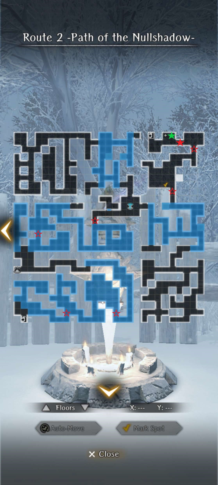
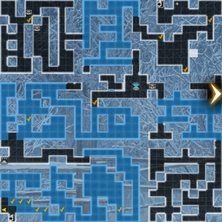
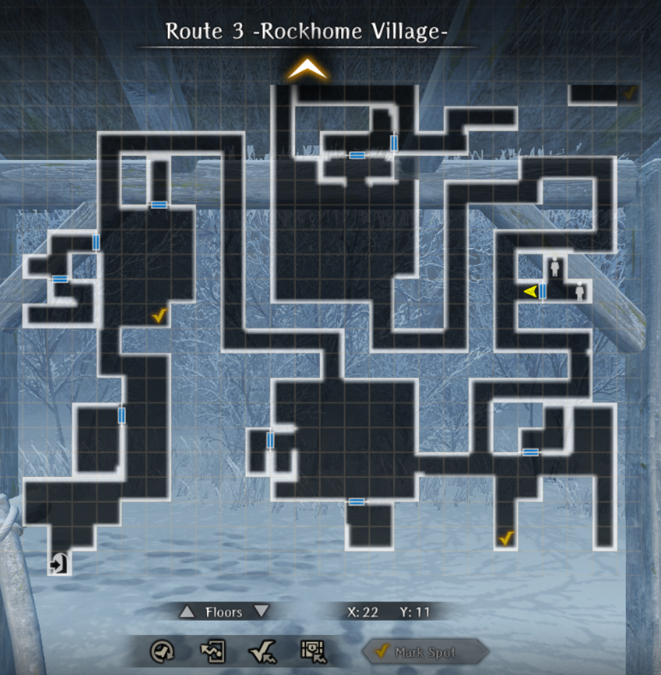
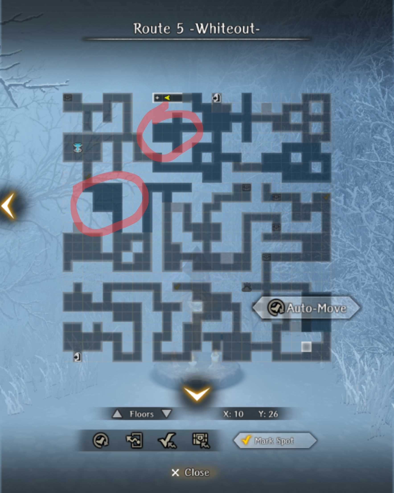
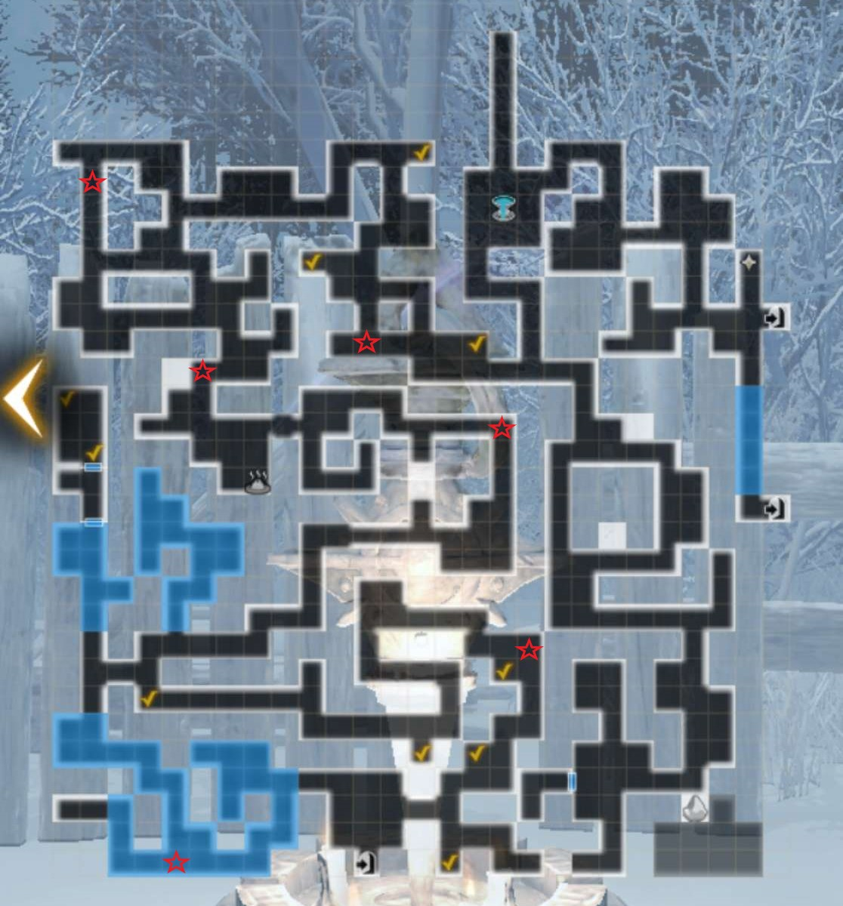
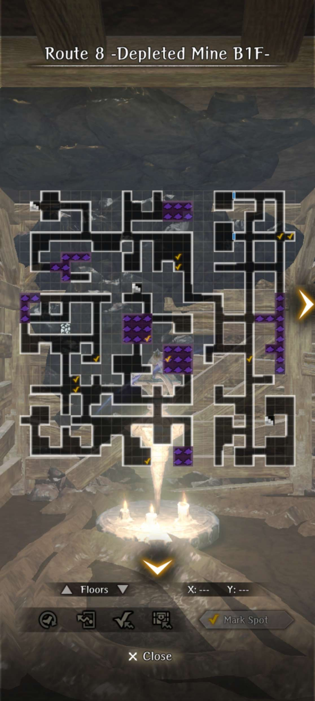

# Deepersnow Hinterlands

!!! warning "Work In Progress"
    - Ctrl + F5 to refresh for updates
    - Major spoilers ahead

??? tip "Things To Know In Advance"

    - We recommend you wait to do the Guild requests until after you have beaten the Abyss at least once. Several requests require: 
        - The second reversal power, which requires clearing GWO 4-3. 
        - Completion of other requests, which are listed as pre-requisites. 
    - The enemy difficulty is on par or higher than mobs found on the final set of floors.
    - All requests are reset if you Cursed Wheel to a different Abyss. 
    - The game saves the state of the entrire map after defeating the GWO, including unlocked shortcuts (stumps, mines).
        - To update the map you have to "wheel-in-place" 2x on Truth of the Beautiful Ore.
        - Before starting a request (or multiple requests) do the above step and then Cursed Wheel to your desired node.
    
## Snowy Forest Minor Harken

### Recovery of Salted Pork

??? danger "Bug - Bondmate Workaround"

    === "Current Status" 
    
        - As of 4/12 the request is working normally ~~if you choose to slay both of them at the end~~.
        - Bug Description: Bondmate ending (spare both of them) will automatically fail even if you do everything perfectly. See next steps for the workaround.

    === "Workaround"
    
        - Part I 
            - Cursed Wheel to Rockhome Village Major Harken. 
            - Accept the request. 
            - Complete all the steps as normal. Choose to "Slay them both" at the end. Remember to pick up the Salted Pork. 
            - Submit the request. 

        - Reset Request
            - Cursed Wheel to Village Shut Away in Silence
            - ~~Cursed Wheel to Deepsnow Hinterlands Entrance, then Cursed Wheel back to Rockhome Village Major Harken.~~ 

        - Part II 
            - Accept the request. 
            - Be sure to pick up a Trifia mushroom at one of the discovery points.
            - This time choose to "Let them go" (bondmate ending) at the end. Remember to pick up the Salted Pork. 
            - Instead of the request automatically failing you should be able to submit. 

    === "Explanation"

        - We have limited insight into what is causing this bug. It appears as if an event flag is broken that requires doing it the "normal" (slay/kill) way first to reset things. 
        - It is possible that this is -not- a bug and intended to work this way moving forward. Historically, you could do either ending successfully on your first run. 
        - Whether or not you have to repeat these steps if you Cursed Wheel outside of A4 has not been tested. If you are planning to level the bondmate, we recommend you do it in one sitting. 
        - Credit: Big thank-you to @liezeithl for discovering the workaround. 
        - Contact: Ping or DM @lightbearer on the Discord if you are running into any problems or discover any new information.  

??? warning "Preparation"

    - Pre-requisite Requests
        - None    
        
    - Recommend entering Route 2 from the Route 1 Harken as the boss's location is based on your starting point. Entering from the Route 2 Harken has the boss fight commence in a blizzard zone, which makes the fight significantly more difficult
    - Bigfoot fights at Discovery Points can be as challenging as the boss and you may encounter more than one in a single run
    - ~~Side areas do not contain Discovery Points. ~~
    - Bring SP items in case of multiple Bigfoot fights

??? note "Request Guide"

    === "Walkthrough"
    
        - Accept the request and enter Route 2 via the Route 1 Harken (recommended) or the Route 2 Harken. 
        - The objective is to traverse all of Route 2 from beginning to end to locate the stolen Salted Pork.
        - The Bigfoot Child will stop and make a sound at the six/eight Discovery Points on the map. A randomized sound will hint at what it has discovered. If you "Let it go":

            ??? quote "Bigfoot Child Audio Cues"
            
                - "Awooooon! Awooooon!" text with a "Mrrr" sound = Bigfoot fight 
                - "Kyoh! Kyoh!" text with a "Kyoh! Kyoh!" high-pitched sound = Trifia 
                - "Kyoh! Kyoh!" text with a "Kyoh!" low-pitched sound = Deep-snow Mushroom  
                
        - Routing Tip: From the entrance if you auto-move to the hotspring it will take you through the first set of Discovery Points. Select the auto-resume button (upper-left boot icon) to continue. Auto-move to the Fountain and exit nex 
        - Bigfoot Parent spawning requires:
            1) a Trifia mushroom in inventory
            2) a Bigfoot fight previously won
        -. If these conditions fail, only a standard Bigfoot fight will occur and the request will fail. Use the Fountain and hot spring on the floor to recover prior to engaging the boss.
        - The boss fight is against a Bigfoot + 2 Bigfoot Child in the frontline, 2 Bigfoot Child in the backline.
        - After the fight you will be given the option to "Let them go" or "Slay them both". The former gives a new bondmate and the latter gives additional gold. 
        - Warning!Remember to pick up the Salted Pork request item next to the Harken before exiting---it is easy to miss.
        - Return to the Guild and submit the request.

            ??? warning "Rewards"
            
                ??? note "Let them go"
                    - Bondmate: Bigfoot's Offspring (Accuracy) 
                    - Gem of Org x20 (one-time only)
                    - 8,000 Gold
                    - Trifia removed from inventory 
                
                ??? note "Slay them both" 
                    - Gem of Org x20 (one-time only)
                    - 8,000 Gold 
                    - Additional gold from request giver if you have a Trifia mushroom in your inventory
                    
    === "Discovery Points"
        
        

        
        

        - Red Star  = Discovery Point
        - Red Star (Filled) = Bigfoot Boss
        - Green Star = Salted Pork request item

    === "Discovery Points (Southbound)"===

        

        
        

        - Check = Discovery Point
        - Checkx2 = Bigfoot Boss
        - Checkx3 = Salted Pork request item

## Village Shut Away in Silence 

### Find My Sister Lisa

??? warning "Important Notes"

    - Pre-requisite Requests
        - None
    - "Perfect" Ending Requirements (contains spoilers)
        - Knowledge of [reversing nullstones](./important-request-gwo.md#saving-iris) 
            - The nullstone in the upper left-hand corner of Route 3 cannot already be reversed before you accept the request.
        - Cursed Wheel: Short Rest in the Cabin
            - North Lakeshore Cabin: "Fixed it up" (Maya needs to be accessible) 
            - Dwarves' Cave: Any 
            - Village Adults: "Secured all of them" (Maya will not go with you if Capture the Villagers request is active) 
    
??? note "Request Guide"

    === "Walkthrough"
    
        - Accept the request from Marta at the Guild and go to Route 3.
        - Warning!Reverse the Stonefolk in the NW corner -before- entering the Mayor's House to avoid unnecessary fights.
        - Head to the Mayor's house in the middle of the map. Obtain the Town Register from the desk and then tap the shiny object on the bottom right of the bookcase for a box (Box Carved with a Snowdrop Motif), Crude Map, and a Doll. Step outside and watch a cutscene of hostile animals and monsters invading the town. All of the enemy groups can be avoided and are not mandatory for successful completion. 
        - The goal is to find the 2 hidden boxes drawn on the crude map. It is possible to collect both boxes without fighting any enemies. Note that the final (3rd) box is not accessible until the end of the request.  
        - Return to the Guild, submit the request, and receive 10,000 Gold, 1 Junk, and Gem of Org x20 (one-time only).

         Additional bondmate ending steps: 
        
        - Head to Route 9, enter the cabin, and speak with Maya by the fire. Return to Route 3 and take her to the reversed nullstone for a cutscene. The route is now open. Go down the path and prepare for a challenging fight against a Snowpeak Cyclops + Hobgoblin in the frontline, 3 Ice Slimes backline.
        - Pick up the last hidden box further down the path at (X:0, Y:16). Return to Maya and the Stonefolk for a cutscene. 
        - Head back to the Guild and submit the request to view the bondmate ending. 

            ??? warning "Rewards"

                - Gem of Org x20 (first-time only)
                - Achievement: The Two are Always Together
                - Bondmate: Maya and Auntie Marta (Fear Tolerance)
                - 12,000 Gold   
            
    === "Hidden Box Locations"
        
        

        
        

        
        - Hidden Box 1: (X:7, Y:10) - Bottom-right area by the graveyard 
        - Hidden Box 2: (X:21, Y:1) - Bottom-left area by the 2 houses 
        
    === "Enemy Locations"
    
        - Outside the Mayor's house - 3 Hobgoblins frontline, 3 Goblins backline
        - Path behind Mayor's house - 2 Ice Slimes + 1 Bigfoot frontline, 2 Ice Slimes + Ice Vorpal Bunny in the middle, and Bigfoot Child + Ice Slime backline
        - Top left house area - 2 Snow Wolves + 1 Bigfoot frontline, Snow Wolf + Bigfoot Child backline
        - Bottom right house area - 3 Hobgoblins frontline, 3 Goblins backline
        - Bottom middle house area - 2 Goblins frontline, 2 Goblins backline
        - Bottom middle house area (stationary): 2 Goblins frontline, 2 Goblins backline
        - Bottom left house area: 2 Ice Vorpal Bunnies, 3 Ice Slimes in the middle, 2 Bigfoot Child backline
        
## Blizzard Blocking the Path

### Find My Kitty

??? warning "Important Notes"

    - Pre-requisite Requests
        - [Recovery of Salted Pork](./requests.md#recovery-of-salted-pork) 
        - [Find my Sister Lisa](./requests.md#find-my-sister-lisa) 
    - Request Requirements
        - Pre-requisites requests are completed. 
        - Staying within the world map (Lulu will warn).
        - The Nullshadow can only be Fled from twice.
        - Avoiding 'Accept Death' option after dieing as this will CW you to a previous timepoint
    - Reset Request
        - Cursed Wheel to 'Blizzard Blocking the Path' which will keep the pre-requisite requests flagged as completed.

??? note "Request Guide" 

    === "Walkthrough"

        - Accept the request. If both prerequisite requests are completed, then the little girl will give you the Dried Fish Fragment. 
        - Head to Route 4. The kitty is only located in one of the 3 non-removable blizzard zones. For added drama the Nullshadow will usually appear behind you after entering a blizzard zone and stalk you throughout the search.
        - Finding the kitty is basically a game of hot-and-cold. It will make audible sounds as you explore with pop-up flavor text depending on your distance from its location. See Meow-chanics ₍^. .^₎. The kitty will always be on the ground in the brush. Its location is randomized, but it tends to appear close to the swirling blizzards. 
        - Find the kitty once in each of the 3 blizzard zones. The first two times it will run away. On the third attempt you will be prompted to use the Dried Fish Fragment as bait and the request will be completed.
        - The kitty is now permanently located at the Guild. It can also see Lulu!
    
            ??? warning "Rewards"
                - Gem of Org x20 (first-time only)
                - 12,500 Gold
                - Deepsnow Hinterlands Roar Junk
                - Deepsnow Hinterlands Fey Roar Junk 

    === "Meow-chanics ₍^. .^₎"
    
        - You catch a faint, barely audible cray of some unseen creature = Several tiles away, usually when you first enter the blizzard zone
        - You catch a soft, thin mewing from somewhere. It sounds like a cat = Few tiles away
        - You catch the sound of a mewing cat nearby. It seems somewhere close by = Within 1-2 tiles

## Minor Harken Beyond the Blizzard

### Special Local Delicacy

??? warning "Important Notes"

    - Pre-requisites
        - MC has been promoted to Copper Grade. 
    - Must step foot into Route 6 and then exit. 
    - Make sure all blizzard zones are active. 
    - The Bondmate ending has specific requirements. See the Bondmate tab.

??? note "Request Guide"

    === "Walkthrough"

        - Talk to Vigo, accept the request, and go to Route 5.
        - Each blizzard zone can be used as a location for Vigo to dry his fish.  
        - Once you enter a blizzard zone a message will appear that describes its current condition. The conditions are randomized each run. You can decline and re-accept any location. 
        - Conditions: 
            - "The air here feels dry to you" 
            - "You can feel a brisk breeze, gusts rippling your clothing" 
            - "There is a slight dampness in the air here"
            - Note: Conditions only matter for the Bondmate ending. See tab for details.
        - After selecting a spot, you will be forced into 3 back-to-back fights. You may leave at any time, but your reward will be impacted. 
        - If you cannot complete the fights while frozen, then you can reverse the blizzard zone before confirming the location. This does lock you out of the bondmate ending. 
        - Once all 3 battles are completed, you will be teleported back to the Tavern to watch a brief cutscene and receive your reward. 

            ??? warning "Rewards"

                === "Normal Ending" 

                    - Gem of Org x20 (first-time only)
                    - 6,000 Gold base + bonus of 4,000 Gold or 6,000 Gold if completed in an active blizzard zone
                    - Ice-Wind Trout (restores 150 HP to one row)
                    
                === "Bondmate Ending" 
            
                    - Gem of Org x20 (first-time only)
                    - Bondmate: Exquisite Jewel Trout (HP)
                    - 13,000 Gold (6,000 base + 7,000 bonus)
                    - Ultimate Ice-Wind Trout (restores 250 HP to one row)

    === "Battle Variations"

        - Variation 1:
            - 1st battle = 3 Goblins frontline + 1 Hobber backline
            - 2nd battle = 3 Snow Wolves frontline + 2 Baby Bigfoot backline
            - 3rd Battle = 3 Snow Wolves frontline, 2 Snow Hawks in the middle, 1 Big Snow Hawk backline
        - Variation 2:
            - 1st battle = 3 Goblins frontline + 1 Hobber backline
            - 2nd battle = 3 Snow Slimes frontline, 3 Ice Clouds in the middle, 2 Ice Clouds backline
            - 3rd Battle = 2 Snow Hawks frontline, 2 Snow Hawks in the middle, 2 Big Snow Hawks backline

    === "Bondmate" 

        === "Conditions" 

            - Blizzard zone: Must be active 
            - Condition: "The air here feels dry to you"
            - Location: The blizzard zones directly beneath the Harken and the Fountain area. See Locations tab.
            - This works 100% of the time as long as -all- of the above conditions are met. During testing the other locations have given inconsistent results or may be bugged. 
            - Upon completion, you will get the "Exquisite Jewel Trout" (HP) bondmate and Ultimate Ice-Wind Trout consumable item. 

        === "Locations" 

            

            
            

## Slaying the White Wolves

### Unforgivable Wolves

??? warning "Important Notes"

    - Pre-requisite request: 
        - [Special Local Delicacy](./requests.md#special-local-delicacy) 
        - If not completed the request will automatically fail  
    - Entering from the Route 6 Harken allows you to reverse the blizzard zones in advance before fighting
    - Cursed Wheeling twice on Truth of the Beautiful Ore and then wheeling to Slaying the White Wolves will automatically reverse all blizzard zones
    - There is no special text, sound, or battle music to signal a wolf pack encounter aside from the boss fight
    - Route 6 is extremely enemy dense with a high respawn rate, so try to avoid enemies or prepare accordingly
    - The Snow Wolf Leader is on par difficulty-wise as the Route 6 boss

??? note "Request Guide"

    === "Walkthrough" 

        - The objective is to hunt 4 wolf packs scattered across Route 6. The wolf pack locations are static, do not move on the field, and the order fought does not matter. Note that while there are 6 possible locations where they could spawn you will only get 4/6 to appear on a given run.  
        - The enemy composition of each fight progresses in a fixed order.
        - The wolf packs at (X:1, Y:23) and (X:11, Y: 19) are in a reversible blizzard zone and close to the Fountain. Recommend saving either for the boss fight. Do not leave the wolf pack in the bottom left at (X:4, Y:1) for last otherwise the boss will be fought in a blizzard.  
        - After defeating 3 wolf packs the 4th encounter will be a boss fight against the Snow Wolf Leader.
        - (Subsequent runs) A new option will appear to spare the Snow Wolf Leader. This skips the boss fight and gives a bondmate, Warg, Commander of the Deep Snow (Freeze Tolerance and Evasion). 
        - Exit and return to the Guild to submit the request.

            ??? warning "Rewards"
            
                - Gem of Org x20 (first-time only)
                - Snow Wolf Trapper Hat
                - 5,000 Gold 
                - Additional reward - 22,000 Gold 
                - Bondmate - Warg, Commander of the Deep Snow (subsequent runs only)

    === "Wolf Pack Locations" 
    
        

        
        

        - (X:11,Y:19) - Southwest of the Fountain
        - (X:5,Y:18) - Next to upper-left reversal stump
        - (X:16,Y:16) - Northeast of middle reversal stump
        - (X:4,Y:1) - Southwest corner in blizzard zone (cannot reverse)
        - (X:1, Y:23) - Far northwest corner 

    === "Battle Composition"
    
        - Wolf Pack 1 - 4 Snow Wolves in a row
        - Wolf Pack 2 - 5 Snow Wolves, 3 in the front, 2 in the back
        - Wolf Pack 3 - 6 Snow Wolves, 3 in the front, 3 in the back
        - Wolf Pack 4 - 4 Snow Wolves in the front, 1 Snow Wolf Leader in the back

    === "Bondmate"

        - Details coming soon or see Isberg - Bondmate page

## Passed Through the Coal Mine

### Ore Mining

??? warning "Important Notes" 

    - Pre-requisite request: 
        - [Unforgivable Wolves](./requests.md#unforgivable-wolves) 
        - If not completed the request will automatically fail  
    - The ore you are collecting is located on Route 8, which is split into two parts that are not connected to each other. 
    - Knowledge of [shortcuts](./important-request-gwo.md#learning-the-truth) is helpful to traverse the area easier, but it is not required. 

??? note "Request Guide"

    === "Walkthrough"

        - The goal of this request is to collect 5 rocks (white, shiny objects on the floor) scattered throughout Route 8.
        - You have two options on your preferred starting point:
            - Select Route 6 and then enter Route 7 to access the stairways to Route 8.
            - Select Route 7 and use the shortcuts to access the stairways to Route 8.
            - As previously noted, you have to explore both parts of Route 8 to collect all 5 stones and the order you do them in does not matter. 
        - The location of several high-value rocks are typically static. For example, (X:4,Y:8) and (X:26,Y:21) are guarded by 2 Stonefolk frontline, and 2 Lamenting Snowfolk backline. They have much higher HP and DEF than randomly encountered ones. These rocks are Silver Ore.
        - After collecting 5 rocks, return to the Guild and turn them in. The merchant will test you on which rocks you think are most valuable and which are cheapest. He will pay you accordingly.
        - After potentially getting scammed, he will answer what type of rock is what type of material. Request completed.

    === "Ore Locations"

        

        
        

        - Double marks = Boss enemy guarding ore

    === "Rock Values"

        1. Small Heavy White Stone = Silver, which coins are made of.
        2. Stone with Yellow Specks = Gold, but small amount so only worth 1/10th of a coin.
        3. Large Reddish Brown Stone = Iron (in high demand)
        4. Shiny Black Stone = Tin (cheap rock after copper and coal)
        5. Large Brownish-Green Stone = Copper (not worth much)
        6. Small Dark Stone = Coal (not worth much)

## Being That Dwells in the Home of God

### Traces of Indigenous People

You need to complete Ore Mining. Otherwise, this request will automatically fail.

!!! warning "The exact mechanics of this request isn't known for sure, but what's listed is perhaps how it works"

??? note "Request Guide"

    === "Walkthrough"

        - Accept request at tavern then head to Route 10 via Route 9 Harken.
        - You will essentially be looking for shiny objects on the floor.
        - Locations of all shiny objects are static: (X:17, Y:9), (X:7, Y:9), (X:13, Y:0)
        - Final shiny object will spawn after all 3 objects are collected at (X:6, Y:24)
        - Upon collection you will engage in a battle with Stonefolk. You can choose to decline the fight by putting the stone down, in which you may pick it up again. After winning the fight, the request will be marked as completed. You must return and turn it in.

            ??? warning "Rewards"
    
                - Turning in less than 3 stones = Just some gold
                - Turning in 3 stones = Gold and some junk
                - Turning in 3 stones + 1 large stone = Gold + 2 types of junk + Icebreaker sword

    === "Stone Locations"

        | Location | Enemies | Status Effect |
        |----------|---------|---------------|
        | (X:17, Y:9) | 1 Stonefolk | Whole team starts Cursed |
        | (X:7, Y:9) | 3 Stonefolk | Whole team starts with Critical Poison |
        | (X:13, Y:0) | 2 Stonefolk | Whole team starts with Paralysis |
        | (X:6, Y:24) | 4 Stonefolk | Whole team starts with Fear |

        - The Stonefolk in these fights all have extremely high HP and DEF. The last battle will be even moreso, especially the ones in the back.

## Truth of the Beautiful Ore 

### Trial of the Stone God

This request requires Ore Mining and Find my Kitty (including all their pre-reqs obviously). You also need to have completed at least the 3rd ending for this abyss?

!!! bug "After the 2nd completion, Lulunarde will glitch onscreen briefly before disappearing and no longer calling out the request giver"

??? note "Request Guide"

    === "Walkthrough"

        - Request requires you to go to Route 10 to pick the warped daphnes and bring them to the Church Grounds altar at the bottom right of the map.
        - It's recommended to take the Church Grounds Harken and walk backwards to Route 10 as it is closer with less enemies.
        - The daphnes are consumed upon being placed on the altar, so any subsequent runs require you to pick them again.
        - Entering the altar will lock the door behind you. There will be several trials that must be overcome.

    === "Trials"

        ??? danger "Trial 1 - Ambush"

            - You will be jumped by 5 Stonefolk (3 in front, 2 in back). They have very high HP and DEF compared to random encounter ones.
            - (2nd run onwards) You may close your eyes to skip this fight.

        ??? danger "Trial 2 - Name"

            - The trial will ask for your name.
            - **Give your name** = Instant death (but this map has Harken's Blessing so you can revive for free). You will realize you got scammed by the request giver.
            - **Give a false name** = Fight more Stonefolk
            - **Stay silent** = Pass safely

        ??? danger "Trial 3 - Combat"

            - Fight another 5 Stonefolk (3 in front, 2 in the back).
            - Finally, you will reach the altar.

        ??? danger "The Altar"

            - The altar allows you to pray or not.
            - **Pray** = Instant death
            - **Do nothing** = Receive a Devotional Stone
            - After exiting the altar room, all the previous stationary Stonefolk become "sentries" that will force you into a difficult fight if you enter their line of sight. They can only see in a straight line in front of them and other Stonefolk block their line of sight. There will also be roaming enemies that are relatively weak.
            - Upon reaching the entrance of the altar, the door will unlock.

    === "Turn-in"

        ??? note "1st Run"

            - The request giver has ran away. Instead, the merchant from the Ore Mining request will appear.
            - He will tell you that you got scammed and ask to buy the Devotional Stone.
            - Selling it will give some flavor text that indicates the dwarves may want to use this stone.

        ??? note "2nd Run"

            - Lulunarde will ask you to try to sus out the person, but the new option doesn't really do anything.
            - The entire ordeal will play out the same, except you can skip the 1st Trial by closing your eyes.
            - When returning to the tavern, you can give the stone to the requester for some gold and junk. She will promptly be chased out by the ore merchant.
            - You will actually keep the Devotional Stone. Its use is not yet known.
