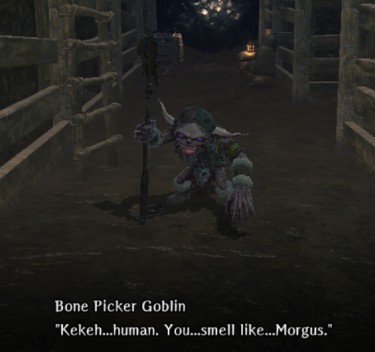

# Deepsnow Hinterlands Wandering NPC Guide

There are a number of characters that wander the Abyss who you may encounter.  They may be a help, a threat, or simply a distraction. These chance encounters often present you with a choice of interactions that may bring you additional riches or even personality changes.  

Work in progress.  [Contributions welcome](../../index.md#contributing).

## Bone Picker Goblin
I really don't want to know what Morgus, God of Death, smells like.  
  
??? note "Details"  
    - Location: 
    - Interaction Options:  
    <!--    - The Bone Picker Goblin has several items he'll sell you:  
            - Healing Potion - 100gp - Always available  
            - Adventurer's Remains - 1,000gp - Once every 7 days  
            - (If unlocked) Mausoleum Bone Tallow - 10,000gp - Once every 7 days  
    -->        
    - Personality Impact: None known.  
    <!--
    - Notes: The cooldown timer on Remains and Tallow appear to be 7 days from the last time collected, not tied to the weekly game reset.  If you have insufficient gold, the interaction will be dismissed without affecting any cooldown timers.  
    -->
