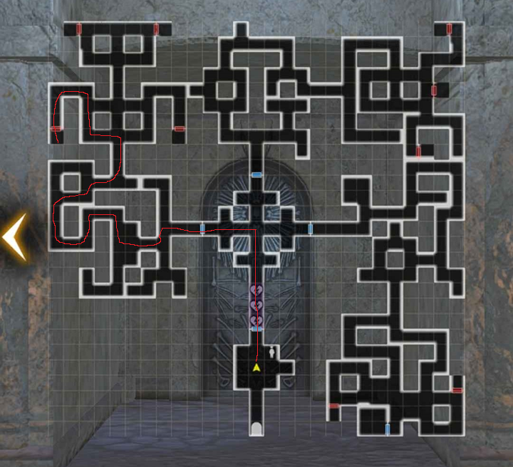

# Ancient Mausoleum

#### ^^Summary^^

The Ancient Mausoleum is a source of guaranteed general/nameless adventurers. You are guaranteed one bone for those adventurers once. The general adventurer bones are separated by class, with nameless adventurers in their own section. Each section's maps are identical and you can only obtain one bone per visit (Bones are located in a chest behind a locked door. Obtaining one will lock all other doors). It costs fortitude to enter the Ancient Mausoleum, as there are 3 tiles that drain the party's fortitude as you enter. You can only enter with 6 people, but you can keep entering even if your fortitude is 0.

Usually the battles in the Mausoleum are mandatory as the enemies block the way to the chests. They might drop a low to high grade chest. These can drop:

- Low Grade chests : Azureous Ore, Minor potions
- Medium Grade chests : Class Equipment Junk from what Class Mausoleum selected
- High Grade chests : Adventurer's bones 

Once more and more bones are found, the mausoleum will increasingly drop class specific junk. However, it's not recommended to farm the junk here.

#### ^^Crucible Mausoleum^^

This part of the Mausoleum resets every 2 weeks and provides 5 random adventurer bones guaranteed. It's highly suggested to clear this out whenever you can. The map here is still the same as that of the general Ancient Mausoleum, though the scenery is slightly different.

??? note "Tips for Ancient Mausoleum"
    - It's recommended to bring undead-bane weapons. Evasion is also a very good stat to have to deal with dodging instant-kill skills.
    - Marein for priests can instant kill most of the enemies (who also all try to stand in the rows)
    - Any Insta-Kill Tolerance items, Bondmate (Bunny), Well of Mind Bonuses will help. Galina improves Instant-kill resistance for adjacent evil characters.
    - Beware of the Centaur and the skeleton guards that might join him because they each has a skill that might Insta-Kill a party member if it succeed.
    - It's recommended to run Ancient Mausoleum before you log off for a while, as you cannot go under 0 fortitude. So try to run as much as you can before you let fortitude recover.

!!! map "Ancient Mausoleum"
    

??? map "Shortest Path to a Chest"
    

## Credits

Ancient Mausoleum map provided by Ogarith
