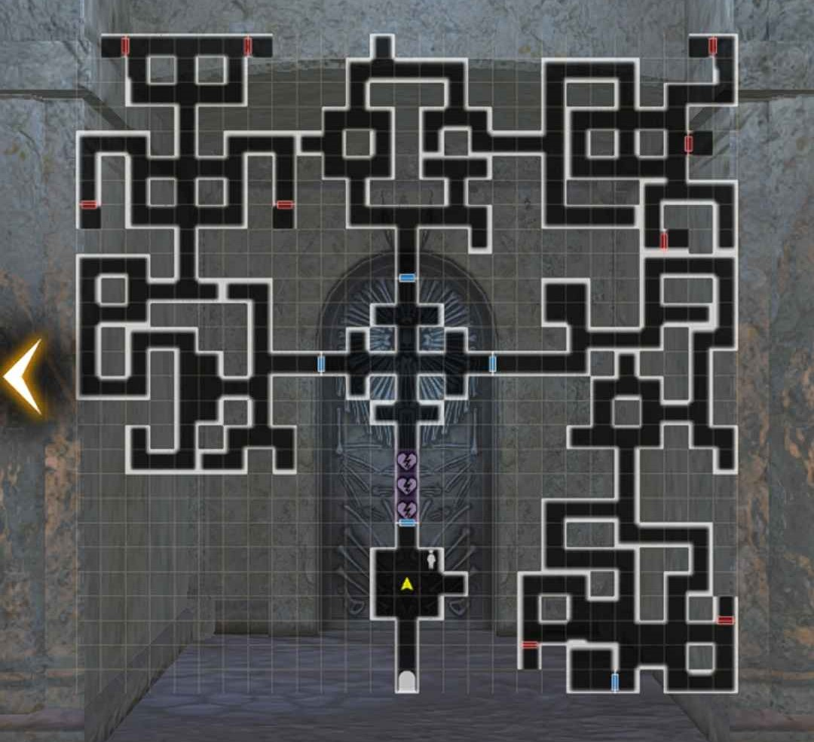

# Ancient Mausoleum

#### ^^Summary^^

The Ancient Mausoleum is a source of guaranteed general/anonymous adventurers. You are guaranteed one bone for every adventurer in the Mausoleum. The general adventurer bones have a separate but identically laid out "floor" for each class.  All anonymous adventurers are together in one smaller floor called the Mausoleum of Guidance. You can only obtain one bone per visit, as all bones are located in a chest behind a door and obtaining any one bone will lock all other doors until you leave. All doors are unlocked again on your next entry, and you may leave and return as many times as you'd like. You must have 6 people in your party to enter.

Some battles in the Mausoleum are mandatory as the enemies block the way to the chests. However, enemy spawn points do not change, so some can be waited for and avoided.  The Mausoleum becomes available after completing the Beginning Abyss for the first time.  While most enemies are the same encountered in the Beginning Abyss, they will be significantly harder and undead have an Insta-kill attack. Enemy level will also scale with you, making battles very challenging below level 30.  Necrocores can also be found right by the chest rooms. Avoiding those is advised. There are poison traps scattered throughout that will significantly reduce fortitude but rhese can also be navigated around.

Enemies might drop chests. These can drop chests that can include Gold, Azure Ore, Minor potions, and Class Equipment Junk from what Class Mausoleum selected. 

The chests located behind doors will randomly drop either one of the remaining available Adventurer bones for that mausoleum or class specific junk. When all bones for thst mausoleum have been found thr room chests will only drop class specific junk. However, it's not recommended to farm the junk here.  The class-specific and anonymous mausoleums do not reset and once all bones are obtained, there is little reason to return to them.  

#### ^^Crucible Mausoleum^^

This part of the Mausoleum resets every 2 weeks (on the same cycle as the guild Daily Supplies) with 4 or 5 random general adventurer bones.  Available adventurer names can be seen by tapping the (i) icon at the selection screen. It's highly suggested to clear this out whenever you can. The map is the same as that of the general Ancient Mausoleum, though the scenery is slightly different.

??? note "Tips for Ancient Mausoleum"
    - It's recommended to bring undead-bane weapons. Evasion is also a very good stat to have to deal with dodging instant-kill skills.
    - Marein for priests can instantly kill the most dangerous enemies (who also all try to stand in rows).
    - Any Insta-Kill Tolerance items, Malice Helm, Well of Mind Bonuses, etc., will help. Galina improves Instant-kill resistance for adjacent evil characters.
    - Beware of the Necrocore (Centaur) and the skeleton guards that might join him because they each have a skill that might Insta-Kill a party member.
    
!!! map "Ancient Mausoleum"
    
<!--
!!! map "Mausoleum of Guidance"
    
-->
??? map "Shortest Path to a Chest"
    

## Credits

Ancient Mausoleum map provided by Ogarith
