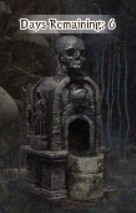
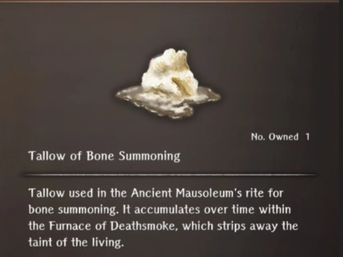
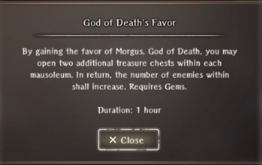
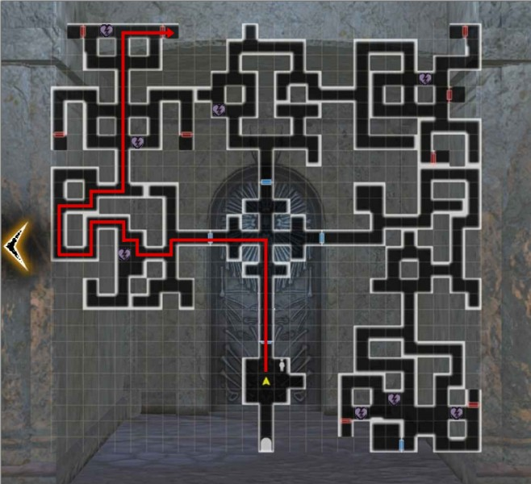

# Ancient Mausoleum  
!!! note "As of Oct 2025 the Fortitude-reducing entry traps are no longer at Mausoleum entrances removing original concerns related to Fortitude-loss, visit rationing, and increased ally revival risk."

!!! note "Requirements"
    The Mausoleum becomes available after defeating the Greater Warped One in the Beginning Abyss.  There is no level or grade requirement.

### Summary  
The Ancient Mausoleum is a source of guaranteed general/anonymous Adventurer's Remains (bones). You are guaranteed at least one bone for every adventurer entombed in the Mausoleum. General adventurer bones have separate but identically laid out "floors" for each class.  All anonymous adventurers are included together in one smaller floor called the Mausoleum of Guidance. See [Maps](./maps.md#maps) below.  Names of Adventurer bones available in each Mausoleum and the number remaining to be found can be seen by tapping the (i) icon at the floor selection screen.

There is a Mausoleum Guide in the entry room who can provide instruction and [some protection](./maps.md#mausoleum-optional-enhancements) within the Mausoleum for a price.  Additionally, there is an Altar to Morgus, God of Death, that will [provide several options for increasing the number of available bones](./maps.md#mausoleum-optional-enhancements).  Most Mausoleum enemies are the same encountered in the Beginning Abyss, but are significantly stronger and all undead have an Insta-kill physical attack. Enemy level will also scale with you, which can make battles very challenging if you are below level 30. 

### Mausoleum Overview
- You must have 6 people in your party to enter. They don't all have to be alive.  
- The bone chests are located in rooms behind doors that will randomly drop either one of the remaining available Adventurer bones or class-specific junk for that mausoleum. After all bones for that mausoleum have been found the room chests will only drop class-specific junk.  Class-specific and anonymous mausoleums do not reset on their own and there is little reason to return to a mausoleum once all bones have been found.   
- You can only obtain one bone per Mausoleum visit (exceptions below).  Opening any of the bone chests will lock all other doors until you leave the Mausoleum. All doors will unlock again on your next entry, and there is no limit to how many times you may leave and return.  
- Enemies might drop chests that drop include Gold, Azure Ore, Minor potions, and Class-Specific Equipment Junk. Loot is generally poor and the Mausoleum is not recommended for loot farming.  
- There are poison traps scattered throughout the floor that will significantly reduce fortitude but these can also be navigated around.  

??? note "Ancient Mausoleum Combat Tips"  
    - Map layout and enemy spawn points do not change.  While a few fights are unavoidable on the path to the chest rooms, most can be waited for and avoided if necessary.   
    - It's recommended to bring undead-bane weapons. Evasion is also a very good stat to have to deal with dodging instant-kill skills.  
    - Necrocores - undead cetaurs -  can often be found patrolling right by the chest rooms.  They are the only "large bear shaped" wandering enemy. Avoiding those at lower level is strongly advised.  
    - Marein for priests can instantly kill the most dangerous enemies (who also all try to stand in rows).  
    - Any Insta-Kill Tolerance items, Malice Helm, Well of Mind Bonuses, etc., can help. Galina improves Instant-kill resistance for adjacent evil characters.  

### Crucible Mausoleum  
The Crucible Mausoleum floor is unique in that it contains a random selection of 4-6 general adventurer bones and *it resets every 2 weeks* (following the same two-week reset cycle as the guild Daily Supplies). The map is the same as that of the general Ancient Mausoleum, though the scenery is slightly different. Again, available adventurer names and the number obtained can be seen by tapping the (i) icon at the floor selection screen. *It's highly suggested to clear this out whenever you can*, as it is a regular source of adventurer bones for aquiring party members, for Skill Inheritance or Discipline, or for Guild Tags. [See Adventurer's Remains Econoy Page](../../appendices/free-to-play-economy.md#adventurers-remains).

### Mausoleum Optional Enhancements  
??? note "Altar of Morgus: Tallow Bone Summoning"  
      
    
    It is now possible to summon additional bones to all Mausoleums except the Crucible Mausolem.  The player can collect Tallow of Bone Summoning from the Furnace of Deathsmoke (on the Mausoleum floor selection screen) and from the Abyss wandering Bone Collector (purchased for 10,000gp).  Each can be obtained once per week.  
    
       
    
    By using two Tallows at the Altar of Morgus, the number of claimed bones in that Mausoleum can be reduced by one. This means that a previously 'emptied' Mausoleum could then produce one extra (random) Adventurer from that Mausoleum's list.  Other than the consumed Tallow, there is no other cost to doing this, and it is ecouraged to be done regularly as it increases the game's otherwise limited bone resource.  

       

??? note "Altar of Morgus: God of Death's Favor"    
       
    The one bone per visit limit can be increased by making a sacrifice of 100 Gems at the Altar of Morgus.  After paying the Gems, a one hour countdown will begin during which time you will be allowed to open up to three doors per visit to the Mausoleum.  Note the warning though, that the number of enemies, including wandering necrocores, is increased.  Because there is no limitation on simply leaving and reentering the Mausoleum, this is considered a rather low-value use of Gems and is discouraged.

??? note "Mausoleum Guide Protection"  
    The Mausoleum Guide offers to accompany you through the Mausoleum for 100 Gems to protect against the increased danger from undead Insta-kill attacks. During combat, the guide will intercept any Insta-kill attacks from undead. If the attack lands, the Guide will be killed instead of your Adventurer. Otherwise the Guide will act as a mid-level fire mage battle companion, often casting Halito, Mahalito, Katino, and other debuff spells on the enemy.  
    Once protection is purchased, the Guide will remain a Mausoleum battle companion indefinitely until killed, even over multiple trips to the Mausoleum.  Because of the persistence and ability to mitigate some of the Mausoleum's increased combat danger, the value of this protection can be considered either a good or poor investement according to your risk tolerance.  

### Maps    
!!! map "Ancient Mausoleum"
      

!!! map "Mausoleum of Guidance"   
      

??? map "Shortest Chest Path with Minimal Fight Potential"   
      

## Credits   
Ancient Mausoleum map provided by Ogarith
