# Bounties

!!! warning "Please bear with us as this page is under construction. More and more details will be added."

??? note "Requirements - Complete the Second Abyss for the first time and talk with Arna in the Royal Capital Adventurer's Guild."  
    Once the requirements are fulfilled a new tab, "Bounties", will appear in the Requests section of the Adventurer's Guild. Each town has its own set of bounties, which requires the player to find and defeat a specific enemy. Submitting a defeated bounty at the Guild will reward the player with gold and Bounty Medals to redeem for items at the Jeweler under Exchange > Bounty Medal. Each bounty provides Bounty Marks (one-time only) that serve as experience points to increase the player's Bounty Rank. The Bounty Rank ranges from 1-13 with higher ranks unlocking new bounties, adding new items to the Bounty Medal shop, and granting milestone rewards that can be viewed under the Bounty List > Check Rewards menu. 

!!! note "Note that some event locations can change due to some maps having layout variations, but events always stay fixed to their relative room location. See the [Map Variations](../../mechanics/map-variations.md) page for details. If your map doesn't match what is shown below refer to the appropriate Dungeon Guide Abyss map to see other possible locations."

### Bounty Rank Unlock Conditions

| Bounty Rank | Unlock Conditions |
|:--:|:--|
| 1-7 | Clear Abyss 2 (Normal Ending) + some Abyss 3 progression |
| 8-9 | Clear Abyss 2 (True Ending) + some Abyss 3 progression. "Defeated Octoranus" must be toggled in the Curse Wheel under "Return to the Capital" |
| 10-12 | Clear Abyss 3 (Mastermind Ending) |
| 13 | Clear Abyss 3 (Mastermind Ending) with 0 Corruption (all 13 sentry nodes in the Curse Wheel set to "Not Spotted"). You do not need to defeat the Greater Warped One. Have MC die during the fight and accept death |

## Abyss 1 Bounties

??? danger "Goblin Daddy (45 Tokens)" 

    === "Bounty Picture" 
        

    === "Bounty Details"
        - Stationary, indicated by green mob on minimap, he will always be in the same location.
        - 2000 Gold Reward
        - 45 Token Reward
        - Appears at Bounty Rank 1

    === "Fight Details"
        - HP: 5.5-6K
        - Spawns with many goblin enemies (HP: ~500) and can resummon them if killed.

    === "Map Location"
        

??? danger "Warped One Burning with Vengeance (30 Tokens)" 

    === "Bounty Picture" 
        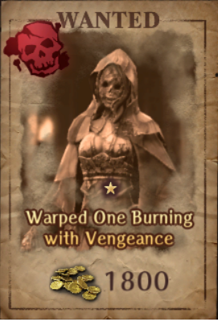

    === "Bounty Details"
        - Stationary, indicated by green mob on minimap, will always be in the same location
        - 1800 Gold Reward
        - 30 Token Reward
        - Appears at Bounty Rank 1

    === "Fight Details"
        - HP: 9.5-10K
        - Spawns as a Red Spinner Woman by itself.

    === "Map Location"
        
        
??? danger "Jhael, The Novice Slayer (30 Tokens)" 

    === "Bounty Picture" 
        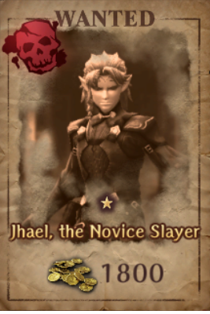

    === "Bounty Details"
        - Stationary, appears as a NPC on the map, can show up in two static locations
        - 1800 Gold Reward
        - 30 Token Reward
        - Appears at Bounty Rank 1

    === "Fight Details"
        - HP: 5.5-6K
        - Spawns as an Elf Fighter Adventurer by himself.

    === "Map Location"
        

??? danger "Grudge-Bearing Sack Doll (100 Tokens)" 

    === "Bounty Picture" 
         

    === "Bounty Details"
        - Roamer, does not show up on the minimap.
        - Frequently appears to the south and east of the F5 Harken. Use the stairs to reset its location.
        - 1900 Gold Reward
        - 100 Token Reward
        - Appears at Bounty Rank 2

    === "Fight Details"
        - Spawns as three Cursed Dolls that can move twice each. They are extremely fast.
        - Bounty HP: 6.5k; Adds: 2.5-3K 
        - Remember that Cursed status harms you when you attack an enemy.
        - Seems to have a week long cooldown before respawning.
        - Can be farmed for EXP, but the bounty cannot be turned in. Must wheel to "Fresh Start" to reset.
        
??? danger "Brokk, The Shrewd Swindler (55 Tokens)" 

    === "Bounty Picture" 
        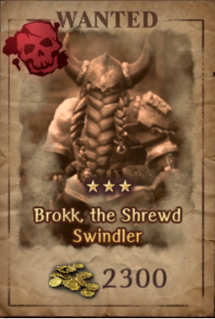

    === "Bounty Details"
        - Stationary, indicated by NPC on the map. He will always be in a corridor near the harken.
        - 2300 Gold Reward
        - 55 Token Reward
        - Appears at Bounty Rank 2

    === "Fight Details"
        - HP: 11-11.5K 
        - Spawns as a Dwarf Fighter by himself.

    === "Map Location"
        
        
??? danger "Skeleton Archmage (90 Tokens)" 

    === "Bounty Picture" 
        

    === "Bounty Details"
        - Roamer, does not show up on the minimap.
        - Tends to show up around the poison hallways and areas connected by the F8 rocks.
        - Can sometimes spawn inside a wall, reset to fix.
        - 2700 Gold Reward
        - 90 Token Reward
        - Appears at Bounty Rank 3

    === "Fight Details"
        - HP: 12.5-13K 
        - Spawns with 2 skeletons and 2 skeletons knights in the front row, 2 skeletons and 1 skeleton knight in the middle row, and the boss skeleton mage is in the backmost row.
        - They are all susceptible to Marein.
        - Can be silenced.
        - When only the Skeleton Mage boss is alive, it will spam Lazelos (~150-200 damage).
        
    === "Map Location"
        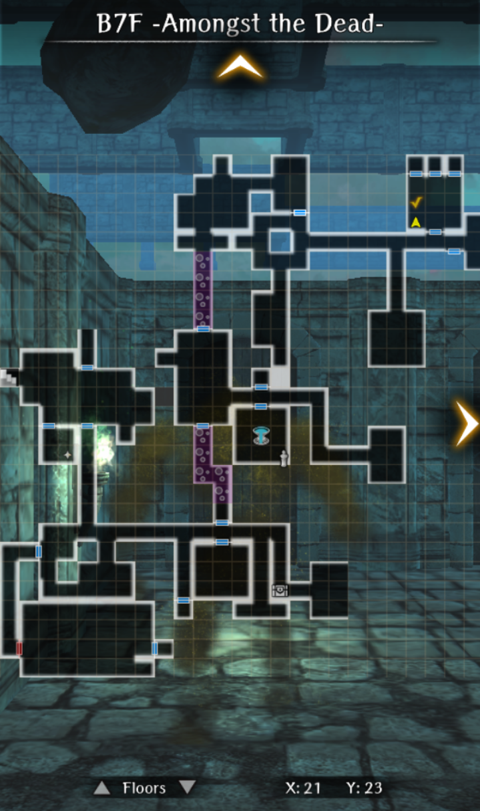
        
??? danger "Six-Limbed Storm (180 Tokens)" 

    === "Bounty Picture" 
        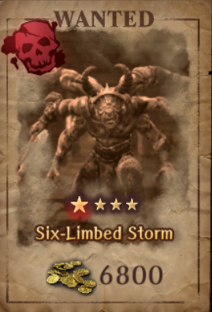

    === "Bounty Details"
        - Stationary, indicated as a green mob on the minimap. It always appears in the big room to the right of the harken.
        - 6800 Gold Reward
        - 180 Token Reward
        - Appears at Bounty Rank 5

    === "Fight Details"
        - HP: 12K
        - Spawns as a Minotaur by itself.
        - Is immune to magic damage.
        - Has very high EVA and ACC, need 140-150 ACC. 
        - Use Masolotu, Batilgref, Dilto, Heavy Attack 3+ and Decisive Torso Strike 2+ for the ACC bonus.
        - Maces are useful as they cannot miss.
        - Will get stronger and faster as turns pass.

    === "Map Location"
        

??? danger "Host of the Cursed Banquet (200 Tokens)" 

    === "Bounty Picture" 
        

    === "Bounty Details"
        - Stationary, indicated as a green mob on the minimap. Appears right next to the staircase after going from B7 to B6.
        - 5100 Gold Reward
        - 200 Token Reward
        - Appears at Bounty Rank 6

    === "Fight Details"
        - HP: 8-9K
        - Spawns with 2 skeletons, 2 skeleton knights, and 1 poltergeist in the front row, 2 skeleton giants, 2 poltergeists, and 1 skeleton mage in the middle row, 2 skeleton archers, 1 skeleton mage, and the boss wight in the backmost row.
        - The wight acts twice per turn.
        - It's highly recommended to simply cast LA- spells to clear this. They are also all susceptible to Marein.

    === "Map Location"
        
        
??? danger "Peerless Scorpionesses (280 Tokens)" 

    === "Bounty Picture" 
        

    === "Bounty Details"
        - Stationary, indicated as a green mob on the minimap.
        - 10800 Gold Reward
        - 280 Token Reward
        - Appears at Bounty Rank 7

    === "Fight Details"
        - HP: 11K (for both)
        - Spawns as a Scorpion Lady by itself.
        - Will summon another Scorpion Lady in the same row after taking a certain amount of damage (~1200) but not reaching the threshold for Rage.
        - After a certain HP threshold is reached (~4K), either Scorpion Lady will cast Rage, which allows it to move 5 times in one turn
        - Fight can be ended without the second Scorpion Lady being summoned.

    === "Map Location"
        

## Abyss 2 Bounties

??? danger "The Unpierceable One (40 Tokens)" 

    === "Bounty Picture" 
        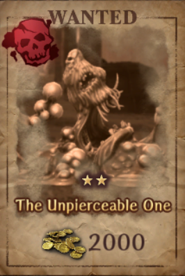

    === "Bounty Details"
        - Roamer, does not show up on the minimap, can appear in water current portions of the map.
        - 2000 Gold Reward
        - 40 Token Reward
        - Appears at Bounty Rank 1

    === "Fight Details"
        - Spawns with 3 Floating Coins in the back.
        - Has very high defense.

??? danger "Patti, Apostate of the Sea (35 Tokens)" 

    === "Bounty Picture" 
        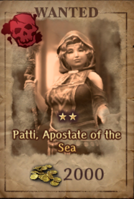

    === "Bounty Details"
        - Stationary, indicated by the NPC by the statue on the left of the map. Enter from B4. On fail, must reenter the Abyss.
        - 2000 Gold Reward
        - 35 Token Reward
        - Appears at Bounty Rank 1

    === "Fight Details"
        - Spawns with two rows of hostile adventurers in the front and middle row. The Pirate Deacon will be in the backmost row.

    === "Map Location"
        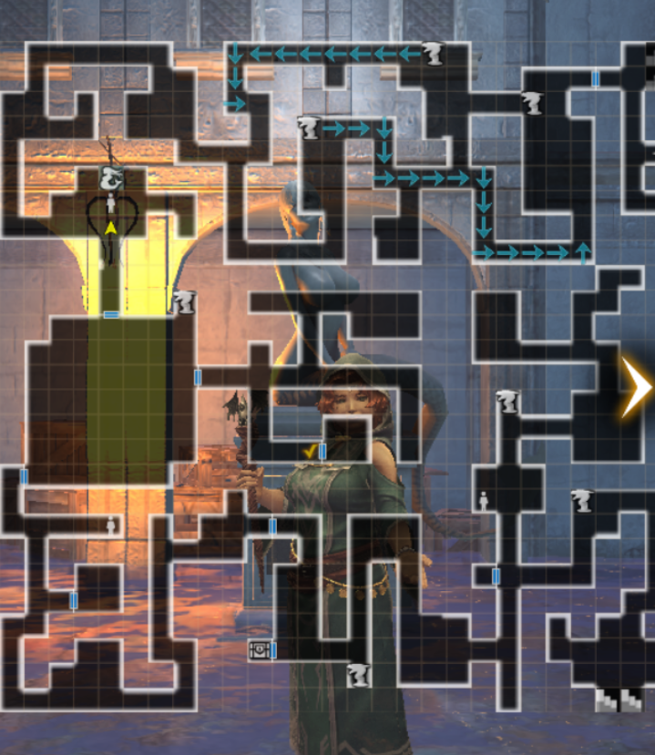

??? danger "The Unending Breath of Stone (70 Tokens)" 

    === "Bounty Picture" 
        

    === "Bounty Details"
        - Roamer, does not show on the minimap.
        - 3500 Gold Reward
        - 70 Token Reward
        - Appears at Bounty Rank 2

    === "Fight Details"
        - Spawns with 2 Chimeras in the front row, and 1 Chimera in the middle row. The Gorgon is in the backmost row.

??? danger "The Champion (80 Tokens)" 

    === "Bounty Picture" 
        

    === "Bounty Details"
        - Roamer, does not show on the minimap.
        - 4100 Gold Reward
        - 80 Token Reward
        - Appears at Bounty Rank 3

    === "Fight Details"
        - Spawns by itself initially, but will summon two weaker Lizardman Champions, one of which is in the same row and one in the back. It can summon multiple times in a fight.

??? danger "Dungeon-Stalkers (115 Tokens)" 

    === "Bounty Picture" 
        

    === "Bounty Details"
        - Stationary, indicated by NPC icon on map. Typically appears in a small dead end corridor.
        - 4800 Gold Reward
        - 115 Token Reward
        - Appears at Bounty Rank 4

    === "Fight Details"
        - Spawns as 3 Bandits in the same row.

    === "Map Location"
        

??? danger "Fallen Princess of Bewitching Dreams (120 Tokens)" 

    === "Bounty Picture" 
        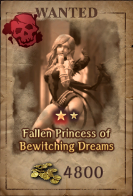

    === "Bounty Details"
        - Stationary, appears as a green mob on the minimap. Will always be in the room that requires the Vernant sidequest to open.
        - 4800 Gold Reward
        - 120 Token Reward
        - Appears at Bounty Rank 4

    === "Fight Details"
        - Spawns with 5 hostile adventurers in the front row. The Succubus will be in the back row.
        - The succubus can move twice per turn.

    === "Map Location"
        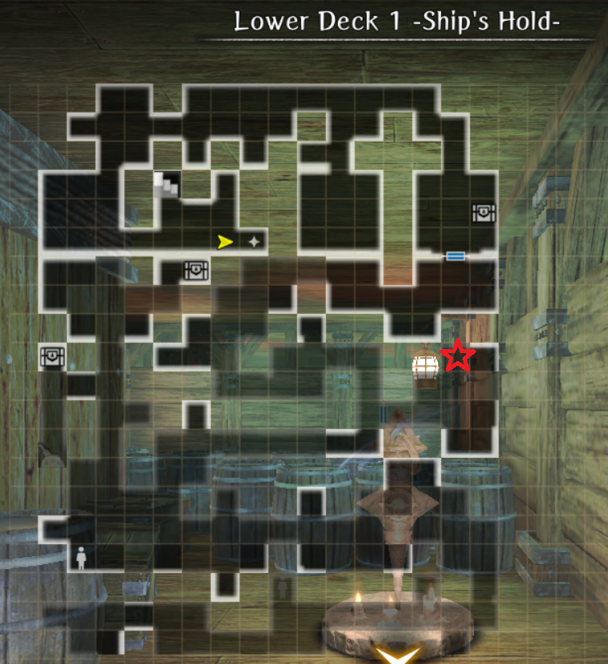
        
??? danger "Dolan, the Long-Lost Sailor (215 Tokens)" 

    === "Bounty Picture" 
        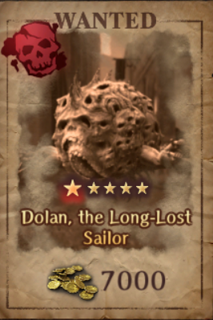

    === "Bounty Details"
        - Roamer, does not show on the minimap.
        - 7000 Gold Reward
        - 215 Token Reward
        - Appears at Bounty Rank 6

    === "Fight Details"
        - Spawns as an Oar Collector by itself.
        - When it takes enough damage, it will flood the battlefield out of turn.
        
??? danger "Ecstatic Blazing Eye (310 Tokens)" 

    === "Bounty Picture" 
        

    === "Bounty Details"
        - Stationary, but does not appear on the map. It will always be in the small room that is accessed by heading to the bottom right staircase from the Upper Deck Arena.
        - 8000 Gold Reward
        - 310 Token Reward
        - Appears at Bounty Rank 8

    === "Fight Details"
        - Spawns as a Corrosion Eye by itself.
        - It can move three times per turn.

    === "Map Location"
        

## Abyss 3 Bounties

??? danger "Reaper Bunny (65 Tokens)" 
    
    === "Bounty Picture" 
        

    === "Bounty Details"
        - Roamer, does not show up on the minimap.
        - 2000 Gold Reward
        - 65 Token Reward
        - Appears at Bounty Rank 1

    === "Fight Details"
        - Spawns with 1 normal Vorpal Bunny on each side. The boss Vorpal Bunny is light element.
        - Acts twice on its turn and has extremely high evasion.
        
??? danger "Sand Shadow that Calls Scorched Earth (60 Tokens)"

    === "Bounty Picture" 
        

    === "Bounty Details"
        - Roamer, does not show up on the minimap, can show up in caged areas as well.
        - 3500 Gold Reward
        - 60 Token Reward
        - Appears at Bounty Rank 2

    === "Fight Details"
        - Spawns as a group of 7 Sand Apparitions
        - There are 3 in the front row, 3 in the middle row, with the boss in the back.
        - The boss can re-summon Sand Apparitions.
        
??? danger "Petz, the Mook who Flaunts Authority (145 Tokens)"

    === "Bounty Picture" 
        

    === "Bounty Details"
        - Stationary, appears as an NPC icon on the map.
        - 3560 Gold Reward
        - 145 Token Reward
        - Appears at Bounty Rank 5

    === "Fight Details"
        - Spawns with 5 Pirate Berserkers in the frontline. Ruffian boss will be in the backline.
        - They are relatively weak.

    === "Map Location"
        

??? danger "Timid Crimson Fang (240 Tokens)"

    === "Bounty Picture" 
        

    === "Bounty Details"
        - Stationary, doesn't appear on the minimap. However, he's always located in the same map structure.
        - 7200 Gold Reward
        - 240 Token Reward
        - Appears at Bounty Rank 7

    === "Fight Details"
        - Spawns with a row of hostile adventurers in the front and middle row. The back row has the Vampire.
        - The Vampire has extremely high evasion.

    === "Map Location"
        

??? danger "Insatiable Gorger (360 Tokens)"

    === "Bounty Picture" 
        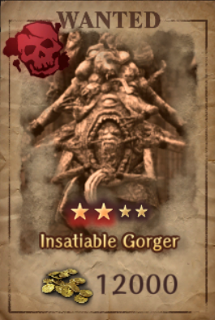

    === "Bounty Details"
        - Roamer, doesn't appear on the minimap.
        - 12000 Gold Reward
        - 360 Token Reward
        - Appears at Bounty Rank 8

    === "Fight Details"
        - Spawns by itself as an Ent.
        - It can move twice per turn, and tends to cast Breath of Gluttony, which is a row damaging skill that guarantees Critical Poison with a chance to also Confuse.
        
??? danger "Shadow-Lurking Operative (400 Tokens)"

    === "Bounty Picture" 
        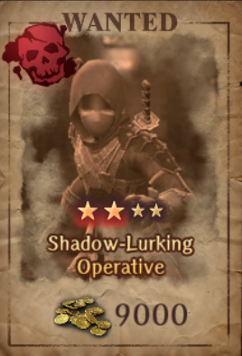

    === "Bounty Details"
        - Stationary, appears on the minimap as an NPC. Will always be inside a 2x1 small room.
        - 9000 Gold Reward
        - 400 Token Reward
        - Appears at Bounty Rank 9

    === "Fight Details"
        - Spawns with a front row and middle row of Indigo and Amber ninjas. The boss ninja will be in the backmost row.
        - This fight is very similar to that of the Sand Shadow Cave boss fight. There is a lot of confusion/critical.

??? danger "Indolent Demon Marquis (425 Tokens)"

    === "Bounty Picture" 
        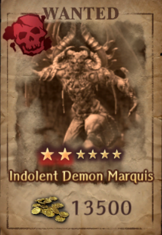

    === "Bounty Details"
        - Stationary, but doesn't appear on the map. Appears in the alarm trap room of the floor.
        - 13500 Gold Reward
        - 425 Token Reward
        - Appears at Bounty Rank 9

    === "Fight Details"
        - Spawns with a front row and middle row of 3 lesser demons. The Greater Demon will be in the backmost row.
        - The Greater Demon can move twice per turn and will summon more lesser demons per turn as long as he doesn't reach the front row.
        - Once the Greater Demon reaches the front row, he will continually summon Greater Demons until the entire field is filled.
        - The Greater Demon has a lot of surety evasion (~150) and around 25-30k HP.
        - It is recommended to not kill all the lesser demons (don't let the Greater Demon boss reach the front row), buff front row with masolotu + use evasion gear, and carry ranged damaging options. Focus entirely on damaging the Greater Demon boss and just ignore the lesser demons.

    === "Map Location"
        

??? danger "Mellie, the Coin-Counting Killer (500 Tokens)"

    === "Bounty Picture" 
        

    === "Bounty Details"
        - Stationary, appears as an NPC on the map in a specific structure.
        - 16400 Gold Reward
        - 500 Token Reward
        - Appears at Bounty Rank 10

    === "Fight Details"
        - Spawns with 3 Human Knight Adventurers in the front row. She will be in the backrow.
        - She moves twice per turn and will cast Healing skills/debuffs/AOE magic.
        - The Knights have a very high chance to defend a hit on Mellie.

    === "Map Location"
        

??? danger "Veigar, the Sorceror Who Rules the Dead (800 Tokens)"

    === "Bounty Picture" 
        

    === "Bounty Details"
        - Stationary, appears as an NPC on the map in a specific 2x1 room.
        - 17000 Gold Reward
        - 800 Token Reward
        - Appears at Bounty Rank 11

    === "Fight Details"
        - Spawns with 2 Necrocores in the front row. The necromancer will be in the back row.
        - Can randomly cast Lazelos.
        - When both Necrocores are dead, he can summon skeletons like a typical necromancer.
        - Both Necromancer + Necrocore cannot spawn as a relic monster.

    === "Map Location"
        

??? danger "Mad, Rampaging, Thunderous Fiend (1200 Tokens)"

    === "Bounty Picture" 
        

    === "Bounty Details"
        - Stationary, but doesn't appear on the map. Appears right outside the Zone 10 Greater Harken.
        - 18900 Gold Reward
        - 1200 Token Reward
        - Appears at Bounty Rank 12

    === "Fight Details"
        - Spawns with 3 Succubi in the Front Row, and 2 Chimera in the back row. The Cyclops will be in the middle row.
        - He only spams Frenzied Strike, which gives him a permanent undispellable CT buff. This attack can target his own allies as well. The attack is wind element.
        - This attack is extremely strong and can even one shot backline units if they are not defending/using knight's defense.
        - It is recommended if you are not strong enough to kill him in a timely manner with Knight's Defense spamming to simply cast Batilgref and defend to take advantage of opening damage.
        - Has around 57k-60k HP.

    === "Map Location"
        

## Other Bounties

??? danger "The Lurking Flutter Hunting-Fey (80 Tokens)"

    === "Bounty Picture" 
        

    === "Bounty Details"
        - Roaming, but will turn white and attempt to run away. Other enemies will turn red and attempt to chase you.
        - 1600 Gold Reward
        - 80 Token Reward
        - Appears at Bounty Rank 1

    === "Fight Details"
        - Spawns with 2 Dragonflies and 2 Vorpal Bunnies in the front row. The Pixie is in the back row.

    === "Map Location"
        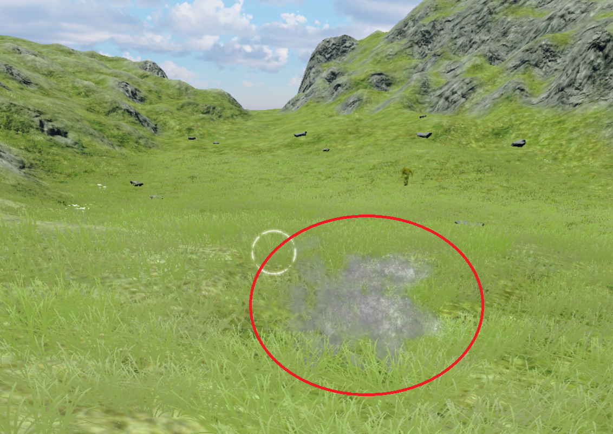

## Bounty Medal Shop

### Permanent Items

The Hound Mask is a unique piece of Ebonsteel cloth headgear that increases Disarm Trap and unlocks at Bounty Rank 5 ("Rank"). It is a permanent item and does not reset each month. Please remember to lock each copy after purchasing to avoid accidentally bulk-selling them in the Item Shop. There is no known way to gain extra copies and you will be unable to reach max unification (3/3) and enhancement (+20).

| Item | Rank | Bounty Medals | # Copies | Total Bounty Medals |
|:-----|:----:|:-------------:|:--------:|:-------------------:|
| Hound Mask | 5 | 1,500 | 1  | 1,500   |  
| Hound Mask | 5 | 3,000 | 2  | 6,000   | 
| Hound Mask | 5 | 4,000 | 24 | 96,000  | 
| Total      |   |       | 27 | 103,500 | 

### Monthly Items

Monthly items reset on the first of each month at 0:00 (midnight) JST. A higher Bounty Rank unlocks additional items and several of them can be purchased multiple times ("# Copies"). The total cost to clear the shop each month is 45,000 Bounty Medals. Excluding the High, Mid, and Low Iron Ore the total cost is 40,500.   

| Item | Rank | Bounty Medals | # Copies | Total Bounty Medals |
|:-----|:----:|:-------------:|:--------:|:-------------------:|
| Way of the Warrior Skill Scroll | 13 | 3,000 | 1  | 3,000   |  
| Way of the Mage Skill Scroll    | 13 | 3,000 | 1  | 3,000   | 
| Book of Honed Ability Secrets   | 10 | 3,000 | 1  | 3,000   | 
| Book of Passive Magic Defense Up Secrets                    | 3  | 1,500 | 5  | 7,500   |  
| Book of Passive Defense Power Up Secrets                     | 3  | 1,500 | 5  | 7,500   | 
| Legendary Adventurer's Remains  | 1  | 8,000 | 1  | 8,000   |  
| Adventurer's Remains            | 1  | 800   | 5  | 4,000   |
| Gem of Org x100                 | 1  | 400   | 5  | 2,000   | 
| Codex of Learning               | 1  | 2,500 | 1  | 2,500   | 
| High Grade Iron Ore             | 1  | 100   | 20 | 2,000   | 
| Mid Grade Iron Ore              | 1  | 75    | 20 | 1,500   | 
| Low Grade Iron Ore              | 1  | 50    | 20 | 1,000   | 
| Total                           |    |       |    | 45,000  | 

## One-Time Bounty Rank Rewards

| Bounty Rank | Adv. Remains | Gems of Org | Gold | Special |
|:-----------:|:---------:|:-----------:|:----:|:-------:|
| 2 |   | 100 | 40,000 | |  
| 3 | 1 | 100 | 90,000 | | 
| 4 |   | 100 | 200,000 | | 
| 5 | 3 | 300 | 200,000 | | 
| 6 |   | 100 | 300,000 | | 
| 7 |   | 100 | 300,000 | 1 Legendary Remains |
| 8 |   | 100 | 500,000 | | 
| 9 | 3 | 300 | 500,000 | |  
| 10 |  | 100 | 600,000 | |  
| 11 | 1 | 100 | 600,000 | |  
| 12 | 3 | 300 | 800,000  |  |  
| 13 |   | 500 | 1,000,000  | Master Ring   |  
| Total | 11 | 2,200  |  4,530,000  |    |

## Unique Rewards

!!! warning "It's entirely possible to buy all the hound masks and not receive a 4* Purple"

- Master Ring: Abyss 4 tier ring that always generates as a White 5* with 0/3 Strength Level. It provides 13 of every stat, minus Defense and Magic Defense which are a bit higher.
- Hound Mask: Randomly generated quality and grade ebonsteel level cloth hat that has innate evasion and resistance. At +20, it gives 17 Disarm Trap. 
- Book of Honed Ability Secrets: Provides a few stats that vary depending on class.

**Hound Mask**:

- Enhance +0 = 5 Disarm Trap
- Enhance +5 = 8 Disarm Trap
- Enhance +10 = 11 Disarm Trap
- Enhance +15 = 13 Disarm Trap
- Enhance +20 = 17 Disarm Trap

**Book of Honed Ability stat boost**:

- Fighter: 5 ATK, 5 ACC
- Knight: 10 HP, 5 DEF, 5 MDEF
- Thief: 5 Disarm Trap, 5 Evade Trap, 5 Detect
- Ninja: 5 ATK, 5 EVA, 5 ASPD
- Samurai: 5 ATK, 5 MAG
- Priest: 5 DIV, 5 RES
- Mage: 10 MP, 5 MAG

## Farming Information

- It's possible to farm a specific bounty by cursed wheeling in place, typically to Triumphant Return
- There is no limit to the number of Bounty Medals you can farm
- It's possible for bounty monsters to spawn as a relic version. Note that relic monsters can only spawn in the first row
- It costs 45,000 points (40,500 with no ore) to buy out the respawning items in the shop every month.
- It's recommended to farm Veigar as he is always in a set location close to a Harken and easier to deal with than some other bounties. Alternatively, you can farm Peerless Scorpionesses.

