# Bounties

!!! warning "Work in Progress"
    - Ctrl + F5 to refresh

## Overview

!!! warning "How to Unlock" 

    - Defeat the GWO of Abyss 2 (Port Town Grand Legion), go to the Royal Capital, and speak with Arna who will give an introduction to the bounty system.
    - At the Guild select Requests and you will see a new tab called Bounties. Every Guild in each major city has its own set of bounties for you to find and defeat. New bounties are added based on your Bounty Rank and Abyss progression.  

### Bounty System

=== "Wanted Posters"

    === "Details"
    
        - Name
        - Gold Reward
        - Bounty Medals: Used to exchange for one-time and monthly rewards at the Jeweler under [Exchange-Bounty Medal](#bounty-medal-exchange-shop). 
        - Bounty Markers: One-time only points used to increase your Bounty Rank. 
        - Skull Icon
            - Located in the upper-left of the wanted poster. 
            - Red: Must be killed.
            - Blue: Can be killed or captured. Capturing is more challenging, but gives a bonus gold and Bounty Medal reward. 
        - Reported Sightings: Lists the specific floor the bounty can be encountered. 
        - Star Icon
            - Represents both the number of Bounty Markers and relative difficulty. In practice, it is not that useful as some low-star bounties can be as challenging as their high-star counterparts depending on your account's power level and team composition.
            - Note that 5 small stars are equal to 1 large, glowing star. 

    === "Wanted Dead"
        

        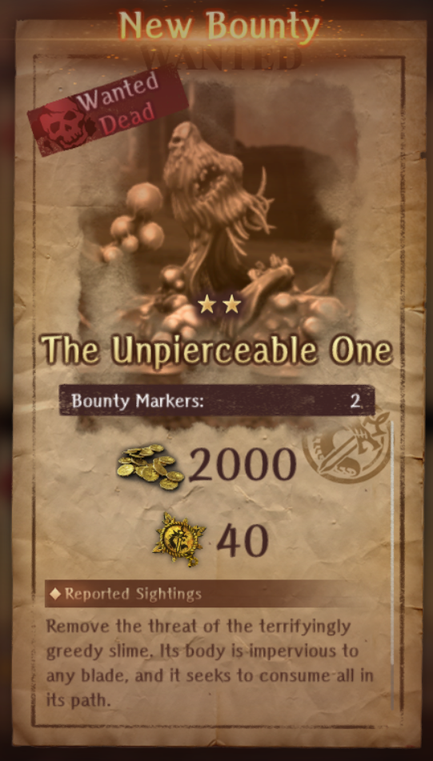
        

    === "Capture Alive" 
        

        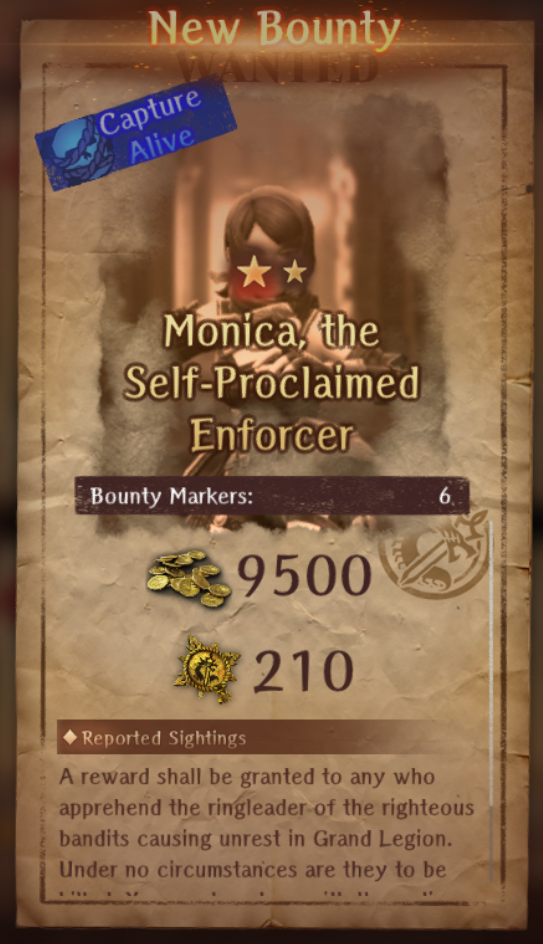
        

    === "Capture Alive (Optional)"
        

        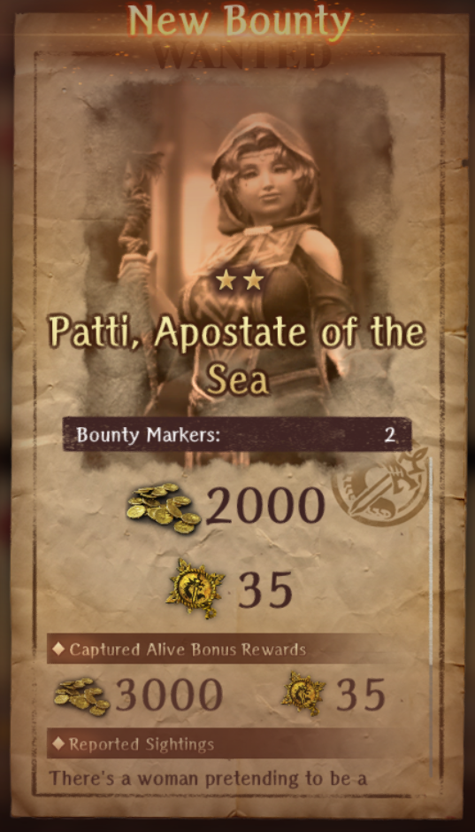
        

        
=== "How to Accept, Submit, and Reset"

    - The Bounties tab is located under Guild - Requests.
    - Accept 
        - Selecting the Bounties tab will automatically activate every available bounty for that Abyss and associated dungeons. To double-check your active bounties go to Log - Bounty List. 
        - Active bounties are denoted by a black skull on both the world map and the dungeon floor selection screen.  
    - Submit 
        - After defeating or capturing a bounty return to the appropriate Guild, select the Bounties tab, and the wanted poster will be glowing.
        - Select the wanted poster to submit the bounty and receive your rewards. 
        - Warning! If you wheel outside of the current Abyss, then the bounty will be reset.
    - Reset 
        - Bounties can be reset by wheeling-in-place on the same Cursed Wheel node. 
        - To wheel-in-place go to the Ruins - Cursed Wheel, select your current or furthest node, and Leap. 
        - Note that bounties are tied to specific floors, so if you Cursed Wheel to an earlier point where that floor is not accessible it will not appear on the Bounties tab. 
        
            !!! warning "Each time you reset you must return to the Guild - Requests and selected the Bounties tab again."

=== "Bounty Rank" 

    - A progression metric that unlocks additional bounties, adds new items to the Bounty Medal Exchange, and grants milestone rewards.   
    - Ranges from Level 1-15 (current max). 
    - Defeating a bounty for the first time gives one-time only Bounty Markers, which function as experience points. You cannot farm a bounty repeatedly for additional Bounty Markers.  
    - Each Bounty Rank generally requires defeating all the available bounties in each city. If you are stuck, then revisit each location or make additional Abyss progression. 
    - Your Bounty Rank is listed at the bottom of the Bounties tab. To view the [milestone rewards](#one-time-bounty-rank-rewards) select "Check Rewards".  

### Mechanics

=== "Battle" 

    - You cannot be ambushed you unless you have a Morgus contract active. You can literally walk into them backwards. 
    - You can flee 100% of the time, however they will disappear afterward. You will need to change floors or exit and re-enter the Abyss for them to reappear.
    - Can give relics, but only if they are in the front row. If you encounter a bounty that carries a relic (pink-purple aura), then its HP will be ~30% higher. They do not appear to give relics at a higher rate versus slag. 

=== "Capturing"

    - Only human bounties can be captured. It is easy to accidentally kill a target, tracking its HP is recommended.   
    - Steps
        - Weaken an enemy to 10-15% of its HP.
        - Use a Binding Rope (consumable item) until it is successfully captured.  
        - Some enemies will do an out-of-turn action, a unique action, or give in-battle text to signal they can be captured.
    - Binding Rope
        - Sold at the Item Shop for 200 gold. 
        - DEX is the single most critical factor for capturing a bounty. Ninjas and Thiefs are recommended. The Grip Gloves seem to provide a small, marginal benefit based on limited testing. 
        - The rope message is a helpful indicator:
            - Knocked away means that its HP is still too high. 
            - A "Miss" means the bounty can be captured, but that the unit's DEX is too low for a 100% guarantee. 
            - Each time you throw a rope the game rolls against the unit's DEX stat for a % capture rate. You can try again with that unit, but if their DEX is too low the effective capture rate might be 0%. 
        - It may take several attempts to successfully capture a bounty even at very low HP. 
    - If you accidentally kill the bounty, then you must exit the dungeon, Cursed Wheel, return to the Guild and re-accept the bounty, and try again.
    - There are achievements for capturing a bounty 1, 5, 10, and 20 times.  
    
=== "Map Types"

    - Fixed
        - Populate on a specific tile set and will never move. 
        - Displayed on the mini-map as a green arrow. 
    - Wandering
        - Can appear anywhere on the floor map, but their spawning location can be reset with changing floors or exiting and re-entering.  
        - They have a tendency to get stuck in walls, so if you have cleared the entire floor and they do not appear try exiting and restarting your game. 
        - Not displayed on the mini-map. 
    - Person
        - Populate on a specific tile set and will never move. 
        - Appear as a "person icon" on the mini-map if that part of the floor has been explored.
        - These encounters are always against human enemies. There will often be a brief interaction when you encounter them where you will be offered the choice to fight or let them go. 
        - Can never drop relics. 

=== "Map Variations" 

    - Each time you Cursed Wheel outside of your current Abyss it can reset your map configuration. Fortunately, bounties with events (dialogue) are always fixed to their relative room location. 
    - See the [Map Variations](../../mechanics/map-variations.md) page for details. If your map doesn't match what is shown below refer to the appropriate Dungeon Guide Abyss map to see other possible locations

### Bounties Summary Tables

=== "Unlock Conditions" 

    | Rank | Unlock Conditions |
    |:--|:--|
    | 1-7 | Clear Abyss 2 (Normal Ending) + some Abyss 3 progression |
    | 8-9 | Clear Abyss 2 (True Ending) + some Abyss 3 progression. "Defeated Octoranus" must be toggled in the Curse Wheel under "Return to the Capital" |
    | 10-12 | Clear Abyss 3 (Mastermind Ending) |
    | 13-14 | Clear Abyss 3 (Mastermind Ending) with 0 Corrosion (all 13 sentry nodes in the Curse Wheel set to "Not Spotted"). You do not need to defeat the Greater Warped One. Have MC die during the fight and accept death |
    | 15 | Clear Abyss 4 GWO (Save Iris Ending) |

=== "Bounties List" 

    

    | Bounty Name &emsp;  &emsp; &emsp;  &emsp; &emsp;  &emsp; &emsp;  &emsp;                               | Rank | Guild &emsp;         | Location | Floor  | Markers | Medals | Gold   | Capture? |
    |:------------------------------------------|:----:|:--------------|:---------|:-------|:-------:|:------:|--------|:--------:|
    | Goblin Daddy                              | 1    | Royal Capital | &emsp;&nbsp; A1       | B3F    | 2       | 45     | 2,000  |          |
    | Warped One Burning with Vengeance         | 1    | Royal Capital | &emsp;&nbsp; A1       | B1F    | 1       | 30     | 1,800  |          |
    | Jhael, the Novice Slayer                  | 1    | Royal Capital | &emsp;&nbsp; A1       | B4F    | 1       | 30     | 1,800  | Yes      |
    | The Unpierceable One                      | 1    | Port Town     | &emsp;&nbsp; A2       | D3     | 2       | 40     | 2,000  |          |
    | Patti, Apostate of the Sea                | 1    | Port Town     | &emsp;&nbsp; A2       | D5     | 2       | 35     | 2,000  | Yes      |
    | The Lurking Flutter Hunting-Fey           | 1    | Port Town     | &emsp;&nbsp; Valeon   |        | 1       | 80     | 1,600  |          |
    | Reaper Bunny                              | 1    | Guarda        | &emsp;&nbsp; A3       | Z2     | 3       | 65     | 2,000  |          |
    | Brok, the Shrewd Swindler                 | 2    | Royal Capital | &emsp;&nbsp; A1       | B3F    | 3       | 55     | 2,300  | Yes      |
    | Grudge-Bearing Sack Doll                  | 2    | Royal Capital | &emsp;&nbsp; A1       | B5F    | 1       | 100    | 1,900  |          |
    | The Unending Breath of Stone              | 2    | Port Town     | &emsp;&nbsp; A2       | D1     | 6       | 70     | 3,500  |          |
    | Sand Shadows that Calls Scorched Earth    | 2    | Guarda        | &emsp;&nbsp; A3       | Z1     | 5       | 60     | 3,500  |          |
    | Skeleton Archmage                         | 3    | Royal Capital | &emsp;&nbsp; A1       | B7F    | 6       | 90     | 2,700  |          |
    | The Champion                              | 3    | Port Town     | &emsp;&nbsp; A2       | D2     | 6       | 80     | 4,100  |          |
    | Saige the Sacker                          | 4    | Royal Capital | &emsp;&nbsp; A1       | B6F    | 4       | 110    | 4,800  | Req      |
    | Dungeon-Stalkers                          | 4    | Port Town     | &emsp;&nbsp; A2       | D6     | 7       | 115    | 4,800  |          |
    | Fallen Princess of Bewitching Dreams      | 4    | Port Town     | &emsp;&nbsp; A2       | Ship 1 | 6       | 120    | 4,800  |          |
    | Six-Limbed Storm                          | 5    | Royal Capital | &emsp;&nbsp; A1       | B5F    | 8       | 180    | 6,800  |          |
    | Monica, the Self-Proclaimed Enforcer      | 5    | Port Town     | &emsp;&nbsp; A2       | D1     | 6       | 210    | 9,500  | Req      |
    | Petz, the Mook Who Flaunts Authority      | 5    | Guarda        | &emsp;&nbsp; A3       | Z3     | 4       | 145    | 3,600  | Yes      |
    | Host of the Cursed Banquet                | 6    | Royal Capital | &emsp;&nbsp; A1       | B6F    | 8       | 200    | 5,100  |          |
    | Dolan, the Long-Lost Sailor               | 6    | Port Town     | &emsp;&nbsp; A2       | D3     | 9       | 215    | 7,000  |          |
    | Peerless Scorpionesses                    | 7    | Royal Capital | &emsp;&nbsp; A1       | B2F    | 11      | 280    | 10,800 |          |
    | Timid Crimson Fang                        | 7    | Guarda        | &emsp;&nbsp; A3       | Z5     | 9       | 240    | 7,200  |          |
    | Estatic Blazing Eye                       | 8    | Port Town     | &emsp;&nbsp; A2       | Ship 2 | 10      | 310    | 8,000  |          |
    | Insatiable Gorger                         | 8    | Guarda        | &emsp;&nbsp; A3       | Z8     | 12      | 360    | 12,000 |          |
    | Ross, the Twisted Knight                  | 8    | Guarda        | &emsp;&nbsp; A3       | Z10    | 9       | 400    | 12,000 | Req      |
    | Shadow-Lurking Operative                  | 9    | Guarda        | &emsp;&nbsp; A3       | Z7     | 12      | 400    | 9,000  | Yes      |
    | Indolent Demon Marquis                    | 9    | Guarda        | &emsp;&nbsp; A3       | Z6     | 14      | 425    | 13,500 |          |
    | Mellie, the Coin-Counting Killer          | 10   | Guarda        | &emsp;&nbsp; A3       | Z6     | 13      | 500    | 16,400 | Yes      |
    | Veigar, the Sorceror Who Rules the Dead   | 11   | Guarda        | &emsp;&nbsp; A3       | Z2     | 15      | 800    | 17,000 | Yes      |
    | Ice Frost and Potent Venom Strangler Vine | 11   | Isberg        | &emsp;&nbsp; A4       | R4     | 13      | 950    | 17,000 |          |
    | Mad, Rampaging, Thunderous Fiend          | 12   | Guarda        | &emsp;&nbsp; A3       | Z10    | 20      | 1,200  | 18,900 |          |
    | Dutz, the Honey Tonic Savanat             | 13   | Isberg        | &emsp;&nbsp; A4       | R9     | 18      | 1,140  | 26,700 | Req      |
    | Spirit Realm Automaton                    | 14   | Isberg        | &emsp;&nbsp; A4       | R1     | 21      | 1,380  | 28,000 |          |
    | Wailing Twin Dolls                        | 14   | Isberg        | &emsp;&nbsp; A4       | R3     | 23      | 1,550  | 32,100 |          |
    
    

    
=== "Bounty Markers Required per Rank" 

    | Bounty Rank | Bounty Markers  |
    |:------------|:---------------:|
    | &emsp; 1 to 2      | 6               |
    | &emsp; 2 to 3      | 8               |
    | &emsp; 3 to 4      | 13              |
    | &emsp; 4 to 5      | 14              |
    | &emsp; 5 to 6      | 15              |
    | &emsp; 6 to 7      | 16              |
    | &emsp; 7 to 8      | 17              |
    | &emsp; 8 to 9      | 21              |
    | &emsp; 9 to 10     | 25              |
    | &emsp; 10 to 11    | 27              |
    | &emsp; 11 to 12    | 15              |
    | &emsp; 12 to 13    | 20              |
    | &emsp; 13 to 14    | 42              |
    | &emsp; 14 to 15    | 52              |

## Bounties

### Abyss 1

??? danger "Goblin Daddy (45 Bounty Medals)" 

    === "Wanted Poster" 
        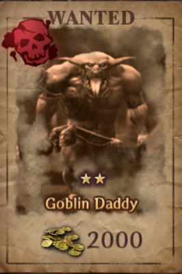

    === "Bounty Details"
        - Stationary, indicated by green mob on minimap, he will always be in the same location.
        - 2,000 Gold Reward
        - 45 Bounty Medals
        - 2 Bounty Markers
        - Appears at Bounty Rank 1

    === "Fight Details"
        - HP: 5.5-6K
        - Spawns with many goblin enemies (HP: ~500) and can resummon them if killed.

    === "Map Location"
        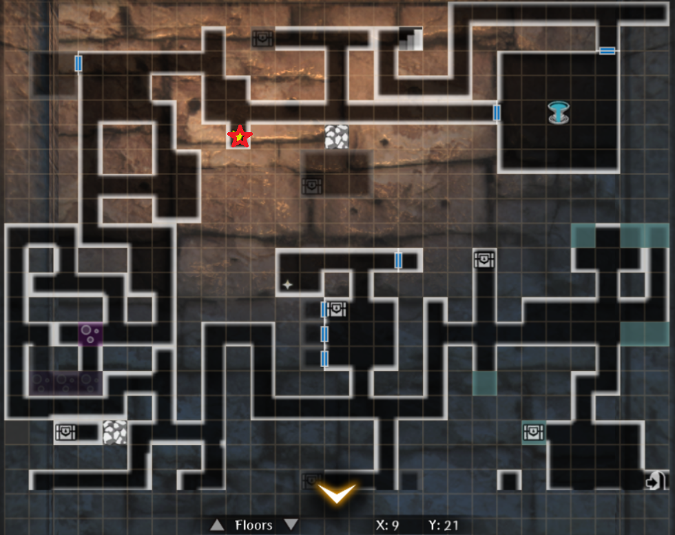

??? danger "Warped One Burning with Vengeance (30 Bounty Medals)" 

    === "Wanted Poster" 
        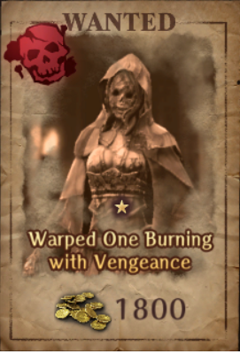

    === "Bounty Details"
        - Stationary, indicated by green mob on minimap, and will always be in the same location.
        - 1,800 Gold Reward
        - 30 Bounty Medals
        - 1 Bounty Marker
        - Appears at Bounty Rank 1

    === "Fight Details"
        - HP: 9.5-10K
        - Spawns as a Red Spinner Woman by itself.

    === "Map Location"
        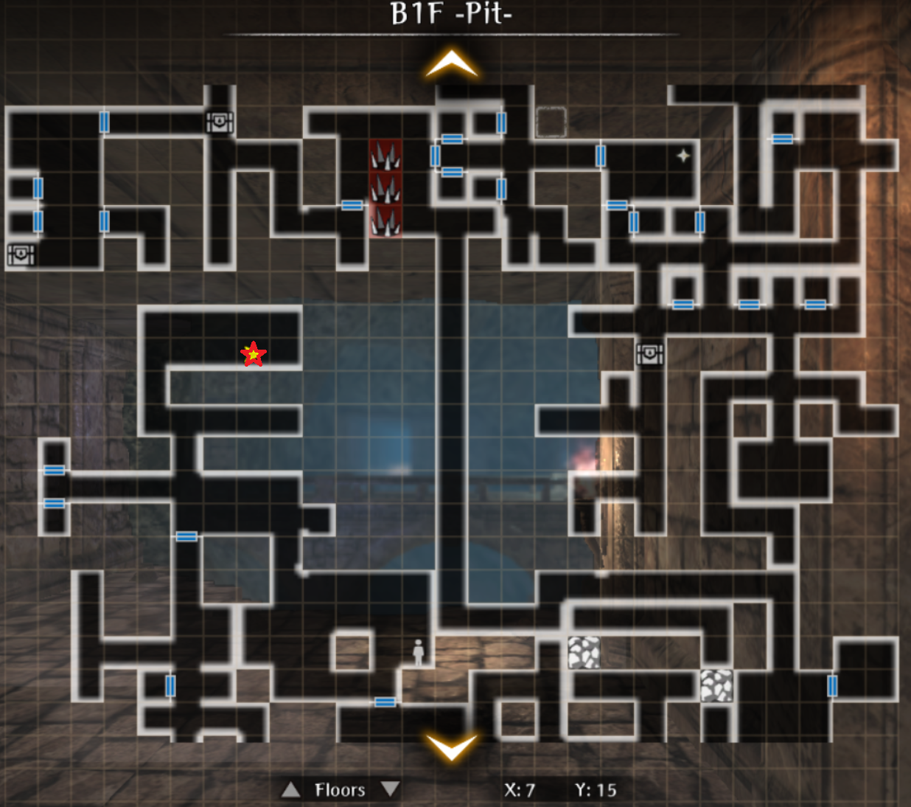
        
??? danger "Jhael, The Novice Slayer (30 Bounty Medals)" 

    === "Wanted Poster" 
        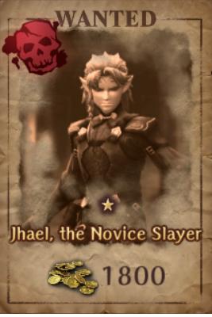

    === "Bounty Details"
        - Stationary, appears as a NPC on the map, can show up in two static locations
        - 1,800 Gold Reward
        - 30 Bounty Medals
        - 1 Bounty Marker
        - Appears at Bounty Rank 1

    === "Fight Details"
        - HP: 5.5-6K
        - Spawns as an Elf Fighter Adventurer by himself.

    === "Map Location"
        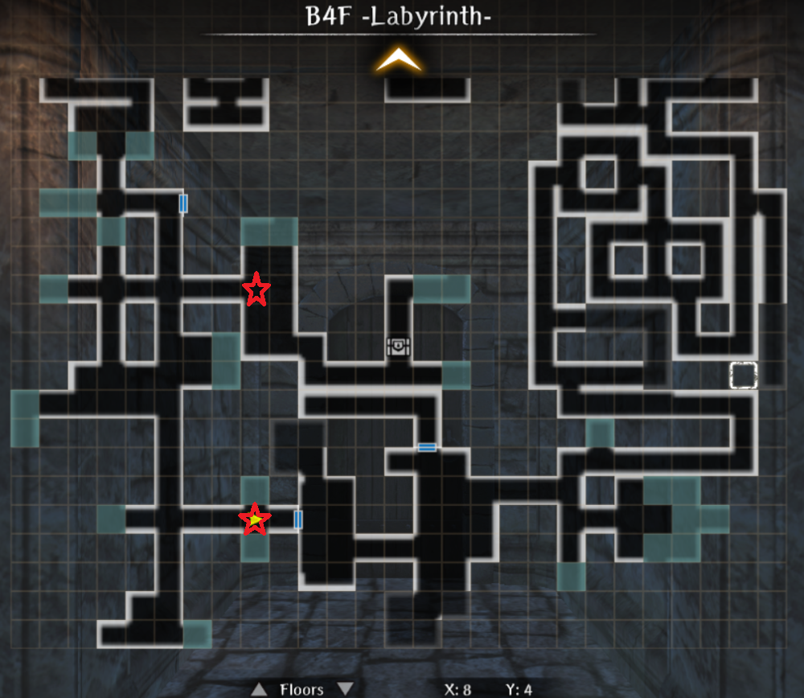

??? danger "Grudge-Bearing Sack Doll (100 Bounty Medals)" 

    === "Wanted Poster" 
         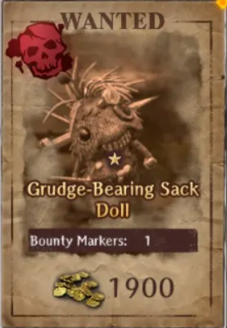

    === "Bounty Details"
        - Roamer, does not show up on the minimap.
        - Frequently appears to the south and east of the F5 Harken. Use the stairs to reset its location.
        - 1,900 Gold Reward
        - 100 Bounty Medals
        - 1 Bounty Marker
        - Appears at Bounty Rank 2

    === "Fight Details"
        - Bounty HP: 6.5k; Adds: 2.5-3K 
        - Spawns as three Cursed Dolls that can move twice each. They are extremely fast.
        - Remember that Cursed status harms you when you attack an enemy.
        - Seems to have a 7-day cooldown before respawning.
        - Can be farmed for EXP, but the bounty cannot be turned in. Must wheel to "Fresh Start" to respawn.
        
??? danger "Brokk, The Shrewd Swindler (55 Bounty Medals, 105 if Captured)" 

    === "Wanted Poster" 
        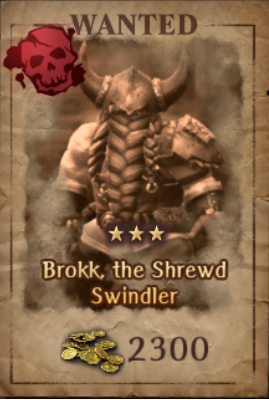

    === "Bounty Details"
        - Stationary, indicated by NPC on the map. He will always be in a corridor near the harken.
        - 2,300 Gold Reward
        - 55 Bounty Medals
        - 3 Bounty Markers
        - Capture Bonus
            - 3,200 Gold
            - 50 Bounty Medals
        - Appears at Bounty Rank 2

    === "Fight Details"
        - HP: 11-11.5K 
        - Spawns as a Dwarf Fighter by himself.

    === "Map Location"
        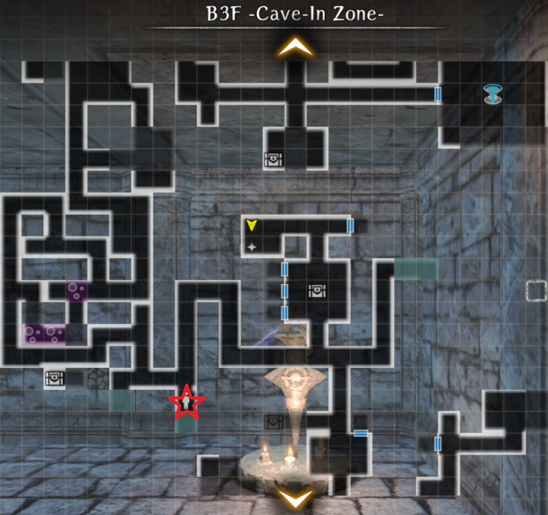
        
??? danger "Skeleton Archmage (90 Bounty Medals)" 

    === "Wanted Poster" 
        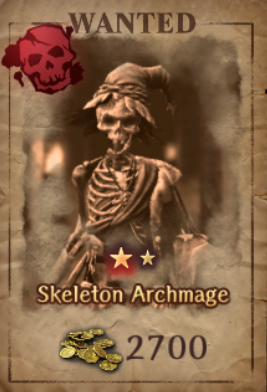

    === "Bounty Details"
        - Roamer, does not show up on the minimap.
        - Tends to show up around the poison hallways and areas connected by the F8 rocks.
        - Can sometimes spawn inside a wall, reset to fix.
        - 2,700 Gold Reward
        - 90 Bounty Medals
        - 6 Bounty Markers
        - Appears at Bounty Rank 3

    === "Fight Details"
        - HP: 12.5-13K 
        - Spawns with 2 skeletons and 2 skeletons knights in the front row, 2 skeletons and 1 skeleton knight in the middle row, and the boss skeleton mage is in the backmost row.
        - They are all susceptible to Marein.
        - Can be silenced.
        - When only the Skeleton Mage boss is alive, it will spam Lazelos (~150-200 damage).

??? danger "Saige the Sacker (110 Bounty Medals)"

    === "Wanted Poster" 
        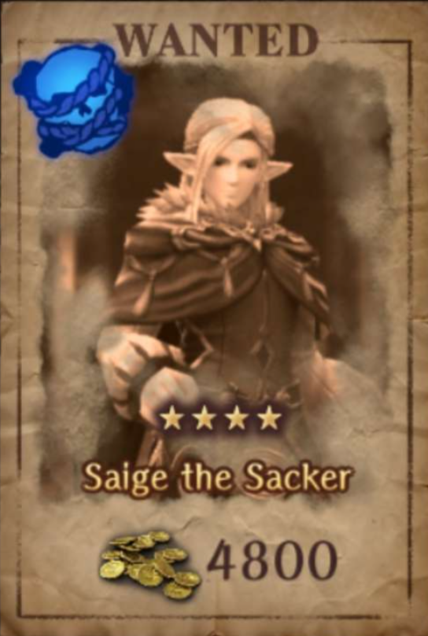

    === "Bounty Details"
        - Stationary, indicated as an NPC on the map
        - 4,800 Gold Reward
        - 110 Bounty Medals
        - 4 Bounty Markers
        - Appears at Bounty Rank 4
        
    === "Fight Details"
        - HP: ~5k (can be captured after ~3k)
        - Will cast Dios out of turn, which indicates that they can be caught with Binding Rope

    === "Map Location"
        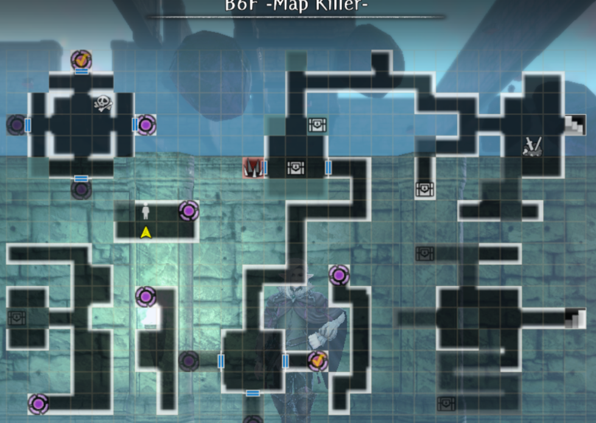

??? danger "Six-Limbed Storm (180 Bounty Medals)" 

    === "Wanted Poster" 
        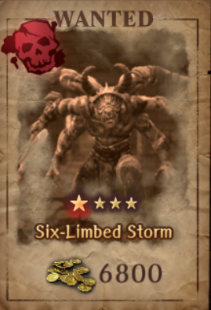

    === "Bounty Details"
        - Stationary, indicated as a green mob on the minimap. It always appears in the big room to the right of the harken.
        - 6,800 Gold Reward
        - 180 Bounty Medals
        - 8 Bounty Markers
        - Appears at Bounty Rank 5

    === "Fight Details"
        - HP: 12K
        - Spawns as a Minotaur by itself.
        - Immune to magic damage.
        - Has very high EVA and ACC, need 140-150 ACC to hit it consistently. 
        - Use Masolotu, Batilgref, Dilto, Heavy Attack 3+ and Decisive Torso Strike 2+ for the ACC bonus.
        - Maces are useful as they cannot miss.
        - Will get stronger and faster as the fight progresses. 
        
    === "Map Location"
        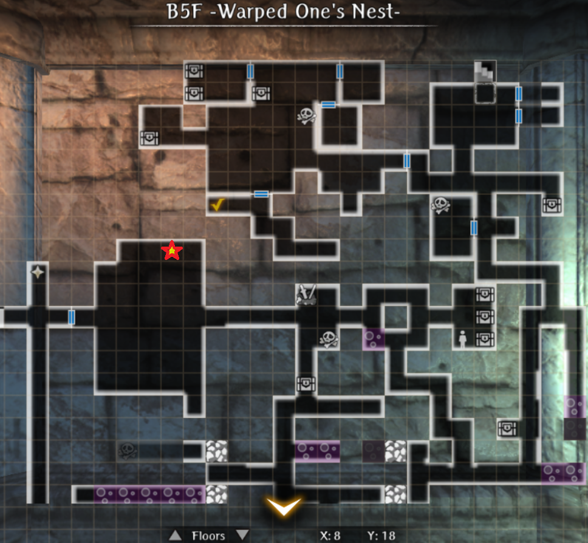

??? danger "Host of the Cursed Banquet (200 Bounty Medals)" 

    === "Wanted Poster" 
        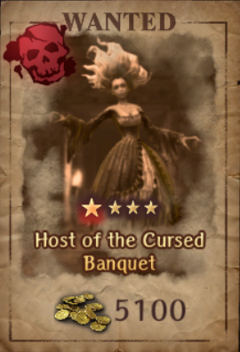

    === "Bounty Details"
        - Stationary, indicated as a green mob on the minimap. Appears right next to the staircase after going from B7 to B6.
        - 5,100 Gold Reward
        - 200 Bounty Medals
        - 8 Bounty Markers
        - Appears at Bounty Rank 6

    === "Fight Details"
        - HP: 8-9K
        - Spawns with 2 skeletons, 2 skeleton knights, and 1 poltergeist in the front row, 2 skeleton giants, 2 poltergeists, and 1 skeleton mage in the middle row, 2 skeleton archers, 1 skeleton mage, and the boss wight in the backmost row.
        - The wight acts twice per turn.
        - It's highly recommended to simply cast LA- spells to clear this. They are also all susceptible to Marein.

    === "Map Location"
        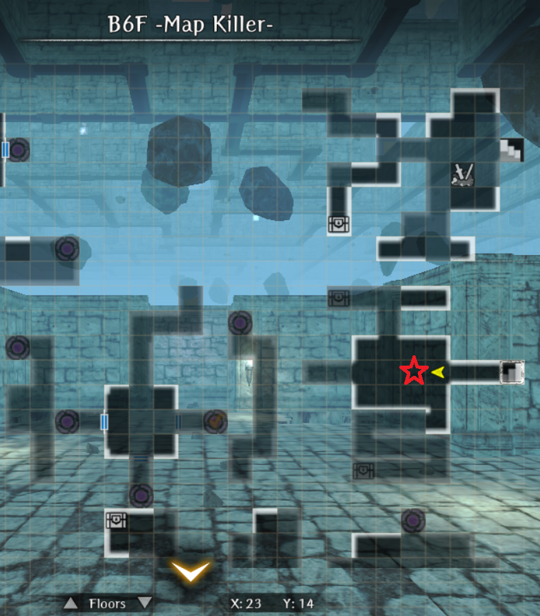
        
??? danger "Peerless Scorpionesses (280 Bounty Medals)" 

    === "Wanted Poster" 
        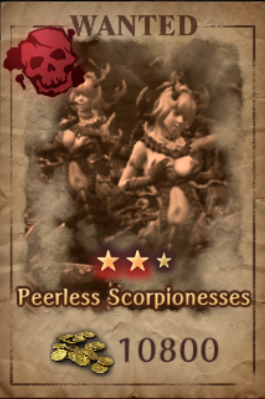

    === "Bounty Details"
        - Stationary, indicated as a green mob on the minimap.
        - 10,800 Gold Reward
        - 280 Bounty Medals
        - 11 Bounty Markers
        - Appears at Bounty Rank 7

    === "Fight Details"
        - HP: 11K (for both)
        - Spawns as a Scorpion Lady by itself.
        - Will summon another Scorpion Lady in the same row after taking a certain amount of damage (~1200) but not reaching the threshold for Rage.
        - After a certain HP threshold is reached (~4K), either Scorpion Lady will cast Rage, which allows it to move 5 times in one turn
        - Fight can be ended without the second Scorpion Lady being summoned.

    === "Map Location"
        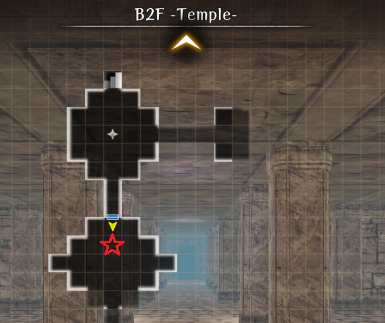

### Abyss 2 

??? danger "The Unpierceable One (40 Bounty Medals)" 

    === "Wanted Poster" 
        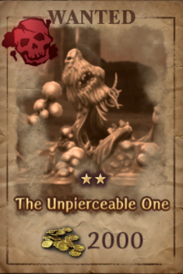

    === "Bounty Details"
        - Roamer, does not show up on the minimap, can appear in water current portions of the map.
        - 2,000 Gold Reward
        - 40 Bounty Medals
        - 2 Bounty Markers
        - Appears at Bounty Rank 1

    === "Fight Details"
        - HP: 5.5K
        - Spawns with 3 Floating Coins (500 HP) in the back.
        - Has very high defense.
        - Susceptible to Kantios (Confusion). 

??? danger "Patti, Apostate of the Sea (35 Bounty Medals)" 

    === "Wanted Poster" 
        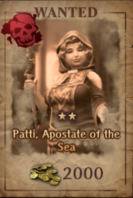

    === "Bounty Details"
        - Stationary, indicated by the NPC by the statue on the left of the map. Enter from B4. On fail, must reenter the Abyss.
        - 2,000 Gold Reward
        - 35 Bounty Medals
        - 2 Bounty Markers
        - Appears at Bounty Rank 1

    === "Fight Details"
        - HP: 2.5K
        - Spawns with two rows of hostile adventurers in the front and middle row. The Pirate Deacon will be in the backmost row.
        - The adds have roughly 1-1.5K HP. 
        - Susceptible to be Kantios (Confusion). 

    === "Map Location"
        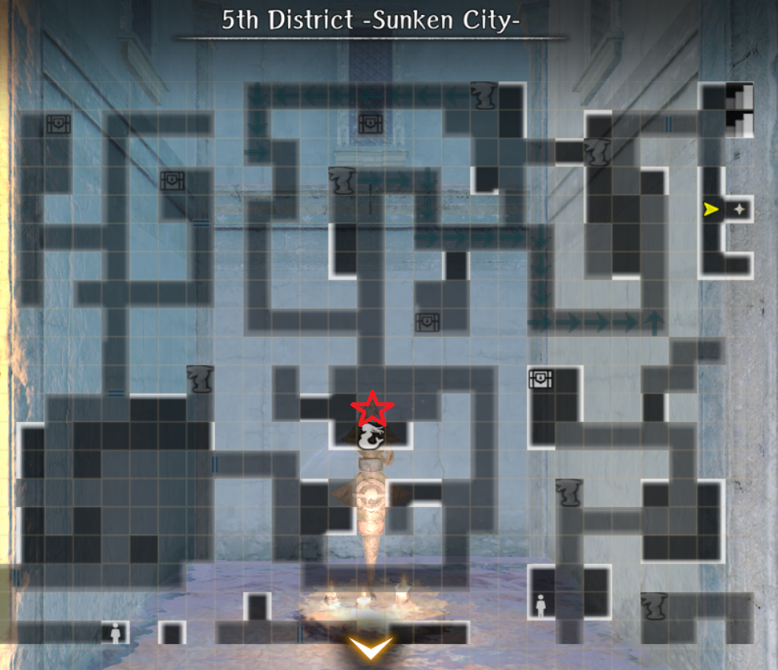

??? danger "The Lurking Flutter Hunting-Fey (80 Bounty Medals)"

    === "Wanted Poster" 
        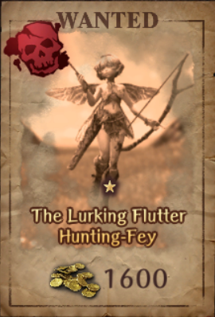

    === "Bounty Details"
        - Roaming, but will turn white and attempt to run away. Other enemies will turn red and attempt to chase you.
        - 1,600 Gold Reward
        - 1 Bounty Mark
        - 80 Bounty Medals
        - Appears at Bounty Rank 1

    === "Fight Details"
        - HP: 3.5K
        - Spawns with 2 Dragonflies (900 HP) and 2 Vorpal Bunnies (300 HP) in the front row. The Pixie is in the back row.

    === "Map Location"
        - Looking south from entrance:
        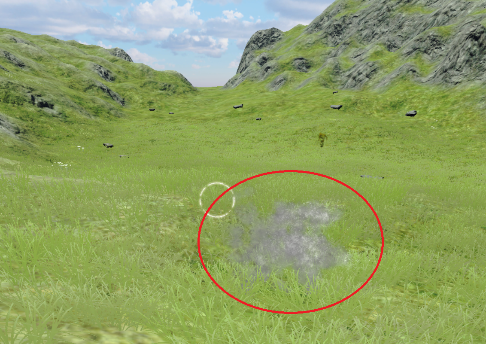

??? danger "The Unending Breath of Stone (70 Bounty Medals)" 

    === "Wanted Poster" 
        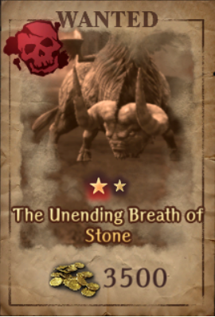

    === "Bounty Details"
        - Roamer, does not show on the minimap.
        - 3,500 Gold Reward
        - 70 Bounty Medals
        - Appears at Bounty Rank 2

    === "Fight Details"
        - HP: 25K HP
        - Spawns with 2 Chimeras (5.5K HP) in the front row, and 1 Chimera in the middle row. The Gorgon is in the backmost row.
        - Extremely weak to Kantios (Confuse), which will disable its stone breath and force it to use physical attacks. Have your Kantios user move last, but before the Gorgon to keep it applied each turn.  

??? danger "The Champion (80 Bounty Medals)" 

    === "Wanted Poster" 
        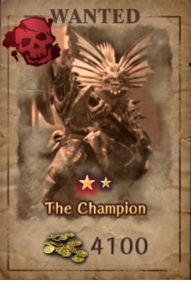

    === "Bounty Details"
        - Roamer, does not show on the minimap.
        - 4,100 Gold Reward
        - 80 Bounty Medals
        - 6 Bounty Marks
        - Appears at Bounty Rank 3

    === "Fight Details"
        - HP: 35K
        - Spawns by itself initially, but will summon two weaker Lizardman Champions, one of which is in the same row and one in the back. It can summon multiple times in a fight at roughly 25K and 10K HP.
        - Acts twice per turn. 
        - Susceptible to Kantios (Confusion). 

??? danger "Dungeon-Stalkers (115 Bounty Medals)" 

    === "Wanted Poster" 
        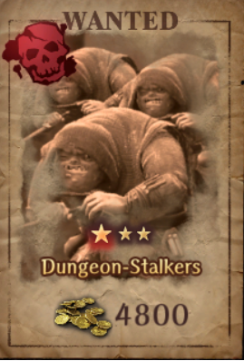

    === "Bounty Details"
        - Stationary, indicated by NPC icon on map. Typically appears in a small dead end corridor.
        - 4,800 Gold Reward
        - 115 Bounty Medals
        - 7 Bounty Markers    
        - Appears at Bounty Rank 4

    === "Fight Details"
        - HP: ???
        - Spawns as 3 Bandits in the same row.

    === "Map Location"
        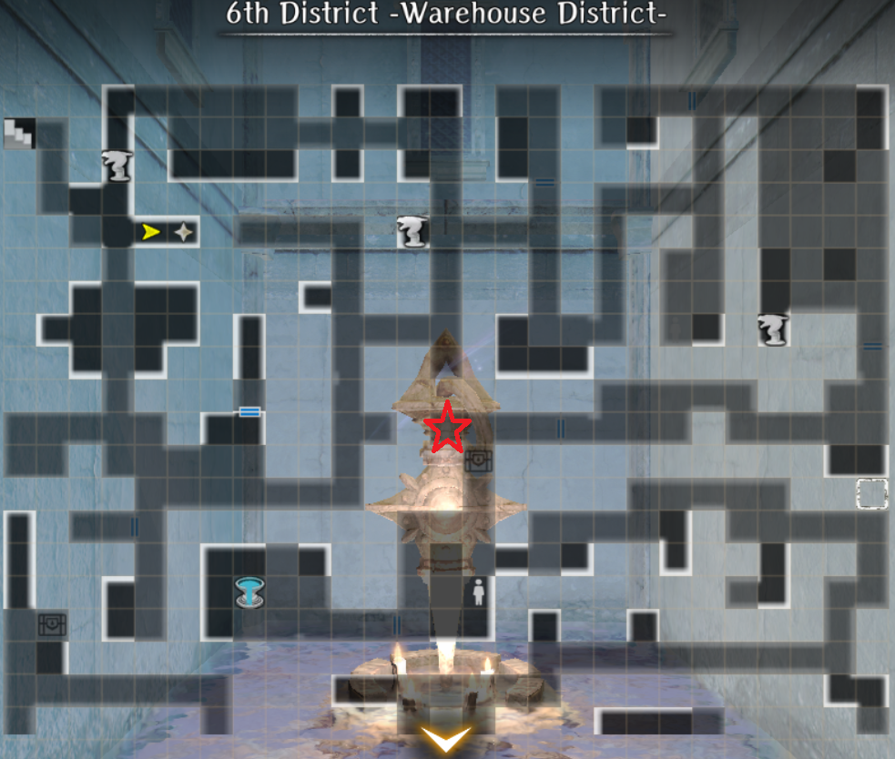

??? danger "Fallen Princess of Bewitching Dreams (120 Bounty Medals)" 

    === "Wanted Poster" 
        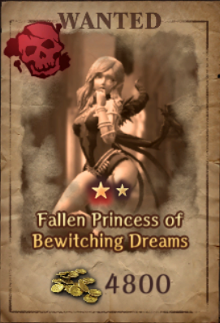

    === "Bounty Details"
        - Stationary, appears as a green mob on the minimap. Will always be in the room that requires the Vernant sidequest to open.
        - 4,800 Gold Reward
        - 120 Bounty Medals
        - 6 Bounty Markers
        - Appears at Bounty Rank 4

    === "Fight Details"
        - HP: ???
        - Spawns with 5 hostile adventurers in the front row. The Succubus will be in the back row.
        - The succubus can move twice per turn.

    === "Map Location"
        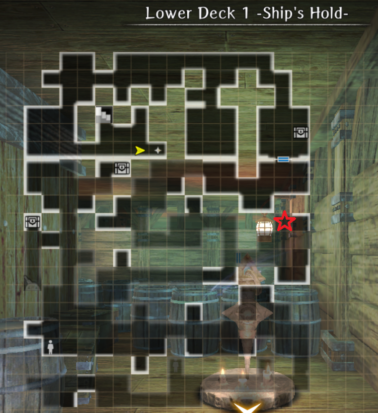

??? danger "Monica, the Self-Proclaimed Enforcer (210 Bounty Medals)"    

    === "Wanted Poster" 
        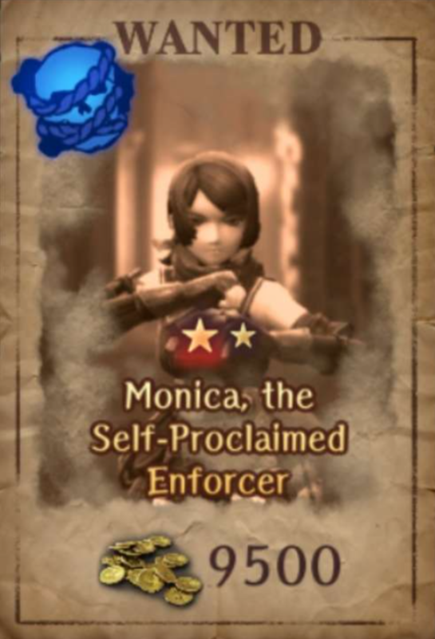

    === "Bounty Details"
        - Stationary, indicated as an NPC on the map.
        - 9,500 Gold Reward
        - 210 Bounty Medals
        - 6 Bounty Markers
        - Appears at Bounty Rank 6

    === "Fight Details"
        - HP: ??? (can be captured after ~3k)
        - You must mention that you are an evil-doer upon meeting, or she will disappear and you must restart the bounty.
        - After doing enough damage to her (~4k), she will become fatigued and you may capture her with Binding Rope

    === "Map Location"
        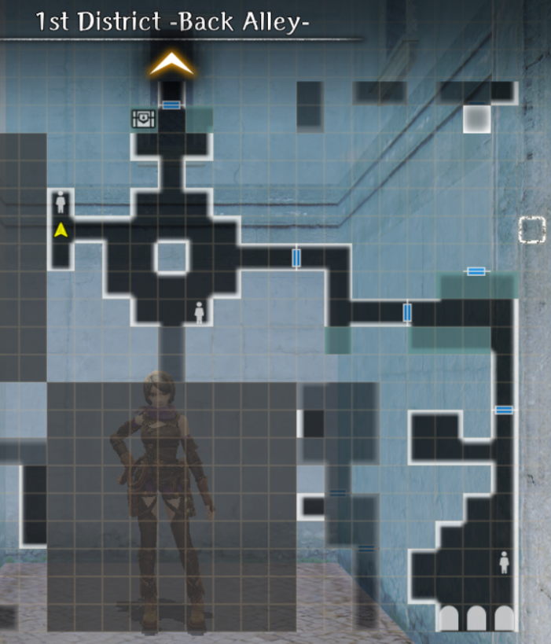
      
??? danger "Dolan, the Long-Lost Sailor (215 Bounty Medals)" 

    === "Wanted Poster" 
        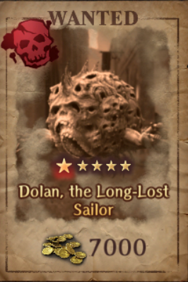

    === "Bounty Details"
        - Roamer, does not show on the minimap.
        - 7,000 Gold Reward
        - 215 Bounty Medals
        - 9 Bounty Markers
        - Appears at Bounty Rank 6

    === "Fight Details"
        - HP: 21K
        - Spawns as an Oar Collector by itself.
        - At ~3K HP it will flood the battlefield out of turn.
        
??? danger "Ecstatic Blazing Eye (310 Bounty Medals)" 

    === "Wanted Poster" 
        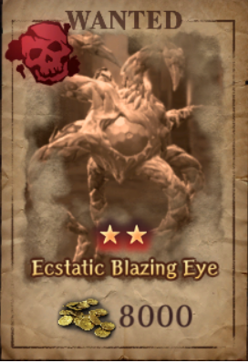

    === "Bounty Details"
        - Stationary, but does not appear on the map. It will always be in the small room that is accessed by heading to the bottom right staircase from the Upper Deck Arena.
        - 8,000 Gold Reward
        - 310 Bounty Medals
        - 10 Bounty Markers
        - Appears at Bounty Rank 8

    === "Fight Details"
        - HP: ???
        - Spawns as a Corrosion Eye by itself.
        - It can move three times per turn.
        - Does Dark Type (element) damage and will easily kill any Light Type units (Abenius, Debra, Clarissa, etc.)
        - The strategy [Ninja Crit Fishing](../../strategies/combat-strategies.md#ninja-crit-fishing) can be utilized to great effect to kill this bounty and save some time. Recommended aspd > ~80.

    === "Map Location"
        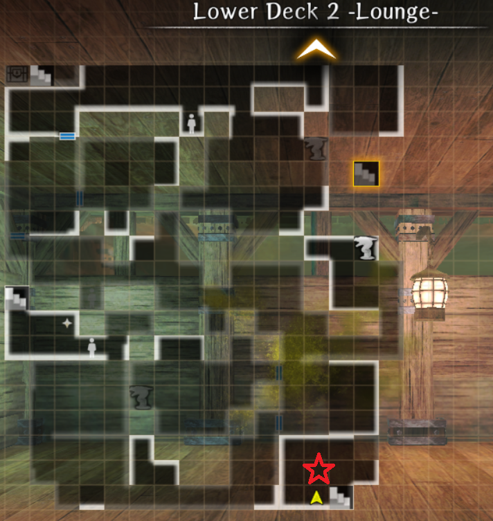

### Abyss 3 

??? danger "Reaper Bunny (65 Bounty Medals)" 
    
    === "Wanted Poster" 
        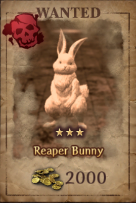

    === "Bounty Details"
        - Roamer, does not show up on the minimap.
        - 2,000 Gold Reward
        - 65 Bounty Medals
        - 3 Bounty Marks3
        - Appears at Bounty Rank 1

    === "Fight Details"
        - HP: 6.5K
        - Spawns with 1 normal Vorpal Bunny on each side (3K HP). The boss Vorpal Bunny is Light Type (element).
        - Acts twice on its turn and has extremely high evasion.
        
??? danger "Sand Shadow that Calls Scorched Earth (60 Bounty Medals)"

    === "Wanted Poster" 
        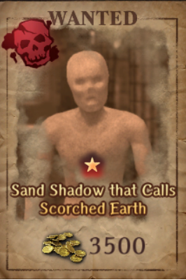

    === "Bounty Details"
        - Roamer, does not show up on the minimap, can show up in the caged areas as well.
        - 3,500 Gold Reward
        - 60 Bounty Medals
        - 5 Bounty Marks
        - Appears at Bounty Rank 2

    === "Fight Details"
        - HP: 15K HP
        - Spawns as a group of 7 Sand Apparitions (1.1K HP)
        - There are 3 in the front row, 3 in the middle row, with the boss in the back.
        - The minions will do a suicide attack at low HP, which can be defended against. 
        
??? danger "Petz, the Mook who Flaunts Authority (145 Bounty Medals)"

    === "Wanted Poster" 
        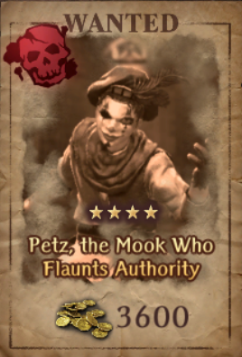

    === "Bounty Details"
        - Stationary, appears as an NPC icon on the map.
        - 3,560 Gold Reward
        - 145 Bounty Medals
        - 4 Bounty Markers
        - Appears at Bounty Rank 5

    === "Fight Details"
        - HP: ???
        - Spawns with 5 Pirate Berserkers in the frontline. Ruffian boss will be in the backline.
        - They are relatively weak.

    === "Map Location"
        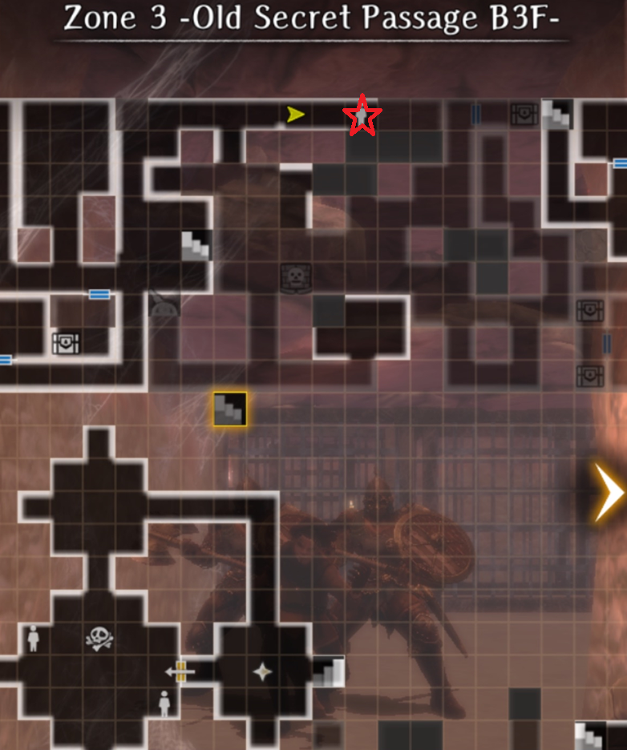

??? danger "Timid Crimson Fang (240 Bounty Medals)"

    === "Wanted Poster" 
        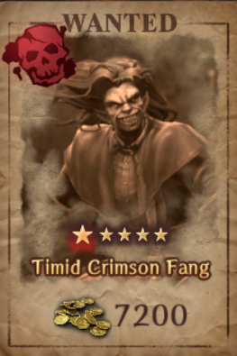

    === "Bounty Details"
        - Stationary, doesn't appear on the minimap. However, he's always located in the same map structure.
        - 7,200 Gold Reward
        - 240 Bounty Medals
        - 9 Bounty Markers
        - Appears at Bounty Rank 7

    === "Fight Details"
        - HP: ???
        - Spawns with a row of hostile adventurers in the front and middle row. The back row has the Vampire.
        - The Vampire has extremely high evasion.
        - Can use Dalto (Copper Grade Mage Spell) spells to freeze the vampire reducing evasion significantly.

    === "Map Location"
        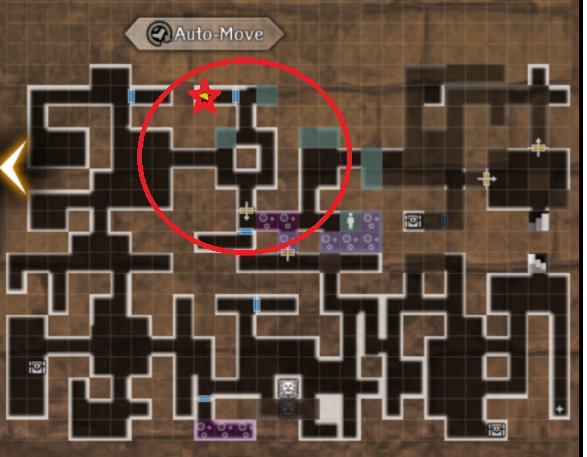

??? danger "Insatiable Gorger (360 Bounty Medals)"

    === "Wanted Poster" 
        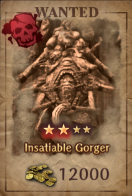

    === "Bounty Details"
        - Roamer, doesn't appear on the minimap.
        - 12,000 Gold Reward
        - 360 Bounty Medals
        - 12 Bounty Markers
        - Appears at Bounty Rank 8

    === "Fight Details"
        - HP: ~30K
        - Spawns by itself as an Ent.
        - It can move twice per turn, and tends to cast Breath of Gluttony, which is a row damaging skill that guarantees Critical Poison with a chance to also Confuse.

??? danger "Ross, the Twisted Knight of Justice (400 Bounty Medals)"

    === "Wanted Poster" 
        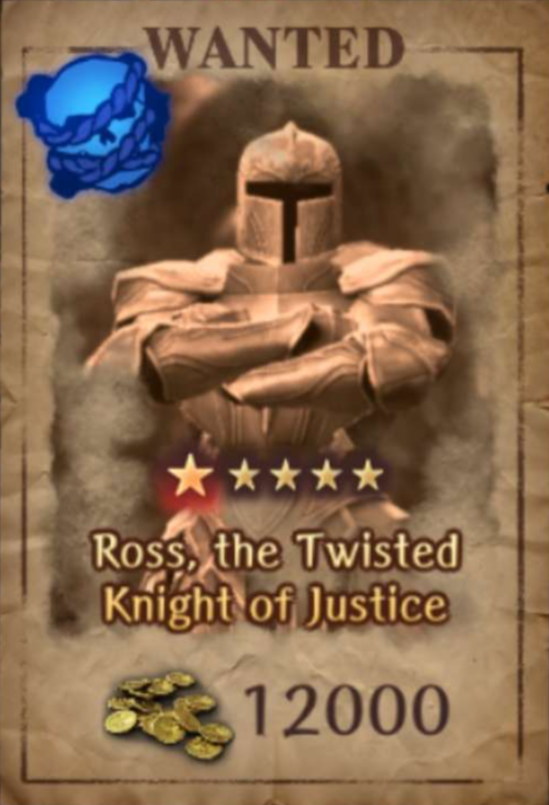

    === "Bounty Details"
        - Stationary, indicated as an NPC on the map.
        - 12,000 Gold Reward
        - 400 Bounty Medals
        - 9 Bounty Markers
        - Appears at Bounty Rank 8

    === "Fight Details"
        - HP: 20k (can be captured after 18k; ~13k Dwarf Fighter; ~12k Elf Mage)
        - Ross has a fairly high DEX capturing requirement of ~82+.
        - Ross is in the front row. Dwarf Fighter and Elf Mage are in the backrow. 
        - Dwarf Fighter uses standard skills. The Elf Mage will cast row debuffs and can cast LA spells. When she takes enough damage, she will cast mental unity out of turn. Ross will cover back-line units without casting a cover. 
        - Backline can be confused with Kantios. Ross can be stunned. 

    === "Map Location"
        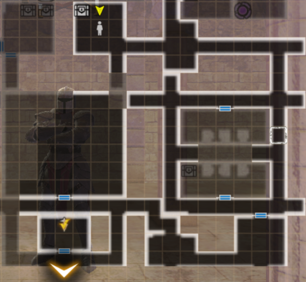

??? danger "Shadow-Lurking Operative (400 Bounty Medals)"

    === "Wanted Poster" 
        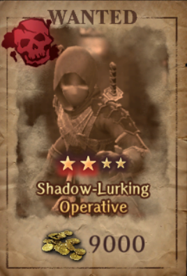

    === "Bounty Details"
        - Stationary, appears on the minimap as an NPC. Will always be inside a 2x1 small room.
        - 9,000 Gold Reward
        - 400 Bounty Medals
        - 12 Bounty Markers
        - Appears at Bounty Rank 9

    === "Fight Details"
        - HP: ~5K (for all)
        - Spawns with a front row and middle row of Indigo and Amber ninjas. The boss ninja will be in the backmost row.
        - This fight is very similar to that of the Sand Shadow Cave boss fight. There is a lot of confusion/critical.

??? danger "Indolent Demon Marquis (425 Bounty Medals)"

    === "Wanted Poster" 
        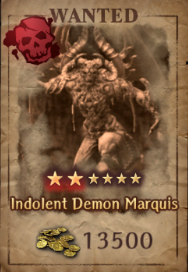

    === "Bounty Details"
        - Stationary, but doesn't appear on the map. Appears in the alarm trap room of the floor.
        - 13,500 Gold Reward
        - 425 Bounty Medals
        - 14 Bounty Markers
        - Appears at Bounty Rank 9

    === "Fight Details"
        - HP: 25k-30k 
        - Spawns with a front row and middle row of 3 lesser demons. The Greater Demon will be in the backmost row.
        - The Greater Demon can move twice per turn and will summon more lesser demons per turn as long as he doesn't reach the front row.
        - Once the Greater Demon reaches the front row, he will continually summon Greater Demons until the entire field is filled.
        - The Greater Demon has a lot of surety evasion (~150)
        - It is recommended to not kill all the lesser demons (don't let the Greater Demon boss reach the front row), buff front row with masolotu + use evasion gear, and carry ranged damaging options. Focus entirely on damaging the Greater Demon boss and just ignore the lesser demons.

    === "Map Location"
        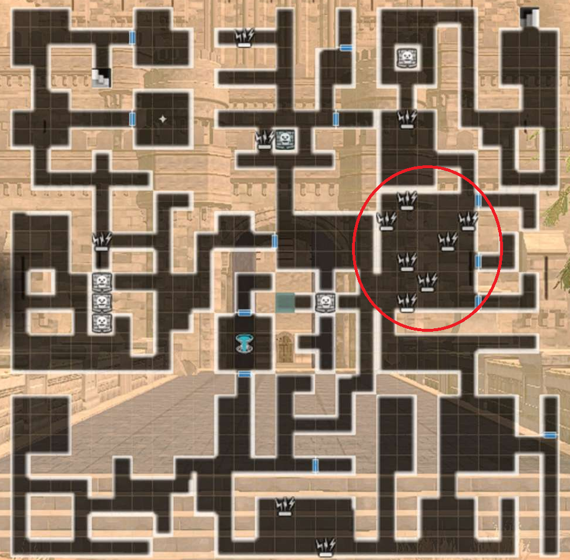

??? danger "Mellie, the Coin-Counting Killer (500 Bounty Medals)"

    === "Wanted Poster" 
        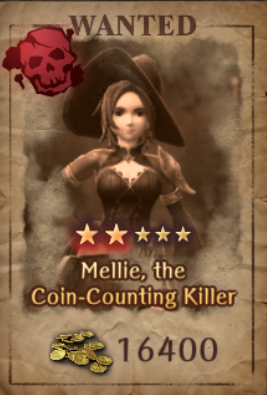

    === "Bounty Details"
        - Stationary, appears as an NPC on the map in a specific structure.
        - 16,400 Gold Reward
        - 500 Bounty Medals
        - 13 Bounty Markers
        - Appears at Bounty Rank 10
        - Requires A3 Mastermind Ending

    === "Fight Details"
        - HP: 11-14k (~10k for each Knight)
        - Spawns with 3 Human Knight Adventurers in the front row. She will be in the backrow.
        - She moves twice per turn and will cast Healing skills/debuffs/AOE magic.
        - The Knights have a very high chance to defend a hit on Mellie.

    === "Map Location"
        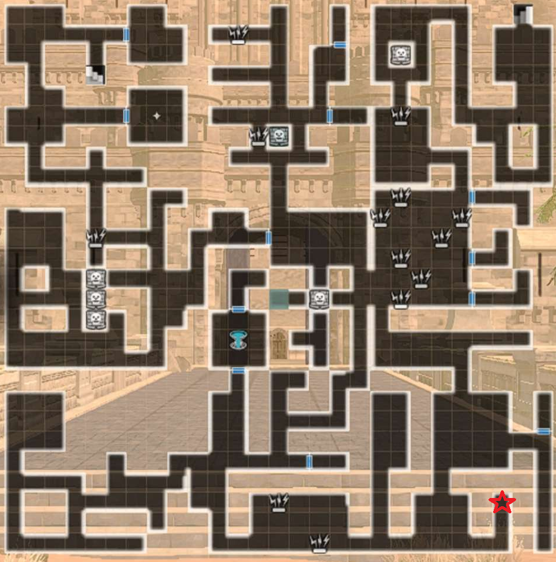

??? danger "Veigar, the Sorceror Who Rules the Dead (800 Bounty Medals, 1,200 Captured)"

    === "Wanted Poster" 
        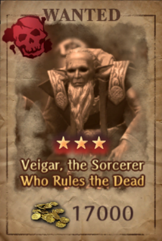

    === "Bounty Details"
        - Stationary, appears as an NPC on the map in a specific 2x1 room
        - Requires very low corrosion level (max 1 "Spotted") to ensure a direct path to him
        - 17,000 Gold Reward
        - 800 Bounty Medals; 1,200 if Captured
        - Appears at Bounty Rank 11
        - Requires A3 Mastermind Ending

    === "Fight Details"
        - HP: 15-16K (~8.5k Right Necrocore; ~9.5k Left Necrocore)
        - Spawns with 2 Necrocores in the front row. The necromancer will be in the back row.
        - Can randomly cast Lazelos.
        - When both Necrocores are dead, he can summon skeletons like a typical necromancer.
        - Both Necromancer + Necrocore cannot spawn as a relic monster.
        - 2H Expulsion weapons are helpful to bring for the Necrocores. 

    === "Map Location"
        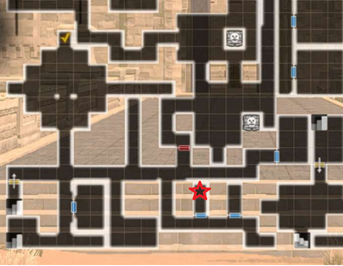

??? danger "Mad, Rampaging, Thunderous Fiend (1,200 Bounty Medals)"

    === "Wanted Poster" 
        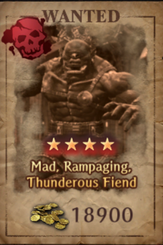

    === "Bounty Details"
        - Stationary, but doesn't appear on the map. Appears right outside the Zone 10 Greater Harken.
        - 18,900 Gold Reward
        - 1200 Bounty Medals
        - 20 Bounty Markers
        - Appears at Bounty Rank 12
        - Requires A3 Mastermind Ending and reaching GWO 0 (killing is optional)

    === "Fight Details"
        - HP: 57k-60k
        - Spawns with 3 Succubi in the Front Row, and 2 Chimera in the back row. The Cyclops will be in the middle row.
        - He only spams Frenzied Strike, which gives him a permanent undispellable CT buff. This attack can target his own allies as well. The attack is wind element.
        - This attack is extremely strong and can even one shot backline units if they are not defending/using knight's defense.
        - It is recommended if you are not strong enough to kill him in a timely manner with Knight's Defense spamming to simply cast Batilgref and defend to take advantage of opening damage.
        - The Succubi aspd ranges from 70-100. If they are causing charming issues, try stacking an aspd mage with at least 100 aspd and casting [Kantios](../../appendices/skills-and-spells/skills-and-spells.md#active-skills) on them.
        - The strategy [Ninja Crit Fishing](../../strategies/combat-strategies.md#ninja-crit-fishing) can be utilized to kill this bounty target. Keep in mind, even if you kill the cyclops you will have to deal with the remaining mobs. Recommended aspd > ~90.

    === "Map Location"
        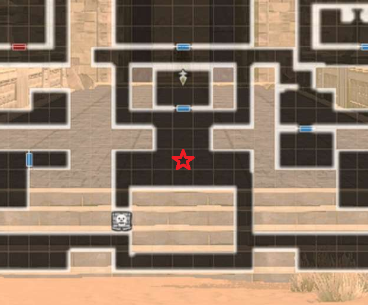

### Abyss 4

??? danger "Ice Frost and Potent Venom Strangler Vine (950 Bounty Medals)"

    === "Wanted Poster"
        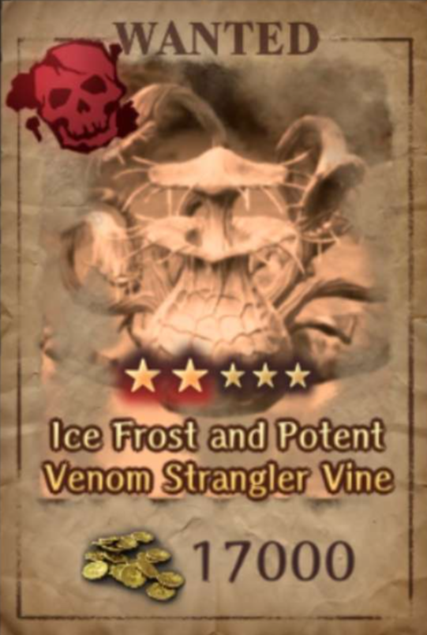
        
    === "Bounty Details"
        - Roamer, doesn't appear on the minimap.
        - 17,000 Gold Reward
        - 950 Bounty Medals
        - 13 Bounty Markers 
        - Appears at Bounty Rank 11
        - Available slightly after Rockhome Village Major Harken and interacting with Nullshadow for the first time
        - Does -not- require A3 Mastermind Ending

        
    === "Fight Details"
        - HP: 38.5k
        - Spawns with 2 Ice Entities in the same row.
        - High HP, but otherwise acts like its normal counterpart.

??? danger "Dutz, the Honey Tonic Savant (1,140 Bounty Medals)"

    === "Wanted Poster" 
        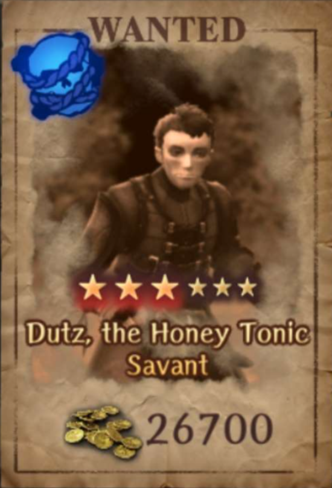

    === "Bounty Details"
        - Stationary, indicated as an NPC on the map.
        - 26,700 Gold Reward
        - 1,140 Bounty Medals
        - 18 Bounty Markers
        - Appears at Bounty Rank 13

    === "Fight Details"
        - HP: ??? (can be captured after ~20k which is around the time he self buffs with Night Honey)
        - Has 3 actions per his turn. Can self buff with various drugs and perform typical thief skills. Can also cast weak magic.
        - When he casts Night Honey, will gain permanent massive ATK, CT and MAG up buffs. Essentially all his physical skills will do over a thousand damage. In addition, he will be available to be caught with Binding Rope.
        - After using certain drugs, you may buy them from him minus the Night Honey upon meeting him again via Cursed Wheel. He will disappear however after buying one. This seems to require successfully completing the Octonarus Ending in A2.
        - After defeating him, you MUST give him the Tonic or else he will die and the bounty will fail.

    === "Map Location"
        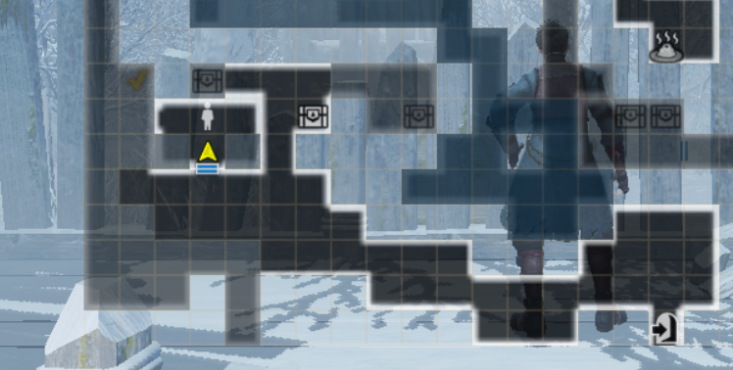

??? danger "Spirit Realm Automaton (1,380 Bounty Medals)"

    === "Wanted Poster" 
        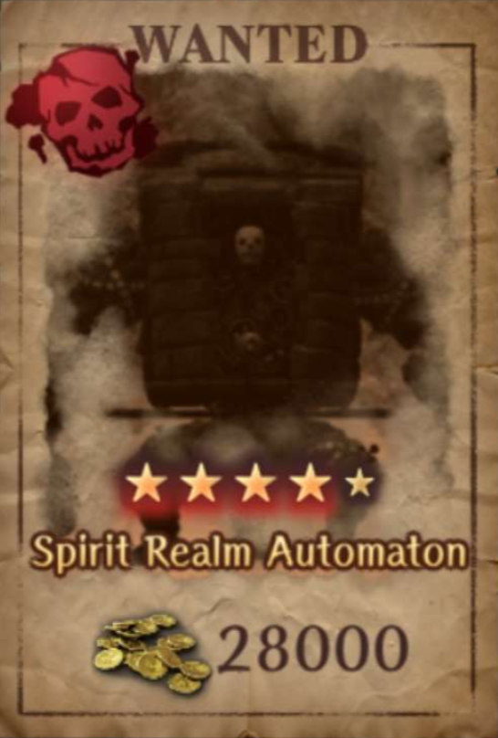

    === "Bounty Details"
        - Stationary, but not indicated on the map nor minimap.
        - 28,000 Gold Reward
        - 1,380 Bounty Medals
        - 21 Bounty Markers
        - Appears at Bounty Rank 14
        - Requires clearing GWO 4-2 although some people did not have it appear until defeating 4-3

    === "Fight Details"
        - HP: ~80k
        - Has insanely high evasion that is not overcomeable by standard means.
        - Is Dark element, but much weaker than typical golems.
        - Extremely recommended to bring multiple fighters with 2H Maces. Badios/Foros users are okay as well if using Mental Unity. Otherwise, magic is not recommended.

    === "Map Location"
        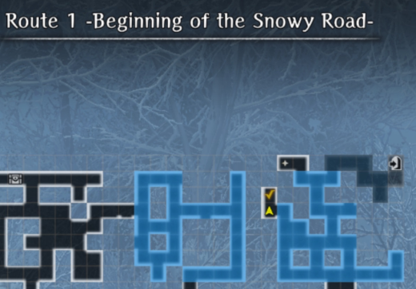

??? danger "Wailing Twin Dolls (1,550 Bounty Medals)"

    === "Wanted Poster" 
        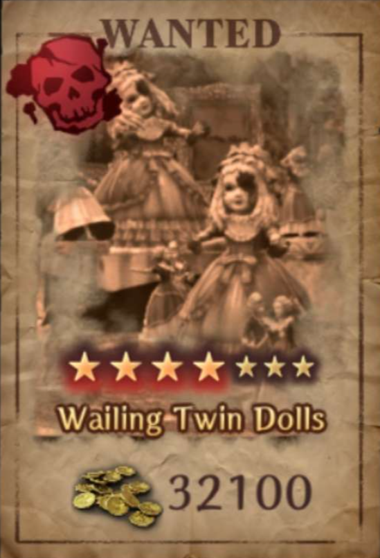

    === "Bounty Details"
        - Stationary-ish, shows up as a flying shaped enemy when you are nearby. Will be in the same area of the map every time.
        - 32,100 Gold Reward
        - 1,550 Bounty Medals
        - 23 Bounty Markers
        - Appears at Bounty Rank 14
        - Requires clearing GWO 4-4

    === "Fight Details"
        - HP: ~50k (each)
        - There are two Our Heirlooms in the same row. They each have 50kish HP
        - The left one will typically cast magic, while the right one typically uses physical skills. The magic casted is typically Zelos/Mazelos and can hit upwards of 500 on neutral units. 
        - Upon taking enough damage, they can cast Ballroom Waltz (full team charm) once and then Dance (full team confuse) once out of turn.
        - They can also summon a Stonefolk in the back row.

    === "Map Location"
        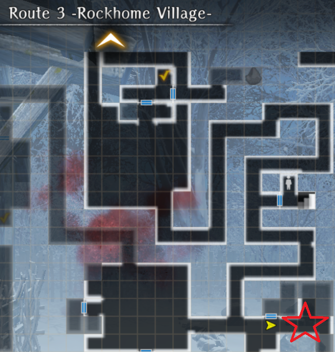

## Bounty Medal Exchange Shop

### Permanent Items

- The Hound Mask is a unique piece of Ebonsteel cloth headgear that increases Disarm Trap and unlocks at Bounty Rank 5 ("Rank"). It is a permanent item and does not reset each month. Please remember to lock each copy after purchasing to avoid accidentally bulk-selling them in the Item Shop. There is no known way to gain extra copies and you will be unable to reach max unification (3/3) and enhancement (+20).
- The Master Ring Unification Material is an item that is used specifically for unifying the Master Ring obtained at Rank 13 to 1/3 Strength. It cannot be used for anything else.

| Item | Rank | Bounty Medals | # Copies | Total Bounty Medals |
|:-----|:----:|:-------------|:--------:|:-------------------|
| Hound Mask | 5 | 1,500 | 1  | 1,500   |  
| Hound Mask | 5 | 3,000 | 2  | 6,000   | 
| Hound Mask | 5 | 4,000 | 24 | 96,000  |
| Master Ring Unification Material | 15 | 4500 | 2 | 9000 | 

### Monthly Items

- Monthly items reset on the first of each month at 0:00 (midnight) JST. A higher Bounty Rank unlocks additional items and several of them can be purchased multiple times ("# Copies").
- The total cost to clear the shop each month is 45,000 Bounty Medals. Excluding the High, Mid, and Low Iron Ore the total cost is 40,500.   

| Item | Rank | Bounty Medals | # Copies | Total Bounty Medals |
|:-----|:----:|:-------------:|:--------:|:-------------------:|
| Way of the Warrior Skill Scroll | 13 | 3,000 | 1  | 3,000   |  
| Way of the Mage Skill Scroll    | 13 | 3,000 | 1  | 3,000   | 
| Book of Honed Ability Secrets   | 10 | 3,000 | 1  | 3,000   | 
| Book of Passive Magic Defense Up Secrets                    | 3  | 1,500 | 5  | 7,500   |  
| Book of Passive Defense Power Up Secrets                     | 3  | 1,500 | 5  | 7,500   | 
| Legendary Adventurer's Remains  | 1  | 8,000 | 1  | 8,000   |  
| Adventurer's Remains            | 1  | 800   | 5  | 4,000   |
| Gem of Org x100                 | 1  | 400   | 5  | 2,000   | 
| Codex of Learning               | 1  | 2,500 | 1  | 2,500   | 
| High Grade Iron Ore             | 1  | 100   | 20 | 2,000   | 
| Mid Grade Iron Ore              | 1  | 75    | 20 | 1,500   | 
| Low Grade Iron Ore              | 1  | 50    | 20 | 1,000   | 
| Total                           |    |       |    | 45,000  | 

## One-Time Bounty Rank Rewards

| Rank | Adv. Remains | Gems of Org | Gold | Special |
|:-----------:|:---------:|:-----------:|:----|:-------|
| 2  |   | 100 | 40,000     | |  
| 3  | 1 | 100 | 90,000     | | 
| 4  |   | 100 | 200,000    | | 
| 5  | 3 | 300 | 200,000    | | 
| 6  |   | 100 | 300,000    | | 
| 7  |   | 100 | 300,000    | 1 Legendary Remains |
| 8  |   | 100 | 500,000    | | 
| 9  | 3 | 300 | 500,000    | |  
| 10 |   | 100 | 600,000    | |  
| 11 | 1 | 100 | 600,000    | |  
| 12 | 3 | 300 | 800,000    | |  
| 13 |   | 500 | 1,000,000  | Master Ring   |
| 14 |   | 100 | 1,200,000  | |
| 15 |   | 300 | 1,450,000  | Grip Gloves |
| Total  | 11  | 2,600  |  7,180,000  |    |

### Unique Rewards

??? note "Master Ring" 

    - Silver-rank ring that is fixed at 5* White and 0/3 Strength level.  
    - +13 to every stat aside from DEF and MDEF, which are higher. 
    - If the first blessing line at +5 rolls an undesirable blessing you can use an LFAS to re-roll. Not recommended for the average player. Do not attempt to use a FAS as you will not get the additional enhancement bonus. 
    - Primarily used on the team's chest opener (for the Detect and Disarm) or to boost a stat that may be seriously lagging. 
    - It is now possible to purchase unification Unification Material to take the ring to +10, which unlocks a second blessing slot. 

??? note "Hound Mask" 

    - Enhance +0 = 5 Disarm Trap
    - Enhance +5 = 8 Disarm Trap
    - Enhance +10 = 11 Disarm Trap
    - Enhance +15 = 13 Disarm Trap
    - Enhance +20 = 17 Disarm Trap

    !!! warning "It's entirely possible to buy all 27 Hound Masks and not receive a 4* Purple."

??? note "Book of Honed Ability Secrets" 

    - Stats vary by the unit's class and will be updated automatically when class changing a unit, including the MC. 
    - Fighter: 5 ATK, 5 ACC
    - Knight: 10 HP, 5 DEF, 5 MDEF
    - Thief: 5 Disarm Trap, 5 Evade Trap, 5 Detect
    - Ninja: 5 ATK, 5 EVA, 5 ASPD
    - Samurai: 5 ATK, 5 MAG, 5 ACC
    - Ranger: 5 ACC, 5 ASPD
    - Priest: 5 DIV, 5 RES
    - Mage: 10 MP, 5 MAG

??? note "Grip Gloves"

    - Forthcoming. 

## Farming 

!!! warning "Work In Progress" 

??? note "Overview"

    === "Basics" 
    
        - There are a handful of well-established farming loops depending on your team's power level and Abyss progression.
        - To reset a bounty you need to: 
            - Wheel-in-place to the node where the bounty first unlocks or later
            - Return to the Guild > Requests > Bounties in order for the bounty to show up. 
        - It is strongly recommend you do a little each day as part of your daily routine versus long marathon sessions. 
        - It costs 45,000 points (40,500 with no ore) to buy out the respawning items in the shop every month.

    === "Other Notes" 

        - It's possible to farm a specific bounty by cursed wheeling in place, typically to Triumphant Return
        - There is no limit to the number of Bounty Medals you can farm
        - It's possible for bounty monsters to spawn as a relic version. Note that relic monsters can only spawn in the first row
        - It costs 45,000 points (40,500 with no ore) to buy out the respawning items in the shop every month.
        - It's recommended to farm Veigar as he is always in a set location close to a Harken and easier to deal with than some other bounties. Alternatively, you can farm Peerless Scorpionesses.

??? note "Scorpion Lady + Minotaur (460 Bounty Medals)"

    - Most straight forward loop as both bounties are located right next to their Harkens in A1 at F2 and F5, respectively. 
    - Morgus ATK contract can be run safely if the MC is put in the backrow. This allows you to kill both in 1 round depending on your team's power level. However, you can be ambushed with it active. 

