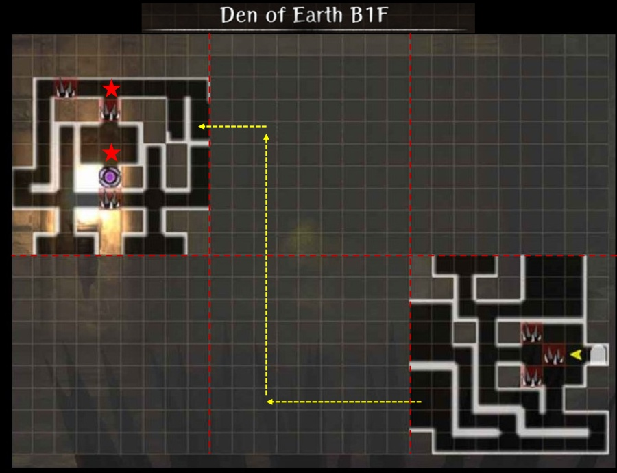
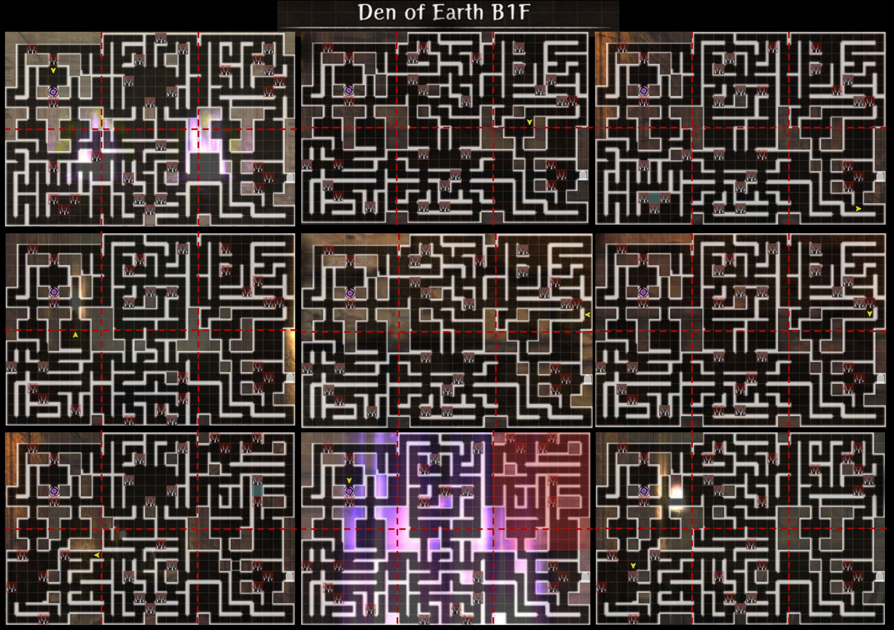
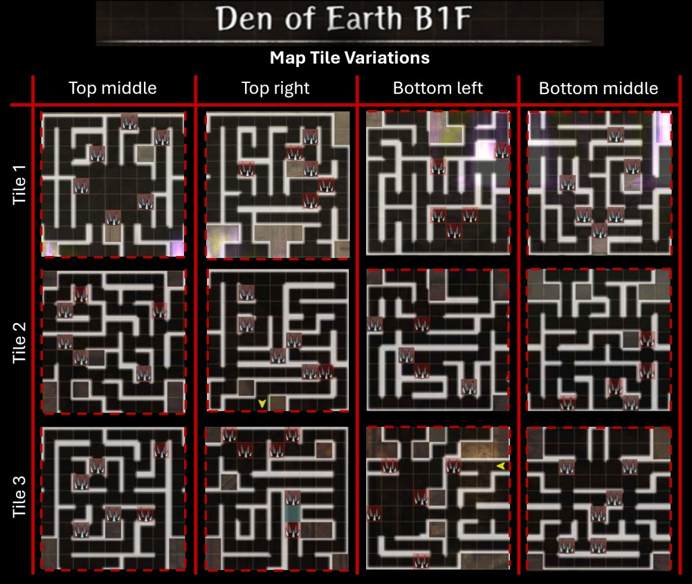

# Den of Earth  

!!! info "Requirements"  
    The Den of Earth is the first Den available to players.  It is unlocked after defeating the Greater Warped One in the Beginning Abyss, and after talking with Arna in the Royal Capital Adventurer's Guild it can be accessed from the Edge of Town.  
    
??? info "About Dens"
    All Dens are 1 floor dungeons that are obscured each time the Den is entered, with the Entrance and Exit (portal) tiles always visible. All other map tiles are variable, and randomly change layout each time the Den is entered. Each den has one or two Boss fights on the way to the exit portal.  

    Chests in Dens can give you [Blacksmithing Ore of different grades required for ehnancing gear beyond +4](../../equipment/blacksmithing.md#enhance) and Elemental armor and weapon junk matching the Den. (Earth, fire, air, and water gear are steel grade.)  

    The Earth Den provides mostly Low-Grade Ore (gray), with occasional Mid-Grade Ore (red), and rarely a piece of High-Grade Ore (blue), and is a source of Earth Type armor and weapons (useful against Water Type enemies like those found in excess in Abyss 2).  

??? info "Boss Fights"
    The Earth Den has a mini boss fight just outside the portal room with a Big Slime, and a final boss fight with a Hydra Plant moster (Earth type, vulnerable to Air), both accompanied by a random group of Earth Den monsters.

??? info "Exploration and Farming Strategy"
    For the Earth Den (and most other Dens) the map reset prevents auto-moving to efficiently collect chests on the map. So the most efficient ore and junk farming strategy is usually to rush straight to the boss for guaranteed chest drops while picking up any nearby spawned chests along the way.  Sprung traps are permanently revealed, however, so full exploration is of value once on each map tile variation to expose traps.  After a few rounds of exploration enough tiles should be explored and traps revealed to allow safe progress to the boss on further trips.

    Without knowing the map layout, the fastest boss route is often to leave the entry tile from the south east room, then work west and north through the middle tiles, to enter the exit tile on the upper east side, as generally indicated on the main map below. The acutal path can vary significantly on some map variations.

!!! map "Den of Earth Maps"
    The Earth Den is a 2x3 map.  The entry map, tileset, and a several map variations are shown below. This is obviously an incomplete set.  Rather than tiles 'swapping' like Abyss map variations, there appears to be at least three variations for each of the four hidden tiles, suggesting at least 3^4=81 full map combinations.  

    That said, all 3x4=12 tile variations only need to be explored once for the traps to be permanently exposed for future runs. Trap and hallway layout can then tip you off as to which tile variation you've been dealt.

    !!! map "Den of Earth - Entry Map"
        

    ??? map "Den of Earth - Some Variations"
        

    ??? map "Den of Earth - Tileset"
        

## Credits

Den of Earth Maps kindly provided by Pookie, Theom1st, and Dirty.
