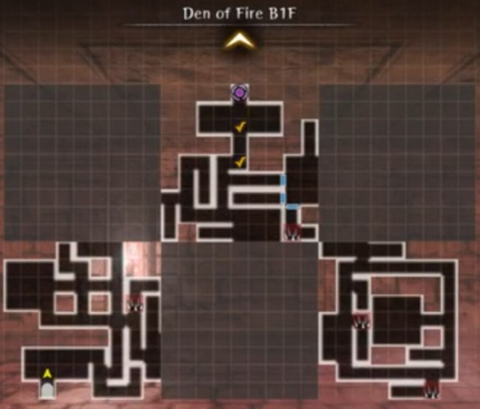

# Den of Fire  

!!! note "Mapping updates in Jan 2026 changed the behavior of Den maps. Floors are no longer obscured by grey tiles. Once any tile is explored the map stays visible when it appears on subsequent visits. Auto moving to marks and chests is now viable for the whole map."

??? info "About Dens"  
    All Dens are 1 floor element-themed dungeons with variable map tiles that randomly change layout each time the Den is entered. Only the Entrance and Exit (portal) tiles stay unchanged, and once explored stay permanently visible.  Each den has one or two Boss fights on the way to the exit portal.  

    Chests in Dens can give you the [Blacksmithing Ore of different grades required for ehnancing gear beyond +4](../../equipment/blacksmithing.md#enhance) and Elemental armor and weapon junk matching the Den. (Earth, fire, air den gear are steel grade. Light den gear is Ebonsteel grade.  Water den gear is Silver grade.)  

!!! info 
    The Den of Fire is the second den available to players. It appears after unlocking a new Right Hand of Reversal ability on the fourth level of the Second Abyss - Trade Waterways.  After talking with Arna in the Royal Capital Adventurer's Guild it can be accessed from the Edge of Town.

    The Fire Den provides some Low-Grade Ore (gray), mostly Mid-Grade Ore (red), and some High-Grade Ore (blue), and is a source of Fire Type armor and weapons (useful against Air Type enemies).

??? info "Boss Fights"
    The Fire Den has a mini boss fight just outside the portal room with a random set of fire-type creatures, and a final boss fight with a number of high-level Fire Hobgoblins sometimes accompanied by other Fire Den monsters. Both are located at the check marks shown on the Entry map below.

??? info "Exploration and Farming Strategy"
(After the January 2026 mapping update) Similar to the Earth Den, the initially blank map and map reset initially prevents auto-moving to efficiently collect chests on the map. There are a fixed number of tiles, though, as explained below. Because map exploration now persists across visits you should completely explore the map a few times. Eventually, you will have fully explored every tile variation, and the map will be fully revealed to you each time you enter. At this point, you can auto-move to chests and/or the bosses to farm for ore and equipment. Note there are no hidded traps in the Fire Den, they are revealed from the start.  None that sprung traps are permanently revealed, and should be avoiding from that point on as long as 'avoid traps' is selected in your auto-move settings.  Note that there are far fewer traps here than in the Earth Den and none need to be crossed to reach the bosses, but chests may appear in areas inaccessible without crossing them.

The bosses are on the top center tile, and the tiles are constructed such that direct boss-rush routes will never take you on the two eastern tiles. The tileset draw will dicate which path is open.  If you have not yet fully explored the tiles, you can look at the revealed walls of tiles adjoining the boss tile. The only tileset found where you cannot enter from the west has a only 1-square wide passage to a deadend, and the only tileset found where you cannot enter from the south has no openings.  So as long as you see a three-square wide opening to either the west or the south from the exit tile, that way should be open to you. Once you've explored the tilesets, though, you can just set check marks on the bosses, auto-move to chests, then auto move to the bosses, then leave and repeat. If the bosses are too challenging, then you can just chest dive and leave.  Explore/reveal the eastern tiles if you want to maximize your chest rate. 

!!! map "Den of Fire Maps"
    The Fire Den is another 2x3 map.  The entry map with boss locations, tileset, and a several map variations are shown below. This is obviously an incomplete set of variations.  Rather than tiles 'swapping' like Abyss map variations, there appears to be at least three variations for each of the three hidden tiles, suggesting at least 3^3=27 full map combinations.  

    That said, all 3x3=9 tile variations only need to be explored once for the maps to be permanently exposed for future runs. Minimially, only the 2x3=6 tiles closest to the entrance *need* to be checked for boss-rushing.

    !!! map "Den of Fire - Entry Map"
        

    ??? map "Den of Fire - Some Variations"
        

    ??? map "Den of Fire - Tileset"
        

## Credits  
Den of Fire Map kindly provided by GrandAccelerator.
