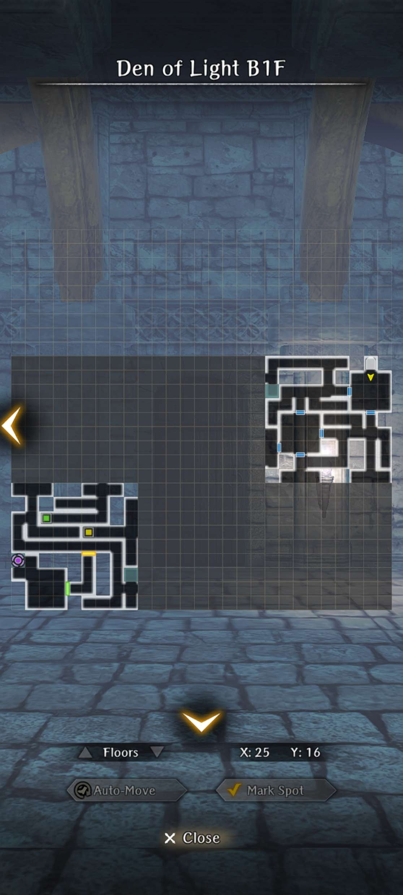
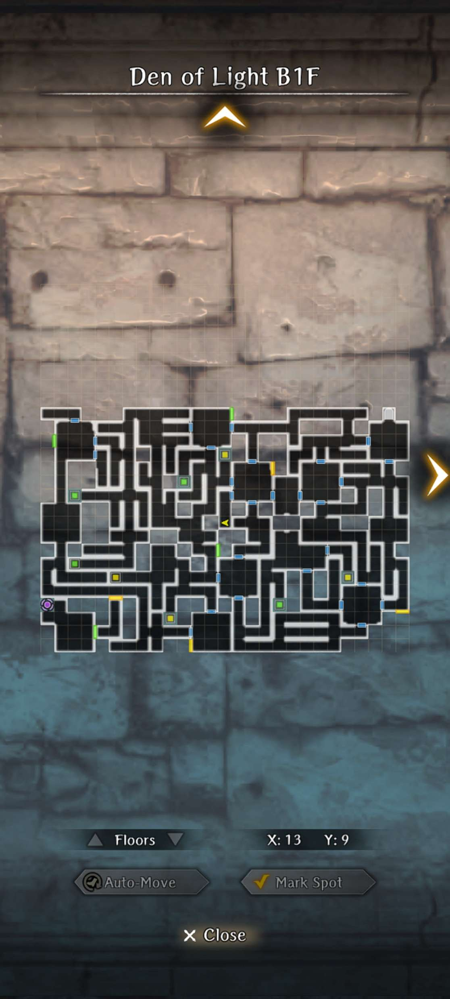
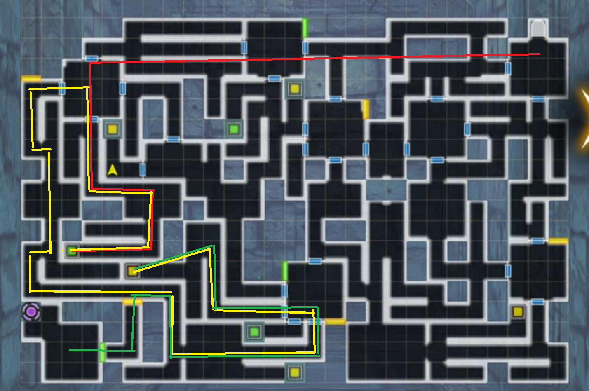

# Den of Light

This den is different from the other dens in that there are green and yellow switches for certain big rooms around the map. Usually a green or yellow switch corresponds to the nearest big room. The final room also requires both a green and yellow switch to be pressed. For non-boss rooms, they may or may lead to paths that contain a chest (usually they don't).

??? note "Requirements"
      This den is only unlocked after [Stopping the Blackmailer and saving the Duke](../3-guarda-fortress/important-request-gwo.md#stop-the-blackmailer-and-save-the-duke)

The den drops Mid, High, and Fine grade ore randomly.

##### Maps

??? map "Den of Light Fog of War"
      

??? map "Den of Light Variant 1"
      

??? map "Den of Light Variant 2"
      

??? map "Den of Light Variant 3"
      

??? map "Den of Light Variant 4"
      

??? map "Den of Light Variant 5"
      

## How to Farm

There are two main types of variants for Den of Light. Typically, you can just walk to the very top left "big room" and then from that room, access the green button for the final door. You then walk through a different door from that room downwards and right to the bottom middle "big room". From there, you can access the yellow button for the final door, usually via the left door of that "big room"

The exception is when you are unable to walk directly left from the entrance all the way to the top left "big room". In this case, you will need to go down from the top middle "big room" and head downwards to the bottom middle "big room" and access the yellow button for the final door. You then should head left past the final room and upwards to the top left "big room" to access the green button from another door usually heading downwards.

