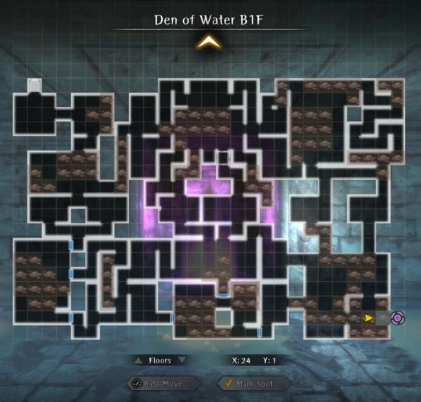

# Den of Water

Requirements: The Den of Water is the fifth Den available to players.  It appears after completing the Fourth Abyss for the second time, and after talking with Arna in the Royal Capital Adventurer's Guild it can be accessed from the Edge of Town.  

## Finding the Boss

!!! map "Route to Boss"

    !!! note
        Den of Wind has four squares with multiple variations of the dungeon layout, which are randomly chosen on entry. The entry and exit squares are always the same. All permutations of the full maps are not presented here and your map will likely be very different from what is shown.  

## Maps

!!! map "Den of Water Entrance"
        
    
    === "Full Map"
        
