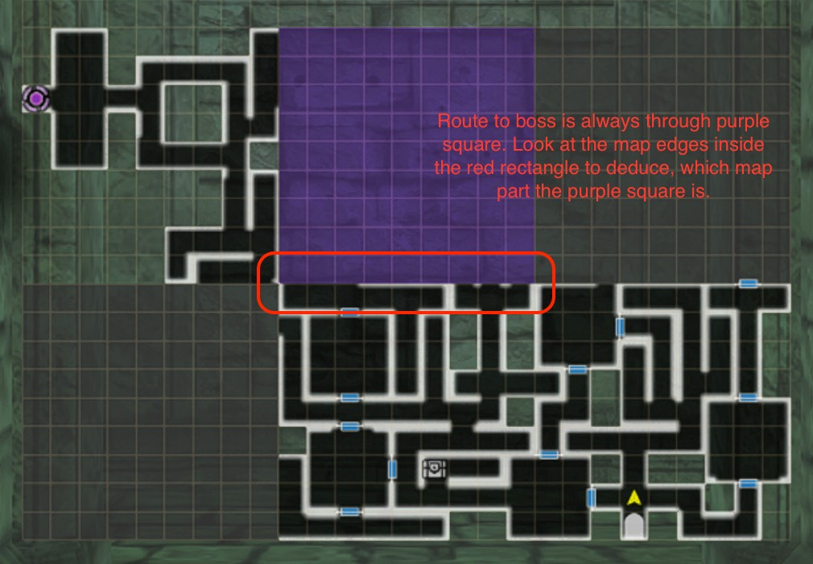
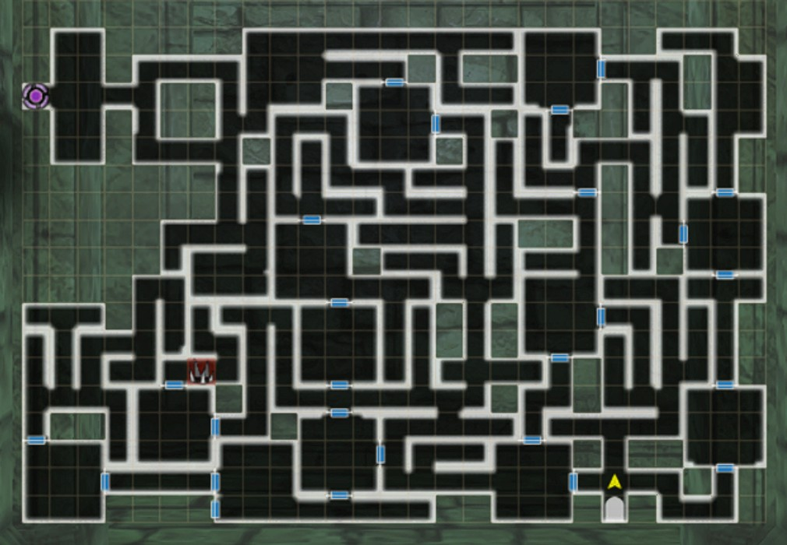

# Den of Wind

Requirements: The Den of Wind is the third Den available to players.  It appears after completing the Second Abyss for the first time, and after talking with Arna in the Royal Capital Adventurer's Guild it can be accessed from the Edge of Town.  

## Finding the Boss

!!! map "Route to Boss"

    !!! note
        Den of Wind has three squares with multiple variations of the dungeon layout, which appear to be randomly chosen on entry. All permutations of the full maps are not presented here, only the different types of dungeon maps inside the purple square.

    

## Maps

??? map "Den of Wind #1"
    === "Entrance"
        
    === "Full Map"
        

??? map "Den of Wind #2"
    === "Entrance"
        
    === "Full Map"
        

??? map "Den of Wind #3"
    === "Entrance"
        
    === "Full Map"
        
