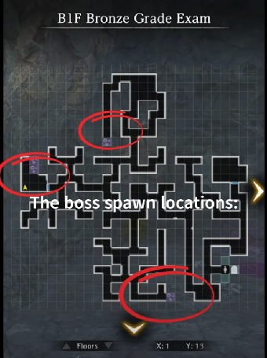

# Grade Exams

Grade exams are necessary for an adventurer to increase their level limits by 10 for each subsequent grade exam completed. This feature is unlocked at level 20, and a new one is available every 10 levels up to level 60 currently. Upon passing the exam without dying, an adventurer may increase their level limit with the corresponding grade tag item. Grade tag items may [be obtained in various ways](../../frequently-asked-questions.md#how-do-i-get-grade-tags). 

In addition, adventurers may not grade up past the highest grade the MC is currently at. However, unlike the MC, they do not need to complete every grade exam in order and may simply complete the latest grade exam available (e.g., If the MC is level 60 already, and a fresh level 1 adventurer on the team completes the level 60 exam with the help of other team members, that level 1 adventurer will receive permission to grade up at every level 10 interval starting at lvl 20 without having to complete the previous exams.) If exams are skipped this way, the adventurer will still need the corresponding grade tags every 10 levels along with the corresponding level requirement to grade up.

It is possible to skip the exam by purchasing grade exam pass items from the Jeweler's Shop (After completing the equivalent grade exam once), but this method is overpriced and inefficient.

## Lead Exam

*Images courtesy of [https://www.youtube.com/@Grafarya89](https://www.youtube.com/@Grafarya89)*

**Special Notes:**

- Boss summons adds every few rounds. Save AoE clears for them. If have legendary units with Secret Arts, place them in back middle position to use them here.  
- Boss is undead. Bring undead slayer weapons if possible, or a lot of magic scrolls.  
- Boss sometimes skips turn.  
- Boss only has 2 moves, both attack 1 unit on the front row. 1 is a multihit, 1 is a normal hit. Not really threatening, just heal up after.
- Running away from the fight will reset the adds he spawns with. You can use this to your advantage and keep running away until he spawns with only Vorpal Bunnies, as they can be killed very quickly and easily.

## Bronze Exam

*Images courtesy of [https://www.youtube.com/@Grafarya89](https://www.youtube.com/@Grafarya89)*

**Special Notes**:

- Boss doesn’t summon any adds  
- Boss is weak to air  
- Boss is susceptible to Opening
- Mobs on the way to boss can mostly be dealt with Scroll of Rockfall, except Air Entities. Those need Fire.  
- Boss hits like a truck.  
  - Tail Swipe AoE hits all front row with chance to stun.  
  - Jump attack hits 1 front row, swaps that column’s front and back.  
  - Buildup leads to Stinger next hit, hits 1 column with chance to fear. Block or take big damage.  
- As usual, stock inventory full of healing potions to save on MP on the way to boss.

## Iron Exam

**Special Notes**:

- Boss is a Hydraplant and is weak to air and can cause critical poison
- Spawns with additional enemies but does not summon more

## Steel Exam

**Special Notes**

- This exam unlocks shortly after you start the request to save Duke Ixion in Guarda Fortress.
- There is a single boss room and two paths to get there.
    - The left path favors physical damage. All enemies have extremely high magic defense.
    - The right path favors magic damage. All enemies have extremely high physical defense.
- All enemies are stationary and you cannot avoid getting into fights.
- The mage at the start tells you explicitly that you `won't be able to find any gaps to exploit`. This means that you are unable to rely on Openings as a strategy.
- The boss encounter consists of a Minotaur and a Succubus together
    - Kill the succubus first, then the Minotaur.
    - Leverage DILTO, MORLIS, MACALDIA, and any other buff/debuff spells at your disposal.
