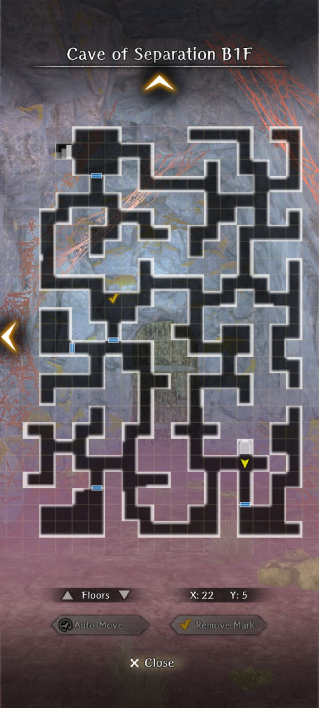
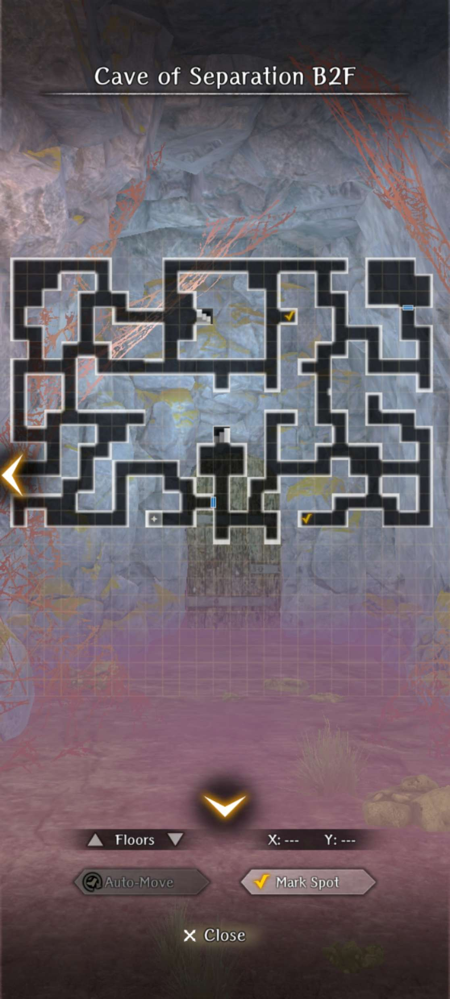
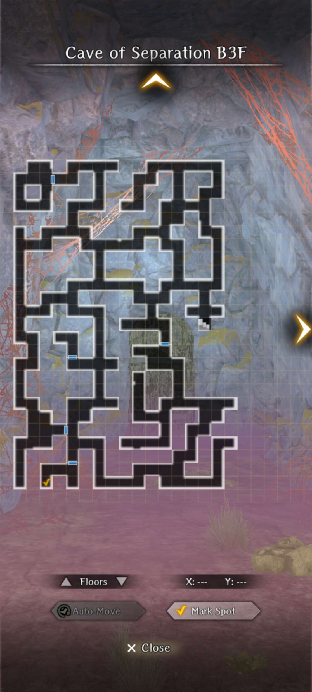
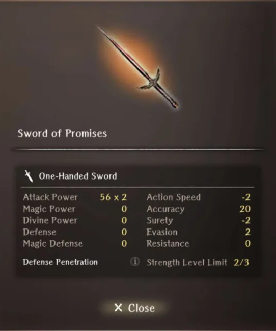
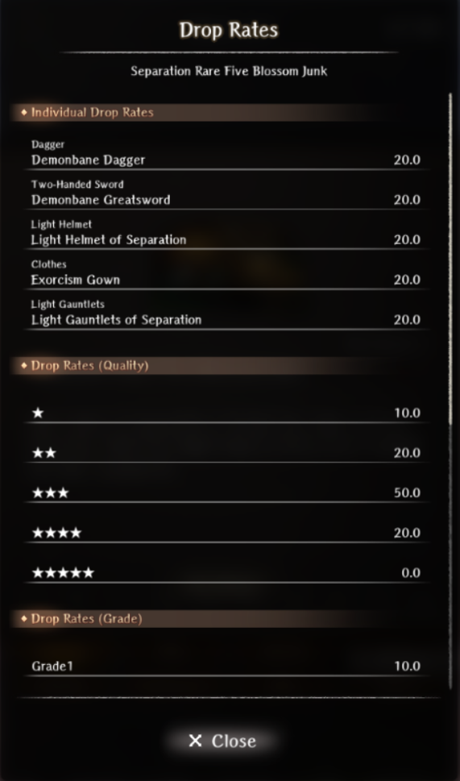

# Arna's Past

??? note "Requirements"
    - Complete Abyss 3 up to Cursed Wheel point "Secret Path Keeper Vanquished".

## Map

??? note "Maps"
    
    
    

## Walkthrough

1. Head to the Royal Capital Adventurer Guild and accept the request directly from Arna herself after the cutscene.
2. Head to the Edge of Town to access the Cave of Separation.
3. Find the adventurers on each floor and keep heading down. Glenn may be in different spots. On the 2nd floor, the mage may be in different spots. See check mark on the maps.
4. Find the last adventurer Fugol, who may be in different spots. He indicates that Erik has been killed this whole time. Glenn is a vampire and teleports away with Erik's body. You now need to fight Fugol which is a relatively easy fight.
5. Head back to the 2nd floor to pick up the mage and return to the Adventurer's Guild to turn in the request.
6. Despite failing, you will still receive a reward. Proceed to Cursed Wheel back in time. Go find glenn on the first floor and choose the option to slay him. You will fight his Vampire form, which has around 4k HP. If you choose the option "Don't take him with you", he will ambush you.
7. Find the mage on the 2nd floor and then find Fugol again and proceed to fight Glenn a 2nd time. This time however, he summons an additional weaker Vampire into the fight.
8. Win the fight and obtain a key for the optional boss. Return to the Adventurer's Guild and turn in the request and find out about Arna's past.

## Reward

??? note "Rewards"
    
    
    

## Optional Boss Fight

!!! danger "This fight is very difficult relative to Abyss 3 content"

The boss will be accessible with the malefic key on the top left room of the 3rd floor. They will just be standing there behind the coffin.

### Boss Details
- It is possible to get iniative in this boss fight.
- The boss will initially summon 2 Dark Succubi alongside him and cast Makaltu on himself and his allies. Each Dark Succubi have around 5k HP each. They typically use charm, mazelos, and OD suction.
- He will summon the Dark Succubi again and buff everyone at around 15-17k HP dealt to him. He will summon two Greater Demons in the back row at around 25k-26k HP dealt to him. The Greater Demons have their typical movepool. They also have around 7k HP each.
- The boss has around 36-37k HP total. It also has extremely high surety evasion (100+).
- The boss hits extremely hard and gets to move twice per turn. He will usually use a typical greater demon moveset.
- The boss can uniquely cast Demonic Hand Of Chaos during any of their turns, which is a full party confusion.
- The boss can be respawned by cursed wheeling. 

### Boss Rewards

There will also be a chest drop for 5 Azure Lustrous ore and 3 Separation Rare Five Blossom Junk.

