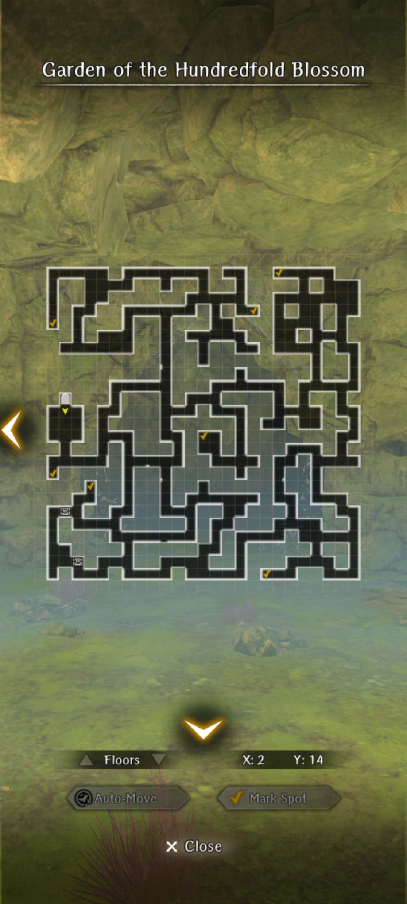
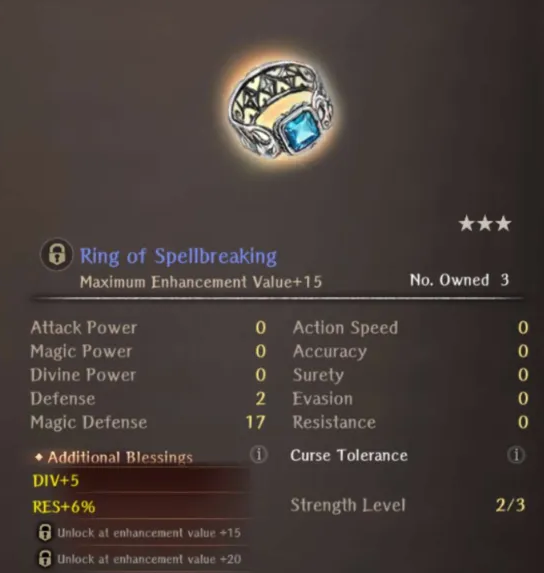
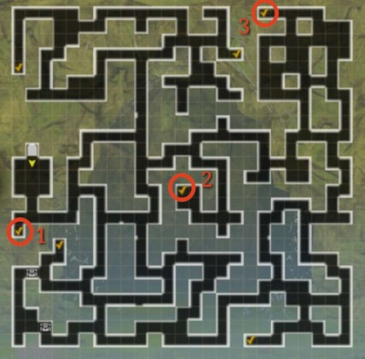

# Memories of Charlotte

??? note "Requirements"
    - Complete Abyss 3 up to the Cursed Wheel Point "Triumphant Return"
    - You must have completed Symbol of Alliance.

## Map

??? note "Map"
    

## Flower Locations
- Kid = Rose
- Top left = Rose
- Top middle = Carnation
- Middle middle = Carnation
- Top right = Rose
- Bottom right = Carnation
- Bottom left = Rose

## Walkthrough
1. Head to Royal Capital for a cutscene and then head to Adventurer's Guild to take the request from the featured tab.
2. The flower selected for this first run doesn't matter. It only influences where the flowers selected spawn, which are different depending on the flower. However, you won't actually know which flower you're supposed to get until after you complete the first run. Each flower is guarded by some monsters. Defeat them and collect all three flowers and leave. There will be a Lizardman Champion blocking the way when leaving. He has the same moveset as a normal one, but with greatly increased stats (15k HP)
3. Turn in the request and gain knowledge on which flowers to pick. You will need both Roses and Carnations to fulfill the request properly. Cursed Wheel and return to the cave. Check the map listed and collect 4 flowers. You need at least 1 Carnation and 1 Rose, otherwise the combination of flowers doesn't matter. You are also given the option to collect more flowers. Choosing to do so will ensure that the Lizardman Champion blocking the exit is just by himself. If you choose not to collect all the flowers, then there will be more enemies accompanying the Lizardman Champion.
4. If you stole the flowers from the kid, you can fight an additional superboss fight. Otherwise, you don't need to do so. Go turn in the request back in the Royal Capital Adventurer's Guild for the ring reward. If you collected all the flowers, you will obtain 1 additional high grade ore (yay).

## Reward
  

!!! note "About the Reward"
    This item is farmable with no CD and is always 3* Blue at 2/3 Strength. The substats are random.

## Super Boss Fight Details

- Main boss is a Lizardman Champion with around 30k HP. He has very high defense and will summon 4 Lizardman and 2 Sahuagin Mages either immediately if he goes first, or after your first move if you are faster. He will then also immediately buff his team with 4 turns of accuracy, evasion, and action speed. All the mobs besides the main boss has around 5k HP.
- At around half HP, he can resummon all his allies and rebuff them.
- On his first turn, he gets to attack 4 turns. As a result it's highly recommended to use Knight's Defense OR defend until their buffs run out.
- The two sahuagin mages will cast KATINO on your backrow. All the mobs in this fight are susceptible to KATINO themselves however.
- Completing this fight drops a normal chest from the cave. It's highly recommended to not farm this fight even if you are capable of doing so easily as it's a waste of time.
- All enemies in this fight are not surety resistant. However, they all have very high evasion so it's recommended to have 150+ Accuracy and to use high accuracy moves.

## Chest / Junk Farming

If you don't want to go through the entire quest repeatedly to get ring rewards, the Cave also is provides a fairly decent opportunity to farm high quality Ebonsteel junk.  The procedure below provides a farming route with an efficient chest/junk rate:

1. Use the Cursed Wheel to reset the quest if it’s already completed or if you have enough flowers to complete it… (Just reset it if unsure.)  
2. Just go to the three circled checkmarks on map below (bottom left, middle, top right). Ignore all other checkmarks.  
3. Kill miniboss encounters for guaranteed chests at these checkmarks.  
4. Do not pick any flowers.  
5. Collect any randomly spawned chests you see on the way to the checkmarks.  
6. Once those are complete, leave the cave and return to the world map.  
7. Go right back into the Cave from from world map.  
8. Repeat.  

??? map "Chest Farming Map"
    

Difficulty - Mid-to-high (below Bicken, above SSC and Sepa Cave)  

Available Junk:  
Types: Five Blossom and Roar  
Tier: 100% Ebonsteel  
Rarities: "unlabeled" (3* blue max), Commonplace (3* blue max), Fey (6% 4* / 6% purple), Unusual (12% 4* / 12% purple)  
Weapons: 1H Rods, 2H Staves, 1H Maces, 2H Maces, Spears, 2H Swords, 2H Axes  
Gear: Cloth and Light Shields, Cloth and Light Helm, Cloth Boots,  Cloth Gloves, unflavoured Ring  
Racial Gear: Cloth/Light/Heavy anti-beast gloves  
Special gear: Light Helm, Light Gloves, Anti-Beast with higher EVA  
