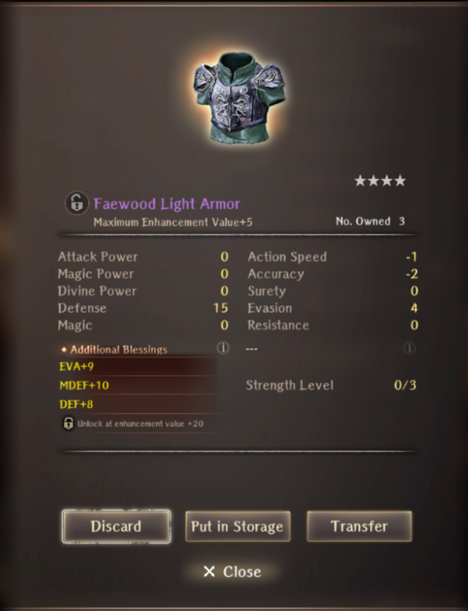

# Symbol of Alliance

??? note "Requirements"
    - Complete Abyss 3 up to the Cursed Wheel Point "Hidden Passage"
    - Elmon must be alive

## Map

??? note "Map"
    

## Walkthrough
1. Pick up the request at Royal Capital's Adventurer's Guild. The request will be in the "Featured" Tab.
2. Talk to Elmon and pay attention. She tells you to remember "Elmon of Le Bicken, Friend of Charlotte" if you're in trouble with elves. Receive a Pendant and Le Bicken Cave is opened on the world map. It is recommended to buy 3 of Treasure Fever, Scroll of Gravel, or Scroll of Sacred Protection from the item shop before you leave.
3. Head to Le Bicken Cave. You will need to pick up 3 Mushrooms and 3 Herbs. Mushrooms are located on the checkmarks. They are protected by a monster fight that is always 2 Gorgons in the frontline + 1 elemental entity in the backline.
4. Herbs are located at the NPC indicated by the red star on the map. You must trade items for the Herbs. He will ask for: Treasure Fever, Scroll of Gravel, Scroll of Sacred Protection, or Mimic Secretion. If he requests an item you do not have, simply tell him you want something else until he has a request for something in return for the herbs.
5. Upon attempting to leave regardless of whether you have all the ingredients or not, you will encounter elves. You must tell them that you know Elmon, friend of Charlotte.
6. Return to the Royal Capital's Adventurer's Guild and turn in the request. You will obtain a piece of gear and some knowledge about Elmon

## Reward
  

!!! note "About the Reward"
    This item is farmable with no CD and can spawn up to 4* Purple?. It increases Def, Mdef, and Evasion on enhancement.

## Farming

The cave remains on the world map after completion of the event. You can just go in and out to collect the chests for junk. To reset the quest though, simply go to the Cursed Wheel and select any option on or past "Hidden Passage" in Abyss 3. The option to reset this request is on the bottom left in green.
