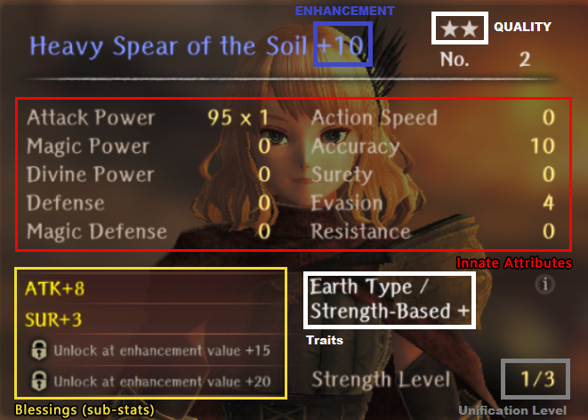
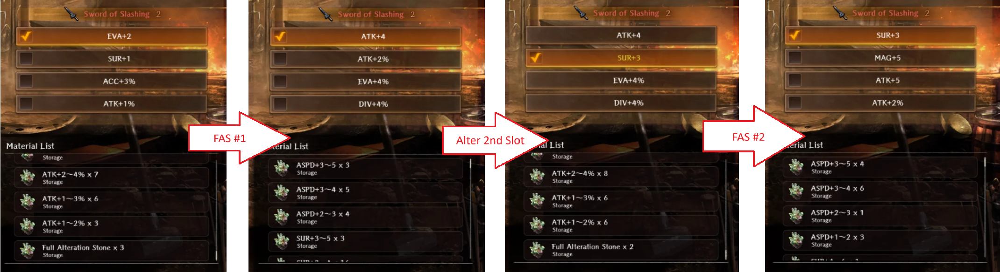

# Blacksmithing Basics

Blacksmithing offers several methods for improving your weapons, armor and accessories, and is essential for strengthening your party.

## Default Equipment Blessings

**These values are only estimates, and should be used as reference only.**

* `O`: Confirmed
* `Empty`: None

|   Type   | Shield  |  Hat  |  Armor  | Gloves  | Shoes | Accessory | Weapon|
|:--------:|:-------:|:-----:|:-------:|:-------:|:-----:|:---------:|:-----:|
|   ATK%   |         |   O   |         |    O    |       |     O     |   O   |
|   MAG%   |         |   O   |         |    O    |       |     O     |   O   |
|   DIV%   |         |   O   |         |    O    |       |     O     |   O   |
|   ACC%   |         |   O   |         |    O    |   O   |     O     |   O   |
|   EVA%   |    O    |       |    O    |         |   O   |     O     |   O   |
|   RES%   |    O    |   O   |    O    |         |   O   |     O     |       |
|   DEF%   |    O    |   O   |    O    |    O    |   O   |     O     |       |
|   MDEF%  |    O    |   O   |    O    |    O    |   O   |     O     |       |
|   ASPD%  |    O    |       |    O    |         |   O   |     O     |       |
|    ATK   |         |   O   |         |    O    |       |     O     |   O   |
|    MAG   |         |   O   |         |    O    |       |     O     |   O   |
|    DIV   |         |   O   |         |    O    |       |     O     |   O   |
|    ACC   |         |   O   |         |    O    |   O   |     O     |   O   |
|    EVA   |    O    |       |    O    |         |   O   |     O     |   O   |
|    RES   |    O    |   O   |    O    |         |   O   |     O     |       |
|    DEF   |    O    |   O   |    O    |    O    |   O   |     O     |       |
|   MDEF   |    O    |   O   |    O    |    O    |   O   |     O     |       |
|    SUR   |    O    |       |    O    |         |       |     O     |   O   |
|   ASPD   |    O    |       |    O    |         |   O   |     O     |       |

## Enhance
 - Increases Enchantment Value up to a maximum of +20.
 - Increases Innate Attributes
 - At Enchantment Value +5, +10, +15 and +20, unlocks a new Blessing or improves an existing Blessing if one already exists in that slot.

Requires **Gold** and **Iron Ore**.

### Enhancement Values

**These values are inaccurate, and should be treated as estimates.**

|                                               |  1★ |  2★ | 3 ★ |  4★ |  5★ |
|:---------------------------------------------:|:---:|:---:|:---:|:----:|:----:|
|     **ATK, MAG, DIV, DEF, MDEF, ACC, EVA**    | 1~3 | 2~6 | 3~9 | 4~12 | 5~15 |
| **ATK%, MAG%, DIV%, DEF%, MDEF%, ACC%, EVA%** | 1~3 | 2~6 | 3~9 | 4~12 | 5~15 |
|                 **ASPD, SUR**                 | 1~3 | 1~5 | 1~7 |  1~9 | 2~11 |
|                   **ASPD%**                   | 1~3 | 1~5 | 1~7 |  2~9 | 2~11 |

## Refine

Refining an item increases the value of a substat and requires a Refinement Stone for that attribute.

Refinement bonuses are lost if used before enhancing to +5, +10, +15, or +20.

For example, you can safely (without losing the refinement):
- Refine substat 1 after upgrading an item to +5.
- Refine substat 1 or 2 after upgrading an item to +10.
- Refine substat 1, 2 or 3 after upgrading an item to +15.
- Refine any substat after upgrading an item to +20.

Requires a matching Refinement Stone of the **Blessing** to improve.

Blacksmithing becomes available early in the game after your party enters the first major city, Royal Capital Luknalia.

### Gold Cost for Enhancing

| Gear Tier |  +1  |  +2  |  +3  |  +4  |  +5  |  +6  |  +7  |  +8  |  +9  |  +10  |  +11  |  +12  |  +13  |  +14  |  +15  |  +16  |  +17  |  +18  |  +19  |  +20  |  Total  |
|:---------:|:----:|:----:|:----:|:----:|:----:|:----:|:----:|:----:|:----:|:-----:|:-----:|:-----:|:-----:|:-----:|:-----:|:-----:|:-----:|:-----:|:-----:|:-----:|:-------:|
|   Iron    |  350 |  500 |  750 | 1100 | 1550 | 2100 | 2850 | 3750 | 4800 |  6050 |  7500 |  9350 | 11500 | 13950 | 16700 | 19750 | 23400 | 27350 | 39200 | 76200 |  268700 |
|   Steel   |  500 |  700 | 1100 | 1700 | 2500 | 3500 | 4900 | 6650 | 8750 | 11200 | 14000 | 17400 | 21250 | 25550 | 30300 | 35550 | 41500 | 48050 | 67700 | 126650|  469400 | 
| Ebonsteel |  650 |  900 | 1500 | 2450 | 3750 | 5400 | 7650 | 10500| 13950| 18000 | 22650 | 28100 | 34750 | 42600 | 51650 | 61900 | 74150 | 87800 | 128750| 251600|  848700 |

## Extraction

Extracting destroys an item, with a small chance of producing an Alteration Stone or Refinement Stone that can be used to modify or increase substats on items.

The type of stone produced will be randomly selected from one of the substats on the item under extraction.

Only weapons, armor and accessories can be extracted.

### Extraction Values

**These values are inaccurate, and should be treated as estimates.**

|                                               |  1★ | 2 ★ | 3 ★ | 4 ★ | 5 ★ |
|:---------------------------------------------:|:---:|:---:|:---:|:---:|:---:|
|     **ATK, MAG, DIV, DEF, MDEF, ACC, EVA**    | 1~3 | 2~4 | 3~5 | 4~6 | 5~7 |
| **ATK%, MAG%, DIV%, DEF%, MDEF%, ACC%, EVA%** | 1~2 | 1~3 | 2~4 | 3~5 | 3~6 |
|                 **ASPD, SUR**                 | 1~2 | 2~3 | 3~4 | 3~5 | 4~6 |
|                   **ASPD%**                   | 1~2 | 1~3 | 2~4 | 3~5 | 3~6 |

### Alteration

Altering an item modifies a substat, and requires an Alteration Stone.

Alteration has some nuanced behavior to it.

* Altering a slot after it reached its checkpoint will remove both the initial Blessing and any enhancements and refinements, leaving the slot with just the value provided by the Alteration Stone.

### Enhancement Inheritance

Enhancement Inheritance sacrifices an existing enchanted item to increase the enchantment value of another item.

This helps save gold when changing to higher quality equipment when you have already enchanted your existing equipment.

### Unification

## Advanced Blacksmithing

### Advanced Extraction

The star quality of an item being extracted determines the magnitude of the stones produced. 

Extracting higher quality items results in a larger bonus granted by the stones.

**Tip:** Altering a high quality item with a low-grade Stone and then extracting the resulting item will result in a higher quality Stone, as the game only considers **item quality** and **type of available substats** when generating a Stone, not the magnitude of the substats.

### Full Alteration

A **Full Alteration Stone** allows you to reroll all unlocked substats on an item.

!!! note "Known Ways to Obtain"
    - Very VERY rare chance from extracting ANY grade/quality gear.
    - As of April 1st, 2025, can be purchased from the monthly pack: ^^Jeweler Curated Collection Set^^ for 74.99 USD.
    - From Old Castle Ruins Event Shop for 10000 event tokens.

It re-rolls all blessings currently on an item. This process is subject to the same RNG that all items are subject to when generating stats on Reversal from junk. It also applies a bonus amount to each blessing; similar to the same check point that you would normally receive when enhancing an item to +5/10/15/20. This allows you to "double-dip" on stats when enhancing a piece of gear altered with FAS if it hasn't been enhanced already. Using this method will allow gear to receive stats significantly higher than naturally possible, even in ideal circumstances.

Using a SECOND FAS on the same item repeats the process - it will again re-roll all blessings while unlocking an alteration slot, even if you had altered previously.

!!! note "Example 1: Using One Full Alter Stone"
    

!!! note "Example 1: Using Two Full Alter Stones"
    

It is highly suggested that a FAS should be saved and used on your highest rarity items - 4* purple or higher. Good examples for this would the Master Fighter Ring from the Fighter Proving Grounds (A 4* Red Ring) or certain extremely strong gacha equipment like Blade Cuisinart if they have a good quality/grade. Alternatively, it can be used to give another chance at better rolls on gear that has already been enhanced to +20.

Credits to samuraidoc on Discord for experimenting with FAS + Guide writeup.

