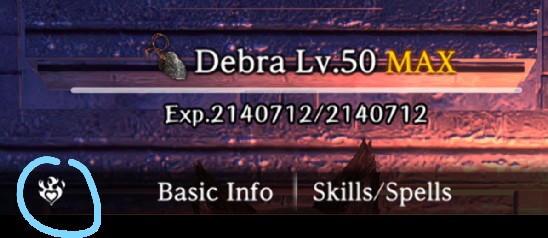

## Adventurer Bondmates

- All adventurers can be bondmates if you dismiss them once they reach max [trust](../../mechanics/trust/trust.md)

??? note "Adventurer Trust Icon"

??? note "Adventurer Bondmate Example"

* Dismissed heroes with the flaming heart icon become bondmates that give a bonus to a certain base attribute (+1..+5, depending on bondmate level).
* The bondmate level of a dismissed adventurer seems to depend on the bondmates attached to it on dismissal. If the adventurer has two level 5 bondmates, the resulting bondmate will in most cases (but not always) be level 5 too. Attached bondmates are returned to the pool on dismissal and can be attached to someone else afterwards.
    * It's possible that this is a bug, as it doesn't make a whole lot of sense to have an adventurer bondmate level depend on it having bondmates when dismissed, but stranger things have happened.
* The quickest way to obtain a level 5 adventurer bondmate is to get them to level 30 (see xp farming) and bronze grade (see grade up exams), take them to beat Helmut and Octonarus, and if necessary finish with the well-known trust-farming methods (see affinity). When they have the flaming heart icon, attach two level 5 bondmates, then dismiss the hero.
    * This process is much faster when using adventurers that match the main character‘s alignment. Often, just beating both greater warped ones and bronze grade will be enough for the flaming heart for matching alignments.
    * There seems to be another factor, possibly a random element to this. Sometimes the resulting bondmate will be level 4 only. It is currently not known why.
* Bonuses from two adventurer bondmates with the same attribute do not stack.
    * This means that at most, you can only get up to +5 on a attribute from an adventurer bondmate. This severely limits the appeal of dismissing adventurers for bondmates, with the most common practical application of it being for speed tuning purposes.
* Contrary to regular bondmates, there is no additional bonus when attaching an adventurer bondmate to a hero of the same element.

| Bondmate     | Increased Attribute |
| ------------ | ------------------- |
| Abenius      | STR                 |
| Adam         |                     |
| Aldric       | DEX                 |
| Alex         | VIT                 |
| Alice        |                     |
| Amelia       | SPD                 |
| Arboris      |                     |
| Asha         | IQ                  |
| Bakesh       | DEX                 |
| Barbara      | STR                 |
| Beast-Thi    | DEX                 |
| Benjamin     | STR                 |
| Berkanan     | STR                 |
| Bugen        |                     |
| Chloe        | STR                 |
| Clarissa     | STR                 |
| Daniel       | STR                 |
| Debra        | SPD                 |
| Dino         | IQ                  |
| Dwarf-Kni    | VIT                 |
| Eckhart      | VIT                 |
| Elda         | STR                 |
| Eldorado     | VIT                 |
| Elf-Mag      | IQ                  |
| Elf-Pri      | PIE                 |
| Elise        | STR                 |
| Emil         | PIE                 |
| Eulalia      | VIT                 |
| Flut         | IQ                  |
| Galina       | PIE                 |
| Gandolfo     | STR                 |
| Gaston       | STR                 |
| Gerard       | VIT                 |
| Gerulf       | STR                 |
| Human-Fig    | STR                 |
| Human-Nin    | SPD                 |
| Human-Pri    | PIE                 |
| Iarumas      | IQ                  |
| Jarmil       | IQ                  |
| Jean         | DEX                 |
| Kiriha       | DEX                 |
| Lanaville    | VIT                 |
| Marianne     | PIE                 |
| Milana       | DEX                 |
| Olive        | VIT                 |
| Ophelia      | STR                 |
| Phillip      | SPD                 |
| Red Beard    |                     |
| Rinne        |                     |
| Savia        |                     |
| Shelirionach |                     |
| Shiou        | STR                 |
| Valdor       | IQ                  |
| Viviana      | SPD                 |
| Yekatarina   | IQ                  |
