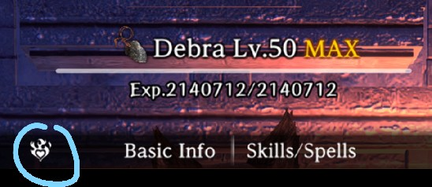

### Overview

!!! warning "Updates"
    - We are current investigating the impact of the 4/28 patch.
    - An alternative, potentially faster method for the Flaming-Heart is now posted.

=== "What is a Stat Bondmate?" 

    - All adventurers can become bondmates ("stat bondmates") if they are dismissed after reaching flaming-heart status.
    - Stat bondmates are -not- the same as story bondmates. The former increases base traits while the latter increases derived stats such as Attack Power, Accuracy, etc. 
    - Stat bondmates help to augment your units since story bondmates are limited. 
    - Equipped from the Training Room - Bondmates menu. 
    
=== " Bondmate Levels" 

    - After dismissing a stat bondmate it will roll a Level from 1 to 5. The level that is rolled appears to be a function of the bondmates attached to it prior to dismissal. It is a mechanic that is not fully understood to-date. 
    - Based on extensive community testing we can confirm:
        - If a unit has 2x Level 5 bondmates attached prior to dismissal it will result in a Level 4 or 5 stat bondmate.
        - The odds are roughly 50/50. There is no known, consistent way to guarantee a Level 5.
    - Rule of thumb: You will need to farm 2x the number of units to reach a target number of Level 5 bondmates . For example, if you want 6x Level 5 SPD bondmates, then you should expect to farm, on average, 12 SPD bondmates.
    - Bondmates attached to the dismissed unit are not lost, but are returned to the Bondmate List.

=== "Trait Bonuses" 
    
    === "Mechanics"

        - The trait bonus is a function of both the Grade of the unit being equipped and the level of the stat bondmate. See examples in the tabs. 
        - Trait bonuses cap at +7-8 at Level 70. It is possible to attach a Level 2 and Level 3 of the same stat bondmate to one character for the "equivalent" trait bonus of a Level 5 stat bondmate.
        - SPD bondmates are an exception. All of their values are one lower, so the max at Level 70 would be +6-7. 
        - There is no additional trait bonus for matching elemental alignments. This holds true for story bondmates, too.
        - Nameless, General, and Legendary adventurers all provide the exact same trait bonuses.

    === "Example: Level 5 Stat Bondmate"

        - A Level 5 stat bondmate +
            - A Level 70 (Copper Grade) unit will receive +7-8 trait points
            - A Level 60 (Steel Grade) unit will receive +6-7 trait points
            - A Level 50 (Iron Grade) until withh receive +5-6 trait points
            - And so on 
        - The trait bonus range is due to rounding and will vary by unit

    === "Example: Level 4 Stat Bondmate"
    
        - A Level 4 stat bondmate +
            - A Level 70 (Copper Grade) unit will receive +6-7 trait points
            - A Level 60 (Steel Grade) unit will receive +5-6 trait points
            - A Level 50 (Iron Grade) until withh receive +4-5 trait points
            - And so on
        - The trait bonus range is due to rounding and will vary by unit

### Flaming-Heart Requirements

!!! warning "Summary" 

    === "Requirements"
    
        - Promoted to Bronze Grade
            - The Bronze Grade exam is offered at Level 30. 
            - Each stat bondmate costs 3 tags; 1x for Lead and 2x for Bronze.
            - Raising a unit beyond Level 30 does not do anything and has no effect on rolling a Level 5 stat bondmate. 
            - Lead Grade at Level 30 will -not- work.
        - Defeat any two Greater Warped Ones (GWOs). 
            - The easiest GWOs are Helmut and either Melgina or Octoranus.
            - The game treats Melgina or Octoranus as the "same" Greater Warped One (GWO), so you cannot double-dip. Melgina is safer for low HP units.
            - The unit does not need to survive the fight, but it is preferrable to avoid the trust penalty from dying.
            - Killing a GWO more than once does -not- give you extra trust.
        - Trust farm via Camping using the Fountain on Abyss 1, Floor 7 until the flaming-heart icon appears.
    
    === "Troubleshooting" 
    
        - Do the conditions in the order listed. 
        - The primary reason why people do not get the flaming-heart is because they begin trust farming prior to defeating the two GWOs (Helmut, Melgina or Octoranus). 
        - If you have been trust farming for more than 30 minutes, then double-check:
            - Unit is Bronze grade
            - The 2 GWO fights are completed
            - The unit did not die repeatedly while leveling 
        - There are very rare instances where an Anonymous unit will just not proc the flaming-heart icon even after excessive trust grinding. This tends to happen with a Good or Neutral MC and Evil units the most frequently. We suspect that each unit has a starting trust value range that is RNG-based and determined at creation. Some units can start with extremely low trust making them difficult to raise. In some cases it is just best to dismiss for their Grade tag. 

    === "Flaming-Heart Icon"

        

        
        

    
    === "Stat Bondmate Example"

        

        
        

    === "Bondmate List Example"

        

        
        

??? warning "New! Flaming-Heart - No Trust Farming Method" 

    === "Requirements" 
    
        1) Promoted to Bronze Grade.  
        2) Defeat the first 3 GWOs.
            - A1: Helmut
            - A2: Melgina or Octoranus
            - A3: Gatekeeper

    === "Additional Information"

        Context: 
        
        - This was shared in late April by Discord member @Genosis. It is currently undergoing additional testing. 
        - Historically, defeating 3 GWOs did not trigger the flaming-heart on Nameless, General, or Legendary units. We suspect at some point in the past a patch altered the one-time trust gain from defeating a GWO. 

        Technical Notes: 
        
        - The flaming-heart is instant after killing the third GWO (kill order does not matter) for both Nameless and General units. Genosis tested this with a Good MC and Evil bondmate candidates. 
        - MC and team alignment does not seem to matter. Genosis tested with a Good MC and Evil bondmate candidates. 
        - Bondmate death during the Gatekeeper battle did not have an impact, but we suggest you try to keep your units alive if possible. 
        - With a strong team it takes ~15-20 minutes from the Zone 10 Fountain to the ending cutscene. If your trust farming via Camping is take longer than this, then we suggest trying out this method. 
        - Legendary units have not been tested to-date.  
        
### Efficient Trust Farming 

- Trust farming is the last step. It is done after promoting to Bronze Grade and defeating both GWOs if the stat bondmate did not receive the flaming-heart.
- This guide is built around using Anonymous units. If you opt for General or Legendary units, then this process can take 2-4x as long depending on your MC's alignment. 

??? note "How to Build Trust"

    === "Conversations"

        - For Tavern and Camp conversations the amount of trust points gained depends on two factors:
            - Alignment (Good-Neutral-Evil)
            - Selecting the "best" response to conversational prompts ([Trust Table](../../mechanics/trust/table.md)).
        - More trust points are earned if the MC's alignment is the same as his conversation partner. For example, Neutral MC and Yekaterina (Neutral) will earn more trust points than Neutral MC and Milana (Evil) even if you provided the "best" response to both.
        - Few-to-no trust points are earned with Good-Evil pairings.
        - Trust farming should be done with same-alignment parties only when possible. 

    === ""Spillover" Trust"

        - Other adventurers present during Tavern or Camp conversations gain a small amount of trust even if they did not prompt the conversation. 
        - Example: If Good MC and Lana (Good) had a conversation with the "best" response selected, then:
            - Lana - Good: Maximum amount of trust points
            - Abenius - Good: Small amount of trust points
            - Yekaterina - Neutral: Small amount of trust points, but fewer than Abenius
            - Milana - Evil: Few-to-no trust points 

    === "Battles and Death Penalty"
     
        - Battles provide an extremely small amount of trust. It requires 100+ battles before you begin to see pips added to the Compendium. It is unknown whether a character needs to be present or take an action during combat to earn trust points. 
        - The death of a stat bondmate comes with a significant trust penalty. It should be avoided at all costs while leveling or during the GWO fights.
        - Death penalty for Anonymous units:
            - Same alignment as MC: 1-3 additional Camp conversations
            - Different alignment: 2-5 additional Camp conversations
        - If a stat bondmate dies, then kill MC during the revival mini-game. The "Rise again" or "Accept death" options will negate any trust loss.
        - If you have access to the Martial Training (Guarda Fortress) dispatch this is a safe alternative to manually leveling.

    === "Other Tips" 

        - Neutral MC is the optimal alignment when stat bondmate farming. 
        - Good MC is arguably the worst alignment to trust farm with for two reasons: 
            - VIT or PIE stat bondmates have a negligble impact on battle performance, so most people do not raise them.  
            - Raising trust with Good MC and Evil stat bondmates can be extremely time-consuming, taking up to 2-4x as long.
        - Lana (Good), Yekaterina (Neutral), and Alice (Evil) are excellent companions to bring along as they will frequently proc camp conversations.
        - This process can be tag-intensive. Remember that you are refunded a Bronze tag at the end of this process, but you cannot downgrade tags!

??? note "Anonymous Adventurers"

    === "Why Anonymous?"

        - Always use Anonymous adventurers (Human Fighter, Elf Mage, etc.) as they have lower trust requirements for a flaming-heart than their General or Legendary counterparts.
        - General or Legendary adventurers can take 2-3x as long to reach flaming-heart status even if their alignment matches the MC. They also give the same trait bonus amounts as Anonymous.
        - A warning that raising a Legendary unit to flaming-heart status can take up to 20-25+ camp conversations if the alignments do not match. 

    === "Anonymous Basics"

        - Cannot join Tavern conversations, but are present during Camp conversations. This is the key to efficient stat bondmate farming.
        - Anonymous receive "spill over" trust points from Camp conversations from adventurer's with the same alignment.
        - Anonymous that share the MC's alignment receive an additional trust boost and require few-to-no Camp conversations. 
            - 90% of the time they will receive a flaming-heart after defeating the second GWO - as long as they did not die at any point during the battle or while leveling.
            - If they do not instantly receive the flaming-heart, then it usually requires 1-2 Camp conversations.
        - Putting all BP into SPD is recommended to ensure the stat bondmates can move before Melgina or Octoranus to defend against their attacks.

    === "Trait Bonuses"

        - STR - Human Fighter (Neutral)
        - DEX - Beast Thief (Evil) 
        - IQ - Elf Mage (Neutral)
        - SPD - Human Ninja (Evil)
        - VIT - Dwarf Knight (Neutral) 
        - PIE - Human Priest (Good), Elf Priest (Evil)
        - LCK - No unit - Anonymous, General, or Legendary - gives Luck as a trait bonus

    === "Alternative Options" 
    
        - The only General units you may want to consider using are Philip (Neutral) and Viviana (Evil) for SPD. 
        - The Human-Ninja (Evil) requires 830K EXP to reach Level 30 versus 330K EXP for Philip and Viviana. 
        - The trade-off is that Philip's inherit, Delay Attack, can be very useful if using speed strategies in conjunction with MC Chrono 1-2, Batilgref, and Porto. The latter two can be stacked using a spell and shop scroll.  
        - Viviana's inherit, Hiding, is no longer as attractive as it used to be, but she is one of the more difficult characters to build trust with if you are not using an Evil MC.  
        
??? note "Trust Farming Steps"

    1. Ensure that every unit (besides the MC) shares the same alignment as the stat bondmate. 
    2. It is most efficient to raise two different stat bondmates of the same alignment simultaneously.
        - Neutral: Human Fighter (STR) and Elf Mage (IQ) 
        - Evil: Beast Thief (DEX), Human Ninja (SPD), Elf Priest (PIE)
        - Good: Human Priest (PIE), Dwarf Knight (VIT)
    3. Go to the Beginning Abyss, Floor 7. 
    4. Locate a chest and have the MC, ideally, fail the trap disarm mini-game.
        - It is not known if failing to open a chest incurs a trust penalty, but it does lower the MC's hidden Fortitude value. 
        - There is a fixed mimic chest on Floor 6 by the stairs that you can fail and run away from the battle; this can be repeated. Be careful if you are using auto-battle as you may accidentally kill the mimic. 
        - If you accidentally kill the mimic it will respawn after 24 hours. To force respawn it you need to leap to "Fresh Start" first. 
        - If you do not want to use the mimic, then chests appear frequently on the path to the Fountain. You can also check Floor 6 to see if there are any chests close to the stairs. 
        - The odds of getting a Camp conversation go up slightly, on average, if more than one chest is failed. However, this has not been extensively tested. 
    5. Go to the Floor7 Fountain and Camp, use the [Trust Table](../../mechanics/trust/table.md) to select the "best" answers.
    6. Note: If the stone block to the Fountain is not reversed, then you can:
        - Harken to Floor 8 and reverse them. 
        - Wheel twice on "King's Arrival" in the Cursed Wheel to see if that restores them.
    7. Exit
    8. Repeat this process until the flaming-heart procs on the stat bondmate. 

        !!! warning "Do not start trust farming until the stat bondmates have been promoted to Bronze grade and have defeated both GWOs (Helmut and either Melgina or Octoranus)." 

### Putting It All Together

- Experience grind until Level 30.
- Pass the Bronze exam and promote to Bronze Grade (requires 3 No Grade tags).
- Defeat Helmut and either Melgina or Octoranus. 
    - Killing them repeatedly does not give extra trust.    
    - If the Anonymous bondmate candidate dies at any point doing any of the above steps it will add between 2-5 extra Camp conversations.
- Go to the Beginning Abyss, F7 and trust farm with a same-alignment team until the flaming-heart appears.
- Go to the Guild - Training Room and attach any 2x Level 5 bondmates (story or stat bondmate does not matter) to the stat bondmate.

!!! danger "**DOUBLE-CHECK WARNING**"

    - **Flaming-heart icon present, 2x Level 5 bondmates equipped, unit is unlocked**
    - **Flaming-heart icon present, 2x Level 5 bondmates equipped, unit is unlocked**
    - **Flaming-heart icon present, 2x Level 5 bondmates equipped, unit is unlocked**

- Dismiss.
- During the dismissal scene you will be notified that the adventurer is now a bondmate.
- The Bronze Grade tag will be refunded.
- Check the Bondmate List to see if they rolled a Level 4 or 5.

### Other Notes

- Historically, adding additional bondmates (3-5) before dismissal always averaged out to a 50/50 chance to get a Level 4 or 5 bondmate. Whether this has changed or not in recent patches remains untested.
- Matching elements does -not- provide an additional stat boost.

### Bondmate Trait Table

{{ populate_quicklist(file='adventurers.csv', return_columns=['Name','Bondmate Trait','Personality','Rarity']).set_axis(['Bondmate','Increased Trait','Personality','Rarity'], axis=1)  | convert_to_md_table }}  
