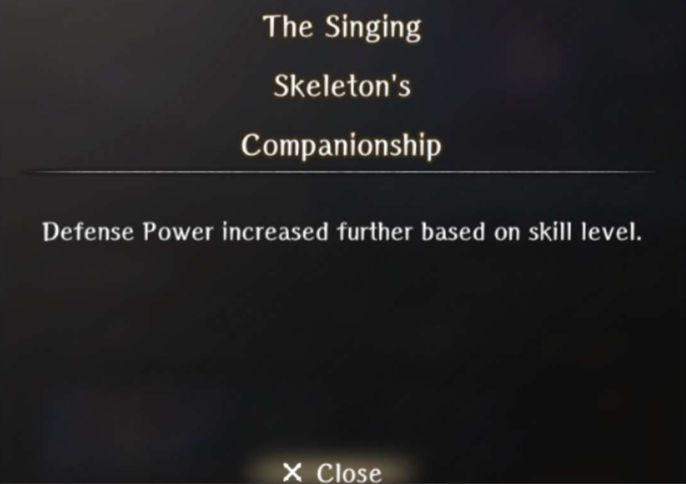
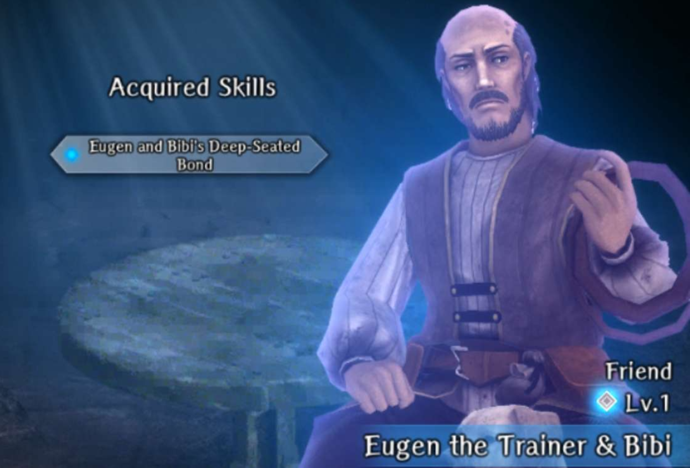
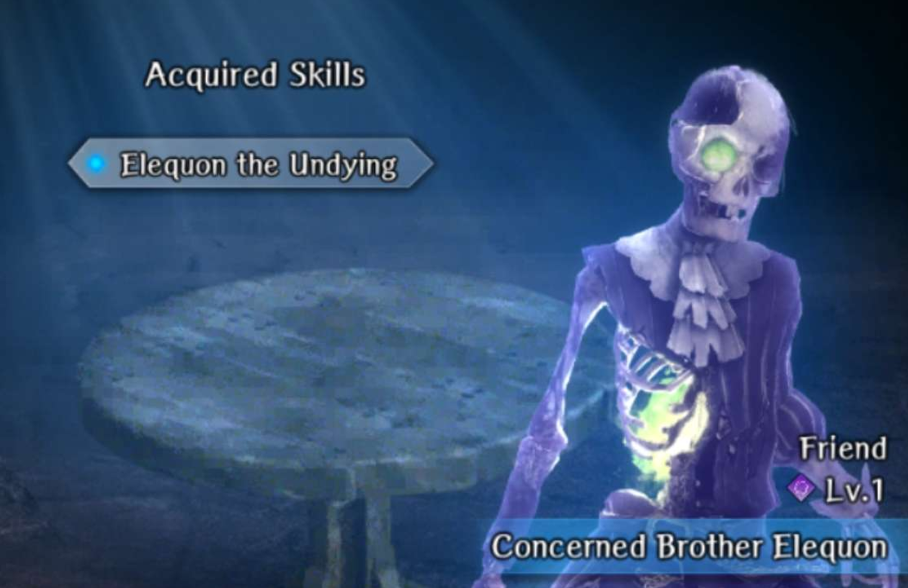

# Impregnable Fortress

## Request to Rescue the Duke

### Kidnapped Girl Liam

??? info "Kidnapped Girl Liam"
    

??? info "Skill"
    

- Complete the [Search for the Missing Girl](../../../abyss-guides/3-guarda-fortress/requests.md#search-for-the-missing-girl) request perfectly.

!!! note "To farm, Cursed Wheel to Request to Rescue the Duke, then Cursed Wheel to Fortress 2F Minor Harken and complete the request again"

### Guardian Knight Dalian

??? info "Guardian Knight Dalian"
    

??? info "Skill"
    

- Complete the [Blackmail Resolution](../../../abyss-guides/3-guarda-fortress/requests.md#blackmail-resolution) request.

!!! warning "Guardian Knight Dalian is permanently lvl 1."

## Infiltrating the Fortress

## Hidden Passage

## Secret Passage Minor Harken

## Enshadowed Well of Life

### Enthusiastic Carpenter Hans

??? info "Enthusiastic Carpenter Hans"
    

??? info "Skill"
    

- Complete the [Bodyguard for Ruins Exploration](../../../abyss-guides/3-guarda-fortress/requests.md#bodyguard-for-ruins-exploration) request.

!!! note "To farm, Cursed Wheel to Request to Rescue the Duke, then Cursed Wheel to Fortress 2F Minor Harken and complete the request again"

## Secret Path Keeper Vanquished

## Fortress Basement Arrival

### Endy the Mage

??? info "Endy the Mage"
    

??? info "Skill"
    

- Complete the [Forbidden Area Search Escort](../../../abyss-guides/3-guarda-fortress/requests.md#forbidden-area-search-escort) request.

!!! note "To farm, Cursed Wheel to Request to Rescue the Duke, then Cursed Wheel to Fortress 2F Minor Harken and complete the request again"

## Fortress Lower Floors Cleared

## Portrait Gallery Minor Harken

### Singing Skeleton in the Tunnel

??? info "Singing Skeleton in the Tunnel"
    

??? info "Skill"
    

- Complete the [Search for Missing Person](../../../abyss-guides/3-guarda-fortress/requests.md#search-for-missing-person) request.

!!! note "To farm, Cursed Wheel to Request to Rescue the Duke, then Cursed Wheel to Fortress 2F Minor Harken and complete the request again"

## Ghosts of Yore Vanquished

## Fortress 2F Minor Harken

### Brita the Lazy Handmaiden

??? info "Brita the Lazy Handmaiden"
    

??? info "Skill"
    

- Complete the [Water Hauling](../../../abyss-guides/3-guarda-fortress/requests.md#water-hauling) request.

!!! note "To farm, Cursed Wheel to Request to Rescue the Duke, then Cursed Wheel to Fortress 2F Minor Harken and complete the request again"

## Fortress 3rd Floor Arrival

## Triumphant Return

### Duke Ixion

??? info "Duke Ixion"
    

??? info "Skill"
    

- Complete the [Expedition to Clear the Fortress Lower Levels](../../../abyss-guides/3-guarda-fortress/requests.md#expedition-to-clear-the-fortress-lower-levels) request.

!!! note "To farm, Cursed Wheel to Request to Rescue the Duke, then Cursed Wheel to Triumphant Return and complete the request again"

### Eugen and Bibi

??? info "Eugen and Bibi"
    

??? info "Skill"
    

- Complete the [Missing Companion](../../../abyss-guides/3-guarda-fortress/requests.md#missing-companion) request.

!!! warning "Eugen and Bibi is permanently lvl 1."

### Graham, Knight Commander of Guarda

??? info "Graham, Knight Commander of Guarda"
    

??? info "Skill"
    

- Complete the [Emergency Occurrence](../../../abyss-guides/3-guarda-fortress/requests.md#emergency-occurrence) request.

!!! note "To farm, Cursed Wheel to Request to Rescue the Duke, then Cursed Wheel to Triumphant Return and complete the request again"

### Concerned Brother Elequon

??? info "Concerned Brother Elequon"
    

??? info "Skill"
    

1. Obtain Mini Golem Doll from the golem skeleton besides the Harken in Zone 4.
2. Trade the Mini Golem Doll to Dr. Raimi at Guarda Fortress Entrance for a Mysterious Root.
3. Trade the Mysterious Root for Glowing Ore at the Royal Capital.
4. Trade the Glowing Ore for Dagger of Honor at the blacksmith in Guarda.
5. Trade the Dagger of Honor to Graham at Guarda Fortress Entrance for Enchiridion of the Knights of Guarda
6. Trade the Enchiridion of the Knightss of Guarda for Mysterious Seeds at the tavern in Guarda.
7. Give the Mysterious Seeds to the Workman at (X:8, Y:2) at Guarda Fortress Entrance during [True Ending Run](../../../abyss-guides/3-guarda-fortress/greater-warped-one.md#true-ending)
8. Kill the Gatekeeper and return to the Workman to receive Mysterious Flower.
9. Head to Zone 4 and give the Mysterious Flower to Elequon and receive him as a Bondmate.

!!! warning "Concerned Brother Elequon is permanently lvl 1."
