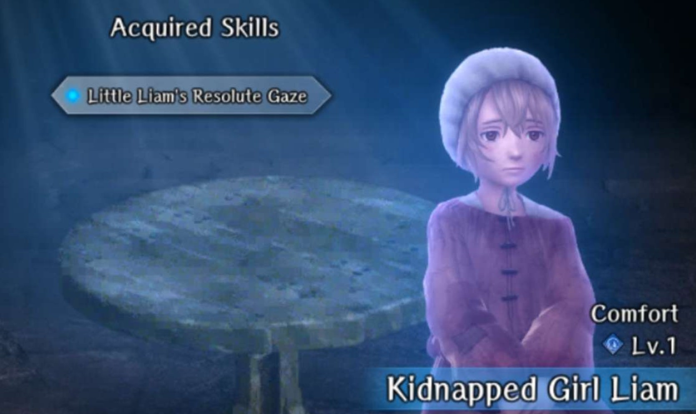
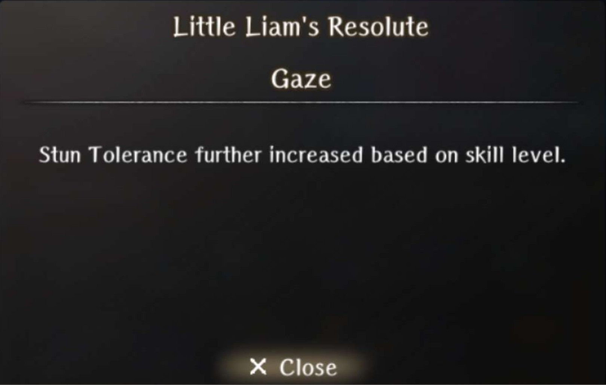
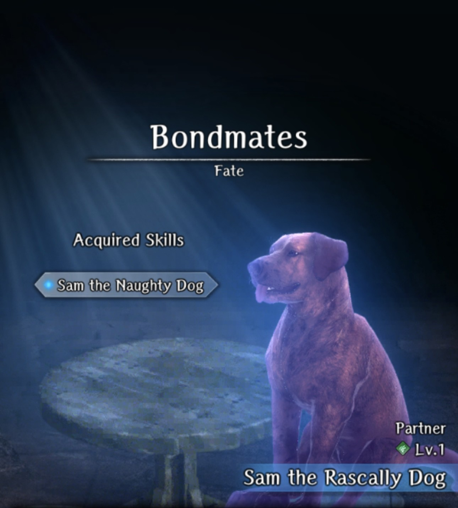
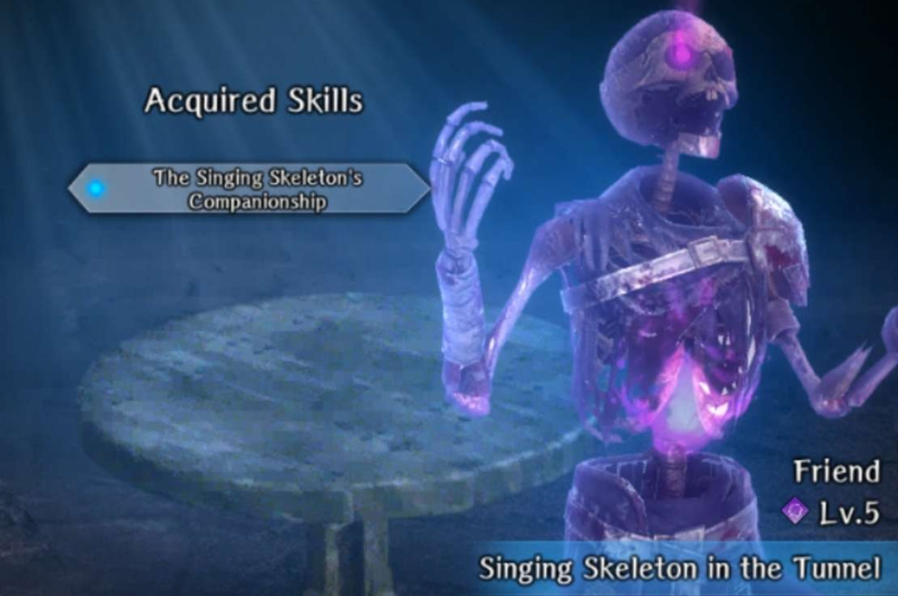
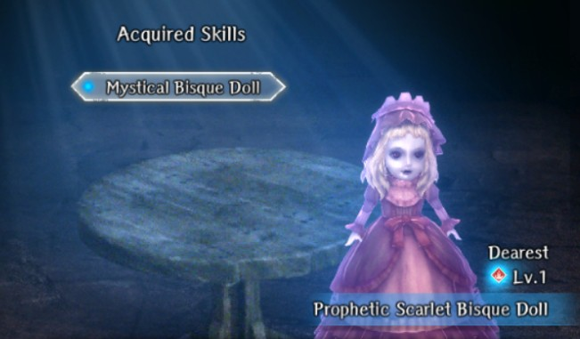
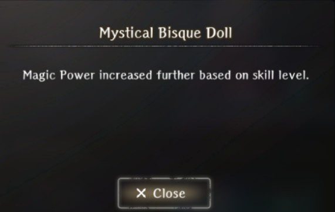
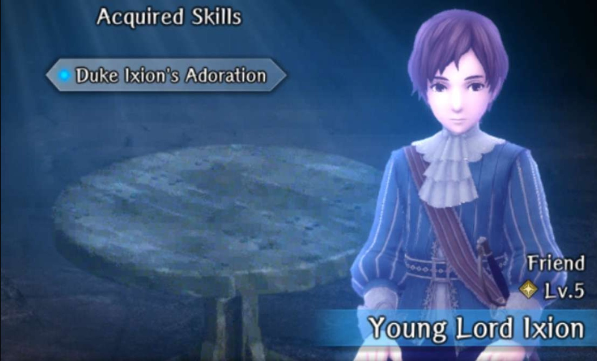
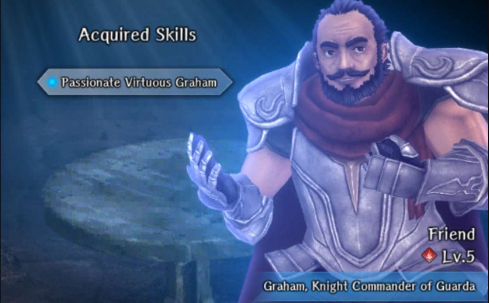
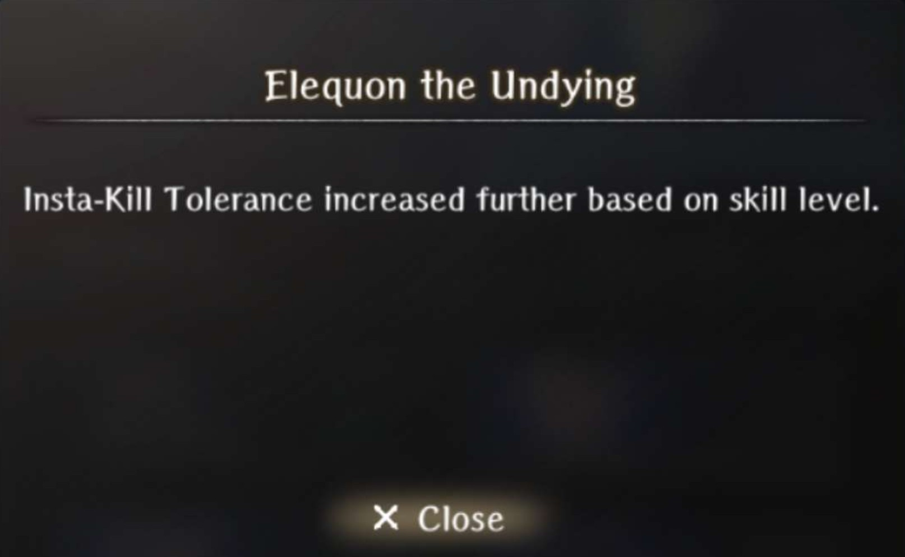

# Impregnable Fortress

## Request to Rescue the Duke

### Kidnapped Girl Liam

??? info "Kidnapped Girl Liam"
    

??? info "Skill"
    

- Complete the [Search for the Missing Girl](../../../abyss-guides/3-guarda-fortress/requests.md#search-for-the-missing-girl) request perfectly.

!!! note "Kidnapped Girl Liam is permanently lvl 1."

??? info "Sam the Rascally Dog"
    
    
??? info "Skill"
    

- Complete the [Search for the Missing Girl](../../../abyss-guides/3-guarda-fortress/requests.md#obtaining-sam-the-rascally-dog) request incorrectly.

### Guardian Knight Dalian

??? info "Guardian Knight Dalian"
    

??? info "Skill"
    

- Complete the [Blackmail Resolution](../../../abyss-guides/3-guarda-fortress/requests.md#blackmail-resolution) request.

!!! note "Guardian Knight Dalian is permanently lvl 1."

## Infiltrating the Fortress

## Hidden Passage

## Secret Passage Minor Harken

## Enshadowed Well of Life

### Enthusiastic Carpenter Hans

??? info "Enthusiastic Carpenter Hans"
    

??? info "Skill"
    

- Complete the [Bodyguard for Ruins Exploration](../../../abyss-guides/3-guarda-fortress/requests.md#bodyguard-for-ruins-exploration) request.

!!! note "To farm, Cursed Wheel to Request to Rescue the Duke, then Cursed Wheel to Fortress 2F Minor Harken and complete the request again"

## Secret Path Keeper Vanquished

## Fortress Basement Arrival

### Endy the Mage

??? info "Endy the Mage"
    

??? info "Skill"
    

- Complete the [Forbidden Area Search Escort](../../../abyss-guides/3-guarda-fortress/requests.md#forbidden-area-search-escort) request.

!!! note "To farm, Cursed Wheel to Request to Rescue the Duke, then Cursed Wheel to Fortress 2F Minor Harken and complete the request again"

## Fortress Lower Floors Cleared

## Portrait Gallery Minor Harken

### Singing Skeleton in the Tunnel

??? info "Singing Skeleton in the Tunnel"
    

??? info "Skill"
    

- Complete the [Search for Missing Person](../../../abyss-guides/3-guarda-fortress/requests.md#search-for-missing-person) request.

!!! note "To farm Cursed Wheel to Fortress Lower Floors Cleared and complete the request again"

## Ghosts of Yore Vanquished

## Fortress 2F Minor Harken

### Brita the Lazy Handmaiden

??? info "Brita the Lazy Handmaiden"
    

??? info "Skill"
    

- Complete the [Water Hauling](../../../abyss-guides/3-guarda-fortress/requests.md#water-hauling) request.

!!! note "To farm Cursed Wheel to Fortress 2F Minor Harken and complete the request again"

## Fortress 3rd Floor Arrival

## Triumphant Return

### Prophetic Scarlet Bisque Doll

??? info "Prophetic Scarlet Bisque Doll"
    

??? info "Skill"
    

- Complete the [Doll of Fortune](../../../abyss-guides/3-guarda-fortress/requests.md#doll-of-fortune) request.

!!! note "To farm, Cursed Wheel before Triumphant Return and back and complete the request again"

### Duke Ixion

??? info "Duke Ixion"
    

??? info "Skill"
    

- Complete the [Expedition to Clear the Fortress Lower Levels](../../../abyss-guides/3-guarda-fortress/requests.md#expedition-to-clear-the-fortress-lower-levels) request.

!!! note "To farm, Cursed Wheel to Request to Rescue the Duke, then Cursed Wheel to Triumphant Return and complete the request again"

### Eugen and Bibi

??? info "Eugen and Bibi"
    

??? info "Skill"
    

- Complete the [Missing Companion](../../../abyss-guides/3-guarda-fortress/requests.md#missing-companion) request.

### Graham, Knight Commander of Guarda

??? info "Graham, Knight Commander of Guarda"
    

??? info "Skill"
    

- Complete the [Emergency Occurrence](../../../abyss-guides/3-guarda-fortress/requests.md#emergency-occurrence) request.

!!! note "To farm, Cursed Wheel to Request to Rescue the Duke, then Cursed Wheel to Triumphant Return and complete the request again"

### Concerned Brother Elequon

??? info "Concerned Brother Elequon"
    

??? info "Skill"
    

1. Obtain Mini Golem Doll from the golem skeleton besides the Harken in Zone 4.
2. Trade the Mini Golem Doll to Dr. Raimi at Guarda Fortress Entrance for a Mysterious Root.
3. Trade the Mysterious Root for Glowing Ore at the Royal Capital.
4. Trade the Glowing Ore for Dagger of Honor at the blacksmith in Guarda.
5. Trade the Dagger of Honor to Graham at Guarda Fortress Entrance for Enchiridion of the Knights of Guarda
6. Trade the Enchiridion of the Knightss of Guarda for Mysterious Seeds at the tavern in Guarda.
7. Give the Mysterious Seeds to the Workman at (X:8, Y:2) at Guarda Fortress Entrance while [stopping the Mastermind](../../../abyss-guides/3-guarda-fortress/important-request-gwo.md#stop-the-mastermind-and-save-the-duke)
8. Kill the Gatekeeper and return to the Workman to receive Mysterious Flower.
9. Head to Zone 4 and give the Mysterious Flower to Elequon and receive him as a Bondmate.

!!! note "Concerned Brother Elequon is permanently lvl 1."

### Old Mage's Lingering Fixation

??? info "Old Mage's Lingering Fixation"
    

??? info "Skill"
    

- He will randomly spawn throughout Abyss 3 from Zone 1 - 6 (with the exception of 4)
- Help him with his spell (battle him) 3 times and he will eventually become a bondmate.

!!! warning "This bondmate is very tedious to farm."

### Cheating Gambler Faile

??? info "Cheating Gambler Faile"
    

??? info "Skill"
    

If you have already stopped the Mastermind of Abyss 3, then follow these steps to reset:

1. Successfully rescue the Duke in Abyss 3 at least once.
2. Cursed Wheel back and defeat the Greater Warped One at 7-8 corruption level. Do not hand evidence to Dalian or Clemente. Talk to Alan after saving Liam.
3. Get the execution ending. Upon reviving, chase Dalian's maid to the Temple. Answer all questions correctly and accept the blackmail request.
4. Cursed Wheel back to Fresh Start (this resets the beginning abyss area). Cursed Wheel to Return to Capital. Accept any faction quest to unlock Guarda Fortress. Head to Guarda Fortress entrance (this resets the entrance zone). Cursed Wheel to Fortress Basement Arrival.
5. Head to Beginning Abyss Entrance. Make your way to the Gamblers near the cave entrance. Talk to them and lose. When prompted, select the option "They are blowing on the dice", then accuse them of cheating. This will begin a fight against them. After winning, select the option that says cheating is not good.
6. Cursed Wheel to Triumphant Return. Head to Guarda Entrance. There are two gamblers. Talk to them and accept the gambling minigame
7. This time, you have to WIN the gambling minigame. It is highly recommended to simply bet it all on singles. If you fail the minigame entirely, you can restart the app and get to redo the gambling minigame.
8. If you lose completely (you get a few retries if you drop to 0), simply pay the gold (other option engages in a fight and messes up the reset). Cursed Wheel to Triumphant return to reset.
9. If you win, you will face Thatcher, who is a Pirate Berserker that either basic attacks or uses stun bash. He will never attack the backrow and only gets one action per turn. This does 1100+ damage on 300 defense adventurers with Makaltu 7. The strategy is rather to defend and abuse openings. He is vulnerable to sleep and is EXTREMELY fast, so you may lose someone if you they don't have over ~95 action speed. He has around 15k HP or so. He can still easily hit ~550 against a blocking unit, so be careful. He can also self buff with an ATK Up buff, which will allow him to do enough damage to kill units that are defending, so bring a ninja with dissipation if possible. He also has very little to no surety evasion.
10. Upon winning, protect the gambler from being attacked by Thatcher. He will become reformed and you will gain his bondmate.
11. To farm, simply cursed wheel back to Triumphant Return, and head to Guarda Entrance.
    
