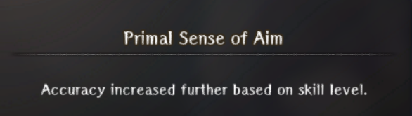
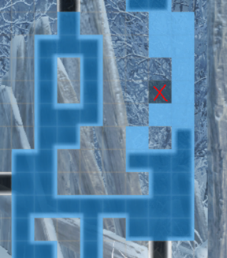
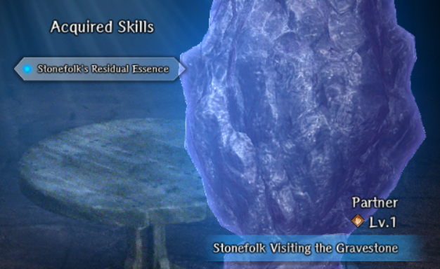
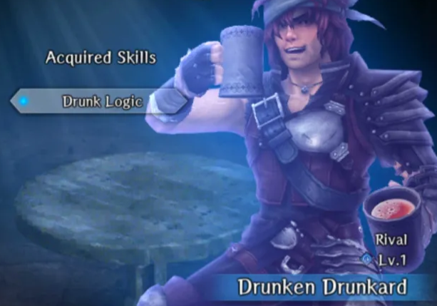
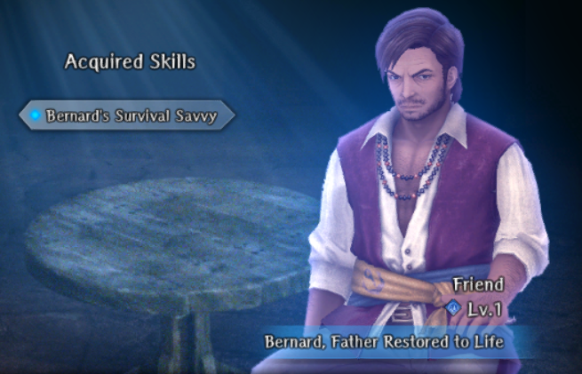
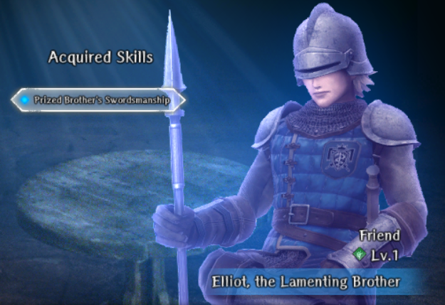
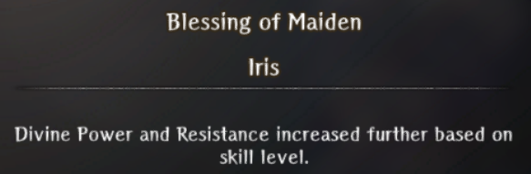

# Deepsnow Hinterlands

!!! warning "Bondmates are listed in the order of the story according to the Cursed Wheel progression point at which they are met."

!!! warning "Work in Progress. To be added soon:"
    - Wandering Bunny

## Snowy Forest Minor Harken

### Bigfoot's Offspring

??? note "Details"

    === "How to Acquire"

        - [Recovery of Salted Pork](../../../abyss-guides/4-isberg/requests.md#recovery-of-salted-pork)
        - Must choose to "Spare" the Bigfoot and its child at the end of the request

    === "Skill - Accuracy"

        <figure markdown>
        
        </figure>

    === "Portrait"

        <figure markdown>
        
        </figure>

## Village Shut Away in Silence

### Maya and Auntie Marta

??? note "Details"

    === "How to Acquire"

        - [Find My Sister Lisa](../../../abyss-guides/4-isberg/requests.md#find-my-sister-lisa)
        - Requires the "Perfect Ending"

    === "Skill - Fear Tolerance"

        <figure markdown>
        
        </figure>

    === "Portrait"

        <figure markdown>
        
        </figure>

### Stonefolk Visiting the Gravestone

??? note "Details"

    === "How to Acquire"       

        === "Requirements" 
        
            - Knowledge of [reversing nullstones](../../../abyss-guides/4-isberg/important-request-gwo.md#saving-iris)
            - Knowledge of [shortcuts](../../../abyss-guides/4-isberg/important-request-gwo.md#learning-the-truth) as he can appear on the right-hand side of Route 9

        === "Guide"
        
            Basics
            
            - This is a "hide-and-seek" bondmate. The goal is to locate and reverse him on every single floor from Route 3 to Route 10. His beginning and ending locations are fixed:
                - Route 3: Behind the Mayor's house at (X:21, Y:18)
                - Route 10: To the far left of the entrance at (X:6, Y:1)
            - For Routes 4-9 his location is randomized, but he does appear frequently on certain tiles sets.
            
            Map
            
            - Appears as a stone icon; once reversed, a person icon
            - If located in an active blizzard zone, then his icon will not appear on the map
            
            Other
            
            - Each time you reverse him he will leave behind 1 piece of ore:
                - Routes 3-4: Mid Grade
                - Routes 5-6: High Grade
                - Routes 7-9: Fine Grade or Silver (one-time only?)
            - You can return to town and visit other cities without losing progress. However, if you wheel to any point before Rockhome Major Harken or to another Abyss, then all progress will be reset. 
            - Do not currently know the effect(s), if any, of having a request active while searching for him. 

        === "Farming" 
        
            Recommendations
            
            - Fully complete each map in advance, especially the blizzard zones. This makes locating and auto-pathing to him significantly faster.
            - Do **not** begin farming unless you intend to do several runs or all 11 to reach level 5. If you wheel to another Abyss, then map completion will be reset and could roll with a different map variation. 
            - Use the Harkens to preview the next floor to see if he's closest to the entrance or exit.
            - He can still be spotted in active blizzard zones if you look for a tile that is discolored. See Blizzard Zone Tip. 
            - Route 8 is horrible for three reasons:
                - Can spawn on a purple poison tile and blend into the background
                - Appear on either "half" of the floor, which requires using the right staircase to access
                - All of the reversible stones (+ poison tiles) reset.

            Parallel Farming 
            
            - Potential to combine with any of the 2nd faction bondmates (Bernard, Elliot, William) since those also take you through the majority of the floors while you are hunting down the wax tablets. This has not been tested as of 1/3/26. 
    
            Resetting
            
            - Start: Snowy Forest Minor Harken
                - If you wheel to Rockhome Major Harken, then you will have to sit through all of Lulu's story dialogue as you try to exit back to town.
            - Jump to: Short Rest in the Cabin or Truth of the Beautiful Ore
                - You will need access to the Route 9 Harken for easy pathing to his final location on Route 10. 
            - Once you materialize on Route 9 or 11 head to the Harken and go to Route 3 to begin a new run. 
                
        === "Blizzard Zone Tip"

            - This only works on a fully completed map
            - Search for a single, discolored tile in the blizzard zones that does not match the surrounding area

                ??? map "Discolored Tile"
    
                    <figure markdown>
                    
                    </figure>
    
                ??? map "After Reversal" 
    
                    <figure markdown>
                    
                    </figure>

    === "Skill - MP"

        <figure markdown>
        
        </figure>

    === "Portrait"

        <figure markdown>
        
        </figure>

## Minor Harken Beyond the Blizzard

### Exquisite Jewel Trout

??? note "Details"

    === "How to Acquire"

        - [Special Local Delicacy](../../../abyss-guides/4-isberg/requests.md#special-local-delicacy)
        - Still testing to confirm the exact requirements
        - Requires blizzard zones not being reversed (needs verification)
        - Select "The air here feels dry to you" (bottom blizzard zone is reportedly bugged and does not work)
        - Defeat all 3 waves of enemies

    === "Skill - HP"

        <figure markdown>
        
        </figure>

    === "Portrait"

        <figure markdown>
        
        </figure>

## Lakeshore Camp

### Drunken Drunkard

??? note "Details"

    === "How to Acquire"

        - When attempting to obtain the berries from the man, you must get drunk with him during the drinking minigame.
        - He is locked at Level 1.

    === "Skill - Confusion Tolerance"

        <figure markdown>
        
        </figure>

    === "Portrait"

        <figure markdown>
        
        </figure>

## Slaying the White Wolves

### Warg, Commander of the Deep Snow

??? note "Details"

    === "How to Acquire"

        - [Unforgivable Wolves](../../../abyss-guides/4-isberg/requests.md#unforgivable-wolves)
        - Spare the final wolf pack on 2nd run onwards.

    === "Skill - Freeze Tolerance and Evasion"

        <figure markdown>
        
        </figure>

    === "Portrait"

        <figure markdown>
        
        </figure>

## Short Rest in the Cabin

### Bernard, Father Restored to Life

??? note "Details"

    === "How to Acquire"

        - [Search Bernard and Young Laurent](../../../abyss-guides/4-isberg/requests.md#search-for-the-missing-persons-2nd-faction-request)
        - Admiral Route
        - Requires finding the second missing person

    === "Skill - Magic Power"

        <figure markdown>
        
        </figure>

    === "Portrait"

        <figure markdown>
        
        </figure>

### Elliot, the Lamenting Brother

??? note "Details"

    === "How to Acquire"

        - [Search for Missing Royal Knights](../../../abyss-guides/4-isberg/requests.md#search-for-the-missing-persons-2nd-faction-request)
        - Princess Route
        - Requires finding the second missing person

    === "Skill - Attack Power"

        <figure markdown>
        
        </figure>

    === "Portrait"

        <figure markdown>
        
        </figure>

### William, the Remorseful Husband

??? note "Details"

    === "How to Acquire"

        - [Search for Adherent Acquaintances](../../../abyss-guides/4-isberg/requests.md#search-for-the-missing-persons-2nd-faction-request)
        - Pontiff Route
        - Requires finding the second missing person

    === "Skill - Divine Power"

        <figure markdown>
        
        </figure>

    === "Portrait"

        <figure markdown>
        
        </figure>

## Truth of the Beautiful Ore

### Iris, Maiden of Rockhome

??? note "Details"

    === "How to Acquire"

        - [Saving Iris](../../../abyss-guides/4-isberg/important-request-gwo.md/#saving-iris)
        - Requires True Ending

    === "Skill - Divine Power and Resistance"

        <figure markdown>
        
        </figure>

    === "Portrait"

        <figure markdown>
        
        </figure>
