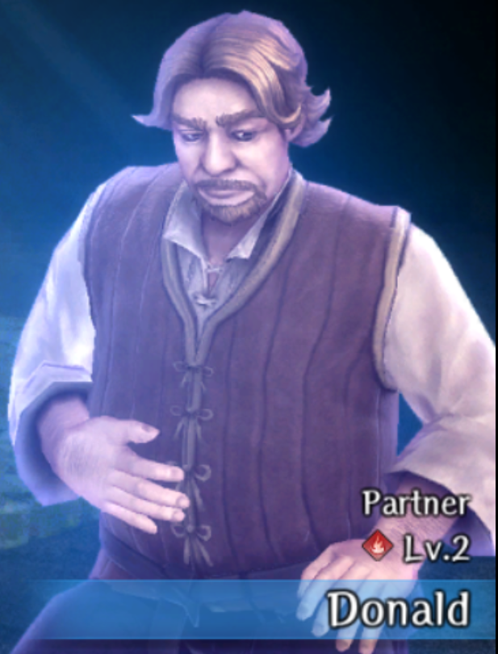

# Port Town Grand Legion

## Watery Obstacle

### Donald

??? info "Donald"
    

??? info "Skill"
    

- Complete all waves of the Defend My Shop from Goblins quest 

### Water God Priestess Regia

??? info "Water God Priestess Regia"
    

??? info "Skill"
    

!!! note
    It's easiest to wait to get her bondmate until after you have reached `7th District -Pier-`

- Complete the Water God Statue Restoration Materials request
- Find Regia 5 times throughout Districts 2-7 in the Trade Waterways
    - The easiest way to do this is to teleport into the pier, search for her, return back to the Port Town, and repeat until you find her 5 times. On the 5th time, she will mention that this was the final time she will heal you.
- Go to the marked spot in the 2nd District to receive the bondmate

??? map "Final Location"
    

## Sunken City Arrival

### Bergier the Fisherman

??? info "Bergier the Fisherman"
    

??? info "Skill"
    

- Complete the Fisherman Rescue quest battle within the limited turn count to avoid any of them dying. 

## One-Eyed Sahuagin

### Pirate Captain Valo

??? info "Pirate Captain Valo"
    

??? info "Skill"
    

- Complete Retake Stolen Belongings from Robbers selecting the “Pirates?” dialogue choice when prompted at quest start

## All Aboard

### Doris, the Frightened Maid

??? info "Doris, the Frightened Maid"
    

??? info "Skill"
    

- Complete the Servant and Cargo Recovery Request and choose to let the maids go.

### Caterwaul Crew

??? info "Caterwaul Crew"
    

??? info "Skill"
    

- Complete the Repel Enemy Forces Request and defeat all waves.

## Rickert’s Shop

### Head Cook

??? info "Head Cook"
    

??? info "Skill"
    

- Complete the four Procurement requests and turn each in to the Head Cook directly. Do not turn them into the guild.
- Wheel ahead (if you're not already there) to Arena 5 and beat either Melgina or Octonarus.
- After the battle, do not return to town. Instead, take the harken at the pier over to the Lower Deck 2 \-Lounge- and Head Cook.

### Ugo in the Ship's Hold

??? info "Ugo"
    

??? info "Skill"
    

Complete the Oar Collector Extermination request.

- After defeating the final Oar Collector, you must suggest Ugo becomes an apprentice to Rickard.
- Ugo will then randomly appear in the ship offering a variety of items for sale.
    - You must meet him once in order to be able to get him as a bondmate.
    - It is unknown whether it is necessary to buy something before he leaves. If you decide to buy everything, he gives you one extra Health Potion as a bonus.
- After you defeat either of the Greater Warped Ones, return to Rickard shop and Ugo will be there.
  - It is possible to wheel forward to after defeating the Greater Warped Ones. You do not need to manually fight them. 

## Arena Round 4

### Gessi

??? info "Gessi"
    

??? info "Skill"
    

- Make sure you do not give him Garlic
- Make sure you flip the lever to the Right
- Make sure you give him Titanium Ore
- Fight him under water and win!

??? info "Tips"
    - If you have very high (150+) evasion, go solo as a Thief
        - Equip Mask of the Water God
        - Hiding + Sneak Attack your way to victory
    - If you take your party, bring scrolls and potions for your casters to deal damage and heal as needed

## Arena Round 5

### Gigi

??? info "Gigi"
    

??? info "Skill"
    

- After witnessing his death to Melgina on the 1st run, warn him of his impending demise the second time so that he lives.  
- Find him in the same spot he was in on the boat and speak to him after defeating Melgina and successfully completing your objective.

### Melgina

??? info "Melgina"
    

??? info "Skill"
    

- Defeat Melgina once to learn that she was not the true greater warped one  
- Complete your request to find the missing person alive to get the Merfolk Lexicon  
- Read all mermaid statues and choose the secret text for each   
- Go back to one-eyed Sahuagin wheel time and speak to the red sahuagin destroying the statue, tell him “Don’t you want to save Melgina” for the dialogue choice  
- Go back to Flooded Town wheel time and speak with Melgina using the “Do you want to be free from Octonarus” dialogue choice  
- Complete the Rustproof Knife Delivery request that Melgina gives you instead of getting her the mackerel sandwich  
- Complete the Obtaining Titanium Ore delivery request to have the blacksmith make it and give it to Melgina  
- Wheel time back to One-eyed sahuagin and respond with “Dont you want to save Melgina” then “I understand, Gessi”  
- Complete “Obtaining Titanium Ore request”  
- Wheel time back to Arena Round 5 and after defeating Geuzan, choose “Melgina's liberation” as the dialogue  
- Defeat the boss and examine what’s in his hands after getting the relic when prompted

### Songstress Marin

??? info "Songstress Marin"
    

??? info "Skill"
    

- Complete the Murder Investigation request from Rickert.
- Marin has various locations that she can spawn on the map. However, only one location will drop her hairpin. If she doesn't spawn in the correct location, you need to cursed wheel. 
- She will only drop the Hairpin in the checked location below (lower middle room).

??? map "Marin's Location"
    

- After getting the hairpin, Cursed Wheel back and show the hairpin to Rickert once accepting the Murder Investigation request.  
- Once you show Rickert the hairband she’ll leave, if you head to Lower Deck 2 -Lounge-, you’ll find her speaking with Marin. Go there to receive the bondmate.  

??? map "Final Location"
    

## Return to the Capital

### Reprobus

??? info "Reprobus"
    

??? info "Skill"
    

- Complete the Arena Tourney Hosted by Avere request to completion
