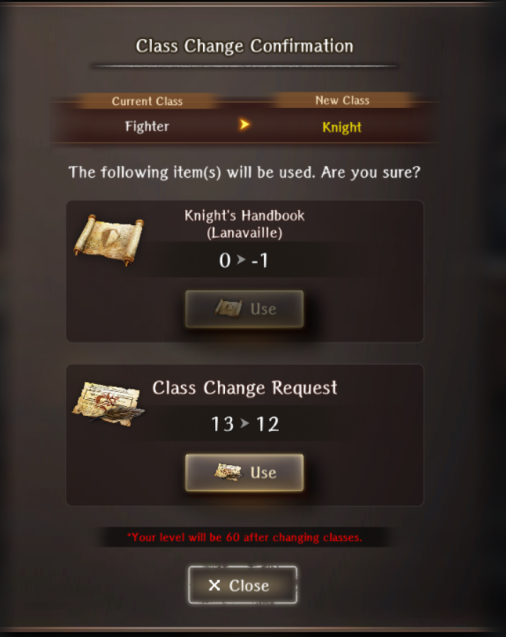

# Class Changes

## When Do I Unlock Class Changes?
You unlock class changes after you beat the Greater Warped One of the Beginning Abyss. For summonable heroes you unlock a weekly reseting shop for class change books for your summonable heroes. For your Main Character (MC) certain class changes are locked behind story progression.

## Do I Keep My Skills From the Previous Class?
Yes, you keep all the active and passive skills that you've learned from that class. However, certain skills and passives can only be used by certain classes. For instance, the description of the passive skill Behind Cover ends with \<Knight-specific\>. This means you need be the knight class to have this passive active. Or take the active skill Hiding whose description ends with <Thief-specific\>. This means you have to be the thief class to use this skill.  Please see the [Class Skills Page](../appendices/skills-and-spells/class-skill-quicklist.md) which notes skill restrictions.

## What About Passives Like Passive HP Up (Fighter)? Do I Need To Be Fighter Class For This Passive?
No, you don't need to be the same class as passives that list a class in parantheses. These parantheses just indicate origin of where the passive came from (and allow inheriting multiple similarly-named skills from different sources). Angled brackets in the skill description, such as \<Knight-specific\> indicate that use of the skill is restricted to that specific class.

## Can I Class Change Back?
Your main character can freely change between classes that you have unlocked and activated in the Well of Mind. Allies on the other hand cannot freely change back to a previous class. You either need another class change book corresponding to the character's original class, or a special item called a class change request that lets you change back to any previously learned class. Again, <em>yes</em>, you have to obtain or buy another class change item to change a character back to a previous class, and for handbooks it's a different handbook than you used to change the first time (the name of the book tells you the class you can use it to change <em>to</em>. Class change request items are given for free during class change events and purchased from certain limited packs from the jeweler.

## Why Am I Level 1? Does My Other Class Keep Their Levels?
Levels are independent to each class so you are going to have to re-level. 

## Why Are Some Characters Missing A Class Change?
Anonymous units such as Human-Pri have no class change available. Newer released units don't start with a class change available. These are usually released at a later time, often connected to a limited time event.

## When Should I Class Change?
For your main character, class change as soon as possible. The Wanderer Class doesn't get any new skills after level 17. The Fighter class is the first available and it is advised to switch to this class immediately. (Be aware you will be a level 1 Fighter and will need a way to _safely_ gain XP to get back up to survivable levels.) Changing back and forth is generally free to do if new classes or usefull skills become available.  
For your other party members, it's up to personal preference. For some time, level 40 was deemed a decent switch-level for most classes. However, higher level caps have come with valuable transferrable skills at higher levels for most classes (sorry Knight), and it is recommended raising classes to max level to take full advantage, as ability to swich back and forth is quite limited.  That said, there will always be another level cap raise and new skills coming, so consult the [Class Skills by Level list](../appendices/skills-and-spells/class-skill-quicklist.md) and decide for yourself what level will be high enough for you.

## Should I Stay As The Class That I Changed To Or Swap Back After Getting The Skills And Passives?
Again, it depends. This is your personal preference for your playstyle. Keep in mind that classes scale differently on their base stats, have different resource pools, and have differing things they can equip. There are almost no 'swap or stay' consensus examples, and so far the value of different classes has changed quite extremely with each new Abyss, major Event, and new class release.
