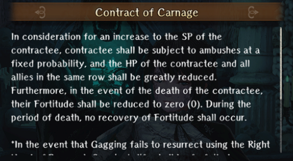
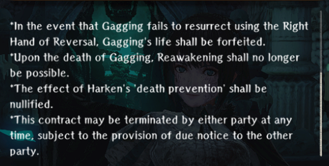

# Contracts

Upon completing [Ominous Shadow Investigation](../abyss-guides/3-guarda-fortress/requests.md#ominous-shadow-investigation), you will unlock the ability to make contracts on specific characters by talking to Morgus, God of Death.
These contracts generally give a sizeable buff at a cost of a very drastic penalty. (For the Stat Buffs, it appears to be AROUND a 20% Buff and 80% Penalty)

??? note "List of Adventurer Contracts"
    
    
    

    !!! warning "Extra Conditions"
        

??? note "List of MC-Exclusive Contract(s)"
    

    !!! warning "Extra Conditions"
        
    

