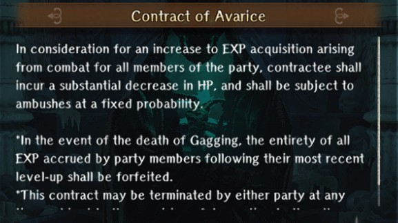

# Contracts

!!! warning "Upon completing [Expose the Intruder](../abyss-guides/3-guarda-fortress/requests.md#expose-the-intruder), you will unlock the ability to make contracts on specific characters by talking to Morgus, God of Death."

Contracts are essentially applied to an adventurer and provide a sizeable buff with a disproportionate debuff, typically to the entire row of the adventurer is in. They can be applied and removed at any time without any consequences. All the contracts listed are always available once contracts have been unlocked.

## List of Adventurer Contracts

??? "Contract of the Raging Warrior"

    

    
    

    - Boosts contracted user's damage by ~50%. User takes ~100% more damage and row takes ~50% more damage.
    - If user dies, and MC fails to resurrect user, MC dies. Reawakening isn't possible, and Harken doesn't prevent death. User's fortitude is reduced to 0 and cannot recover.
        
??? "Contract of the Archdemon"

    

    
    

    - Boosts contracted user's MP by user's Base Value. Row loses ~30% base HP.
    - If user dies, and MC fails to resurrect user, MC dies. Reawakening isn't possible, and Harken doesn't prevent death. User's fortitude is reduced to 0 and cannot recover.
        
??? "Contract of Carnage"

    

    
    

    - Boosts contracted user's SP by user's Base Value. Row loses ~30% base HP.
    - If user dies, and MC fails to resurrect user, MC dies. Reawakening isn't possible, and Harken doesn't prevent death. User's fortitude is reduced to 0 and cannot recover.

??? "Contract of Bone Reclamation"

    

    
    

    - Boosts number of chests openable per run in the Ancient Mausoleum. 1-2 Contracts = 1 more chest, 3-4 Contracts = 2 more chests, 5-6 Contracts = 3 more chests.
    - All stats on the contracted unit will decrease, with smaller reductions the more contracts there are.

## List of MC-Exclusive Contracts

??? "Contract of Avarice"
    
    

    
    

    
    - Boosts EXP for the entire party by ~30%. MC loses ~30% base HP.
    - If the MC dies, all EXP gained during the contract is removed.
    

