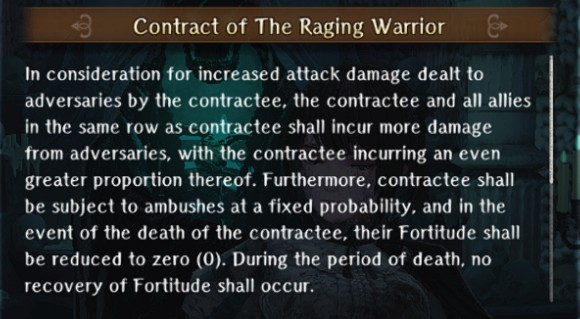
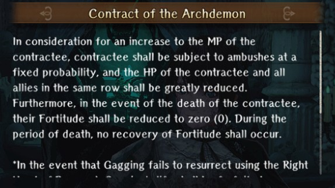
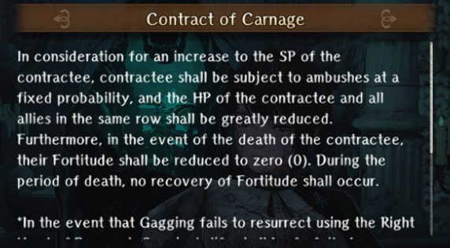
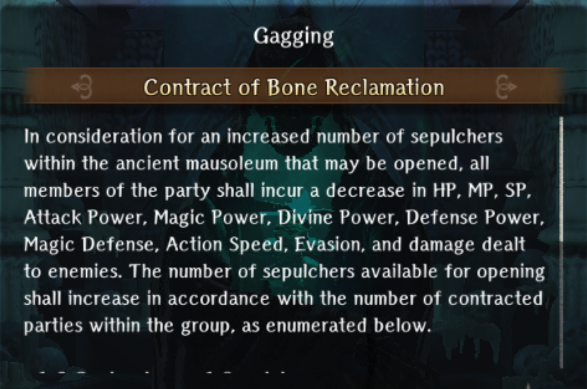
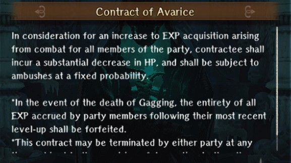

# Contracts

!!! note "The ability to make contracts becomes unlocked upon completing [Expose the Intruder](../abyss-guides/3-guarda-fortress/requests.md#expose-the-intruder), followed by talking to Morgus, God of Death, in the Catacombs."

A contract with Morgus provides a sizeable buff for an adventurer(s) with a disproportionate debuff to other adventurers (typically the entire row the contractee is in). They can be applied and removed at any time free of consequences. All the contracts continue to be available once the contracts have been unlocked.

## Adventurer Contracts

??? note "Contract of the Raging Warrior"

    

    
    

    - Agreement: The contractee's *attack power* increased by 50%, contractee's *damage received* increased by ~100%, and *row damage received* increased by ~50%.
    - Penalty: If the contractee dies, and the MC fails to reverse the contractee's death: the MC dies, the Harken will fail to restore the contractee's life, and reawakening will fail. The contractee's fortitude is reduced to and stays at zero.
        
??? note "Contract of the Archdemon"

    

    
    

    - Agreement: The contractee's *MP* increased (derived from their Base Value), and *row HP* decreased by ~30%.
    - Penalty: If the contractee dies, and the MC fails to reverse the contractee's death: the MC dies, the Harken will fail to restore the contractee's life, and reawakening will fail. The contractee's fortitude is reduced to and stays at zero.
        
??? note "Contract of Carnage"

    

    
    

    - Agreement: The contractee's *SP* increased (derived from their Base Value), and *row HP* decreased by ~30%.
    - Penalty: If the contractee dies, and the MC fails to reverse the contractee's death: the MC dies, the Harken will fail to restore the contractee's life, and reawakening will fail. The contractee's fortitude is reduced to and stays at zero.

??? note "Contract of Bone Reclamation"

    

    
    

    - Agreement: The contractee's chests increase in the Ancient Mausoleum; 1-2 Contracts = +1, 3-4 Contracts = +2, 5-6 Contracts = +3.
    - Penalty: The contractee will have all stats decreased (additional contracts will have smaller stat decreases).

## MC-Exclusive Contracts

??? note "Contract of Avarice"
    
    

    
    

    
    - Agreement: The contractee's party will have *experience* increased by ~30%, and contractee's *HP* decreased by ~30%.
    - Penalty: If the contractee dies, all EXP gained during the contract is removed.
    

