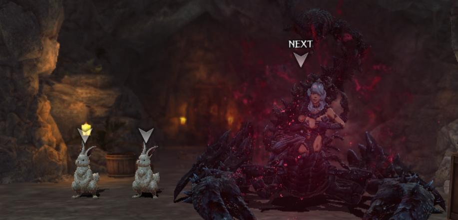

# Relicbrews

## Requirements

Upon completion of [Recovery of Belongings](../abyss-guides/2-port-town-grand-legion/requests.md#recovery-of-belongings) and subsequently [Recovery of Research Materials](../abyss-guides/2-port-town-grand-legion/requests.md#recovery-of-belongings) you unlock the ability to access Relicbrews at the Black Barrel Tavern, which can be accessed via the world map.

## Terminology 

The Relicbrew mechanic uses several different terms that sound similar and can be confusing to new players. Each of the subsections provide more detailed information.

<!--picture - relicbrew menu w/ callouts-->

| Term                   | Definition                                                                                                                              |
|:-----------------------|:----------------------------------------------------------------------------------------------------------------------------------------|
| Relic monster          | Extremely rare enemy with a relic in its possession denoted by a red aura                                                               |
| Relic                  | Dropped by relic monsters in a chest after battle. Contains the power of the Lord of the Abyss and is what turns humans into Warped Ones.    |
| Relic slag ("slag")    | Remnants of a relic that failed to form. Can be exchanged for relics at the Black Barrel Tavern.                                         |   
| Relicbrew              | Corvo can transform a relic into a consumable drink. This is the primary function of the Black Barrel Tavern.                            |
| Relic Power            | A semi-permanent, unique passive skill gained from drinking a relicbrew.                                                                 |
| Eye of Vitriol         | Valuable item given by Corvo that allows the user to see if an enemy is carrying a relic (red aura). |

??? info "Relic Monster"
    

        
    

??? info "Flowchart"
    Relic monster > Relic (or Relic Slag) > Relicbrew > Relic Power  

## How to obtain relics

Relics can be obtained by encountering relic monsters that can rarely appear anywhere in the game. Upon defeat a relic monster will always drop a chest after a battle. The chest will spawn either the enemy's relic (~30%) or slag (~70%). Slag can be exchanged for relics in the Black Barrel Tavern's Slag Piece Exchange Shop. Relic monsters are unique and only one can spawn per encounter.

- Relic monster encounters are rare (2%) and entirely RNG-dependent.
- Relic monsters have increased HP (~30%)
- Only enemies in the front row can be relic monsters.
- Adventurers and Warped enemies (aside from the White Gluttonous Maw) cannot drop relics. 
- Relic monsters are determined upon map entry. You cannot "farm" relics by running away, using stairs, or Harkens. To re-roll for potential encounters you must fully exit the map and reenter. 
- Relic monsters do not appear with any Guild Requests or Bounties that have NPC text before the battle. 
- An enemy can only drop its specific relic and not relics from other enemies.
- Elemental variations of enemies will always drop the same relic.
- The ★ quality (1-4) of a relic is based on the level of the area. The vast majority of enemies will never drop a 4★ relic even in late game areas.  

<!-- maybe add image of a glowing common mob-->
<!-- what enemies drop 4 star relics-->
<!-- maybe add image with call outs for Relic Name, Relicpower, etc.--> 

## Black Barrel Tavern

At the Black Barrel Tavern the proprietor, Corvo the Alchemist, offers several different services.

| Services               | Details                                                                                                                                 |
|:-----------------------|:----------------------------------------------------------------------------------------------------------------------------------------|
| Drink Relicbrew        | Transforms relics into relicbrews that give unique Relic Powers (passives) to your units.                                                |
| Relic Powers           | View each unit's currently equipped and extracted Relic Powers. Relic Powers can be extracted for a fee.                        |
| Slagpiece Exchange     | Trade slag for up to 9 randomly selected relics that refresh on a weekly basis.                                                          |
| Talk                   | Provides details on relic terms and history.                                                                                             |

### Drink Relicbrew

The "Relicbrew" menu lists all of the relics in your inventory. Note that the same relic with a different ★ quality is counted as a separate item and relicbrew. Selecting a relic will show you the name of the relicbrew, a brief description, and its associated Relic Power, if known. Each relicbrew provides a unique Relic Power in the form of a passive skill.

**Relic Powers**

- Increases 1-2 stats at the cost of another (always -1 per level).
- Effects are hidden until the relicbrew has been consumed at least once.
- Effects can be increased to a maximum of level 5 by repeatedly drinking the same relicbrew of any ★ quality.
- Have alignments (Good/Neutral/Evil). Matching alignments with a unit gives an additional, immediate bonus (or "extra" level) to the positive effects.
- Each unit can safely equip up to 3 Relic Powers with no side effects. A 4th can be added if the alignments match.
- Located at the bottom of a unit's Passive Skill list with its current level and a dark red star icon.
- Level and accumulated experience is not lost if extracted, but you need to find and drink the same relicbrew again to reactivate it.

Once a relicbrew has been chosen hit the "Order" button to continue. 

The "Drink Relicbrew" menu shows you a list of all available units, the number of equipped Relic Powers, side effect status, and Relic Power history via a small bottle icon over their class name. A golden bottle denotes a currently equipped Relic Power. A dark grey (empty) bottle means it was extracted in the past. This icon can help you sort through a large roster to find the correct units. Up to 6 people can consume a relicbrew, but the MC is always a fixed member that can be de-selected in the menu. To consume the relicbrew select "Drink Relicbrew" at the bottom of the menu to view a brief cutscene. Congrats, enjoy your newfound powers of the Abyss!   

### Relic Powers

When you select a unit a new menu, "Relic Power", will appear that shows the currently equipped Relic Powers, level, and whether the alignment matches (bright pink text). You can click on any Relic Power to see its current level, effect description, and "Power Density", which functions as an experience bar. The "Extracted Relic Power" section shows the unit's previously equipped Relic Powers. 

**Extraction**

This is the primary service you will be using, which allows you to extract (remove) a currently equipped Relic Power. To extract, click on the Relic Power and select "Remove Power". There are 3 types of extraction services: Emergency, Standard, and Special. The more expensive options have a higher chance of success. On success, the adventurer will lose 1 max Fortitude for 2 weeks. On failure, the adventurer will lose 5 max Fortitude for 2 weeks. On great success, the adventurer does not lose any fortitude. 

The extraction services can be paid for with purple gems, green gems, and gold. There is no reason to use gems for extraction as the gold costs are generally affordable as you progress through the game. However, the costs increase the higher the level of the Relic Power being removed. We recommend that you always use Special Extraction when possible. Please remember that an extracted Relic Power does not lose its level or accumulated experience, but must be reactivated with a new relicbrew.

### Slagpiece Exchange

The Slagpiece Exchange Shop lists 9 relicbrews for sale in exchange for slag on a weekly rotation. There are 3 rows of 3 relicbrews per row, with the top row being 3★, the middle row being 2★ relics, and the last row being 1★ relics. The relicbrews could be any known relic in the game. 3★ relics cost 400 slag, 2★ relics cost 200 slag, and 1★ relics cost 100 slag. You can refresh the shop with gems, which begins at 200 gems and doubles per refresh.

## Leveling Relic Powers

Relic Powers can be leveled like other passive skills. Instead of using inherits or codexes they require additional relics (transformed into relicbrews). Each relic has an associated ★ quality that gives different amounts of Power Density, which function as experience points (EXP). This is the term (EXP) that will be used throughout this section.       

| ★ Quality | EXP |        
|:----------:|:-----:|
| 1★         | 100   |
| 2★         | 200   |
| 3★         | 400   |
| 4★         | 1,000 |

Each Relic Power requires a certain amount of EXP to reach the next level. The maximum is level 5. A quirk of this system is that there is a "hidden" level 0 as it costs 100 EXP to equip a Relic Power. For example, if you used a 1★ relic, then the adventurer would have that Relic Power at level 1 with 0 EXP. This is the reason why you will often be exactly 100 EXP away from the next skill level.  After level 3 the EXP required to take a Relic Power to level 4 (1,200 EXP) or level 5 (3,000 EXP) is significant so plan accordingly. Note that it takes 900 total EXP to reach level 3 and 2,100 EXP to reach level 4.    

| Relic Power Level | Required EXP | Cumulative EXP |        
|:-----------------:|:------------:|:--------------:|
| 0 - 1             |     100      |      100       |
| 1 - 2             |     200      |      300       |
| 2 - 3             |     600      |      900       |
| 3 - 4             |     1,200    |      2,100     |
| 4 - 5             |     3,000    |      5,100     |
| Total             |     5,100    |        -       |

Below is a summary table to give you an idea of how many relics you would have to collect per ★ quality to reach a specific level. These are total _not_ incremental numbers. For example, to reach level 4 (2,100 total EXP) it would take 11, 2★ (200 EXP) relics (11 x 200 EXP = 2,200 EXP). Take advantage of the Slagpiece Exchange to buy 1-2★ relics to reach the next level, especially for level 5 to avoid wasting EXP that could have gone to a different adventurer.     

| ★ Quality | Lv 1 | Lv 2 | Lv 3 | Lv 4 | Lv 5 |   
|:---------:|:----:|:----:|:----:|:-----:|:---:|
| 1★        |  1   |  3   |  9   |  21  |  51  |
| 2★        |  1   |  2   |  5   |  11  |  26  | 
| 3★        |  1   |  1   |  3   |  6   |  13  |
| 4★        |  1   |  1   |  1   |  3   |  6   |

## Penalties

After gaining too many Relic Powers, an adventurer and the MC can suffer from certain debilitating effects in combat. Status is indicated by the color of the swirl on the top left of the character portrait, and the effect of different stages of impact are listed below. Any character can safely have 3 active Relic Powers at one time.  A 4th power can be safely added if at least one of those four powers has the same alignment type as the character. Exceeding these limits will raise an adventurer to Stage 2 side effects immediately. 

- Stage 0: Grey (Normal)
- Stage 1: White (Normal?)
- Stage 2: Purple (50 max fortitude, chance to be afflicted with confusion at start of every turn)
- Stage 3: Red (0 max fortitude, afflicted with confusion at start of every turn)

Note that there currently appears to be no negative effects outside of combat, and the safe limit apparently can be exceeded by any amount without impact as long as excess powers are removed before entering combat.

## List of Relic Power Effects  
!!! note "Relics Names below are as listed in the Compendium. Relics in your inventory may have Name modifiers, such as 'Twisted'. The meaning of these modifiers is unknown."

| Relic Power Name                           | Stat Effect                          | Personality | Drops From             | Relic Name                             | Compendium Number |
| ------------------------------------------ | ------------------------------------ | ----------- | ---------------------- | --------------------------------------- | ----------------- |
| Redripened Carapace                        | Crit Res Up, Detect Down             | Neutral     | Gluttonous Maw (White) | Ripeness of the Abyss                   | 19                |
| Gobber's Evil Eye                          | Accuracy Up, Surety Down             | Neutral     | Goblin                 | Gobber Bloodwood                        | 4040              |
| Gobber Bowman's Sharp Ears                 | Detect Up, Magic Down                | Neutral     | Goblin Archer          | Gobber Bowman Gleambright               | 4041              |
| Gobber's Magic-Resistant Lump              | Magic Def Up, Crit Tol Down          | Neutral     | Goblin Mage            | Gobber Sorcerer Rootcrystal             | 4042              |
| Gobber Soothsayer's Hallowed Voice         | Divine Up, Def Down                  | Evil        | Goblin Cleric          | Gobber Soothsayer Cursefruit            | 4043              |
| Hobber's Mighty Arm                        | Attack Up, Def Down                  | Evil        | Hobgoblin              | Hobber Bloodwood                        | 4044              |
| Bony's Iron Ribs                           | Critical Tol Up, Disarm Trap Down    | Evil        | Skeleton               | Bony Spiritcoral                        | 4045              |
| Bony Bowman's Cartilage                    | Evade Trap Up, Res Down              | Evil        | Skeleton Archer        | Bony Bowman's Gleambright               | 4046              |
| Bony Sorcerer's Spectral Bones             | Magic Def Up, Evade Trap Down        | Good        | Skeleton Mage          | Bony Sorcerer Rootcrystal               | 4047              |
| Bony Knight's Armored Bones                | Def Up, Accuracy Down                | Evil        | Skeleton Knight        | Bony Knight Rootcrystal                 | 4048              |
| Dissolving Ooze's Defensive Core           | Def Up, Evasion Down                 | Good        | Slime                  | Dissolving Ooze Rootcrystal             | 4049              |
| Man Eating Box's Sturdy Jaw                | All Elemental Res Up, Eva Down       | Neutral     | Mimic                  | Man-Eating Box Spiritcoral              | 4050              |
| Carrion Beetle's Carapace                  | Earth Res Up, Mp Down                | Good        | Abyssal Insect         | Carrion Beetle Spiritcoral              | 4051              |
| Plunderer's Deft Hand                      | Surety Up, Magic Down                | Evil        | Bandit                 | Plunderer Bloodwood                     | 4052              |
| Noxfume's Shelled Lungs                    | Air Res Up, Disarm Trap Down         | Evil        | Cloud                  | Noxfume Spiritcoral                     | 4053              |
| Dancing Blade's Razor Bite                 | Attack Up, Air Res Down              | Neutral     | Flying Sword           | Dancing Blade Bloodwood                 | 4054              |
| Venommaiden's Arachnid Legs                | Surety Up, Evasion Up, SP Down       | Good        | Scorpion Lady          | Venommaiden  Bloodwood                  | 4055              |
| Firebrand Legionnaire's Evil Eye           | Accuracy Up, Light Resist Down       | Evil        | Lesser Demon           | Firebrand Legionnaire Bloodwood         | 4056              |
| Hellfire Warlord's Blue Blood              | MP Up, Light Res Down                | Evil        | Greater Demon          | Hellfire Warlord Cursefruit             | 4057              |
| Beheading Rabbit's Sharp Claws             | Surety Up, Divine Down               | Good        | Vorpal Bunny           | Beheading Rabbit's Bloodwood            | 4058              |
| Hexdoll's Fleeing Step                     | ASPD Up, HP Down                     | Good        | Cursed Sack Doll       | Hexdoll Gleamblight                     | 4059              |
| Restless Currency's Tentacles              | Disarm Trap Up, Dark Res Down        | Neutral     | Creeping Coin          | Restless Currency Gleambright           | 4060              |
| Merfolk's Scaleskin                        | Water Resist Up, Divine Power Down   | Good        | Sahuagin               | Merfolk Spiritcoral                     | 4061              |
| Merfolk Bowman's Energy Flow               | SP Up, Res Down                      | Good        | Sahuagin Archer        | Merfolk Bowman Bloodwood                | 4062              |
| Merfolk Spellcaster's Spirit Flow          | Magic Up, Res Down                   | Neutral     | Sahuagin Mage          | Merfolk Spellcaster Cursefruit          | 4063              |
| Reptilian's Pupils                         | Accuracy Up, Air Res Down            | Good        | Lizardman              | Reptilian Bloodwood                     | 4064              |
| Reptilian Monarch's Energy Flow            | SP Up, Earth Res Down                | Neutral     | Lizardman Champion     | Reptilian Monarch Bloodwood             | 4065              |
| Four-Fist Bull's Fierce Heart              | HP Up, Fire Res Down                 | Neutral     | Minotaur               | Four-Fist Bull Rootcrystal              | 4066              |
| Lust Demon's Warding Glyph                 | Res Up, Attack Down                  | Evil        | Succubus               | Lust Demon Spiritcoral                  | 4067              |
| Sea Mad Warrior's Energy Lump              | SP Up, MP Down                       | Evil        | Pirate Berserker       | Sea Mad Warrior Bloodwood               | 4068              |
| Salt-Teared Priestess's Hallowed Voice     | Divine Up, Res Down                  | Neutral     | Pirate Deacon          | Salt-Teared Priestess Cursefruit        | 4069              |
| Great Undulating Devourer's Magic Core     | MP Up, Attack Down                   | Neutral     | Big Slime              | Great Undulating Devourer Cursefruit    | 4070              |
| One-Eyed Giant's Mighty Arm                | Attack Up, Accuracy Up, Evasion Down | Neutral     | Cyclops                | One-Eyed Giant Bloodwood                | 4071              |
| Sprite's Ghostlight Hair                   | Magic Up, Def Down                   | Good        | Pixie                  | Sprite Cursefruit                       | 4072              |
| Wind Being Defensive Core                  | Def Up, Magic Def Down               | Neutral     | Entity                 | Wind Being Rootcrystal                  | 4073              |
| Thrall of the Dark's Violet Glowing Eyes   | Evasion Up, Def Down                 | Evil        | Vampire                | Thrall of the Dark Gleambright          | 4074              |
| Giant Bugwing's Compound Eyes              | Evade Trap Up, MP Down               | Neutral     | Dragon Fly             | Giant Bugwing Gleambright               | 4075              |
| Servant-of-the-Earth's Pauldrons           | Def Up, Crit Tol Down                | Good        | Golem                  | Servant-of-the-Earth Rootcrystal        | 4076              |
| Chaos-Haunt's Mind's Eye                   | Detect Up, Attack Down               | Evil        | Poltergeist            | Chaos-Haunt Gleambright                 | 4077              |
| Shadowhoof Cavalier's Ghostsoul            | Magic Up, Dark Res Up, Divine Down   | Evil        | Necrocore              | Shadowhoof Cavalier Cursefruit          | 4078              |
| Dead-Minder's Spirit Essence               | MP Up, Def Down                      | Evil        | Wight                  | Dead-Minder Cursefruit                  | 4079              |
| Bone Colossus's Hardened Bones             | Def Up, Mp Down                      | Neutral     | Skeleton Giant         | Bone Colossus Rootcrystal               | 4080              |
| Foxear's Fingerhooks                       | Disarm Trap Up, Divine Down          | Good        | Footpad                | Foxear Gleambright                      | 4081              |
| Bonemaster's Cursemark                     | Magic Up, Def Down                   | Neutral     | Necromancer            | Bonemaster Cursefruit                   | 4082              |
| Carnivorous Plant's Greenbark              | Magic Def Up, Res Up, Acc Down       | Evil        | Hydra Plant            | Carnivorous Plant Rootcrystal           | 4083              |
| Composite Beast's Mighty Arm               | Attack Up, Water Resist Down         | Good        | Chimera                | Composite Beast Bloodwood               | 4084              |
| Stonebreath Bull's Hardened Horns          | Def Up, MP Down                      | Evil        | Gorgon                 | Stonebreath Bull Rootcrystal            | 4085              |
| Wind-Cutting Fowl's Wingfeathers           | Critical Tol Up, Evade Trap Down     | Good        | Hawk                   | Wind-Cutting Bird Spiritcoral           | 4086              |
| Abyssal Blossom High Blood                 | MP Up, SP Up, ASPD Down              | Neutral     | ????                   | Flower of the Abyss                     | 4088              |

## Relic Brew Stat Increases

The table below shows the stat increase per brew level along with the level 5 totals of both non-matching ("Standard") and matching ("Alignment Bonus") alignments. Note: The stat that is negatively impacted is always -1 for a maximum of -5 at level 5.

| Stats                           | Per Level | Standard | Alignment Bonus  |
|---------------------------------|:---------:|:--------:|:----------------:|
| HP                              |     3     |    15    |        18        |
| SP                              |     2     |    10    |        12        |
| MP                              |     2     |    10    |        12        |
| ATK                             |     2     |    10    |        12        |
| SUR                             |     1     |     5    |         6        |
| ACC                             |     2     |    10    |        12        |
| EVA                             |     2     |    10    |        12        |
| MAG                             |     2     |    10    |        12        |
| DIV                             |           |          |                  |
| ASPD                            |     1     |     5    |         6        |
| DEF                             |     4     |    20    |        24        |
| MDEF                            |     4     |    20    |        24        |
| RES                             |     2     |    10    |        12        |
| Detect	     	                  |     2     |    10    |        12        |
| Disarm Trap                     |           |          |                  |
| Evade Trap                      |           |          |                  |
| Elemental tolerance† |    1%     |    5%    |        6%        |
| Status tolerance†    |    1%     |    5%    |        6%        |

† These are rough estimates. Could range from 0.5-1% per level
